# DESIGN.md — GameHandler_26: Boardgame Platform

> **Versione:** 1.0 | **Data:** 2026-06-29 | **Corso:** PISSIR, 3° anno
>
> Documento di architettura software del progetto **GameHandler_26**, piattaforma distribuita per la gestione di giochi da tavolo e da bar. Si rivolge a sviluppatori, architetti e manutentori che devono comprendere la struttura, le scelte progettuali e i flussi del sistema.

---

## Indice

1. [Vista Logica](#1-vista-logica)
2. [Vista di Processo](#2-vista-di-processo)
3. [Vista Fisica](#3-vista-fisica)
4. [Vista di Sviluppo](#4-vista-di-sviluppo)
5. [Pattern Architetturali](#5-pattern-architetturali)
6. [Pattern di Design](#6-pattern-di-design)
7. [Modello Dati](#7-modello-dati)
8. [API Design](#8-api-design)
9. [Integrazioni Esterne](#9-integrazioni-esterne)
10. [ADR — Architectural Decision Records](#10-adr--architectural-decision-records)

---

## 1. Vista Logica

### 1.1 Panoramica dei moduli

Il sistema è strutturato come **monorepo Maven multi-modulo** con sei artefatti distinti organizzati in tre aree funzionali.

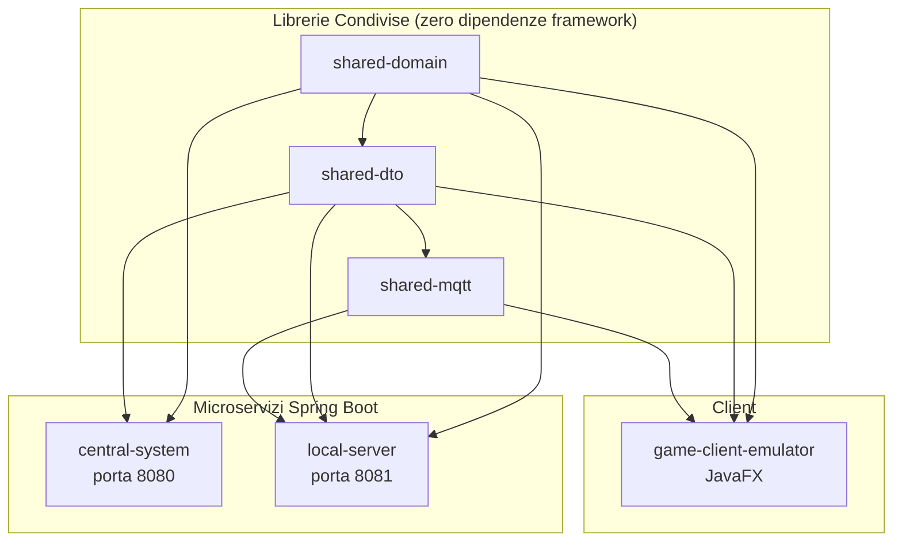

### 1.2 Responsabilità dei moduli

| Modulo | Artefatto Maven | Responsabilità principale |
|---|---|---|
| `shared-domain` | `com.gameplatform:shared-domain` | Value Object, interfacce di gioco, `GameResult`, `DomainEvent`. **Zero dipendenze da framework.** |
| `shared-dto` | `com.gameplatform:shared-dto` | Contratti REST e MQTT come Java record. Dipende solo da `shared-domain`. |
| `shared-mqtt` | `com.gameplatform:shared-mqtt` | Costanti topic MQTT, payload serializzati, `MqttPayloadSerializer`. Dipende da `shared-dto`. |
| `central-system` | `com.gameplatform:central-system` | Source of Truth globale: autenticazione, catalogo globale, statistiche aggregate, registro dei Local Server, replica utenti verso l'edge. |
| `local-server` | `com.gameplatform:local-server` | Edge Node Offline-First: prenotazioni, sessioni di gioco, gateway MQTT per i client, sincronizzazione asincrona con il Central. |
| `game-client-emulator` | `com.gameplatform:game-client-emulator` | Emulatore JavaFX di un dispositivo fisico: comunica **esclusivamente** via MQTT over TLS con il Local Server. |

### 1.3 Layer della Clean Architecture per microservizio

Ogni microservizio (Central e Local) segue la stessa struttura a tre layer con dipendenze unidirezionali verso l'interno:

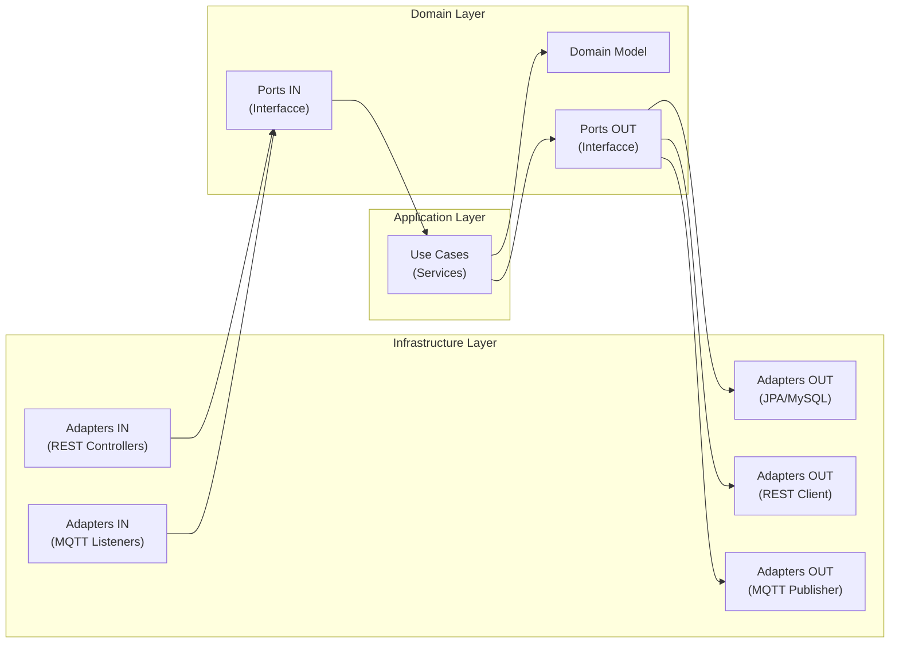

---

## 2. Vista di Processo

### 2.1 Flusso: Login Utente (tramite client → Local Server)

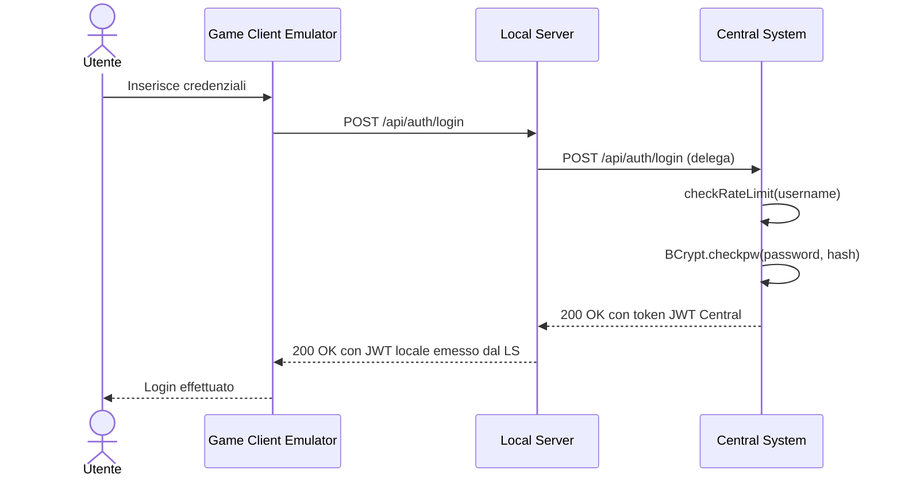

> **Nota:** [fonte: `AuthService.java`] Il Central System esegue un dummy BCrypt check anche per utenti inesistenti per prevenire timing attacks. Dopo 5 fallimenti in 60 secondi, risponde con HTTP 429.

### 2.2 Flusso: Avvio Sessione di Gioco (MQTT)

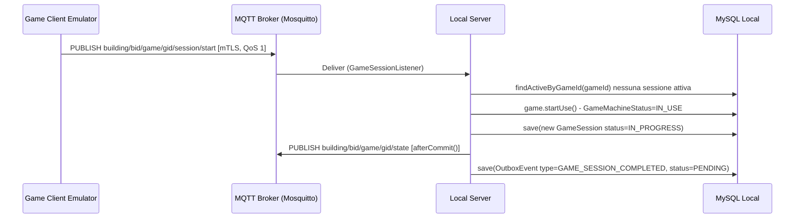

> **Nota:** [fonte: `GameSessionService.java`] Il publish MQTT avviene dopo il commit della transazione tramite `TransactionSynchronizationManager.registerSynchronization`, evitando pubblicazioni premature in caso di rollback.

### 2.3 Flusso: Heartbeat e Abort per Timeout

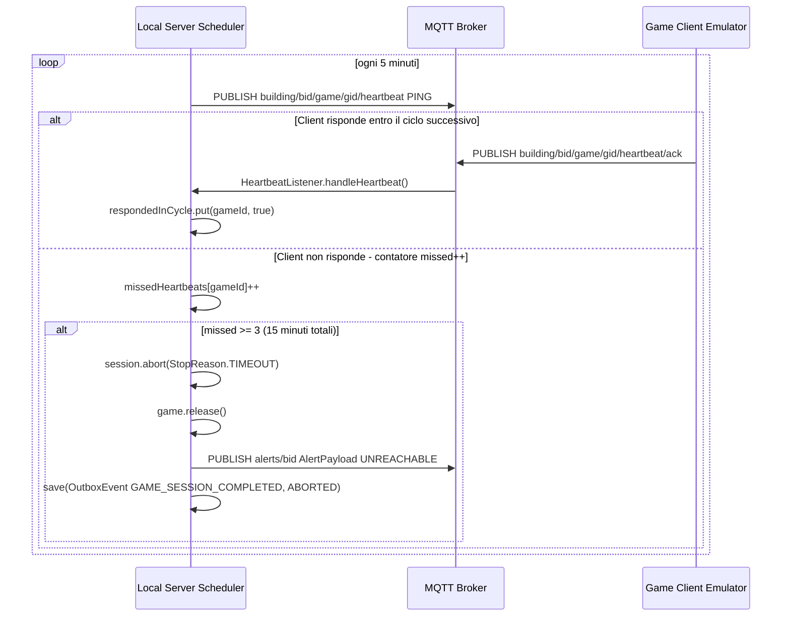

> **Nota:** [fonte: `HealthCheckService.java`] Il contatore è gestito in memoria con `ConcurrentHashMap`; si azzera al riavvio del Local Server.

### 2.4 Flusso: Sincronizzazione Outbox Local → Central

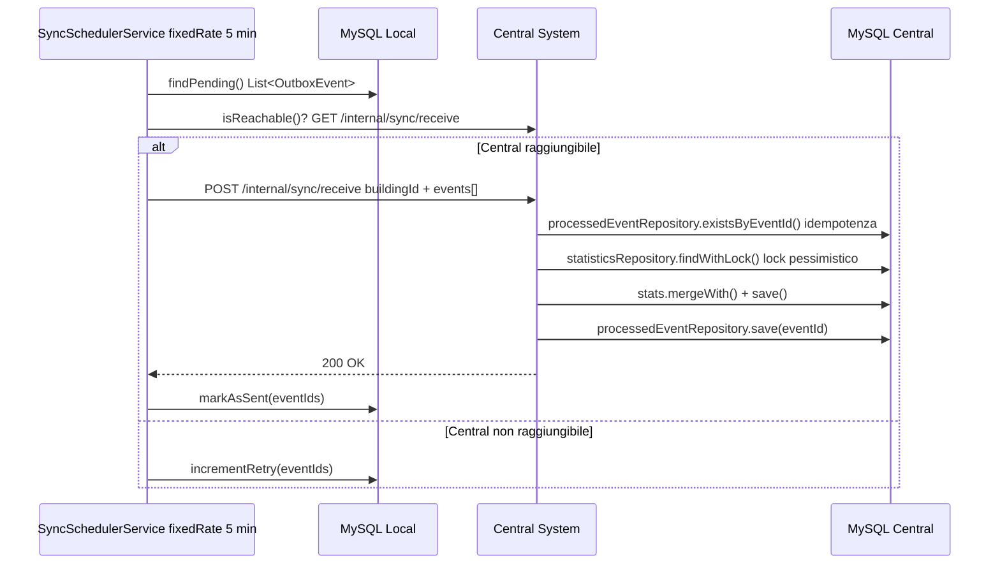

> **Nota:** [fonte: `SyncSchedulerService.java`, `SyncReceiverService.java`] Il lock pessimistico previene race condition su statistiche aggregate. La deduplicazione via `processed_events` garantisce idempotenza.

### 2.5 Flusso: Replica Utenti Central → Local

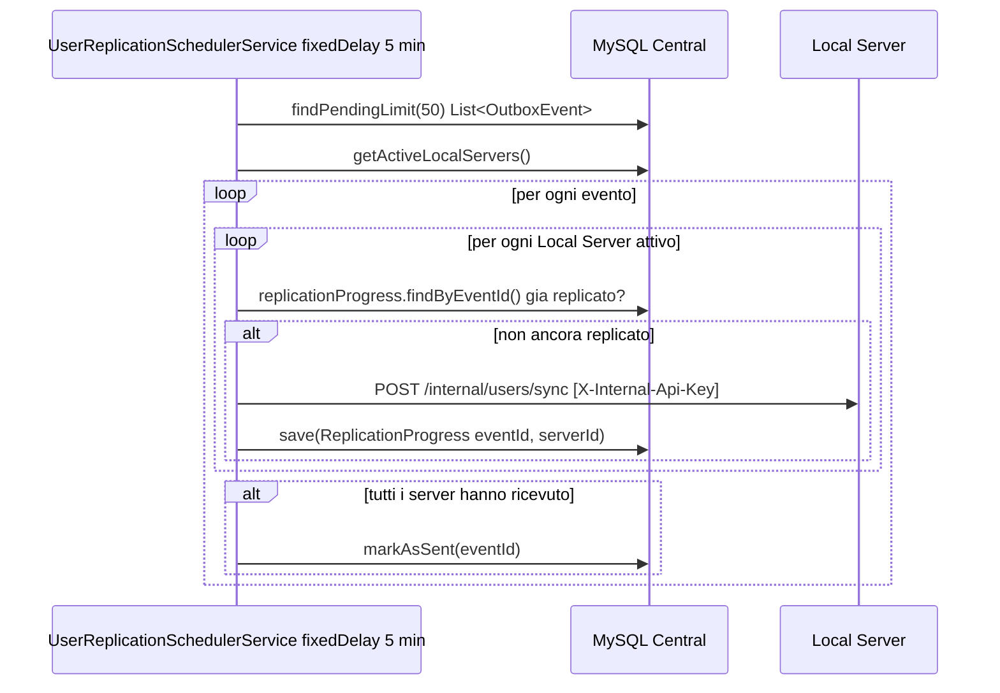

> **Nota:** [fonte: `UserReplicationSchedulerService.java`] Il batch è limitato a 50 eventi per evitare OOM. Il `fixedDelay` (non `fixedRate`) garantisce che non si sovrappongano esecuzioni.

### 2.6 Flusso: Registrazione Certificato Client (mTLS Bootstrap)

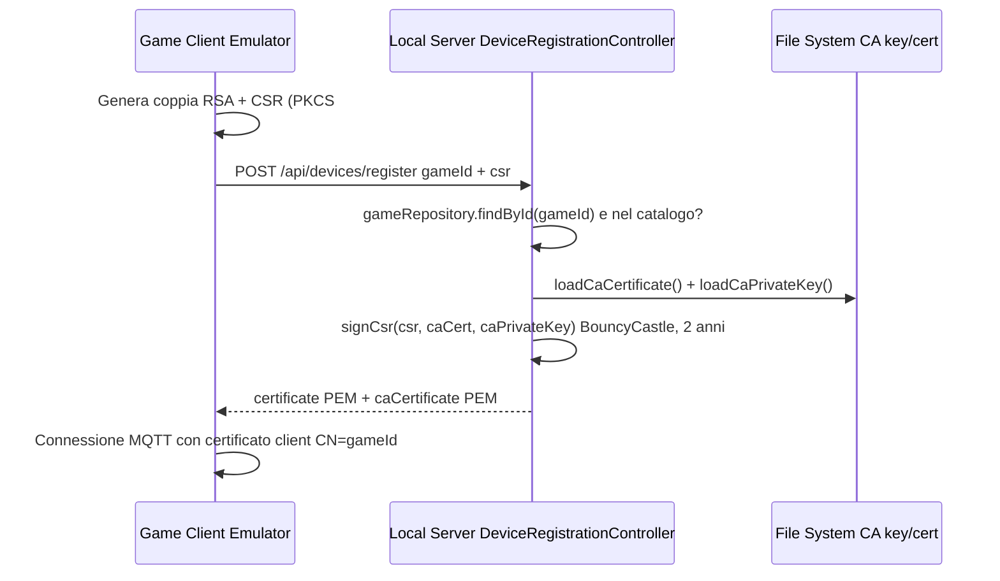

> **Nota:** [fonte: `DeviceRegistrationController.java`, `CertificateEnrollmentService.java`] Il certificato ha CN uguale al `gameId`. Mosquitto usa `use_identity_as_username true`, quindi il CN diventa l'username MQTT. Solo i giochi pre-autorizzati nel catalogo ricevono un certificato.

---

## 3. Vista Fisica

### 3.1 Topologia di deployment

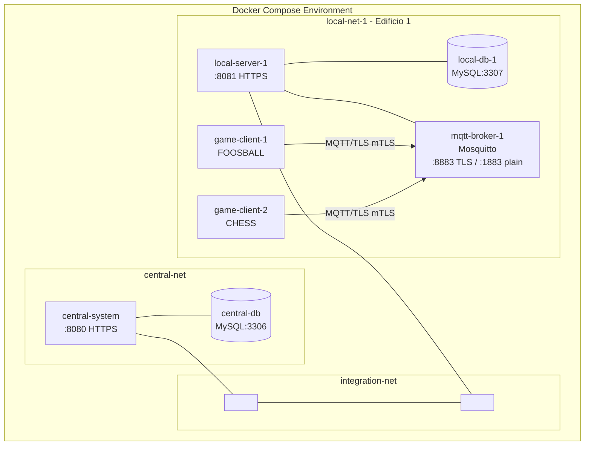

### 3.2 Reti Docker

| Rete | Servizi connessi | Scopo |
|---|---|---|
| `central-net` | `central-system`, `central-db` | Isolamento del tier centrale |
| `local-net-1` | `local-server-1`, `local-db-1`, `mqtt-broker-1`, `game-client-1`, `game-client-2` | Isolamento del tier locale per l'edificio 1 |
| `integration-net` | `central-system`, `local-server-1` | Comunicazione service-to-service (sync, replica utenti) |

### 3.3 Porte esposte

| Servizio | Porta host | Porta container | Protocollo |
|---|---|---|---|
| `central-db` | 3306 | 3306 | MySQL |
| `central-system` | 8080 | 8080 | HTTPS |
| `local-db-1` | 3307 | 3306 | MySQL |
| `mqtt-broker-1` | 8883 | 8883 | MQTT over TLS (mTLS) |
| `mqtt-broker-1` | 1883 | 1883 | MQTT plain (dev only) |
| `local-server-1` | 8081 | 8080 | HTTPS |

### 3.4 Scalabilità orizzontale

Aggiungere un nuovo edificio richiede **esclusivamente** la replica del blocco di servizi locali nel `docker-compose.yml` con un nuovo `BUILDING_ID`. Il codice applicativo è invariato. Ogni blocco è composto da:
- `local-db-N` (nuovo volume MySQL)
- `mqtt-broker-N` (nuovo broker Mosquitto, nuovi certificati TLS)
- `local-server-N` (connesso a `integration-net`)
- `game-client-X...N` (quanti dispositivi servono)

---

## 4. Vista di Sviluppo

### 4.1 Struttura del repository

```
gamehandler-platform/
├── pom.xml                          # Parent POM (groupId: com.gameplatform, v1.0.0-SNAPSHOT)
├── docker-compose.yml               # Definizione dell'intero stack
├── README.md                        # Guida setup (manuale sviluppatore)
│
├── shared/                          # Librerie senza dipendenze framework
│   ├── shared-domain/               # Zero dipendenze framework
│   │   └── src/main/java/com/gameplatform/shared/domain/
│   │       ├── model/               # Value Object (record): UserId, GameId, BuildingId...
│   │       ├── game/                # Interfacce: GameLifecycle, TurnBasedGame, ScoredGame...
│   │       ├── result/              # GameResult + implementazioni (record)
│   │       └── events/              # DomainEvent + record specializzati
│   ├── shared-dto/                  # Contratti REST (record)
│   └── shared-mqtt/                 # Topic MQTT + payload
│
├── central-system/
│   ├── Dockerfile
│   └── src/main/java/com/gameplatform/central/
│       ├── domain/
│       │   ├── model/               # User, AggregatedStatistics, OutboxEvent...
│       │   ├── ports/in/            # RegisterUserUseCase, AuthenticateUserUseCase...
│       │   ├── ports/out/           # UserRepository, OutboxEventRepository...
│       │   └── exception/           # Eccezioni di dominio tipizzate
│       ├── application/service/     # UserService, AuthService, SyncReceiverService...
│       └── infrastructure/
│           ├── adapters/in/rest/    # UserController, AuthController, SyncController...
│           ├── adapters/out/mysql/  # JPA entities + repositories + adapters + mappers
│           ├── adapters/out/rest/   # LocalServerRestAdapter
│           ├── config/              # SecurityConfig, JwtConfig, SchedulerConfig
│           └── security/            # JwtTokenProvider, JwtAuthenticationFilter, InternalApiKeyFilter
│
├── local-server/
│   ├── Dockerfile
│   └── src/main/java/com/gameplatform/local/
│       ├── domain/
│       │   ├── model/               # Reservation, Game, GameSession, OutboxEvent...
│       │   ├── ports/in/            # CreateReservationUseCase, StartGameSessionUseCase...
│       │   ├── ports/out/           # ReservationRepository, SyncCentralSystemPort...
│       │   └── exception/           # GameNotAvailableException, SessionAlreadyActiveException...
│       ├── application/service/     # ReservationService, GameSessionService, HealthCheckService...
│       └── infrastructure/
│           ├── adapters/in/rest/    # ReservationController, GameController, DeviceRegistrationController...
│           ├── adapters/in/mqtt/    # GameStateListener, GameSessionListener, HeartbeatListener
│           ├── adapters/out/mysql/  # JPA entities + repositories + adapters + mappers
│           ├── adapters/out/rest/   # CentralSystemRestAdapter
│           ├── adapters/out/mqtt/   # MqttPublisherAdapter
│           ├── config/              # MqttConfig, SecurityConfig, TlsConfig, SchedulerConfig
│           └── security/            # JwtTokenProvider, JwtTokenValidator...
│
├── game-client-emulator/
│   ├── Dockerfile
│   └── src/main/java/com/gameplatform/client/
│       ├── domain/
│       │   ├── games/               # FoosballGame, ChessGame, DartsGame, MonopolyGame, RiskGame...
│       │   ├── ClientState.java
│       │   └── GameFactory.java
│       ├── application/service/     # GameOrchestrationService, HeartbeatService...
│       └── infrastructure/
│           ├── mqtt/                # MqttClientAdapter, SessionPublisher, HeartbeatPublisher...
│           ├── ui/                  # JavaFX: MainView, LoginView, GamePlayView...
│           ├── security/            # CertificateEnrollmentService, HttpClientHelper
│           └── config/              # MqttClientConfig
│
└── infrastructure/
    ├── mysql-central/init.sql       # DDL: users, game_catalog, aggregated_statistics...
    ├── mysql-local/init.sql         # DDL: reservations, game_sessions, replicated_users...
    ├── mosquitto/
    │   ├── mosquitto.conf           # Config broker (listener 8883 mTLS, listener 1883 plain)
    │   └── certs/                   # Certificati TLS
    └── tls/                         # Certificati HTTPS per i microservizi
```

### 4.2 Grafo delle dipendenze Maven

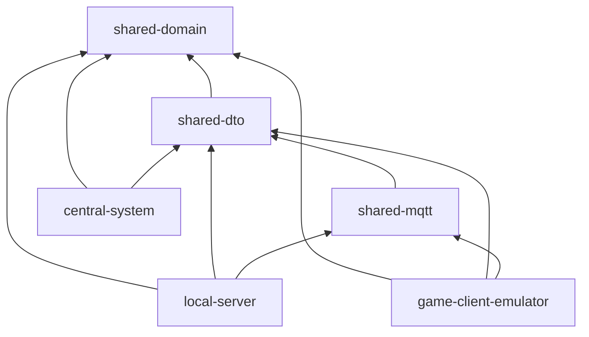

### 4.3 Dipendenze di terze parti principali

| Libreria | Versione | Modulo | Scopo |
|---|---|---|---|
| Spring Boot | 3.2.0 | central, local | Framework applicativo, DI, Web, JPA, Security |
| Eclipse Paho MQTT | 1.2.5 | local, client | Client MQTT per Java |
| JJWT | 0.12.3 | central, local | Generazione e validazione JWT RS256 |
| Jackson | 2.17.2 | tutti | Serializzazione JSON |
| BouncyCastle | 1.78.1 | local, client | CSR signing, gestione certificati X.509 |
| MySQL Connector J | runtime | central, local | Driver JDBC |
| JavaFX | — | client | UI del game-client-emulator |
| JUnit 5 + Mockito | via Spring Boot Test | central | Testing unitario e d'integrazione |

---

## 5. Pattern Architetturali

### 5.1 Hub-and-Spoke

**Descrizione:** Il Central System è l'hub unico. Ogni Local Server (spoke) comunica solo con l'hub, mai con altri spoke.

**Giustificazione:** Semplifica la consistenza dei dati globali (utenti, statistiche aggregate) evitando un mesh di comunicazioni N×N tra edifici. L'hub è il punto di verità per l'identità degli utenti.

**Dove:** Topologia Docker (`integration-net` connette solo Central ↔ Local), `[CentralSystemRestAdapter.java]`.

### 5.2 Pub/Sub via MQTT (Event-Driven locale)

**Descrizione:** All'interno di ogni edificio, i Game Client Emulator e il Local Server comunicano tramite topics MQTT. Il broker Mosquitto funge da intermediario.

**Giustificazione:** Disaccoppia completamente il client dal server. Il client non ha bisogno di conoscere l'indirizzo del server: pubblica su topic predefiniti. Il Local Server iscrive e reagisce. Permette di aggiungere subscriber senza modificare i publisher. Compatibile con la futura integrazione ESP32/Arduino.

**Dove:** `[MqttTopics.java]`, `[GameSessionListener.java]`, `[HeartbeatListener.java]`, `[MqttPublisherAdapter.java]`.

### 5.3 Clean Architecture / Hexagonal (Ports & Adapters)

**Descrizione:** Ogni microservizio ha tre layer: domain (zero dipendenze framework), application (use case), infrastructure (adapter). Le dipendenze puntano sempre verso il domain.

**Giustificazione:** Il domain rimane testabile in isolamento senza necessità di Spring, JPA o MQTT. Permette di sostituire tecnologie modificando solo gli adapter, non la business logic.

**Dove:** Package structure `domain/ports/in`, `domain/ports/out`, `application/service`, `infrastructure/adapters`.

### 5.4 Transactional Outbox Pattern

**Descrizione:** Le operazioni critiche (fine sessione, creazione prenotazione) scrivono un `OutboxEvent` nella stessa transazione del dato principale. Un thread separato legge e invia gli eventi in modo asincrono.

**Giustificazione:** Garantisce che nessun evento venga perso in caso di crash tra il salvataggio del dato e l'invio al Central System. Elimina la necessità di coordinamento distribuito (2PC).

**Dove:** `[GameSessionService.java]` (crea `OutboxEvent` nella stessa `@Transactional`), `[SyncSchedulerService.java]`, `[UserReplicationSchedulerService.java]`.

### 5.5 Offline-First (Edge Computing)

**Descrizione:** Il Local Server è completamente operativo anche senza connettività verso il Central System. Gli eventi si accumulano nell'outbox locale e vengono inviati al ripristino della connettività.

**Giustificazione:** Gli edifici devono poter operare indipendentemente da guasti di rete o downtime del Central. La verifica di raggiungibilità prima di ogni sync garantisce graceful degradation.

**Dove:** `[CentralSystemRestAdapter.isReachable()]`, `[SyncSchedulerService.java]`.

### 5.6 CQRS Parziale

**Descrizione:** Le interfacce Use Case separano le operazioni di scrittura (Command) da quelle di lettura (Query) a livello di porta in ingresso. Non è implementato un CQRS completo con read model separato.

**Dove:** `CreateReservationUseCase`, `GetReservationsUseCase`, `StartGameSessionUseCase` (separate per responsabilità).

---

## 6. Pattern di Design

### 6.1 Strategy (Interfacce di capacità di gioco)

Le capacità di gioco sono espresse come interfacce standalone componibili. Ogni gioco implementa solo le interfacce pertinenti:

```java
// [fonte: shared-domain/game/]
interface GameLifecycle { void start(List<UserId>); void stop(StopReason); void pause(); void resume(); }
interface TurnBasedGame { UserId getCurrentPlayer(); void endTurn(); int getTurnNumber(); }
interface ScoredGame    { Map<UserId, Integer> getCurrentScores(); void recordScore(UserId, int); }
interface ResourceBasedGame { Map<UserId, Map<String, Integer>> getResources(); }
interface BoardGame     { String serializeBoardState(); void restoreBoardState(String); }

// FoosballGame implements GameLifecycle, ScoredGame
// ChessGame   implements GameLifecycle, TurnBasedGame, BoardGame
// MonopolyGame implements GameLifecycle, TurnBasedGame, ResourceBasedGame
// RiskGame    implements GameLifecycle, TurnBasedGame, ResourceBasedGame, BoardGame
```

### 6.2 Factory Method (GameFactory)

`GameFactory` nel client-emulator crea l'istanza di gioco corretta in base alla variabile d'ambiente `GAME_TYPE`:

```java
// [fonte: GameFactory.java]
public static GameLifecycle create(String gameType) {
    return switch (GameType.valueOf(gameType)) {
        case FOOSBALL -> new FoosballGame();
        case CHESS    -> new ChessGame();
        // ...
    };
}
```

### 6.3 Adapter (Ports & Adapters)

Ogni porta in uscita è implementata da un adapter che traduce il contratto di dominio nella tecnologia specifica:

- `UserRepositoryAdapter implements UserRepository` (traduce JPA → domain)
- `CentralSystemRestAdapter implements SyncCentralSystemPort` (traduce HTTP → domain)
- `MqttPublisherAdapter implements PublishGameStatePort, PublishAlertPort` (traduce MQTT → domain)

### 6.4 Template Method (deferred MQTT publish)

Il pattern di pubblicazione MQTT dopo il commit della transazione è ripetuto tramite un helper:

```java
// [fonte: HealthCheckService.java e altri service]
private void deferMqttPublish(Runnable publishRunnable) {
    if (TransactionSynchronizationManager.isActualTransactionActive()) {
        TransactionSynchronizationManager.registerSynchronization(
            new TransactionSynchronization() {
                @Override public void afterCommit() { publishRunnable.run(); }
            }
        );
    } else { publishRunnable.run(); }
}
```

### 6.5 Chain of Responsibility (Security Filter Chain)

Spring Security configura due filtri in cascata:
1. `InternalApiKeyFilter`: controlla l'header `X-Internal-Api-Key` per gli endpoint `/internal/**`.
2. `JwtAuthenticationFilter`: estrae e valida il Bearer JWT per tutti gli altri endpoint autenticati.

### 6.6 Observer idempotente (ProcessedEvent)

Il `SyncReceiverService` mantiene un registro (`processed_events`) degli ID evento già elaborati:

```java
// [fonte: SyncReceiverService.java]
if (processedEventRepository.existsByEventId(event.eventId())) {
    log.info("Duplicate sync event caught, skipping: {}", event.eventId());
    continue;
}
```

### 6.7 Value Object (Record Java 21)

Tutti gli identificatori di dominio sono Value Object immutabili implementati come Java record:

```java
// [fonte: shared-domain/model/]
public record UserId(String value) {}
public record GameId(String value) {}
public record BuildingId(String value) {}
```

### 6.8 Timing-Attack prevention (Null Object variant)

`AuthService` esegue un BCrypt check fittizio su un hash hardcoded per utenti non trovati, normalizzando il tempo di risposta:

```java
// [fonte: AuthService.java]
private static final String DUMMY_HASH = "$2a$10$LwY..."; // hash valido BCrypt
// ...
BCrypt.checkpw(password, DUMMY_HASH); // previene timing attack per utente non trovato
```

---

## 7. Modello Dati

### 7.1 Schema ER — Database Centrale

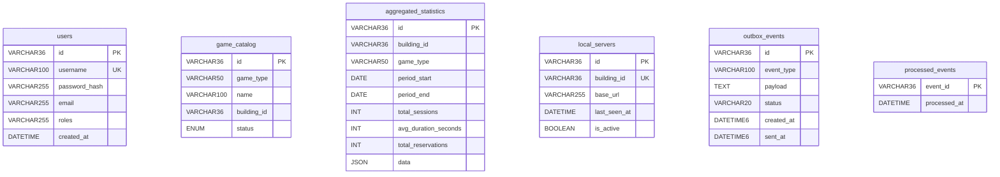

### 7.2 Schema ER — Database Locale

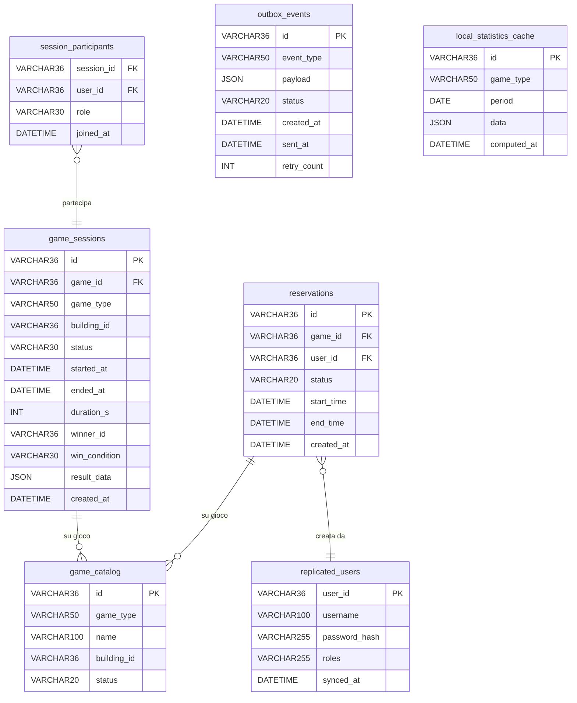

### 7.3 Enum e stati

| Enum | Valori | Dove usato |
|---|---|---|
| `GameMachineStatus` | `AVAILABLE`, `RESERVED`, `IN_USE`, `MAINTENANCE` | `game_catalog.status` (entrambi i DB) |
| `GameStatus` | `IN_PROGRESS`, `PAUSED`, `COMPLETED`, `ABORTED` | `game_sessions.status` |
| `ReservationStatus` | `PENDING`, `CONFIRMED`, `CANCELLED`, `EXPIRED` | `reservations.status` |
| `GameType` | `FOOSBALL`, `CHESS`, `DARTS`, `MONOPOLY`, `RISK`, `SLOT_MACHINE`, `ROULETTE` | Topic MQTT, outbox payload, statistiche |
| `WinCondition` | `WIN`, `DRAW`, `ABANDONED`, `TIMEOUT` | `game_sessions.win_condition` |
| `StopReason` | `COMPLETED`, `ABORTED`, `TIMEOUT` | Payload outbox sessione abortita |

### 7.4 Indici significativi

| Tabella | Indice | Scopo |
|---|---|---|
| `reservations` | `idx_expiration(status, end_time)` | `ReservationExpirationService` trova le prenotazioni scadute |
| `reservations` | `idx_availability(game_id, status, start_time, end_time)` | Verifica disponibilità rapida |
| `outbox_events` (centrale) | `idx_outbox_status_created_at(status, created_at)` | Query pending ordinata per data |
| `outbox_events` (locale) | `idx_status(status)` | `SyncSchedulerService.findPending()` |
| `aggregated_statistics` | `uk_building_type_period` (UNIQUE) | Upsert sicuro, evita duplicati |
| `local_servers` | `idx_active(is_active)` | Filtra server attivi per la replica |

### 7.5 Colonna JSON per risultati di gioco

La colonna `result_data JSON` nella tabella `game_sessions` contiene dati specifici per tipo di gioco, serializzati tramite Jackson `@JsonTypeInfo`. Esempi:

```json
// Calciobalilla
{"type":"FOOSBALL","team_red":{"goals":5,"users":["uuid1"]},"team_blue":{"goals":3,"users":["uuid2"]}}

// Scacchi
{"type":"CHESS","white":"uuid1","black":"uuid2","termination":"CHECKMATE","total_moves":42}

// Monopoli
{"type":"MONOPOLY","finalMoney":{"uuid1":4500,"uuid2":0},"bankruptOrder":["uuid2"]}

// Risiko
{"type":"RISK","territoriesAtEnd":{"uuid1":{"Italy":5,"France":3}},"totalRounds":15}
```

---

## 8. API Design

### 8.1 Central System — Endpoint REST

**Base URL:** `https://central-system:8080` (Docker) / `https://localhost:8080` (sviluppo)

#### Autenticazione

| Metodo | Path | Auth | Response OK | Descrizione |
|---|---|---|---|---|
| `POST` | `/api/auth/login` | Nessuna | 200 `LoginResponseDto` | Autentica utente, ritorna JWT |

**Response 401:** `{ "error": "Invalid username or password" }` (anti-enumeration: stessa risposta per utente assente o password errata)
**Response 429:** `{ "error": "Too many failed login attempts. Please try again later." }` (dopo 5 fallimenti in 60s)

#### Utenti

| Metodo | Path | Auth | Descrizione |
|---|---|---|---|
| `POST` | `/api/users` | Nessuna | Registra nuovo utente → 201 Created |
| `PUT` | `/api/users/{id}` | JWT (ROLE_ADMIN) | Aggiorna utente |

#### Statistiche

| Metodo | Path | Auth | Descrizione |
|---|---|---|---|
| `GET` | `/api/statistics` | JWT (ROLE_ADMIN) | Statistiche aggregate globali |
| `GET` | `/api/statistics?buildingId=&gameType=` | JWT (ROLE_ADMIN) | Statistiche filtrate |

#### Internal (solo service-to-service, `X-Internal-Api-Key`)

| Metodo | Path | Descrizione |
|---|---|---|
| `POST` | `/internal/sync/receive` | Riceve batch di eventi da un Local Server |
| `POST` | `/internal/servers/register` | Registra/aggiorna un Local Server nel registry |

### 8.2 Local Server — Endpoint REST

**Base URL:** `https://local-server-1:8080` (Docker) / `https://localhost:8081` (sviluppo)

| Metodo | Path | Auth | Descrizione |
|---|---|---|---|
| `POST` | `/api/auth/login` | Nessuna | Autentica localmente (offline-first) |
| `POST` | `/api/reservations` | JWT (ROLE_USER) | Crea una prenotazione |
| `GET` | `/api/reservations` | JWT (ROLE_USER) | Elenca prenotazioni dell'utente |
| `DELETE` | `/api/reservations/{id}` | JWT (ROLE_USER) | Cancella una prenotazione |
| `GET` | `/api/games` | JWT (ROLE_USER) | Elenca i giochi nell'edificio |
| `GET` | `/api/games/available` | JWT (ROLE_USER) | Giochi in stato AVAILABLE |
| `POST` | `/api/sessions/start` | JWT (ROLE_USER) | Avvia una sessione |
| `POST` | `/api/sessions/{id}/end` | JWT (ROLE_USER) | Termina una sessione con GameResult |
| `POST` | `/api/sessions/{id}/pause` | JWT (ROLE_USER) | Mette in pausa |
| `POST` | `/api/sessions/{id}/resume` | JWT (ROLE_USER) | Riprende |
| `GET` | `/api/statistics` | JWT (ROLE_USER) | Statistiche locali |
| `POST` | `/api/devices/register` | Nessuna (TLS only) | Firma CSR, ritorna certificato X.509 |
| `PUT` | `/internal/users/sync` | API Key | Aggiorna utenti replicati |

### 8.3 Topic MQTT

**Schema:** `building/{buildingId}/game/{gameId}/{action}` — [fonte: `MqttTopics.java`]

| Topic | Direction | Payload | QoS | Retained |
|---|---|---|---|---|
| `building/{bid}/game/{gid}/state` | LS → GCE | `GameStatePayload` | 1 | Sì |
| `building/{bid}/game/{gid}/session/start` | GCE → LS | `SessionStartPayload` | 1 | No |
| `building/{bid}/game/{gid}/session/end` | GCE → LS | `SessionEndPayload` | 1 | No |
| `building/{bid}/game/{gid}/session/pause` | LS ↔ GCE | `SessionPausePayload` | 1 | No |
| `building/{bid}/game/{gid}/session/resume` | LS ↔ GCE | — | 1 | No |
| `building/{bid}/game/{gid}/heartbeat` | LS → GCE | `"PING"` | 0 | No |
| `building/{bid}/game/{gid}/heartbeat/ack` | GCE → LS | `HeartbeatAckPayload` | 0 | No |
| `building/{bid}/alerts` | LS → * | `AlertPayload` | 1 | No |

### 8.4 Autenticazione e Sicurezza API

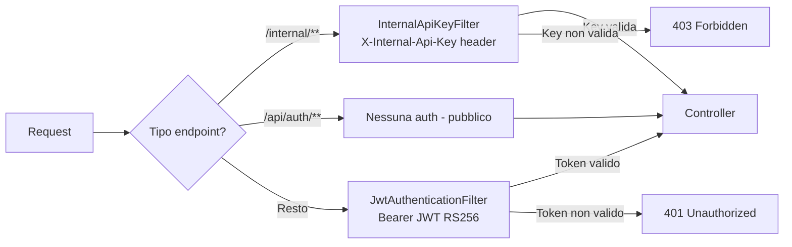

**JWT Claims:**
```json
{
  "sub": "username",
  "userId": "uuid",
  "roles": ["USER"],
  "iat": 1234567890,
  "exp": 1234654290
}
```
Firmato con RSA-256 (chiave privata PEM, 2048 bit). Scadenza: 24 ore (configurabile via `jwt.expiration-ms`).

### 8.5 Error Handling

[fonte: `GlobalExceptionHandler.java`]

| Eccezione | HTTP Status |
|---|---|
| `MethodArgumentNotValidException` | 400 Bad Request |
| `IllegalArgumentException` | 400 Bad Request |
| `InvalidCredentialsException` | 401 Unauthorized |
| `UserNotFoundException` | 404 Not Found |
| `UserAlreadyExistsException` | 409 Conflict |
| `RateLimitExceededException` | 429 Too Many Requests |

---

## 9. Integrazioni Esterne

### 9.1 MySQL (Central e Local)

- **Tecnologia:** MySQL 8.0 via Spring Data JPA / Hibernate
- **Connessione:** `SPRING_DATASOURCE_URL` (env var), driver `mysql-connector-j`
- **Reset:** `docker-compose down -v` elimina i volumi; `init.sql` viene rieseguito al prossimo avvio del container

### 9.2 Eclipse Mosquitto (MQTT Broker)

- **Versione:** eclipse-mosquitto:2.0
- **Persistenza:** abilitata (`persistence true`, volume Docker dedicato `mqtt-broker-1-data`)
- **TLS Produzione:** listener 8883, `require_certificate true`, `use_identity_as_username true` (CN del certificato = username MQTT)
- **Sviluppo:** listener 1883, `allow_anonymous true`
- **Limiti configurati:** `max_inflight_messages 20`, `max_queued_messages 1000`
- **Fonte:** `[infrastructure/mosquitto/mosquitto.conf]`

### 9.3 BouncyCastle (PKI interna)

- **Versione:** 1.78.1 (`bcpkix-jdk18on`, `bcprov-jdk18on`)
- **Scopo:** Il `DeviceRegistrationController` firma i CSR dei client MQTT. Il `CertificateEnrollmentService` nel client genera la coppia RSA e il CSR.
- **Flusso:** Client genera CSR → Local Server legge la CA key dal filesystem → firma il certificato (validità 2 anni) → restituisce PEM.
- **Fonte:** `[certificates_structure.md]`

### 9.4 Retry e Fallback

| Integrazione | Strategia di fallback | Retry |
|---|---|---|
| Local → Central (sync) | Accumulo nell'outbox locale | `retry_count++` ad ogni ciclo, `@Scheduled(fixedRate=300000)` |
| Central → Local (replica) | `ReplicationProgress` per granularità server | Prossimo ciclo scheduler (fixedDelay) |
| MQTT publish | Deferred post-commit; se fallisce: solo warning log | Nessun retry automatico [DA CHIARIRE] |
| CSR signing | HTTP 403 se gameId non in catalogo; HTTP 500 se CA non disponibile | Nessun retry client-side automatico |

---

## 10. ADR — Architectural Decision Records

### ADR-001: Edge Computing con Offline-First Local Server

**Contesto:** Il sistema deve gestire sessioni di gioco in edifici che potrebbero perdere temporaneamente la connettività verso il server centrale.

**Opzioni valutate:**
1. Architettura centralizzata pura (tutti i dati sul Central)
2. **Edge Node offline-first per edificio** (scelta adottata)
3. P2P tra edifici

**Decisione:** Ogni edificio ha un Local Server autonomo con database locale. La sincronizzazione avviene periodicamente tramite Outbox Pattern.

**Trade-off:**
- ✅ Operatività garantita senza connettività
- ✅ Latenza minima per operazioni locali (LAN vs WAN)
- ❌ Complessità di sincronizzazione e potenziale consistenza eventuale
- ❌ Due database da mantenere sincronizzati

**Alternativa scartata:** Architettura centralizzata pura — non tollerante ai guasti di rete, latenza elevata in scenari WAN.

---

### ADR-002: Transactional Outbox Pattern per Sync Asincrona

**Contesto:** Le sessioni di gioco devono essere sincronizzate con il Central System senza perdita di dati, anche in caso di crash del Local Server.

**Opzioni valutate:**
1. Invio diretto HTTP al momento dell'evento (sincrono)
2. Message queue dedicata (Kafka/RabbitMQ)
3. **Transactional Outbox con database locale** (scelta adottata)

**Decisione:** Ogni evento viene scritto nella tabella `outbox_events` nella stessa transazione dell'operazione principale. Un scheduler separato invia gli eventi in batch.

**Trade-off:**
- ✅ Zero perdita di dati garantita atomicamente
- ✅ No dipendenze esterne (nessun Kafka/RabbitMQ)
- ❌ Latenza di sincronizzazione pari all'intervallo dello scheduler (5 min)
- ❌ Crescita unbounded della tabella outbox (problema noto **POF-3**: nessun TTL/cleanup)

**Alternativa scartata:** Message queue dedicata — complessità infrastrutturale elevata per un sistema universitario; richiede deploy e tuning di Kafka.

---

### ADR-003: JWT RSA-256 Asimmetrico con Chiavi per-Nodo

**Contesto:** Il sistema ha due domini di autenticazione: globale (Central System) e locale (Local Server). I token devono essere verificabili senza accesso alla rete.

**Opzioni valutate:**
1. JWT simmetrico HMAC-256 con secret condiviso
2. JWT RSA-256 con unica coppia di chiavi globale
3. **JWT RSA-256 con coppia di chiavi per-nodo** (scelta adottata)

**Decisione:** Ogni nodo (Central, ogni Local Server) ha una propria coppia RSA. Il Central emette token verificabili solo dal Central; il Local emette token verificabili solo dallo stesso Local.

**Trade-off:**
- ✅ Isolamento dei trust domain: un token locale non è valido sul Central
- ✅ La chiave privata non lascia mai il nodo
- ❌ L'utente deve riautenticarsi localmente (potenziale UX friction)
- ❌ Gestione di N coppie di chiavi in produzione

**Alternativa scartata:** HMAC-256 con secret condiviso — un secret compromesso su un nodo edge compromette l'intero sistema.

---

### ADR-004: mTLS per Comunicazione MQTT con Registrazione Dinamica dei Certificati

**Contesto:** I Game Client devono autenticarsi al broker MQTT in modo sicuro. Le credenziali statiche (username/password) sono difficili da ruotare.

**Opzioni valutate:**
1. Username/password Mosquitto statici
2. Token Bearer su WebSocket
3. **mTLS con certificati client + registrazione dinamica via CSR** (scelta adottata)

**Decisione:** Mosquitto usa `require_certificate true` e `use_identity_as_username true`. Il Local Server agisce da CA locale e firma i CSR dei client via `DeviceRegistrationController`. Il CN del certificato diventa l'username MQTT.

**Trade-off:**
- ✅ Autenticazione forte (crittografia asimmetrica)
- ✅ Il CN=gameId permette identificazione precisa del dispositivo
- ✅ Nessun secret fisso nei container client
- ❌ Complessità di gestione PKI (CA key esposta al Local Server)
- ❌ Rinnovo certificati non automatizzato [DA CHIARIRE]

**Alternativa scartata:** Username/password statici — non scalabili, difficili da ruotare in caso di compromissione.

---

### ADR-005: Monorepo Maven Multi-Modulo con Moduli Shared Framework-Free

**Contesto:** Il sistema ha componenti eterogenei (Spring Boot microservizi, JavaFX client) che condividono concetti di dominio (GameType, GameResult, Value Object).

**Opzioni valutate:**
1. Repository separati per ogni componente con DTOs duplicati
2. **Monorepo con moduli shared** (scelta adottata)
3. Schema-first con code generation (Protobuf/OpenAPI)

**Decisione:** Monorepo Maven con tre moduli shared (`shared-domain`, `shared-dto`, `shared-mqtt`) privi di dipendenze da Spring o JPA, garantendo riuso universale (incluso nel client JavaFX).

**Trade-off:**
- ✅ Single source of truth per Value Object ed enum condivisi
- ✅ Il compilatore Java verifica la compatibilità tra moduli ad ogni build
- ✅ `shared-domain` è testabile in isolamento senza framework
- ❌ Accoppiamento a compile-time: una modifica a `shared-domain` richiede rebuild di tutti i moduli
- ❌ Versionamento complesso in futuro se i componenti evolvono a ritmi diversi

**Alternativa scartata:** Repository separati con DTOs duplicati — deriva inevitabile tra le definizioni; errori di serializzazione/deserializzazione difficili da tracciare.

---

### ADR-006: MySQL + Colonna JSON per Risultati di Gioco Eterogenei

**Contesto:** Il sistema gestisce 7 tipi di gioco con strutture di risultato incompatibili. Occorre una strategia di persistenza flessibile senza richiedere ALTER TABLE per ogni nuovo gioco.

**Opzioni valutate:**
1. Single Table Inheritance (colonne nullable per tipo)
2. Table Per Type (una tabella per gioco)
3. EAV (Entity-Attribute-Value)
4. **MySQL + colonna JSON** (scelta adottata)
5. MongoDB (database documentale)

**Decisione:** Schema ibrido con colonne native per campi comuni (`winner_id`, `duration_s`, `game_type`) e colonna `result_data JSON` per dati specifici del gioco. Serializzazione/deserializzazione tramite Jackson `@JsonTypeInfo`.

**Trade-off:**
- ✅ Schema stabile: aggiungere un nuovo gioco richiede zero modifiche al DB
- ✅ Query statistiche aggregate veloci (campi nativi indicizzati)
- ✅ Un solo `GameSessionRepository` per tutti i tipi di gioco
- ❌ Il contenuto di `result_data` non è verificabile a livello DB (no schema enforcement)
- ❌ Query su campi dentro `result_data` richiedono funzioni JSON (`JSON_EXTRACT`)

**Alternativa scartata:** MongoDB — aggiunge una tecnologia (container + driver + config) senza fornire benefici che MySQL+JSON non offra già in questo contesto.

---

*Fine documento DESIGN.md*
*Vedere [REQUIREMENTS.md](REQUIREMENTS.md) per i requisiti verificabili del sistema.*
*Vedere [IMPLEMENTATION.md](IMPLEMENTATION.md) per la guida al setup e allo sviluppo.*
