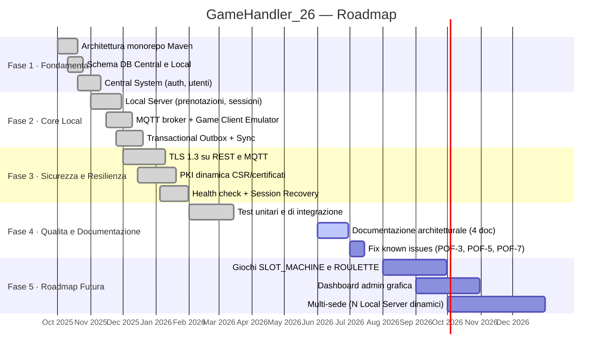

# VISION.md — GameHandler_26: Boardgame Platform

> **Documento:** Vision
> **Versione:** 1.0
> **Data:** 2026-06-29
> **Stato:** Bozza approvata
> **Pubblico:** Manager, Product Owner, stakeholder non tecnici, nuovi membri del team

---

## Indice

1. [Visione del Prodotto](#1-visione-del-prodotto)
2. [Obiettivi Strategici](#2-obiettivi-strategici)
3. [Problem Statement](#3-problem-statement)
4. [Scope](#4-scope)
5. [Stakeholder](#5-stakeholder)
6. [Contesto di Mercato e Competitivo](#6-contesto-di-mercato-e-competitivo)
7. [Vincoli e Assunzioni](#7-vincoli-e-assunzioni)
8. [Roadmap ad Alto Livello](#8-roadmap-ad-alto-livello)

---

## 1. Visione del Prodotto

**GameHandler_26** vuole essere la piattaforma di riferimento per la gestione intelligente e distribuita dei giochi da tavolo e da bar in spazi pubblici e privati. Immaginiamo un ecosistema in cui ogni tavolo da gioco — dal calciobalilla agli scacchi, dalle freccette al monopoli — diventa un nodo digitale connesso, prenotabile e monitorabile in tempo reale, anche quando la connessione alla rete centrale viene meno. La piattaforma elimina le inefficienze operative degli spazi gioco tradizionali — attese, conflitti su disponibilità, dati di utilizzo opachi — e le sostituisce con trasparenza, prevedibilità e dati azionabili, restituendo agli utenti la libertà di giocare senza attriti e agli amministratori il controllo reale sulla propria infrastruttura ricreativa.

---

## 2. Obiettivi Strategici

### 2.1 Business Goals

| ID  | Obiettivo                                                                                         | Priorità |
|-----|---------------------------------------------------------------------------------------------------|----------|
| BG1 | Eliminare i conflitti di utilizzo sui tavoli da gioco tramite un sistema di prenotazione digitale | Alta     |
| BG2 | Garantire continuità operativa degli spazi gioco anche in assenza di connettività Internet        | Alta     |
| BG3 | Fornire agli amministratori statistiche aggregate di utilizzo per decisioni basate sui dati       | Media    |
| BG4 | Scalare orizzontalmente a più edifici/sedi senza rifacimento architetturale                       | Media    |
| BG5 | Ridurre il tempo di onboarding di nuovi dispositivi tramite PKI dinamica automatizzata            | Bassa    |

### 2.2 KPI e Metriche di Valore

| KPI                                                | Target                                           | Metodo di misurazione                                       |
|----------------------------------------------------|--------------------------------------------------|-------------------------------------------------------------|
| Disponibilità del Local Server (offline-first)     | Operativo al 100% senza Central System           | Test di disconnessione controllata                          |
| Latenza sincronizzazione Local → Central           | ≤ 5 minuti dalla riconnessione                   | Timestamp `outbox_events.sent_at` vs `created_at`          |
| Tempo di propagazione nuovi utenti ai Local Server | ≤ 5 minuti dal completamento della registrazione | Log `UserReplicationSchedulerService` (fixedDelay=300s)    |
| Scadenza automatica prenotazioni                   | Errore ≤ 60 secondi rispetto all'ora di fine     | `ReservationExpirationService` (fixedRate=60s)             |
| Tempo rilevamento dispositivo irraggiungibile      | ≤ 15 minuti (3 cicli da 5 min)                  | `HealthCheckService` (3 missed heartbeats)                  |
| Onboarding device (PKI dinamica)                   | < 30 secondi dal primo avvio                     | Log `CertificateEnrollmentService`                          |

---

## 3. Problem Statement

### 3.1 Il Problema

Gli spazi gioco — sale ricreative, bar, circoli, club universitari — gestiscono tradizionalmente i propri tavoli e postazioni di gioco con metodi manuali e non coordinati: fogli cartacei, prenotazioni verbali, nessun tracciamento delle sessioni. Questo genera:

- **Conflitti sull'utilizzo:** più utenti reclamano lo stesso tavolo nello stesso momento.
- **Dati di utilizzo opachi:** i gestori non sanno quali giochi sono più usati, in quali fasce orarie, con quale durata media delle sessioni.
- **Dipendenza dalla connettività:** sistemi digitali esistenti perdono funzionalità totale in caso di problemi di rete.
- **Sicurezza assente:** nessun controllo sull'identità degli utenti che accedono ai dispositivi.

### 3.2 Perché Esiste questa Soluzione

GameHandler_26 nasce per rispondere a questi problemi con un'architettura **offline-first** che separa la resilienza locale (Local Server con DB autonomo) dalla governance globale (Central System come Source of Truth). La comunicazione è asincrona e garantita tramite il pattern **Transactional Outbox**, eliminando il rischio di perdita dati durante le interruzioni di rete. La sicurezza è integrata nativamente tramite TLS 1.3 su tutti i canali, JWT con RSA asimmetrico per l'autenticazione utente e una PKI dinamica per i dispositivi fisici.

---

## 4. Scope

### 4.1 Cosa Include (In Scope)

- **Registrazione e autenticazione utenti** con ruoli ROLE_USER e ROLE_ADMIN.
- **Sistema di prenotazione** dei tavoli da gioco per fascia oraria, con scadenza automatica.
- **Gestione del ciclo di vita delle sessioni** di gioco (avvio, pausa, ripresa, fine) via MQTT.
- **Tracciamento in tempo reale dello stato** di ogni dispositivo di gioco (AVAILABLE / RESERVED / IN_USE / MAINTENANCE).
- **Sincronizzazione bidirezionale** Central ↔ Local con pattern Transactional Outbox e retry automatico.
- **Replica degli utenti** dal Central System a tutti i Local Server registrati, per supportare il login offline.
- **Statistiche di utilizzo** locali (per edificio) e aggregate (globali, per amministratori).
- **PKI dinamica** per l'onboarding sicuro dei Game Client via CSR/certificato X.509.
- **Health check** dei dispositivi con rilevamento automatico degli irraggiungibili e ABORT della sessione attiva.
- **Recovery delle sessioni** all'avvio del Local Server dopo un crash o riavvio.
- **Giochi supportati:** FOOSBALL (calciobalilla), CHESS (scacchi), DARTS (freccette), MONOPOLY, RISK.

### 4.2 Cosa NON Include (Out of Scope)

- **Interfaccia web o mobile per utenti finali:** il client è un emulatore JavaFX a scopo prototipale/accademico, non un'app consumer.
- **Pagamenti e monetizzazione:** nessuna integrazione con sistemi di pagamento.
- **Supporto multi-tenant:** ogni istanza della piattaforma gestisce una singola organizzazione.
- **Supporto a giochi in roadmap (SLOT_MACHINE, ROULETTE):** presenti nell'enum `GameType` ma non ancora operativi nel prototipo corrente.
- **Dashboard di amministrazione grafica:** le statistiche sono accessibili via API REST, non tramite UI dedicata.
- **Notifiche push a utenti:** nessun sistema di notifica email, SMS o push notification.
- **Alta disponibilità del Central System:** nessun clustering o failover del nodo centrale nel prototipo attuale.
- **Conformità GDPR completa:** la gestione della privacy è parziale (vedere §7).

---

## 5. Stakeholder

| Stakeholder                    | Ruolo                                 | Interesse principale                                          | Aspettative chiave                                                         |
|--------------------------------|---------------------------------------|---------------------------------------------------------------|----------------------------------------------------------------------------|
| **Utente finale**              | Giocatore                             | Prenotare e usare i tavoli senza conflitti                    | Sistema reattivo, login rapido, stato giochi aggiornato in tempo reale     |
| **Gestore della sede**         | Amministratore locale                 | Monitorare utilizzo, evitare down-time                        | Continuità operativa offline, alert in caso di dispositivi irraggiungibili |
| **Amministratore IT**          | ROLE_ADMIN                            | Gestione utenti, statistiche aggregate globali                | API sicure, accesso a `GET /api/statistics` su Central System              |
| **Team di sviluppo**           | Sviluppatori universitari             | Implementare e mantenere la piattaforma                       | Architettura pulita (Esagonale), moduli ben separati, test automatici      |
| **Professore/Valutatore**      | Esaminatore accademico (corso PISSIR) | Valutare la correttezza architetturale e l'eseguibilità       | `docker-compose up --build` funzionante, documentazione completa           |
| **Device fisico (Game Client)**| Endpoint automatico                   | Comunicare stato e ricevere comandi via MQTT                  | Connessione TLS stabile, PKI dinamica, heartbeat affidabile                |

---

## 6. Contesto di Mercato e Competitivo

### 6.1 Panorama Attuale

Il mercato della gestione digitale di spazi ricreativi è frammentato. Le soluzioni esistenti si dividono in due categorie:

1. **Sistemi centralizzati cloud-only** (es. piattaforme SaaS per booking di campi sportivi): richiedono connettività costante e non gestiscono dispositivi fisici IoT integrati.
2. **Sistemi embedded proprietari** (es. slot machine con controllo remoto): costosi, chiusi, non interoperabili.

### 6.2 Posizionamento di GameHandler_26

GameHandler_26 occupa uno spazio intermedio e differenziante:

```
                    ┌─────────────────────────────────────────┐
                    │         DIFFERENZIATORI CHIAVE          │
                    ├─────────────────────────────────────────┤
  Cloud-only SaaS   │  ✗ Nessun supporto offline              │
                    │  ✗ Nessuna PKI dinamica per device       │
  ──────────────────┼─────────────────────────────────────────┤
  GameHandler_26    │  ✓ Offline-first (Edge Computing)        │
                    │  ✓ PKI dinamica (CSR → certificato)      │
                    │  ✓ MQTT per IoT real-time                │
                    │  ✓ Open source / stack standard Java     │
  ──────────────────┼─────────────────────────────────────────┤
  Sistemi embedded  │  ✗ Closed source, vendor lock-in         │
  proprietari       │  ✗ Non scalabili a multi-edificio        │
                    └─────────────────────────────────────────┘
```

### 6.3 Contesto Accademico

Il progetto è sviluppato nell'ambito del corso **PISSIR — Protocolli Internet per Sistemi Software Industriali e Reti** (3° anno, Università del Piemonte Orientale). Il contesto accademico impone vincoli di tempo e risorse tipici di un team di studenti, ma la qualità architetturale ambisce a standard industriali, dimostrando padronanza di pattern distribuiti avanzati (Outbox, Edge Computing, mTLS, Hexagonal Architecture).

---

## 7. Vincoli e Assunzioni

### 7.1 Vincoli Tecnologici

| Vincolo                     | Dettaglio                                                                                                                                |
|-----------------------------|------------------------------------------------------------------------------------------------------------------------------------------|
| Stack fisso                 | Java 21, Spring Boot 3.2.0, MySQL 8.0, Eclipse Mosquitto 2.0, Docker Compose                                                            |
| Comunicazione IoT           | Solo MQTT (Eclipse Paho 1.2.5); nessun protocollo alternativo (CoAP, AMQP) previsto                                                     |
| Crittografia                | TLS 1.3 su REST e MQTT; RSA 2048-bit per JWT e PKI; BCrypt per hash password                                                            |
| Monorepo Maven multi-modulo | Tutti i moduli (`central-system`, `local-server`, `game-client-emulator`, `shared-*`) in un unico repository                            |
| Client fisico               | Il Game Client Emulator (JavaFX) è un emulatore software, non un hardware dedicato                                                      |
| Singola sede nel prototipo  | Il `docker-compose.yml` configura un solo Local Server (`building-1`) e due client emulati                                              |

### 7.2 Vincoli di Sicurezza e Normativi

| Vincolo                          | Dettaglio                                                                                                                                                                     |
|----------------------------------|-------------------------------------------------------------------------------------------------------------------------------------------------------------------------------|
| GDPR (parziale)                  | La tabella `users` raccoglie username, email, password (hash BCrypt). Nessun meccanismo di cancellazione account (`right to erasure`) implementato. [DA CHIARIRE: conformità GDPR completa] |
| Separazione trust domain JWT     | Il JWT emesso dal Central System non è valido sul Local Server e viceversa. Ogni nodo ha la propria coppia RSA.                                                               |
| Segreti via variabili d'ambiente | `INTERNAL_API_KEY`, `CENTRAL_DB_PASSWORD`, `GAME_CLIENT_MQTT_PASSWORD` configurati tramite `.env` / variabili Docker. Nessun segreto hardcoded nel codice sorgente.          |
| Bootstrap TLS enrollment         | L'enrollment iniziale del Game Client bypassa la verifica TLS del server (trust-all) per risolvere il problema del pollo/uovo nella PKI. È un rischio noto e accettato nel prototipo. |

### 7.3 Vincoli di Budget e Temporali

- **Budget:** progetto universitario a costo zero. Infrastruttura cloud non prevista; tutto gira su macchine locali via Docker.
- **Timeline:** semestre accademico 2025/2026. Scadenza: sessione estiva 2026.
- **Team:** gruppo di studenti universitari (3° anno). Nessuna risorsa DevOps o SRE dedicata.

### 7.4 Assunzioni

- Si assume che ogni edificio abbia un solo Local Server attivo contemporaneamente.
- Si assume che la rete locale (LAN) all'interno di un edificio sia affidabile; le disconnessioni riguardano il collegamento WAN verso il Central System.
- Si assume che il professore valutatore abbia Docker Desktop installato e funzionante.
- Si assume che i `building_id` siano pre-configurati staticamente (non esiste una UI di provisioning per nuovi edifici).

---

## 8. Roadmap ad Alto Livello



### Milestone principali

| Milestone                              | Stato          | Descrizione                                                                |
|----------------------------------------|----------------|----------------------------------------------------------------------------|
| **M1 — Sistema Core**                  | ✅ Completata  | Central System funzionante con auth, utenti e sync ricevuta                |
| **M2 — Operatività Locale**            | ✅ Completata  | Local Server offline-first con prenotazioni, sessioni e MQTT               |
| **M3 — Sicurezza End-to-End**          | ✅ Completata  | TLS 1.3, JWT RSA per-nodo, PKI dinamica Game Client                        |
| **M4 — Resilienza**                    | ✅ Completata  | Health check 15 min, session recovery all'avvio, outbox retry              |
| **M5 — Documentazione Architetturale** | 🔄 In corso    | VISION, REQUIREMENTS, DESIGN, IMPLEMENTATION                               |
| **M6 — Fix Debito Tecnico**            | 📋 Pianificata | POF-3 (outbox cleanup), POF-5 (optimistic lock), POF-7 (outbox pagination) |
| **M7 — Giochi Roadmap**                | 📋 Futura      | SLOT_MACHINE, ROULETTE operativi                                           |
| **M8 — Dashboard Admin**               | 📋 Futura      | UI web per statistiche e gestione edifici                                  |

---

*Fine documento VISION.md*
*Vedere [REQUIREMENTS.md](REQUIREMENTS.md) per i requisiti dettagliati del sistema.*
*Vedere [DESIGN.md](DESIGN.md) per le scelte architetturali.*
