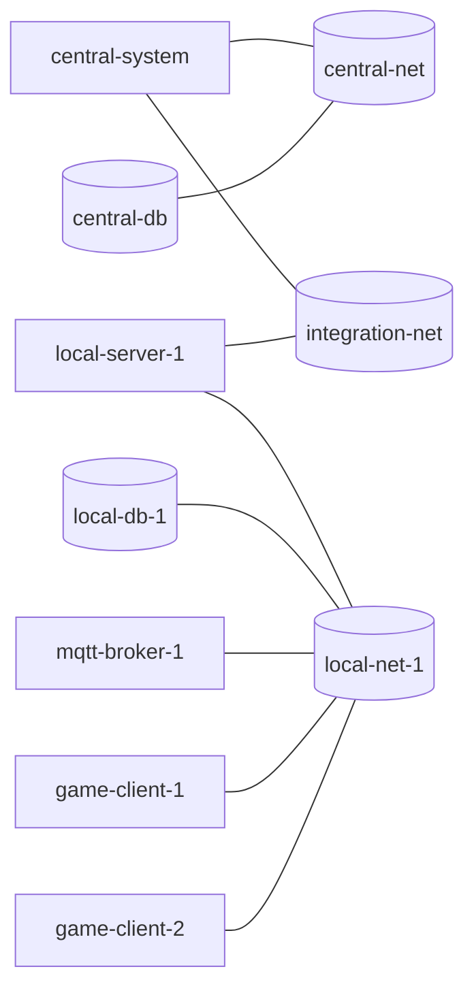

# REQUIREMENTS.md — GameHandler_26: Boardgame Platform

> **Documento:** Requisiti di Sistema
> **Versione:** 1.0
> **Data:** 2026-06-29
> **Stato:** Bozza in revisione
> **Pubblico:** Development Team, QA, Analyst
>
> **Legenda stato implementazione:**
> - ✅ **Implementato e documentato** — il codice esiste e questo documento lo descrive correttamente
> - 🔶 **Implementato ma non documentato** — il codice esiste ma mancava documentazione formale
> - 📋 **Documentato ma non implementato** — requisito pianificato, non ancora in codice
> - ⚠️ **Parzialmente implementato** — implementazione incompleta o con known issues

---

## Indice

1. [Requisiti Funzionali (RF)](#1-requisiti-funzionali-rf)
   - 1.1 [Modulo: Autenticazione e Utenti](#11-modulo-autenticazione-e-utenti)
   - 1.2 [Modulo: Prenotazioni](#12-modulo-prenotazioni)
   - 1.3 [Modulo: Sessioni di Gioco](#13-modulo-sessioni-di-gioco)
   - 1.4 [Modulo: Stato Dispositivi](#14-modulo-stato-dispositivi)
   - 1.5 [Modulo: Statistiche](#15-modulo-statistiche)
   - 1.6 [Modulo: Sincronizzazione Central ↔ Local](#16-modulo-sincronizzazione-central--local)
   - 1.7 [Modulo: Sicurezza e PKI](#17-modulo-sicurezza-e-pki)
   - 1.8 [Modulo: Resilienza e Recovery](#18-modulo-resilienza-e-recovery)
2. [Requisiti Non Funzionali (RNF)](#2-requisiti-non-funzionali-rnf)
3. [Requisiti di Integrazione](#3-requisiti-di-integrazione)
4. [Requisiti di Dati](#4-requisiti-di-dati)
5. [Requisiti di Infrastruttura](#5-requisiti-di-infrastruttura)
6. [Matrice di Tracciabilità](#6-matrice-di-tracciabilità)

---

## 1. Requisiti Funzionali (RF)

### Priorità MoSCoW

| Simbolo | Significato              |
|---------|--------------------------|
| **M**   | Must Have                |
| **S**   | Should Have              |
| **C**   | Could Have               |
| **W**   | Won't Have (this release)|

---

### 1.1 Modulo: Autenticazione e Utenti

#### RF-AU-01 — Registrazione Utente (Central System)
- **Priorità:** M
- **Stato:** ✅ Implementato e documentato
- **Descrizione:** Un visitatore non autenticato può registrarsi alla piattaforma fornendo username, email e password. Il sistema verifica l'unicità dello username e salva la password come hash BCrypt.
- **API:** `POST /api/users` (Central System, pubblico)
- **Fonte:** `[UserController.java]`, `[UserService.java]`, `[init.sql central — tabella users]`
- **Criteri di accettazione:**
  - La risposta è `201 Created` con `userId` generato (UUID v4).
  - Se lo username esiste già → `409 Conflict` (`UserAlreadyExistsException`).
  - La password non viene mai restituita in risposta; solo l'hash BCrypt è persistito.
  - L'evento `USER_REGISTERED` viene scritto nella tabella `outbox_events` del Central System per propagazione asincrona ai Local Server.

#### RF-AU-02 — Login Utente (Central System)
- **Priorità:** M
- **Stato:** ✅ Implementato e documentato
- **Descrizione:** Un utente registrato può autenticarsi sul Central System e ricevere un JWT (RS256, scadenza configurabile via `jwt.expiration-ms`, default 24 ore).
- **API:** `POST /api/auth/login` (Central System, pubblico)
- **Fonte:** `[AuthController.java]`, `[AuthService.java]`, `[JwtTokenProvider.java]`
- **Criteri di accettazione:**
  - Credenziali corrette → `200 OK` con `token` JWT.
  - Credenziali errate → `401 Unauthorized` (`InvalidCredentialsException`).
  - Il JWT contiene i claim `sub` (username), `userId`, `roles`, `iat`, `exp`.
  - Il token è firmato con la chiave RSA privata del Central System; non è valido su nessun Local Server.
  - Il sistema traccia i tentativi falliti nella tabella `failed_login_attempts`. [DA CHIARIRE: soglia di rate limiting e durata del blocco]

#### RF-AU-03 — Login Locale (Local Server, Offline-First)
- **Priorità:** M
- **Stato:** ✅ Implementato e documentato
- **Descrizione:** Un utente può autenticarsi su qualsiasi Local Server anche in assenza di connettività verso il Central System, grazie alla replica locale degli utenti nella tabella `replicated_users`.
- **API:** `POST /api/auth/login` (Local Server, pubblico)
- **Fonte:** `[LocalAuthService.java]`, `[init.sql local — tabella replicated_users]`
- **Criteri di accettazione:**
  - Il JWT emesso dal Local Server è firmato con la coppia RSA locale (diversa dal Central).
  - Il JWT del Central System non è accettato dal Local Server e viceversa.
  - Se l'utente non è nella tabella `replicated_users` → `401 Unauthorized`.
  - Il login funziona anche con il Central System irraggiungibile.

#### RF-AU-04 — Aggiornamento Utente
- **Priorità:** S
- **Stato:** ✅ Implementato e documentato
- **Descrizione:** Un amministratore (`ROLE_ADMIN`) può modificare i dati di un utente esistente sul Central System.
- **API:** `PUT /api/users/{id}` (Central System, richiede `ROLE_ADMIN`)
- **Fonte:** `[UserController.java]`, `[UserService.java]`
- **Criteri di accettazione:**
  - L'operazione è accessibile solo con JWT valido e ruolo `ROLE_ADMIN`.
  - L'aggiornamento genera un evento `USER_UPDATED` nell'outbox per propagazione ai Local Server.
  - Se l'utente non esiste → `404 Not Found`.

#### RF-AU-05 — RBAC (Role-Based Access Control)
- **Priorità:** M
- **Stato:** ✅ Implementato e documentato (FASE 0: migrazione a 4 ruoli canonici)
- **Descrizione:** Il sistema implementa quattro ruoli canonici: `PLAYER` (utente normale), `LOCAL_ADMIN` (amministratore del locale), `GAME_ADMIN` (amministratore del gioco), `PLATFORM_ADMIN` (amministratore della piattaforma). I ruoli sono codificati nel JWT come claim `roles` e verificati da Spring Security. Una finestra di compatibilità (in `JwtAuthenticationFilter`/`JwtTokenValidator` via `Role.toAuthorityNames`) riconosce i letterali legacy `USER`→`PLAYER` e `ADMIN`→`PLATFORM_ADMIN` per i token emessi prima della migrazione.
- **Fonte:** `[SecurityConfig.java]`, `[JwtAuthenticationFilter.java]`, `[Role.java]` (shared-domain)
- **Criteri di accettazione:**
  - Le API `/internal/**` sono protette da API Key (`X-Internal-Api-Key`), non da JWT.
  - Le API `/api/statistics` del Central System richiedono `ROLE_PLATFORM_ADMIN`.
  - Le API di prenotazione e sessione (Local Server) richiedono `ROLE_PLAYER`.
  - La registrazione ( Central `UserService.register` / Local `LocalSignupService.register` ) assegna il ruolo `PLAYER` di default.

---

### 1.1.bis Modulo: Amministratore del Locale (FASE 1)

#### RF-UT-LA-01 — Gestione del catalogo giochi del building
- **Priorità:** M
- **Stato:** ✅ Implementato e documentato (FASE 1)
- **Descrizione:** Un `LOCAL_ADMIN` assegnato a un building può gestire i giochi nel `game_catalog` del proprio building: aggiungere un gioco (validando il `gameType` contro l'enum `GameType` condiviso), modificarne nome e/o stato (`AVAILABLE` ↔ `MAINTENANCE`), e rimuoverlo (vietato se `IN_USE`).
- **API:** `POST /api/admin/local/games`, `PUT /api/admin/local/games/{gameId}`, `DELETE /api/admin/local/games/{gameId}` (Local Server, richiedono `ROLE_LOCAL_ADMIN`)
- **Fonte:** `[AdminLocalController.java]`, `[GameCatalogService.java]`, `[Game.java]` (metodo `rename`), `[GameRepository.deleteById]`
- **Criteri di accettazione:**
  - Ogni endpoint verifica via `LocalAdminBuildingAuthorizationManager` che l'utente autenticato sia bound al building del Local Server (`app.building-id`); in caso contrario → `BuildingNotRegisteredToAdminException` → HTTP 403.
  - `POST /games` valida `gameType` con `GameType.valueOf(...)` (FASE 2 rafforzerà la validazione contro `game_definitions_local`).
  - `PUT /games/{gameId}` applica `Game.rename(newName)` (campo `name` reso non-`final`) + transizione di stato via macchina esistente (`setMaintenance()`/`release()`); almeno uno tra nome e stato deve essere fornito.
  - `DELETE /games/{gameId}` rifiuta se il gioco è `IN_USE` (`GameNotAvailableException`).

#### RF-UT-LA-02 — Monitoraggio sessioni in corso nel building
- **Priorità:** M
- **Stato:** ✅ Implementato e documentato (FASE 1)
- **Descrizione:** Un `LOCAL_ADMIN` può elencare i dispositivi del proprio building (con stato) e le sessioni di gioco attive (stato `IN_PROGRESS`) in quello stesso building.
- **API:** `GET /api/admin/local/devices`, `GET /api/admin/local/sessions/active` (Local Server, richiedono `ROLE_LOCAL_ADMIN`)
- **Fonte:** `[AdminLocalController.java]`, `[GameStateService.getByBuilding]`, `[StatisticsService.getActiveSessionsByBuilding]`
- **Criteri di accettazione:**
  - `GET /devices` restituisce `List<GameStateDto>` dei giochi del building (`gameRepository.findByBuildingId`).
  - `GET /sessions/active` restituisce `List<GameSessionDto>` delle sessioni `IN_PROGRESS` del building.
  - Enforce building-binding come RF-UT-LA-01.

#### RF-UT-LA-03 — Statistiche aggregate del building
- **Priorità:** S
- **Stato:** ✅ Implementato e documentato (FASE 1)
- **Descrizione:** Un `LOCAL_ADMIN` può consultare le statistiche aggregate di utilizzo (per `GameType`) del proprio building.
- **API:** `GET /api/admin/local/statistics?gameType=…` (Local Server, richiede `ROLE_LOCAL_ADMIN`)
- **Fonte:** `[AdminLocalController.java]`, `[StatisticsService.getStatisticsForBuilding]`
- **Criteri di accettazione:**
  - Il parametro `gameType` è obbligatorio; blank → HTTP 400.
  - Calcolo building-scoped: `gameRepository.findByBuildingId` filter per `gameType`, `reservationRepository.countByGameIds`, `gameSessionRepository.findByBuildingId` filter per `gameType` → `LocalStatistics.recalculate`.
  - Enforce building-binding come RF-UT-LA-01.

#### RF-UT-LA-04 — Enforcement offline del binding LOCAL_ADMIN ↔ building
- **Priorità:** M
- **Stato:** ✅ Implementato e documentato (FASE 1)
- **Descrizione:** Il binding `LOCAL_ADMIN`↔building è Source of Truth sul Central (`local_admin_buildings`), replicato ai Local Server via outbox (`LOCAL_ADMIN_BUILDING_ASSIGNED`/`_REVOKED`) e disponibile offline per l'enforcement. La replica è idempotente per PK composita `(user_id, building_id)`.
- **API (Central, `PLATFORM_ADMIN`):** `POST /api/admin/local/buildings` (assign), `DELETE /api/admin/local/buildings` (revoke), `GET /api/admin/local/buildings?userId=…` (lista).
- **API (Local, internal):** `PUT /internal/metadata/sync` (riceve batch di `LocalAdminBuildingEventDto`), gated da `X-Internal-Api-Key`.
- **Fonte:** `[LocalAdminBuildingService.java]`, `[LocalAdminController.java]` (central); `[LocalAdminBuildingSyncService.java]`, `[InternalMetadataController.java]`, `[LocalAdminBuildingAuthorizationManager.java]` (local); `[UserReplicationSchedulerService.java]` + `[LocalMetadataRestAdapter.java]` (replica Central→Local).
- **Criteri di accettazione:**
  - Il `PLATFORM_ADMIN` assegna/revoca building a un `LOCAL_ADMIN`; ogni operazione scrive un evento outbox `LOCAL_ADMIN_BUILDING_ASSIGNED`/`_REVOKED` atomicamente con il cambiamento del binding.
  - `UserReplicationSchedulerService` (esteso in FASE 1) drena anche gli eventi metadata e li pusha a tutti i Local attivi via `LocalMetadataRestAdapter` (`PUT /internal/metadata/sync`, header `X-Internal-Api-Key`); tracciamento via `replication_progress` (id outbox).
  - `LateRegistrationCatchUpService` (esteso) replica i binding ai Local registrati/riattivati dopo la pubblicazione.
  - Il Local applica ASSIGNED come upsert su `local_admin_buildings_local` e REVOKED come delete per PK; entrambi idempotenti.
  - `LocalAdminBuildingAuthorizationManager.canManageBuilding(Authentication)` consulta `local_admin_buildings_local` (lookup `userId` via `userRepository.findByUsername`) per verificare che l'admin sia bound a `app.building-id`.

---

### 1.1.ter Modulo: Amministratore del Gioco (FASE 2)

#### RF-UT-GA-01 — Definizione delle tipologie di gioco configurabili
- **Priorità:** M
- **Stato:** ✅ Implementato e documentato (FASE 2)
- **Descrizione:** Un `GAME_ADMIN` può definire nuove tipologie di gioco (o aggiornarne una esistente) tramite il Source of Truth centrale `game_definitions`. Ogni definizione è identificata dal `gameType` (PK) e trasporta `name`, limiti di giocatori (`min_players`/`max_players`), flag `team_allowed` e opzionali `registration_rules` (documento JSON arbitrario). Lo schema è inizializzato con seed iniziale allineato all'enum `GameType` (CHESS, FOOSBALL, DARTS, MONOPOLY, RISK, SLOT_MACHINE, ROULETTE).
- **API:** `POST /api/admin/games/definitions` (upsert), `PUT /api/admin/games/definitions/{gameType}` (upsert con coerenza path/body), `GET /api/admin/games/definitions` (lista, solo lettura) — Central System.
- **Ruoli:** `POST`/`PUT` richiedono `ROLE_GAME_ADMIN` (`@PreAuthorize("hasRole('GAME_ADMIN')")` a livello di metodo); `GET` è `authenticated` (default per `/api/**` in `SecurityConfig`).
- **Fonte:** `[GameAdminController.java]`, `[GameDefinitionService.java]`, `[UpsertGameDefinitionUseCase.java]`, `[ListGameDefinitionsUseCase.java]`, `[GameDefinition.java]`, `[GameDefinitionRepository.java]`, `[GameDefinitionJpaEntity.java]`, `[GameDefinitionRepositoryAdapter.java]`, `[GameDefinitionMapper.java]`, `[infrastructure/mysql-central/init.sql]` (tabella + seed §FASE 2)
- **Criteri di accettazione:**
  - Il body della richiesta è `UpsertGameDefinitionRequestDto` con validazione Jakarta: `gameType @NotNull`, `name @NotBlank`, `minPlayers/maxPlayers @Min(1) @Max(100)`. Il cross-check `minPlayers <= maxPlayers` è enforced nel costruttore del modello di dominio `GameDefinition` (`IllegalArgumentException` → 400 via `GlobalExceptionHandler`).
  - `PUT /definitions/{gameType}` valida che il `gameType` del path coincida con quello del body, altrimenti 400.
  - Le nuove definizioni sono create (upsert) e la precedente `createdAt` è preservata sugli aggiornamenti; `updatedAt` è refreshato via `Clock`.
  - La scrittura del `GameDefinition` e l'evento outbox `GAME_DEFINITION_UPSERTED` sono persistenti nella **stessa transazione atomica** (`@Transactional` class-level su `GameDefinitionService`).
  - La tabella `game_definitions` è idempotente (PK `game_type`); il seed usa `INSERT ... ON DUPLICATE KEY UPDATE name = VALUES(name)`.

#### RF-UT-GA-02 — Configurazione delle regole di registrazione partita
- **Priorità:** M
- **Stato:** ✅ Implementato e documentato (FASE 2 — parte di RF-UT-GA-01)
- **Descrizione:** Il `GAME_ADMIN` configura i vincoli di registrazione delle partite per ogni tipo di gioco: `min_players`, `max_players`, `team_allowed`, e `registration_rules` (JSON opzionale). Le regole sono replicate ai Local Server per validazione offline (`POST /games` di `AdminLocalController` e `GameSessionService.start`).
- **API:** Stesso endpoint di RF-UT-GA-01 (`POST/PUT /api/admin/games/definitions`).
- **Fonte:** `[GameDefinitionService.java]`, `[GameSessionService.start]` (validazione vs `game_definitions_local`), `[AdminLocalController.createGame]` (validazione `existsByGameType`)
- **Criteri di accettazione:**
  - `GameSessionService.start` legge da `gameDefinitionLocalRepository.findByGameType(gameType)`; se presente usa `getMinPlayers()/getMaxPlayers()` per il bound check; assente → fallback a `GameFactory.createGame(...).getMin/MaxPlayers()` per offline-first resilience (preserva il comportamento FASE 1). `team_allowed` è rinviata al contesto torneo (FASE 6).
  - L'eccezione violazione bound resta `IllegalArgumentException` per non rompere il contratto preesistente dei test.
  - `AdminLocalController POST /games` rafforza la validazione FASE 1 (decisione §10.2 C1): dopo `GameType.valueOf(...)` (enum) chiama `gameDefinitionLocalRepository.existsByGameType(gameType)`; assente → `GameDefinitionNotAvailableLocallyException` → HTTP 400.

#### RF-UT-GA-03 — Replica delle `game_definitions` ai Local per validazione offline
- **Priorità:** S
- **Stato:** ✅ Implementato e documentato (FASE 2)
- **Descrizione:** Le `game_definitions` del Central sono replicate ai Local Server come tabella read-only `game_definitions_local` via outbox events `GAME_DEFINITION_UPSERTED`. La replica è idempotente per PK `game_type` (upsert) e avviene sullo stesso path del pipeline metadata FASE 1 (estensione di `UserReplicationSchedulerService` e `LateRegistrationCatchUpService`), ma su endpoint dedicato `/internal/metadata/game-definitions/sync` per preservare firme preesistenti.
- **API (Local, internal):** `PUT /internal/metadata/game-definitions/sync` (riceve `List<GameDefinitionEventDto>`), gated da `X-Internal-Api-Key` (`InternalApiKeyFilter` su tutti i path `/internal/**`).
- **Fonte:** `[GameDefinitionService.writeOutboxEvent]` (producer), `[GameDefinitionEventDto.java]` (payload, eventId UUID condiviso con `OutboxEvent.id`), `[UserReplicationSchedulerService.replicateGameDefinitionEvent]`, `[LateRegistrationCatchUpService]` (catch-up per Local registrati/riattivati), `[PushGameDefinitionToLocalServersPort]`, `[LocalGameDefinitionRestAdapter]` (REST adapter twin di `LocalMetadataRestAdapter`), `[GameDefinitionSyncService.applyEvents]`, `[InternalGameDefinitionSyncController.java]`, `[infrastructure/mysql-local/init.sql]` (+ `init-building-2.sql`/`init-building-3.sql`, tabella `game_definitions_local`)
- **Criteri di accettazione:**
  - Il producer creava un evento outbox `${eventId UUID random}` condiviso tra `OutboxEvent.id` (PK) e `GameDefinitionEventDto.eventId` (per tracciamento `replication_progress`); payload JSON porta lo snapshot completo della definizione.
  - `UserReplicationSchedulerService.replicateUsers()` è esteso con branch `isGameDefinitionEvent(event)` → `replicateGameDefinitionEvent(event, activeLocalServers)` parallelo al branch metadata FASE 1; tracciamento via `replication_progress`; `markAsSent` solo quando tutti i Local attivi hanno acked (no poison isolation — idempotente per PK).
  - `LateRegistrationCatchUpService.catchUpNewlyRegisteredServer(server)` è esteso: `REPLICATION_EVENT_TYPES` include `GAME_DEFINITION_UPSERTED`; replay best-effort parallel al branch metadata FASE 1.
  - Il Local applica l'evento come upsert su `game_definitions_local` per PK `game_type`; re-delivery idempotente (stesso stato finale).
  - `GameDefinitionLocalRepositoryAdapter`/`Mapper`/`JpaEntity` replicano struttura del FASE 1.

---

### 1.1.quater Modulo: Statistiche del Giocatore (FASE 3)

#### RF-UT-PL-01 — Consultazione statistiche globali del giocatore
- **Priorità:** M
- **Stato:** ✅ Implementato e documentato (FASE 3)
- **Descrizione:** Un `PLAYER` può consultare le proprie statistiche globali (per `GameType`) sul Central System, source of truth globale. Le statistiche sono aggregate in un read-model per-giocatore (`player_match_facts` + `player_statistics`) popolato dal `SyncEventProcessor` consumando gli eventi outbox `GAME_SESSION_COMPLETED` arricchiti (con `participants` + `winnerId` + `winCondition` espliciti). Un `PLATFORM_ADMIN` può consultare le statistiche di qualsiasi utente.
- **API:** `GET /api/players/me/statistics` (richiede `ROLE_PLAYER`, `?gameType=` opzionale), `GET /api/players/{userId}/statistics` (richiede `ROLE_PLATFORM_ADMIN` o self-check `userId == current`).
- **Fonte:** `[PlayerStatisticsController.java]` (central), `[PlayerStatisticsService.java]`, `[GetPlayerStatisticsUseCase.java]`, `[PlayerStatistics.java]`, `[PlayerMatchFact.java]`, `[PlayerMatchFactRepository.java]`, `[PlayerStatisticsRepository.java]`, `[PlayerStatisticsProjectionService.java]`, `[SyncEventProcessor.handleGameSessionCompleted]` (proiezione), `[CurrentUserService.java]`, `[PlayerStatisticsAccessDeniedException.java]`, `[PlayerStatisticsDto.java]` (shared-dto), `init.sql` (central — tabelle `player_match_facts`/`player_statistics`)
- **Criteri di accettazione:**
  - Il `SyncEventProcessor` (Central) consuma l'evento `GAME_SESSION_COMPLETED`, ne estrae `participants`/`winnerId`/`winCondition`/`sessionId`/`buildingId`/`gameType`/`endedAt` e scrive un `PlayerMatchFact` per ogni partecipante (idempotente via PK composita `(session_id, user_id)` + `saveIfAbsent`) e incrementa atomicamente `PlayerStatistics` per `(userId, gameType)`.
  - L'incremento di `player_statistics` usa `@Lock(PESSIMISTIC_WRITE)` (`findByUserIdAndGameTypeForUpdate`) per race protection; il retry same-tx gestisce il first-bucket duplicate via `em.clear()` + re-find-locked + merge (no avvelenamento tx chiamante).
  - La proiezione gira nella tx `REQUIRES_NEW` di `SyncEventProcessor.processOne` (atomicità: fact insert + counter increment committano insieme).
  - `GET /me/statistics` estrae `userId` dal principal via `CurrentUserService` (username → `UserRepository.findByUsername`, mirroring FASE 1 `LocalAdminBuildingAuthorizationManager`).
  - `GET /{userId}/statistics` autorizza: `PLATFORM_ADMIN` OR `userId == current`; altrimenti → `PlayerStatisticsAccessDeniedException` → HTTP 403.
  - Un giocatore senza match → lista vuota (non eccezione): `matchesPlayed == 0` è rappresentato dall'assenza di righe in `player_statistics`.
  - Il filtro `?gameType=` è opzionale (case-insensitive, `GameType.valueOf`); unknown gameType → 400.

#### RF-UT-PL-02 — Consultazione statistiche locali del giocatore
- **Priorità:** S
- **Stato:** ✅ Implementato e documentato (FASE 3)
- **Descrizione:** Un `PLAYER` può consultare le proprie statistiche locali (per `GameType`) sul Local Server. Le statistiche sono calcolate on-demand dalle tabelle locali `game_sessions`+`session_participants` esistenti — nessuna nuova tabella locale e nessun sync aggiuntivo richiesto (PIANO §2.1: replica offline Could-Have via computazione on-demand).
- **API:** `GET /api/players/me/statistics` (Local Server, richiede `ROLE_PLAYER`, `?gameType=` opzionale)
- **Fonte:** `[PlayerStatisticsController.java]` (local), `[StatisticsService.getPlayerStatistics]`, `[GetPlayerStatisticsUseCase.java]` (local), `[GameSessionRepository.findByParticipant]`, `[CurrentUserService.java]` (local)
- **Criteri di accettazione:**
  - L'aggregazione conta solo sessioni con `status == COMPLETED` (coerente con il read-model centrale, popolato solo da `GAME_SESSION_COMPLETED`).
  - `matchesPlayed` = numero di sessioni `COMPLETED` in cui l'utente è partecipante; `matchesWon` = sessioni in cui `winnerId == userId`; `lastPlayedAt` = `endedAt` più recente.
  - Se l'utente autenticato non è replicato localmente → lista vuota (offline-first: nessun match locale possibile).
  - Il filtro `?gameType=` è applicato post-aggregazione; unknown gameType → 400.

#### RF-SE-02 — Termine Sessione (aggiornamento FASE 3)
- **Stato:** ✅ Implementato e documentato (FASE 3: payload arricchito)
- **Criteri di accettazione (aggiornamento):**
  - L'evento outbox `GAME_SESSION_COMPLETED` emesso da `GameSessionService.end` (Local) ora include esplicitamente `participants: List<String>` (user id values), `winnerId: String` (null per draw), `winCondition: String` (null se assente) — oltre a `resultData` che già li contiene. I nuovi campi sono purely additive (payload resta JSON String); facilitano il processing Central-side nel `SyncEventProcessor` senza re-parsing del JSON polimorfico di `GameResult`.

---

### 1.1.quinquies Modulo: Gestione Tornei — CRUD + Registrazione (FASE 4)

#### RF-TO-01 — Creazione di un torneo
- **Priorità:** M
- **Stato:** ✅ Implementato e documentato (FASE 4)
- **Descrizione:** Un `PLATFORM_ADMIN` crea un torneo specificando nome, `gameType`, `teamBased`, `teamSize`, edifici coinvolti (≥2), finestra temporale (`startsAt`). Il torneo è creato in stato `DRAFT` con `format=SINGLE_ELIMINATION` (di default). Il sistema valida la coerenza `teamBased` ↔ `game_definitions.team_allowed` per il `gameType` scelto.
- **API:** `POST /api/tournaments` (Central, richiede `ROLE_PLATFORM_ADMIN`)
- **Fonte:** `[TournamentController.java]`, `[TournamentService.java]`, `[CreateTournamentUseCase.java]`, `[Tournament.java]`, `[TournamentRepository.java]`, `[TournamentBuildingRepository.java]`, `[GameDefinitionRepository.java]` (validazione `team_allowed`), `[CurrentUserService.java]` (principal → `createdBy`), `[CreateTournamentRequestDto.java]`, `[TournamentDto.java]`, `init.sql` (central — tabelle `tournaments`/`tournament_buildings`)
- **Criteri di accettazione:**
  - Body `CreateTournamentRequestDto` validato Jakarta: `name @NotBlank`, `gameType @NotNull`, `teamSize @Min(1)`, `startsAt @NotNull`, `buildingIds @NotNull @Size(min=2)`.
  - `TournamentService.create` forza `status=DRAFT` e `format=SINGLE_ELIMINATION` defensively (non si fida del caller).
  - C.5 coherence: se `teamBased=true` allora `game_definitions.team_allowed` MUST essere `true` (else `InvalidTournamentException` → 400); se `teamBased=false` allora `teamSize` MUST essere `1`.
  - `createdBy` è risolto via `CurrentUserService.getCurrentUserId()` dal principal JWT (no body field).
  - Scrittura atomica `@Transactional` class-level: `tournaments` row + N `tournament_buildings` righe committano insieme (no data-loss se una delle due fallisce).
  - Nessuna emissione outbox in FASE 4 (decisione D13 — i 5 event record sono forward-declared per FASE 5/6).
  - Ritorna `TournamentDto` con `status=DRAFT`, `participantsCount=0`, `buildings=List.copyOf(buildingIds)`.

#### RF-TO-02 — Vincoli strutturali del torneo
- **Priorità:** M
- **Stato:** ✅ Implementato e documentato (FASE 4 — parte di RF-TO-01)
- **Descrizione:** Un torneo coinvolge **≥2 edifici** e riguarda **un solo `gameType`** (FK a `game_definitions`). La tabella `tournament_buildings(tournament_id, building_id)` persiste l'insieme degli edifici coinvolti.
- **API:** Stesso endpoint di RF-TO-01 (`POST /api/tournaments`).
- **Fonte:** `init.sql` (central — `tournament_buildings` PK composita + `tournaments.FK game_type REFERENCES game_definitions(game_type)`); `[TournamentBuildingRepository.java]`, `[TournamentBuildingRepositoryAdapter.java]`
- **Criteri di accettazione:**
  - `buildingIds.size() >= 2` enforced via `@Size(min=2)` + service-level check.
  - `tournaments.game_type` è FK a `game_definitions(game_type)` (valido: `game_definitions` creata in FASE 2).
  - Il `gameType` è singolo per torneo (non c'è lista di gameType).
  - Gli edifici coinvolti sono persistiti a creazione e consultabili via `TournamentDto.buildings`.

#### RF-TO-03 — Iscrizione individuale a un torneo
- **Priorità:** M
- **Stato:** ✅ Implementato e documentato (FASE 4)
- **Descrizione:** Un `PLAYER` può iscriversi a un torneo individuale (`teamBased=false`) quando `status=OPEN_REGISTRATION`. Il sistema registra il `participant_id = UserId.value()` e `display_name = user.username` (risolto via `UserRepository.findById`).
- **API:** `POST /api/tournaments/{id}/participants` (Central, richiede `ROLE_PLAYER`); body `RegisterTournamentParticipantDto` con `teamName=null, teamMembers=null` per individual.
- **Fonte:** `[TournamentRegistrationController.java]`, `[TournamentRegistrationService.java]`, `[RegisterTournamentParticipantUseCase.java]`, `[TournamentParticipant.java]`, `[TournamentParticipantRepository.java]`, `[UserRepository.java]` (display name resolution), `[CurrentUserService.java]` (captain = principal)
- **Criteri di accettazione:**
  - `TournamentRegistrationService.register` valida `tournament.status == OPEN_REGISTRATION` (else `TournamentRegistrationClosedException` → 409).
  - Per individual: `teamName == null && teamMembers == null/empty`; rifiuta se `tournament.teamBased == true` (→ `InvalidTournamentException` 400).
  - `User` risolto via `userRepository.findById(captainId)` (throw `UserNotFoundException` → 404 se non trova). `displayName = user.getUsername()`.
  - `participant_id = captainId.value()`; se già registrato → `DuplicateTournamentParticipantException` → 409.
  - Persistenza atomica `@Transactional` di `TournamentParticipant`.
  - Ritorna `TournamentParticipantDto(participantId, isTeam=false, displayName)`.

#### RF-TO-04 — Iscrizione di una squadra a un torneo a squadre
- **Priorità:** M
- **Stato:** ✅ Implementato e documentato (FASE 4)
- **Descrizione:** Un `PLAYER` (capitano) iscrive una squadra di `teamSize` membri a un torneo a squadre (`teamBased=true`). Il sistema registra la squadra (NON i singoli membri come partecipanti separati): `participant_id = TeamId.value()` (UUID freshly-generated), `display_name = teamName`. I membri sono persistiti in `tournament_team_members`.
- **API:** `POST /api/tournaments/{id}/participants` (Central, richiede `ROLE_PLAYER`); body `RegisterTournamentParticipantDto` con `teamName=<non-blank>, teamMembers=<List<String> di userIds>`.
- **Fonte:** `[TournamentRegistrationService.java]`, `[Team.java]`, `[TournamentTeamRepository.java]`, `[TournamentTeamRepositoryAdapter.java]` (atomic delete-all-then-insert di team_members), `[TeamMapper.java]` (assorbe members ↔ `List<UserId>`), `[TournamentParticipantRepository.java]`
- **Criteri di accettazione:**
  - `tournament.teamBased == true` (else `InvalidTournamentException` 400 — rifiuta team request su torneo individuale).
  - `teamName` non blank; `teamMembers.size() == tournament.teamSize` (else 400); `teamMembers.contains(captainId.value())` MUST essere true (decisione D4 — il capitano è uno dei `teamSize` membri; else 400).
  - `tournament_team_repository.existsByTournamentAndName(...)` per evitare duplicati di nome team nello stesso torneo (else 400).
  - `TeamId = UUID.randomUUID().toString()`; `members = teamMembers.stream().map(UserId::new).toList()`.
  - **Member existence NON validato** alla registrazione (rinviato a FASE 6 session start — decisione D7, risk-mitigation §7 line 724).
  - Persistenza atomica `@Transactional`: `Team` (row `tournament_teams` + N righe `tournament_team_members`) + `TournamentParticipant` committano insieme.
  - Ritorna `TournamentParticipantDto(participantId=teamId.value(), isTeam=true, displayName=teamName)`.

#### Lifecycle addendum (FASE 4 — non RF separati, ma parte di RF-TO-01)

- **`POST /api/tournaments/{id}/open`** (`PLATFORM_ADMIN`): transizione `DRAFT → OPEN_REGISTRATION` sul POJO `Tournament.openRegistration()` (ritorna NUOVA istanza immutabile; throws `InvalidTournamentStateException` se `status != DRAFT` → 400).
- **`POST /api/tournaments/{id}/cancel`** (`PLATFORM_ADMIN`): transizione `DRAFT/OPEN_REGISTRATION → CANCELLED` sul POJO `Tournament.cancel()` (throws se `status` terminale → 400).
- **`DELETE /api/tournaments/{id}/participants`** (`PLAYER`): cancella iscrizione (individual via `participant_id = currentUserId.value()`, o team via lookup `findByTournamentAndMember`). Idempotent no-op → 204 se non trova.
- **`GET /api/tournaments`** (authenticated): lista tutti (`findAll`) o filtra per `?status=OPEN_REGISTRATION` (`TournamentStatus.valueOf` parsing).
- **`GET /api/tournaments/{id}`** (authenticated): dettaglio; 404 via `TournamentNotFoundException` se assente.
- **`GET /api/tournaments/{id}/participants`** (authenticated): lista partecipanti iscritti.

> **Endpoint Implementati in FASE 5**: `POST /{id}/schedule` (bracket generation, `PLATFORM_ADMIN`), `GET /{id}/standings` (authenticated), `GET /{id}/matches` (authenticated). Vedi §1.1.sextus per RF-TO-05..06.

---

### 1.1.sextus Modulo: Gestione Tornei — Bracket e Classifiche (FASE 5)

#### RF-TO-05 — Generazione del bracket single-elimination con byes
- **Priorità:** M
- **Stato:** ✅ Implementato e documentato (FASE 5)
- **Descrizione:** Un `PLATFORM_ADMIN` genera il bracket single-elimination round-1 per un torneo in stato `OPEN_REGISTRATION`. Il sistema transiziona il torneo a `IN_PROGRESS` (via `Tournament.startProgress()` — `InvalidTournamentStateException` → 400 se stato illegale), calcola `bracketSize = nextPow2(N)` e `byes = bracketSize - N`, assegna i BYE ai top seed (i primi `byes` partecipanti per `registeredAt` ASC) con righe `participantB=null, status=BYE, winner=participantA`, e accoppia i restanti `N - byes` partecipanti (lowest remaining seed vs highest remaining seed). Per ogni match `SCHEDULED` emette atomicamente un evento outbox `TOURNAMENT_MATCH_SCHEDULED` (shared UUID tra `OutboxEvent.id` e `TournamentMatchScheduledDto.eventId`); i match `BYE` NON emettono outbox (sono auto-avanzamenti, non partite da giocare). Le standings sono azzerate (zero-init) per tutti gli N partecipanti.
- **API:** `POST /api/tournaments/{id}/schedule` (Central, richiede `ROLE_PLATFORM_ADMIN`); body vuoto; ritorna `200` + `List<TournamentMatchDto>` (righe BYE + SCHEDULED ordinate per `bracketPosition`).
- **Fonte:** `[TournamentController.java]`, `[TournamentBracketService.java]`, `[ScheduleTournamentMatchesUseCase.java]`, `[TournamentMatchOutboxPort.java]`, `[TournamentMatchOutboxAdapter.java]`, `[TournamentStandingsService.java]` (seedStandings), `[Tournament.java].startProgress()`, `[TournamentMatch.java]`, `[TournamentMatchRepository.java]`, `[TournamentParticipantRepository.java]`, `[TournamentMatchScheduledDto.java]`, `[OutboxEvent.java]`/`[OutboxEventRepository.java]` (outbox pattern)
- **Criteri di accettazione:**
  - `Tournament.format == SINGLE_ELIMINATION` (else `InvalidTournamentStateException` → 400; `ROUND_ROBIN` è RF-TO-13 Could-Have, non supportato in FASE 5).
  - `Tournament.status == OPEN_REGISTRATION` (else `InvalidTournamentStateException` → 400; idempotency-by-rejection: una seconda chiamata su torneo già `IN_PROGRESS` fallisce con 400).
  - `participants.size() >= 2` (else `InvalidTournamentStateException` → 400).
  - Partecipanti sortati per `registeredAt` ASC per seeding deterministico (`TournamentParticipantRepository.findByTournament` non ha `ORDER BY` esplicito — sorting interno al service).
  - Bracket shape: `bracketSize = nextPow2(N)`; `byes = bracketSize - N`; `scheduledCount = (N - byes) / 2`; righe totali round-1 = `bracketSize/2`. Tabella valida per N=2..8 (vedi `workflow/architettura_classi.md` §14.2 D7).
  - Atomicità outbox: `tournament` save + ogni `match` save + ogni outbox write + `seedStandings` tutti nello stesso `@Transactional` (Outbox Pattern, mirrors `LocalAdminBuildingService.writeOutboxEvent:130-145`).
  - `TOURNAMENT_MATCH_SCHEDULED` outbox events restano `PENDING` fino al drain FASE 6 (`MetadataReplicationSchedulerService` extension + REST push a Local coinvolti).

#### RF-TO-06 — Esposizione della classifica (`tournament_standings`)
- **Priorità:** M
- **Stato:** ✅ Implementato e documentato (FASE 5 — read + seed; recompute-after-completion + final rank sono FASE 6)
- **Descrizione:** Il sistema espone la classifica corrente del torneo. In FASE 5 la classifica è la proiezione zero-init di tutti i partecipanti (seed stabilito al momento dello `/schedule`); RF-TO-06 sarà pienamente soddisfatto in FASE 6 quando la recompute-after-completion aggiornerà wins/losses/points dopo ogni `TOURNAMENT_MATCH_COMPLETED` e assegnerà il rank finale quando `status=COMPLETED`.
- **API:** `GET /api/tournaments/{id}/standings` (Central, `authenticated`); ritorna `200` + `List<TournamentStandingDto>` ordinata per `points desc, wins desc, participantId asc`.
- **Fonte:** `[TournamentController.java]`, `[TournamentStandingsService.java]`, `[GetTournamentStandingsUseCase.java]`, `[TournamentStanding.java]`, `[TournamentStandingRepository.java]`, `[TournamentParticipantRepository.java]` (displayName resolution), `[TournamentStandingDto.java]`
- **Criteri di accettazione:**
  - `displayName` risolto da `TournamentParticipant.getDisplayName()` via mappa `participantId → displayName`; fallback a `participantId` se partecipante cancellato (defensive).
  - `rank` ritornato `null` se tutti i row sono zero-init (FASE 5 seed); rank finale assegnato in FASE 6.
  - Read path è `@Transactional(readOnly = true)` (mirrors `TournamentService.getById/findAll`).
  - `seedStandings(tournamentId, allParticipantIds)` è package-visible (NON esposto sull'in-port); invocato da `TournamentBracketService.schedule` nella stessa tx del bracket; idempotente (skip se `findByTournamentAndParticipantId` presente).

#### Lifecycle addendum (FASE 5 — non RF separati, parte di RF-TO-05/06)

- **`POST /api/tournaments/{id}/schedule`** (`PLATFORM_ADMIN`): vedi RF-TO-05.
- **`GET /api/tournaments/{id}/standings`** (authenticated): vedi RF-TO-06.
- **`GET /api/tournaments/{id}/matches`** (authenticated): read-only delegation a `TournamentMatchRepository.findByTournament` → `List<TournamentMatchDto>` (inclusi righe `BYE`); 200 anche per torneo senza match (lista vuota). Aggiuntivo rispetto alla checklist FASE 5 (ambiguity A risolta in `workflow/architettura_classi.md` §14.2 D1).

---

### 1.1.septimus Modulo: Gestione Tornei — Integrazione Torneo ↔ Local Server (FASE 6)

#### RF-TO-07 — Replica dei match programmati ai Local coinvolti
- **Priorità:** M
- **Stato:** ✅ Implementato e documentato (FASE 6)
- **Descrizione:** Il Central replica i match di torneo programmati (`TOURNAMENT_MATCH_SCHEDULED`) ai Local Server coinvolti via outbox. Lo scheduler (`UserReplicationSchedulerService`, esteso in FASE 6 con un nuovo branch `replicateTournamentMatchEvent`) drena le righe outbox `PENDING`, assegna round-robin `buildingId` + `gameId` (UUID) al match centrale, filtra i Local attivi a quello coinvolto, e spedisce via REST `PUT /internal/tournaments/matches/sync`. Il Late-Registration Catch-Up replay è esteso per i nuovi server registrati.
- **API:** Nessun endpoint pubblico; canale REST interno `PUT /internal/tournaments/matches/sync` (protetto da `InternalApiKeyFilter`).
- **Fonte:** `[UserReplicationSchedulerService.java]` (+3 ctor params, +`replicateTournamentMatchEvent`), `[LateRegistrationCatchUpService.java]` (+2 ctor params, +branch), `[PushTournamentMatchToLocalServersPort.java]`, `[LocalTournamentMatchRestAdapter.java]`, `[TournamentMatchOutboxAdapter.java]` (+`buildingId=null`), `[TournamentMatchScheduledDto.java]` (+13° campo `buildingId`)
- **Criteri di accettazione:**
  - Round-robin assignment: `buildingId = buildingIds[matchIndex % buildingIds.size()]` dove `buildingIds` proviene da `TournamentBuildingRepository.findByTournament`.
  - `gameId` assegnato come UUID fresco al match centrale.
  - Push solo al Local server il cui `buildingId` corrisponde.
  - Idempotenza locale: upsert su `tournament_matches_local` per PK `matchId` (re-delivery sicuro).
  - Tracciamento via `replication_progress` (event_id + server_id); `markAsSent` quando tutti i Local coinvolti hanno acked.

#### RF-TO-08 — Avvio sessione legata a un match
- **Priorità:** M
- **Stato:** ✅ Implementato e documentato (FASE 6)
- **Descrizione:** Il Local avvia una `GameSession` legata a un `tournamentMatchId`. Il sistema valida che il match sia `SCHEDULED` e appartenga a questo building (implicito — il Central pusha solo ai Local coinvolti). Valida che il richiedente sia tra i partecipanti (per match individuali). Inferisce team-based da `GameDefinitionLocal.teamAllowed`. Marca `tournament_matches_local.status = IN_PROGRESS`.
- **API:** `POST /api/players/tournaments/matches/{matchId}/start` (Local, `ROLE_PLAYER`); `POST /api/sessions/start` con `CreateSessionRequestDto.tournamentMatchId` (Local, `ROLE_PLAYER`).
- **Fonte:** `[PlayerTournamentController.java]`, `[GameSessionController.java]` (+5-arg `start` overload), `[GameSessionService.java]` (+9°/10° ctor params, +5-arg `start`, +`end` extension), `[TournamentMatchLocal.java]`, `[TournamentMatchLocalRepository.java]`, `[CreateSessionRequestDto.java]` (+5° campo `tournamentMatchId`), 4 nuove eccezioni `TournamentMatch*Exception`
- **Criteri di accettazione:**
  - `TournamentMatchLocal.status == SCHEDULED` (else `TournamentMatchNotScheduledException` → 409).
  - `GameDefinitionLocal.teamAllowed` coerente con la natura del match (else `TournamentMatchValidationException` → 400).
  - Per individual: richiedente ∈ {participantA, participantB}; per team: skip (limitazione documentata — semplificazione pseudo-participant).
  - `GameSession` costruit con `tournamentMatchId` + `tournamentId` popolati.
  - `TournamentMatchLocal` flipato a `IN_PROGRESS` atomicamente nella stessa `@Transactional`.

#### RF-TO-09 — Emissione outbox `TOURNAMENT_MATCH_COMPLETED`
- **Priorità:** M
- **Stato:** ✅ Implementato e documentato (FASE 6)
- **Descrizione:** Al termine della sessione, il Local emette outbox `TOURNAMENT_MATCH_COMPLETED` con `{matchId, winner, resultData, status}`. Per sessioni abortite (timeout/abbandono), `SessionAbortHelper` calcola un walkover winner (il partecipante NON tra i `session.participants`) e emette `status=ABANDONED` con `winner=walkoverWinner` (non null) — il torneo continua a scorrere.
- **API:** Nessun endpoint pubblico; outbox locale drenato da `SyncSchedulerService` → `POST /internal/sync/receive` sul Central.
- **Fonte:** `[GameSessionService.java].end` (+`TOURNAMENT_MATCH_COMPLETED` outbox row COMPLETED), `[SessionAbortHelper.java].abortAndEmit` (+`TOURNAMENT_MATCH_COMPLETED` outbox row ABANDONED con walkover winner), `[TournamentMatchResultDto.java]`, `[OutboxEvent.java]`/`[OutboxEventRepository.java]`
- **Criteri di accettazione:**
  - Per COMPLETED: `TournamentMatchResultDto(matchId, winner, resultData, "COMPLETED")`.
  - Per ABANDONED: `TournamentMatchResultDto(matchId, walkoverWinner, null, "ABANDONED")` — winner NON null (walkover).
  - Entrambi gli outbox rows (`GAME_SESSION_COMPLETED`/`_ABORTED` + `TOURNAMENT_MATCH_COMPLETED`) scritti atomicamente nella stessa `@Transactional`.
  - `TournamentMatchLocal` flipato a `COMPLETED`/`ABANDONED`.

#### RF-TO-10 — Consumo `TOURNAMENT_MATCH_COMPLETED` + bracket advancement
- **Priorità:** M
- **Stato:** ✅ Implementato e documentato (FASE 6)
- **Descrizione:** Il Central consuma `TOURNAMENT_MATCH_COMPLETED` via `SyncEventProcessor`. Aggiorna `tournament_matches.winner/played_at/result_data/status`. Ricalcola `tournament_standings` (+3 points/win, +1 loss). Genera il match successivo del bracket via `TournamentBracketService.advanceWinner` (CREA il parent se assente, patcha lo slot, emette `TOURNAMENT_MATCH_SCHEDULED` quando il parent è completo). Quando il match è il finale (no parent round), completa il torneo via `completeIfDone` + assegna rank finali.
- **API:** Nessun endpoint pubblico; `POST /internal/sync/receive` (protetto da `InternalApiKeyFilter` central-side).
- **Fonte:** `[SyncEventProcessor.java]` (+4 ctor params, +`handleTournamentMatchCompleted`), `[TournamentBracketService.java]` (+`advanceWinner`, +`completeIfDone`), `[TournamentStandingsService.java]` (+4° ctor param, +`recomputeAfterCompletion`, +`assignFinalRanks`), 3 repo `*ForUpdate` (`@Lock(PESSIMISTIC_WRITE)`), `[EventTypeContractTest.java]` (+`TOURNAMENT_MATCH_COMPLETED`)
- **Criteri di accettazione:**
  - Idempotency via `processed_events` table (eventId-based).
  - `advanceWinner`: `totalRounds = log2(nextPow2(N))`; `parentRound = round+1`; se `parentRound > totalRounds` → null (finale); else CREA o PATCHA il parent; emette outbox quando parent completo.
  - `completeIfDone`: `@Lock(PESSIMISTIC_WRITE)` su `Tournament`; completa se nessun match `SCHEDULED`/`IN_PROGRESS` rimane; `Tournament.complete(Instant.now(clock))` + `assignFinalRanks`.
  - `recomputeAfterCompletion`: winner +3 points/+1 win, loser +1 loss; NO-OP per ABANDONED (winner=null case handled by walkover).
  - `assignFinalRanks`: sort by `points desc, wins desc, participantId asc`; rank 1..N.
  - Race protection: 3 `@Lock(PESSIMISTIC_WRITE)` queries su `Tournament`/`TournamentMatch`/`TournamentStanding`.

#### RF-TO-11 — Completamento torneo + rank finale (S)
- **Priorità:** S
- **Stato:** ✅ Implementato e documentato (FASE 6 — `TournamentBracketService.completeIfDone` + `TournamentStandingsService.assignFinalRanks`)
- **Descrizione:** Quando tutti i match si concludono (COMPLETED/ABANDONED/BYE — nessun SCHEDULED/IN_PROGRESS rimanente), `Tournament.status=COMPLETED` e il rank finale è calcolato (`assignFinalRanks` ordina per `points desc, wins desc, participantId asc` e assegna `rank = 1..N`).
- **Fonte:** `[TournamentBracketService.java].completeIfDone`, `[TournamentStandingsService.java].assignFinalRanks`, `[Tournament.java].complete(Instant)`

#### RF-TO-12 — `TeamResult` per match a squadre (S)
- **Priorità:** S
- **Stato:** ✅ Implementato e documentato (FASE 6)
- **Descrizione:** Partita a squadre: il `GameResult` è `TeamResult` con `winnerTeamId: TeamId`. Il `winnerId` è derivato da `new UserId(winnerTeamId.value())` (pseudo-participant). I singoli membri non sono registrati come vincitori (semplicità: Local non replica `tournament_teams`/`tournament_team_members`). `MqttPayloadSerializer` mixin esteso con `@JsonSubTypes.Type(TeamResult.class, "TEAM")`. Deviazione H: `GameFactory` NON aggiornato — `TeamResult` costruito a service-layer in `GameSessionService.end`.
- **Fonte:** `[TeamResult.java]`, `[WinCondition.java]` (+`TEAM_VICTORY`), `[MqttPayloadSerializer.java]` (+8° subtype), `[GameSessionService.java].end` (produces `TeamResult` at service layer)

#### Lifecycle addendum (FASE 6 — non RF separati, parte di RF-TO-07..10)
- **`PUT /internal/tournaments/matches/sync`** (Local, API Key): riceve batch di `TournamentMatchScheduledDto` dal Central.
- **`GET /api/players/tournaments/me/matches`** (Local, `ROLE_PLAYER`): elenco match SCHEDULED per l'utente su questo building.
- **`POST /api/players/tournaments/matches/{matchId}/start`** (Local, `ROLE_PLAYER`): avvia sessione legata al match.

---

### 1.2 Modulo: Prenotazioni

#### RF-PR-01 — Creazione Prenotazione
- **Priorità:** M
- **Stato:** ✅ Implementato e documentato (POF-5 risolto)
- **Descrizione:** Un utente autenticato può prenotare un tavolo da gioco specificando `gameId`, orario di inizio e orario di fine.
- **API:** `POST /api/reservations` (Local Server, richiede `ROLE_USER`)
- **Fonte:** `[ReservationService.java]`, `[init.sql local — tabella reservations]`
- **Criteri di accettazione:**
  - Il gioco deve essere in stato `AVAILABLE`; altrimenti → eccezione `GameNotAvailableException`.
  - La prenotazione non può essere creata con orario di fine nel passato (`ReservationExpiredException`).
  - Alla creazione, lo stato del gioco transisce da `AVAILABLE` a `RESERVED`.
  - La transizione viene pubblicata sul topic MQTT `building/{buildingId}/game/{gameId}/state` (QoS 1, Retained).
  - L'evento `RESERVATION_CREATED` viene scritto nell'outbox per sync con il Central System.
  - ✅ **POF-5 risolto:** `@Version` (ottimistic lock) su `GameJpaEntity` e `ReservationJpaEntity`; in caso di richieste concorrenti per lo stesso `gameId` il perdente ottiene `ConcurrentStateException` → 409 (REST) o ack-and-drop (MQTT). Race condition su prenotazione non più possibile.

#### RF-PR-02 — Cancellazione Prenotazione
- **Priorità:** M
- **Stato:** ✅ Implementato e documentato
- **Descrizione:** Il proprietario di una prenotazione può cancellarla, purché sia in stato `PENDING` e l'orario di inizio sia a più di 1 ora di distanza.
- **API:** `DELETE /api/reservations/{id}` (Local Server, richiede `ROLE_USER`)
- **Fonte:** `[ReservationService.java]`
- **Criteri di accettazione:**
  - Solo il proprietario della prenotazione può cancellarla (verifica `userId`).
  - Non si può cancellare una prenotazione già scaduta (`EXPIRED`).
  - Non si può cancellare con meno di 1 ora all'inizio.
  - Alla cancellazione il gioco torna in stato `AVAILABLE` e la transizione è pubblicata su MQTT.
  - L'evento `RESERVATION_CANCELLED` viene scritto nell'outbox.

#### RF-PR-03 — Lista Prenotazioni Utente
- **Priorità:** M
- **Stato:** ✅ Implementato e documentato
- **Descrizione:** Un utente autenticato può visualizzare le proprie prenotazioni sul Local Server.
- **API:** `GET /api/reservations` (Local Server, richiede `ROLE_USER`)
- **Fonte:** `[ReservationService.java]`, `[ReservationRepository]`

#### RF-PR-04 — Scadenza Automatica Prenotazioni
- **Priorità:** M
- **Stato:** ✅ Implementato e documentato
- **Descrizione:** Le prenotazioni scadute (il cui `end_time` è nel passato e sono in stato `PENDING`) vengono automaticamente marcate `EXPIRED` e il gioco torna disponibile.
- **Fonte:** `[ReservationExpirationService.java]` — `@Scheduled(fixedRate = 60000)`
- **Criteri di accettazione:**
  - Il job viene eseguito ogni 60 secondi.
  - Per ogni prenotazione scaduta: stato → `EXPIRED`, gioco → `AVAILABLE`, stato pubblicato su MQTT.
  - L'operazione è transazionale (`@Transactional`); la pubblicazione MQTT avviene dopo il commit.

---

### 1.3 Modulo: Sessioni di Gioco

#### RF-SE-01 — Avvio Sessione
- **Priorità:** M
- **Stato:** ✅ Implementato e documentato
- **Descrizione:** Un utente può avviare una sessione di gioco su un dispositivo, opzionalmente associandola a una prenotazione esistente.
- **API:** `POST /api/sessions/start` (Local Server, richiede `ROLE_USER`)
- **Fonte:** `[GameSessionService.java]`
- **Criteri di accettazione:**
  - Se è già attiva una sessione sullo stesso dispositivo → `SessionAlreadyActiveException`.
  - Se viene fornito un `reservationId`: la prenotazione deve essere `PENDING` e non scaduta, e il `gameId` deve corrispondere.
  - Se non viene fornito un `reservationId`: il gioco non deve essere in stato `RESERVED`.
  - Lo stato del gioco transisce a `IN_USE`; la transizione è pubblicata su MQTT.

#### RF-SE-02 — Termine Sessione
- **Priorità:** M
- **Stato:** ✅ Implementato e documentato
- **Descrizione:** Un utente può terminare una sessione attiva, registrando il risultato di gioco (polimorfismo via `@JsonTypeInfo`).
- **API:** `POST /api/sessions/{id}/end` (Local Server, richiede `ROLE_USER`)
- **Fonte:** `[GameSessionService.java]`, `[GameResult.java]` (shared-domain)
- **Criteri di accettazione:**
  - La sessione transisce in stato `COMPLETED`.
  - Il `GameResult` (che include `winner_id`, `win_condition`, `result_data` JSON) viene persistito.
  - Lo stato del gioco torna `AVAILABLE`.
  - L'evento `GAME_SESSION_COMPLETED` viene scritto nell'outbox.
  - Se la sessione era già in stato `ABORTED` (timeout heartbeat), il risultato viene comunque registrato (late arrival handling).

#### RF-SE-03 — Pausa e Ripresa Sessione
- **Priorità:** S
- **Stato:** ✅ Implementato e documentato
- **Descrizione:** Un utente può mettere in pausa e riprendere una sessione attiva.
- **API:** `POST /api/sessions/{id}/pause`, `POST /api/sessions/{id}/resume` (Local Server, richiede `ROLE_USER`)
- **Fonte:** `[GameSessionService.java]`
- **Criteri di accettazione:**
  - I topic MQTT `session/pause` e `session/resume` vengono pubblicati (QoS 1) dopo il commit della transazione.
  - Lo stato del dispositivo rimane `IN_USE` durante la pausa.

#### RF-SE-04 — Abort Automatico per Timeout Heartbeat
- **Priorità:** M
- **Stato:** ✅ Implementato e documentato
- **Descrizione:** Se un Game Client non risponde per 3 cicli consecutivi di health check (15 minuti), la sessione attiva viene automaticamente abortita.
- **Fonte:** `[HealthCheckService.java]` — `@Scheduled(fixedRate = 300000)`, threshold `missed >= 3`
- **Criteri di accettazione:**
  - Lo stop reason è `TIMEOUT`.
  - L'evento `GAME_SESSION_COMPLETED` (con stato `ABORTED`) viene scritto nell'outbox.
  - Il dispositivo torna in stato `AVAILABLE` solo se era `IN_USE`.
  - Un alert viene pubblicato sul topic `building/{buildingId}/alerts` (QoS 1).

---

### 1.4 Modulo: Stato Dispositivi

#### RF-GS-01 — Lista Giochi
- **Priorità:** M
- **Stato:** ✅ Implementato e documentato
- **Descrizione:** Un utente autenticato può ottenere la lista di tutti i dispositivi di gioco gestiti dal Local Server corrente.
- **API:** `GET /api/games` (Local Server, richiede `ROLE_USER`)
- **Fonte:** `[GameStateService.java]`

#### RF-GS-02 — Lista Giochi Disponibili
- **Priorità:** M
- **Stato:** ✅ Implementato e documentato
- **Descrizione:** Un utente può filtrare i giochi in stato `AVAILABLE`.
- **API:** `GET /api/games/available` (Local Server, richiede `ROLE_USER`)
- **Fonte:** `[GameStateService.java]`

#### RF-GS-03 — Aggiornamento Stato Real-Time via MQTT
- **Priorità:** M
- **Stato:** ✅ Implementato e documentato
- **Descrizione:** Ogni transizione di stato di un dispositivo (AVAILABLE → RESERVED → IN_USE → AVAILABLE) viene pubblicata sul broker MQTT locale con messaggio retained.
- **Topic:** `building/{buildingId}/game/{gameId}/state` (QoS 1, Retained)
- **Fonte:** `[PublishGameStatePort]`, `[GameStatePublisher.java]`, `[MqttTopics.java]` (shared-mqtt)

#### RF-GS-04 — Heartbeat Device
- **Priorità:** M
- **Stato:** ✅ Implementato e documentato
- **Descrizione:** Il Local Server invia un ping via MQTT a ogni dispositivo ogni 5 minuti; il dispositivo risponde su un topic dedicato. Il mancato riscontro per 3 cicli consecutivi attiva l'ABORT.
- **Topic ping:** `building/{buildingId}/game/{gameId}/heartbeat` (QoS 0)
- **Topic ack:** `building/{buildingId}/game/{gameId}/heartbeat/ack` (QoS 0)
- **Fonte:** `[HealthCheckService.java]`, `[HeartbeatService.java]` (client), `[HeartbeatPublisher.java]` (client)

---

### 1.5 Modulo: Statistiche

#### RF-ST-01 — Statistiche Locali
- **Priorità:** S
- **Stato:** ✅ Implementato e documentato
- **Descrizione:** Un utente autenticato può visualizzare le statistiche di utilizzo locali (per tipo di gioco) sul Local Server corrente.
- **API:** `GET /api/statistics` (Local Server, richiede `ROLE_USER`)
- **Fonte:** `[StatisticsService.java]`, `[LocalStatistics.java]`
- **Dati esposti:** totale sessioni, durata media (secondi), totale prenotazioni, sessioni attive in corso.

#### RF-ST-02 — Statistiche Globali Aggregate
- **Priorità:** S
- **Stato:** ✅ Implementato e documentato
- **Descrizione:** Un amministratore può visualizzare le statistiche aggregate globali (per edificio e tipo di gioco, per periodo) sul Central System.
- **API:** `GET /api/statistics` (Central System, richiede `ROLE_ADMIN`)
- **Fonte:** `[StatisticsController.java]`, `[StatisticsAggregationService.java]`, `[init.sql central — tabella aggregated_statistics]`
- **Dati esposti:** `total_sessions`, `avg_duration_seconds`, `total_reservations`, `period_start`/`period_end`.

---

### 1.6 Modulo: Sincronizzazione Central ↔ Local

#### RF-SY-01 — Sync Local → Central (Outbox Pattern)
- **Priorità:** M
- **Stato:** ✅ Implementato e documentato (POF-7 risolto; POF-3 risolto lato Local, residuo Central)
- **Descrizione:** Gli eventi locali (sessioni completate, prenotazioni create/cancellate) vengono accumulati nella tabella `outbox_events` del Local Server e inviati periodicamente al Central System.
- **Fonte:** `[SyncSchedulerService.java]` — `@Scheduled(fixedRate = 300000)`
- **Criteri di accettazione:**
  - Il sync avviene ogni 5 minuti (300 000 ms) o alla prima opportunità dopo una disconnessione.
  - Prima di inviare, viene verificata la raggiungibilità del Central System.
  - In caso di successo, gli eventi vengono marcati `SENT`; in caso di fallimento, viene incrementato il contatore `retry_count`.
  - ✅ **POF-3 risolto (Local):** `OutboxPurgeService` (purge SENT > `app.outbox-purge-retention-days`, default 7gg) + `OutboxDlqPromotionService` (FAILED → `outbox_dead_letter`). ⚠️ **Residuo Central:** la tabella `outbox_events` centrale SENT cresce ancora senza limite (nessun purge/DLQ centrale).
  - ✅ **POF-7 risolto:** lettura limitata via `findPendingLimit(batchSize)` (`app.outbox.batch-size`, default 50); isolamento del poison event per-event su fallimento del trasporto; `markAsSentBatch` atomico sul successo; promozione DLQ dopo 10 retry.

#### RF-SY-02 — Ricezione Sync (Central System)
- **Priorità:** M
- **Stato:** ✅ Implementato e documentato
- **Descrizione:** Il Central System espone un endpoint interno per ricevere i payload di sync dai Local Server e processarli in modo idempotente.
- **API:** `POST /internal/sync/receive` (Central System, richiede API Key)
- **Fonte:** `[SyncController.java]`, `[SyncReceiverService.java]`, `[init.sql central — tabella processed_events]`
- **Criteri di accettazione:**
  - L'idempotenza è garantita dalla tabella `processed_events`: eventi già processati vengono ignorati (`DuplicateEventException`).
  - La verifica avviene tramite `eventId` univoco.

#### RF-SY-03 — Replica Utenti Central → Local
- **Priorità:** M
- **Stato:** ✅ Implementato e documentato
- **Descrizione:** Il Central System propaga gli utenti registrati/aggiornati a tutti i Local Server attivi, in batch da al massimo 50 eventi per ciclo.
- **Fonte:** `[UserReplicationSchedulerService.java]` — `@Scheduled(fixedDelay = 300000)`, `BATCH_SIZE = 50`
- **Criteri di accettazione:**
  - Un evento è marcato `SENT` solo quando è stato propagato con successo a tutti i Local Server attivi.
  - Il fallimento su un singolo server non blocca la propagazione agli altri.
  - Il progresso di replica per-server è tracciato in `ReplicationProgress`.

#### RF-SY-04 — Registrazione Local Server
- **Priorità:** M
- **Stato:** ✅ Implementato e documentato
- **Descrizione:** Un Local Server si registra al Central System all'avvio, fornendo `buildingId` e `baseUrl`.
- **API:** `POST /internal/register` (Central System, richiede API Key)
- **Fonte:** `[SyncController.java]`, `[LocalServerRepositoryAdapter.java]`, `[init.sql central — tabella local_servers]`

---

### 1.7 Modulo: Sicurezza e PKI

#### RF-SK-01 — Autenticazione JWT con RSA Asimmetrico
- **Priorità:** M
- **Stato:** ✅ Implementato e documentato
- **Descrizione:** Tutti i JWT sono firmati con RS256 usando coppie RSA 2048-bit distinte per Central System e per ciascun Local Server.
- **Fonte:** `[JwtTokenProvider.java]`, `[JwtAuthenticationFilter.java]`, `[JwtConfig.java]`

#### RF-SK-02 — Autenticazione Server-to-Server via API Key
- **Priorità:** M
- **Stato:** ✅ Implementato e documentato
- **Descrizione:** Le comunicazioni interne (sync, registrazione, replica utenti) usano un header `X-Internal-Api-Key` con valore segreto condiviso.
- **Fonte:** `[InternalApiKeyFilter.java]`, `docker-compose.yml` (variabile `INTERNAL_API_KEY`)

#### RF-SK-03 — TLS 1.3 su REST e MQTT
- **Priorità:** M
- **Stato:** ✅ Implementato e documentato
- **Descrizione:** Tutte le comunicazioni REST (HTTPS su porta 8080/8081) e MQTT (broker su porta 8883 con SSL) usano TLS 1.3.
- **Fonte:** `docker-compose.yml`, `[infrastructure/tls/]`, `[infrastructure/mosquitto/mosquitto.conf]`

#### RF-SK-04 — PKI Dinamica per Game Client
- **Priorità:** M
- **Stato:** ✅ Implementato e documentato
- **Descrizione:** Ogni Game Client, al primo avvio, genera una coppia RSA 2048-bit e una CSR (PKCS#10), la invia al Local Server tramite `POST /api/devices/register`, e riceve un certificato X.509 firmato dalla CA locale.
- **Fonte:** `[CertificateEnrollmentService.java]` (client), BouncyCastle 1.78.1
- **Nota:** ⚠️ Durante l'enrollment iniziale, la verifica TLS del server viene bypassata (trust-all). È un rischio noto e documentato.

#### RF-SK-05 — Hash Password con BCrypt
- **Priorità:** M
- **Stato:** ✅ Implementato e documentato
- **Descrizione:** Le password degli utenti non vengono mai salvate in chiaro; viene usato BCrypt tramite `PasswordEncoder` di Spring Security.
- **Fonte:** `[PasswordEncoderConfig.java]`, `[UserService.java]`

---

### 1.8 Modulo: Resilienza e Recovery

#### RF-RE-01 — Session Recovery all'Avvio
- **Priorità:** M
- **Stato:** ✅ Implementato e documentato
- **Descrizione:** All'avvio del Local Server, le sessioni in stato `IN_PROGRESS` o `PAUSED` vengono recuperate. Il server invia un ping MQTT di recovery a ogni dispositivo e attende 30 secondi; chi non risponde viene abortito.
- **Fonte:** `[SessionRecoveryService.java]` — implementa `SmartLifecycle`, `@DependsOn("mqttClient")`

#### RF-RE-02 — Operatività Offline del Local Server
- **Priorità:** M
- **Stato:** ✅ Implementato e documentato
- **Descrizione:** Il Local Server mantiene piena operatività (prenotazioni, sessioni, MQTT, login) quando il Central System non è raggiungibile.
- **Fonte:** `[SyncSchedulerService.java]` — check `isReachable()` prima del sync

#### RF-RE-03 — Retry Automatico Sync Fallito
- **Priorità:** S
- **Stato:** ✅ Implementato e documentato
- **Descrizione:** In caso di sync fallito, il contatore `retry_count` viene incrementato e il tentativo sarà ripetuto al ciclo successivo.
- **Nota:** [DA CHIARIRE] Non esiste una soglia massima di retry documentata.

---

## 2. Requisiti Non Funzionali (RNF)

### RNF-01 — Disponibilità Locale (Offline-First)

| Attributo       | Valore                                                                                                                                    |
|-----------------|-------------------------------------------------------------------------------------------------------------------------------------------|
| **Metrica**     | Il Local Server deve rimanere operativo al 100% anche con il Central System irraggiungibile                                               |
| **Misurazione** | Test di disconnessione: simulare assenza del Central System e verificare prenotazioni/sessioni funzionanti                                |
| **Stato**       | ✅ Garantito da DB locale MySQL + Outbox asincrono                                                                                        |

### RNF-02 — Latenza di Sincronizzazione

| Attributo   | Valore                                                                                                               |
|-------------|----------------------------------------------------------------------------------------------------------------------|
| **Metrica** | Entro 5 minuti dalla riconnessione, tutti gli eventi `PENDING` vengono inviati al Central System                    |
| **Soglia**  | Max 300 000 ms (fixedRate del `SyncSchedulerService`)                                                               |
| **Stato**   | ✅ Implementato — POF-7 risolto (lettura limitata `findPendingLimit(batchSize)` + isolamento poison per-event)   |

### RNF-03 — Latenza di Risposta API

| Attributo      | Valore                                                                                       |
|----------------|----------------------------------------------------------------------------------------------|
| **Metrica**    | Tutte le API REST devono rispondere entro 2 secondi in condizioni normali (singolo utente)   |
| **Stato**      | [DA CHIARIRE] Nessun test di performance automatico presente nel progetto                    |

### RNF-04 — Scalabilità Orizzontale degli Spoke

| Attributo   | Valore                                                                                                                                            |
|-------------|---------------------------------------------------------------------------------------------------------------------------------------------------|
| **Metrica** | L'aggiunta di un nuovo Local Server richiede solo la configurazione di `BUILDING_ID`, `CENTRAL_SYSTEM_URL`, e un record in `local_servers`        |
| **Stato**   | ✅ Architetturalmente garantito dall'Hub-and-Spoke — nel prototipo è configurato un solo edificio                                                  |

### RNF-05 — Sicurezza del Trasporto

| Attributo        | Valore                                                       |
|------------------|--------------------------------------------------------------|
| **Metrica**      | 100% delle comunicazioni (REST e MQTT) protette da TLS 1.3  |
| **Algoritmo JWT**| RS256 (RSA 2048-bit)                                         |
| **Hash password**| BCrypt (Spring Security default: 10 round)                   |
| **Stato**        | ✅ Implementato                                               |

### RNF-06 — Rilevamento Dispositivi Irraggiungibili

| Attributo      | Valore                                                                                                                               |
|----------------|--------------------------------------------------------------------------------------------------------------------------------------|
| **Metrica**    | Un dispositivo silente per 3 cicli consecutivi (15 minuti) viene dichiarato irraggiungibile e la sessione viene abortita            |
| **Precisione** | Errore massimo di un ciclo (5 minuti) rispetto alla soglia di 15 minuti                                                             |
| **Stato**      | ✅ Implementato — `[HealthCheckService.java]`                                                                                         |

### RNF-07 — Scadenza Prenotazioni

| Attributo   | Valore                                                                                     |
|-------------|--------------------------------------------------------------------------------------------|
| **Metrica** | Una prenotazione scaduta viene marcata `EXPIRED` entro 60 secondi dalla scadenza           |
| **Stato**   | ✅ Implementato — `[ReservationExpirationService.java]`, `fixedRate = 60000`               |

### RNF-08 — Manutenibilità (Clean Architecture)

| Attributo    | Valore                                                                                                                                                         |
|--------------|----------------------------------------------------------------------------------------------------------------------------------------------------------------|
| **Metrica**  | Nessuna dipendenza diretta tra domain layer e framework Spring o JPA                                                                                           |
| **Struttura**| Ogni modulo segue il layout: `domain/model`, `domain/ports/in`, `domain/ports/out`, `application/service`, `infrastructure/adapters`                          |
| **Stato**    | ✅ Rispettato in `central-system` e `local-server`                                                                                                              |

### RNF-09 — Testabilità

| Attributo      | Valore                                                                                                                                         |
|----------------|------------------------------------------------------------------------------------------------------------------------------------------------|
| **Metrica**    | Ogni `UseCase` e `Service` di dominio ha almeno un test unitario con mock dei repository                                                       |
| **Copertura**  | [DA CHIARIRE] Nessun report di copertura automatico configurato (JaCoCo non presente nel pom.xml root)                                         |
| **Stato**      | 🔶 Test unitari presenti (es. `AuthServiceTest`, `SyncReceiverServiceTest`) ma copertura non misurata formalmente                              |

### RNF-10 — Eseguibilità con Docker

| Attributo   | Valore                                                                                                                                                                           |
|-------------|----------------------------------------------------------------------------------------------------------------------------------------------------------------------------------|
| **Metrica** | Il comando `docker-compose up --build` avvia l'intero sistema (2 DB, 1 broker MQTT, 1 Central, 1 Local Server, 2 Game Client) senza configurazione manuale aggiuntiva           |
| **Stato**   | ✅ Verificato — `docker-compose.yml` e `Dockerfile` di ogni modulo presenti e funzionanti                                                                                        |

---

## 3. Requisiti di Integrazione

### RI-01 — Protocollo MQTT (Local Server ↔ Game Client)

| Attributo            | Valore                                                                  |
|----------------------|-------------------------------------------------------------------------|
| **Broker**           | Eclipse Mosquitto 2.0                                                   |
| **Porta sicura**     | 8883 (SSL/TLS)                                                          |
| **Porta non sicura** | 1883 (solo per sviluppo locale)                                         |
| **Client library**   | Eclipse Paho 1.2.5 (`org.eclipse.paho.client.mqttv3`)                  |
| **QoS**              | QoS 1 per eventi di sessione e stato; QoS 0 per heartbeat              |
| **Retained**         | Sì, per topic `state` (ultimo stato noto sempre disponibile)            |
| **Autenticazione**   | mTLS (CN certificato client = username MQTT) in produzione; password plain in sviluppo |
| **Fonte**            | `[MqttClientConfig.java]`, `[MqttConnectionManager.java]`, `docker-compose.yml` |

**Schema topic completo:**

```
building/{buildingId}/game/{gameId}/state          QoS 1, Retained
building/{buildingId}/game/{gameId}/session/start  QoS 1
building/{buildingId}/game/{gameId}/session/end    QoS 1
building/{buildingId}/game/{gameId}/session/pause  QoS 1
building/{buildingId}/game/{gameId}/session/resume QoS 1
building/{buildingId}/game/{gameId}/heartbeat      QoS 0
building/{buildingId}/game/{gameId}/heartbeat/ack  QoS 0
building/{buildingId}/alerts                       QoS 1
```

**Fonte:** `[MqttTopics.java]` (shared-mqtt)

### RI-02 — API REST Central System

| Endpoint                       | Metodo | Auth                | Descrizione                                       |
|--------------------------------|--------|---------------------|---------------------------------------------------|
| `/api/users`                   | POST   | Pubblico            | Registrazione utente                              |
| `/api/auth/login`              | POST   | Pubblico            | Login (Central)                                   |
| `/api/users/{id}`              | PUT    | ROLE_PLATFORM_ADMIN | Aggiornamento utente                              |
| `/api/statistics`              | GET    | ROLE_PLATFORM_ADMIN | Statistiche globali                               |
| `/api/admin/local/buildings`   | POST   | ROLE_PLATFORM_ADMIN | Assegna building a un LOCAL_ADMIN (FASE 1)         |
| `/api/admin/local/buildings`   | DELETE | ROLE_PLATFORM_ADMIN | Revoca building da un LOCAL_ADMIN (FASE 1)        |
| `/api/admin/local/buildings`   | GET    | ROLE_PLATFORM_ADMIN | Lista building assegnati a un utente (FASE 1)      |
| `/internal/sync/receive`       | POST   | API Key             | Ricezione sync da Local Server                    |
| `/internal/register`           | POST   | API Key             | Registrazione Local Server                        |
| `/api/admin/games/definitions`      | POST   | ROLE_GAME_ADMIN    | Crea/aggiorna definizione di gioco (FASE 2)       |
| `/api/admin/games/definitions/{gameType}` | PUT | ROLE_GAME_ADMIN | Aggiorna definizione di gioco esistente (FASE 2) |
| `/api/admin/games/definitions`      | GET    | authenticated      | Lista definizioni di gioco (FASE 2)              |
| `/api/players/me/statistics`        | GET    | ROLE_PLAYER        | Statistiche personali globali (FASE 3)           |
| `/api/players/{userId}/statistics` | GET    | ROLE_PLATFORM_ADMIN o self | Statistiche di un giocatore (FASE 3)      |
| `/api/tournaments`                  | POST   | ROLE_PLATFORM_ADMIN | Crea torneo (FASE 4)                              |
| `/api/tournaments/{id}/open`       | POST   | ROLE_PLATFORM_ADMIN | Apre la registrazione di un torneo (FASE 4)       |
| `/api/tournaments/{id}/cancel`      | POST   | ROLE_PLATFORM_ADMIN | Cancella un torneo (FASE 4)                        |
| `/api/tournaments`                  | GET    | authenticated      | Lista tornei (FASE 4; `?status=` filter)          |
| `/api/tournaments/{id}`             | GET    | authenticated      | Dettaglio torneo (FASE 4)                          |
| `/api/tournaments/{id}/participants` | POST | ROLE_PLAYER        | Iscrizione individual/team (FASE 4)                |
| `/api/tournaments/{id}/participants` | DELETE | ROLE_PLAYER        | Disiscrizione (FASE 4)                             |
| `/api/tournaments/{id}/participants` | GET  | authenticated      | Lista partecipanti (FASE 4)                        |
| `/api/tournaments/{id}/schedule`   | POST   | ROLE_PLATFORM_ADMIN | Genera bracket single-elimination con byes (FASE 5) |
| `/api/tournaments/{id}/standings`  | GET    | authenticated      | Classifica torneo (FASE 5; seed zero-init, recompute FASE 6) |
| `/api/tournaments/{id}/matches`    | GET    | authenticated      | Lista match del torneo (FASE 5; BYE + SCHEDULED) |

**Fonte:** `[UserController.java]`, `[AuthController.java]`, `[StatisticsController.java]`, `[SyncController.java]`

### RI-03 — API REST Local Server

| Endpoint                              | Metodo | Auth             | Descrizione                                      |
|---------------------------------------|--------|------------------|--------------------------------------------------|
| `/api/auth/login`                     | POST   | Pubblico         | Login locale                                     |
| `/api/reservations`                   | POST   | ROLE_PLAYER       | Crea prenotazione                                |
| `/api/reservations/{id}`              | DELETE | ROLE_PLAYER       | Cancella prenotazione                            |
| `/api/reservations`                   | GET    | ROLE_PLAYER       | Lista prenotazioni                               |
| `/api/games`                          | GET    | ROLE_PLAYER       | Lista giochi                                     |
| `/api/games/available`                | GET    | ROLE_PLAYER       | Giochi disponibili                               |
| `/api/sessions/start`                 | POST   | ROLE_PLAYER       | Avvia sessione                                   |
| `/api/sessions/{id}/end`              | POST   | ROLE_PLAYER       | Termina sessione                                 |
| `/api/sessions/{id}/pause`            | POST   | ROLE_PLAYER       | Pausa sessione                                   |
| `/api/sessions/{id}/resume`           | POST   | ROLE_PLAYER       | Riprendi sessione                                |
| `/api/statistics`                     | GET    | ROLE_PLAYER       | Statistiche locali                              |
| `/api/admin/local/devices`            | GET    | ROLE_LOCAL_ADMIN | Lista dispositivi del building (FASE 1)          |
| `/api/admin/local/sessions/active`     | GET    | ROLE_LOCAL_ADMIN | Sessioni in corso nel building (FASE 1)         |
| `/api/admin/local/statistics`          | GET    | ROLE_LOCAL_ADMIN | Statistiche aggregate del building (FASE 1)    |
| `/api/admin/local/games`              | POST   | ROLE_LOCAL_ADMIN | Aggiungi gioco al catalogo del building (FASE 1) |
| `/api/admin/local/games/{gameId}`     | PUT    | ROLE_LOCAL_ADMIN | Modifica nome/stato di un gioco (FASE 1)        |
| `/api/admin/local/games/{gameId}`     | DELETE | ROLE_LOCAL_ADMIN | Rimuovi gioco dal catalogo (FASE 1)             |
| `/internal/users/sync`                | PUT    | API Key          | Sync utenti dal Central                          |
| `/internal/metadata/sync`            | PUT    | API Key          | Sync metadata binding LOCAL_ADMIN↔building (FASE 1) |
| `/internal/metadata/game-definitions/sync` | PUT | API Key | Sync definizioni di gioco dal Central (FASE 2) |
| `/api/players/me/statistics`         | GET    | ROLE_PLAYER       | Statistiche personali locali (FASE 3)            |
| `/api/devices/register`               | POST   | Pubblico         | Registrazione device con CSR                     |
| `/api/auth/me`                        | GET    | JWT (qualunque)  | Info utente corrente arricchita (`userId`, `roles`, `buildings`) (FASE 7 S4) |
| `/api/tournaments`                    | GET    | ROLE_PLAYER       | Lista tornei disponibili dal Local (`tournaments_summary_local`) con filtro `?status=` (FASE 7 S4) |
| `/api/tournaments/{id}`               | GET    | ROLE_PLAYER       | Dettaglio torneo dal Local (FASE 7 S4) |
| `/api/tournaments/{id}/standings`     | GET    | ROLE_PLAYER       | Classifica del torneo dal Local (`tournament_standings_local`) (FASE 7 S4) |
| `/api/tournaments/{id}/matches`       | GET    | ROLE_PLAYER       | Lista match del torneo dal Local (FASE 7 S4) |
| `/api/tournaments/{id}/participants`  | GET    | ROLE_PLAYER       | Lista partecipanti dal Local (`tournament_participants_local`) (FASE 7 S4) |
| `/api/tournaments/{id}/participants`  | POST   | ROLE_PLAYER       | Iscrizione PLAYER async via outbox `PARTICIPANT_REGISTER_REQUESTED` (FASE 7 S4) |
| `/api/players/me/matches/history`     | GET    | ROLE_PLAYER       | Storico match del giocatore con filtro `?gameType=` (FASE 7 S4) |
| `/api/admin/requests`                 | GET    | JWT (qualunque)  | Lista proprie richieste async (filtro `actingUserId==principal`) (FASE 7 S4) |
| `/api/admin/requests/{requestId}`     | GET    | JWT (qualunque)  | Dettaglio richiesta async (self-service) (FASE 7 S4) |
| `/api/admin/users`                    | GET    | ROLE_PLATFORM_ADMIN | Directory utenti globale (senza `hashedPassword`) (FASE 7 S4) |
| `/api/admin/users/{userId}/roles`     | POST   | ROLE_PLATFORM_ADMIN | Assegnamento ruoli async via outbox `ROLE_ASSIGNMENT_REQUESTED` (FASE 7 S4) |
| `/api/admin/servers/health`           | GET    | ROLE_PLATFORM_ADMIN | Vista salute registry Local server (`ServerHealthViewDto`) (FASE 7 S4) |
| `/api/admin/games`                    | POST/PUT | ROLE_GAME_ADMIN  | Upsert definizione gioco async via outbox `GAME_DEFINITION_UPSERT_REQUESTED` (FASE 7 S4) |
| `/api/admin/tournaments`              | POST   | ROLE_PLATFORM_ADMIN | Creazione torneo async via outbox `TOURNAMENT_CREATE_REQUESTED` (FASE 7 S4) |
| `/api/admin/tournaments/{id}/open`     | POST   | ROLE_PLATFORM_ADMIN | Apertura registrazioni async via outbox `TOURNAMENT_OPEN_REQUESTED` (FASE 7 S4) |
| `/api/admin/tournaments/{id}/cancel`   | POST   | ROLE_PLATFORM_ADMIN | Cancellazione torneo async via outbox `TOURNAMENT_CANCEL_REQUESTED` (FASE 7 S4) |
| `/api/admin/tournaments/{id}/schedule` | POST   | ROLE_PLATFORM_ADMIN | Scheduling bracket async via outbox `TOURNAMENT_SCHEDULE_REQUESTED` (FASE 7 S4) |
| `/api/admin/tournaments/{id}`          | PUT    | ROLE_PLATFORM_ADMIN | Update torneo async via outbox `TOURNAMENT_UPDATE_REQUESTED` (FASE 7 S4) |
| `/api/admin/tournaments/{id}`          | DELETE | ROLE_PLATFORM_ADMIN | Delete torneo async via outbox `TOURNAMENT_DELETE_REQUESTED` (FASE 7 S4) |
| `/internal/tournament-standings/sync`  | PUT    | API Key           | Sync `TOURNAMENT_STANDINGS_UPSERTED` Central→Local (FASE 7 S4) |
| `/internal/tournaments/participants/sync` | PUT | API Key           | Sync `TOURNAMENT_PARTICIPANTS_UPSERTED` Central→Local (FASE 7 S4) |
| `/internal/servers/sync`               | PUT    | API Key           | Sync `LOCAL_SERVER_REGISTRY_UPSERTED` Central→Local (FASE 7 S4) |

### RI-04 — Serializzazione JSON con Polimorfismo

| Attributo        | Valore                                                                                        |
|------------------|-----------------------------------------------------------------------------------------------|
| **Libreria**     | Jackson 2.17.2 (override esplicito rispetto a Spring Boot default)                            |
| **Polimorfismo** | `@JsonTypeInfo` su `GameResult` per gestire risultati di gioco diversi per tipo              |
| **Date/Time**    | `jackson-datatype-jsr310` per `Instant`, `LocalDate`, `ZonedDateTime`                        |
| **Fonte**        | `pom.xml` root, `[GameResult.java]` (shared-domain)                                          |

---

## 4. Requisiti di Dati

### 4.1 Schema Dati — Central System

| Tabella                 | Descrizione                                                    | Chiave primaria                                     |
|-------------------------|----------------------------------------------------------------|-----------------------------------------------------|
| `users`                 | Registro globale utenti (Source of Truth)                      | `id` UUID                                           |
| `game_catalog`          | Catalogo globale dei dispositivi di gioco per edificio         | `id` UUID                                           |
| `aggregated_statistics` | Statistiche aggregate per (edificio, tipo gioco, periodo)      | `id` UUID, UK su `(building_id, game_type, period_start)` |
| `processed_events`      | Idempotency store per eventi di sync ricevuti                  | `event_id` UUID                                     |
| `local_servers`         | Registro dei Local Server registrati                           | `id` UUID, UK su `building_id`                      |
| `outbox_events`         | Coda eventi da propagare ai Local Server                       | `id` UUID                                           |
| `local_admin_buildings` | Bind LOCAL_ADMIN ↔ building (FASE 1; replicato ai Local)        | `(user_id, building_id)`                            |
| `game_definitions`      | Definizioni di gioco configurabili gestite da GAME_ADMIN (FASE 2; replicato ai Local) | `game_type` |
| `player_match_facts`    | Fatto per singola partita giocata da un utente (FASE 3 read-model; popolato da `SyncEventProcessor`) | `(session_id, user_id)` |
| `player_statistics`     | Proiezione aggregata per giocatore e tipo di gioco (FASE 3 read-model) | `(user_id, game_type)` |
| `tournaments`            | Tornei creati dal PLATFORM_ADMIN (FASE 4; `FK game_type → game_definitions`) | `id` UUID |
| `tournament_buildings`   | Edifici coinvolti per torneo (FASE 4) | `(tournament_id, building_id)` |
| `tournament_teams`       | Squadre iscritte a tornei team-based (FASE 4); UNIQUE `(tournament_id, name)` | `id` UUID |
| `tournament_team_members` | Membri per squadra (FASE 4; join table team↔user, standalone entity NO `@OneToMany` — D2) | `(team_id, user_id)` |
| `tournament_participants`| Partecipanti iscritti per torneo (individual o team; FASE 4) | `(tournament_id, participant_id)` |
| `tournament_matches`     | Match del bracket per torneo (FASE 4 scaffolding; popolato in FASE 5) | `id` UUID |
| `tournament_standings`   | Proiezione classifica per partecipante (FASE 4 scaffolding; popolato in FASE 5/6) | `(tournament_id, participant_id)` |

**Fonte:** `[infrastructure/mysql-central/init.sql]`

### 4.2 Schema Dati — Local Server

| Tabella                  | Descrizione                                                  | Chiave primaria              |
|--------------------------|--------------------------------------------------------------|------------------------------|
| `users`                  | Replica locale (lookup locale)                               | `id` UUID                    |
| `game_catalog`           | Catalogo locale dei dispositivi                              | `id` UUID                    |
| `reservations`           | Prenotazioni dei tavoli                                      | `id` UUID                    |
| `game_sessions`          | Sessioni di gioco con risultati JSON                         | `id` UUID                    |
| `session_participants`   | Partecipanti per sessione (relazione N:M)                    | `(session_id, user_id)`      |
| `outbox_events`          | Coda eventi da sincronizzare col Central System              | `id` UUID                    |
| `replicated_users`        | Utenti replicati dal Central per login offline               | `user_id` UUID               |
| `local_statistics_cache`  | Cache statistiche locali pre-calcolate                       | `id` UUID, UK su `(game_type, period)` |
| `local_admin_buildings_local` | Replica read-only binding LOCAL_ADMIN↔building (FASE 1; replicato dal Central via outbox) | `(user_id, building_id)` |
| `game_definitions_local`  | Replica read-only delle definizioni di gioco (FASE 2; replicata dal Central via outbox `GAME_DEFINITION_UPSERTED`) | `game_type` |

**Fonte:** `[infrastructure/mysql-local/init.sql]`

### 4.3 Volumi Attesi

| Entità                       | Volume stimato (prototipo)         | Volume stimato (produzione) |
|------------------------------|------------------------------------|-----------------------------|
| Utenti registrati            | < 100                              | [DA CHIARIRE]               |
| Dispositivi per edificio     | 2 (prototipo: foosball, chess)     | 10–50                       |
| Prenotazioni/giorno/edificio | < 50                               | [DA CHIARIRE]               |
| Sessioni/giorno/edificio     | < 100                              | [DA CHIARIRE]               |
| Outbox events (picco)        | < 1 000                            | [DA CHIARIRE] — ⚠️ POF-3 residuo Central |

### 4.4 Retention e Privacy

| Dato                            | Retention attuale              | Nota                                                               |
|---------------------------------|--------------------------------|---------------------------------------------------------------------|
| `outbox_events` (SENT) — Local  | Purge dopo 7gg (`OutboxPurgeService`)   | ✅ **POF-3 risolto (Local):** cleanup via `app.outbox-purge-retention-days` (default 7) |
| `outbox_events` (SENT) — Central | Nessuna politica di cleanup           | ⚠️ **POF-3 (residuo Central):** crescita illimitata; nessun TTL/purge centrale configurato |
| `processed_events`              | Nessuna politica di cleanup    | [DA CHIARIRE] può generare crescita indefinita                     |
| `game_sessions` / `reservations`| Permanenti                     | Nessun archivio o purge pianificato                                |
| Password utente                 | Hash BCrypt; mai in chiaro     | ✅ Conforme                                                        |
| Email utente                    | Opzionale, non cifrata a riposo| ⚠️ Per conformità GDPR completa, la cifratura a riposo è raccomandata |
| Diritto all'oblio (GDPR)        | Non implementato               | 📋 Da implementare per conformità completa                        |

---

## 5. Requisiti di Infrastruttura

### 5.1 Componenti Docker

| Servizio         | Immagine                          | Porta host | Rete Docker                        | Ruolo                            |
|------------------|-----------------------------------|------------|------------------------------------|----------------------------------|
| `central-db`     | `mysql:8.0`                       | 3306       | `central-net`                      | DB del Central System            |
| `central-system` | Build da `./central-system`       | 8080       | `central-net`, `integration-net`   | Central System Spring Boot       |
| `local-db-1`     | `mysql:8.0`                       | 3307       | `local-net-1`                      | DB del Local Server (edificio 1) |
| `mqtt-broker-1`  | `eclipse-mosquitto:2.0`           | 8883, 1883 | `local-net-1`                      | Broker MQTT locale               |
| `local-server-1` | Build da `./local-server`         | 8081       | `local-net-1`, `integration-net`   | Local Server (edificio 1)        |
| `game-client-1`  | Build da `./game-client-emulator` | —          | `local-net-1`                      | Emulatore FOOSBALL               |
| `game-client-2`  | Build da `./game-client-emulator` | —          | `local-net-1`                      | Emulatore CHESS                  |

**Fonte:** `[docker-compose.yml]`

### 5.2 Reti Docker



- **`central-net`**: isolata, contiene solo Central System e il suo DB.
- **`local-net-1`**: isolata per edificio 1, contiene Local Server, DB locale, MQTT broker e Game Client.
- **`integration-net`**: rete condivisa tra Central System e Local Server per le comunicazioni REST interne.

### 5.3 Variabili d'Ambiente Obbligatorie

| Variabile                   | Componente     | Descrizione                                           |
|-----------------------------|----------------|-------------------------------------------------------|
| `INTERNAL_API_KEY`          | Central, Local | Segreto condiviso per autenticazione server-to-server |
| `CENTRAL_DB_PASSWORD`       | Central DB     | Password root MySQL Central (default: `root`)         |
| `LOCAL_DB_PASSWORD`         | Local DB       | Password root MySQL Local (default: `root`)           |
| `GAME_CLIENT_MQTT_PASSWORD` | Game Client    | Password per autenticazione MQTT dei client           |
| `BUILDING_ID`               | Local Server   | Identificatore dell'edificio (es. `building-1`)       |
| `SYNC_INTERVAL_MS`          | Local Server   | Intervallo sync in ms (default: `300000`)             |
| `HEALTHCHECK_INTERVAL_MS`   | Local Server   | Intervallo health check in ms (default: `300000`)     |

### 5.4 Requisiti Hardware Minimi (per esecuzione prototipo)

| Risorsa  | Minimo raccomandato                                                                    |
|----------|----------------------------------------------------------------------------------------|
| RAM      | 8 GB (Docker Desktop richiede 4 GB; l'insieme dei servizi ne usa ~3–4 GB aggiuntivi)  |
| CPU      | 4 core                                                                                 |
| Storage  | 10 GB liberi (immagini Docker + volumi MySQL)                                          |
| OS       | Windows 10/11 con Docker Desktop, o Linux/macOS con Docker Engine                     |

### 5.5 Moduli Maven (Monorepo)

| Modulo                   | Tipo        | Descrizione                                            |
|--------------------------|-------------|--------------------------------------------------------|
| `shared/shared-domain`   | Library     | Value objects, enums, domain interfaces condivisi      |
| `shared/shared-dto`      | Library     | DTO per comunicazione REST e sync tra moduli           |
| `shared/shared-mqtt`     | Library     | `MqttTopics`, payload MQTT condivisi                   |
| `central-system`         | Application | Spring Boot, Central System                            |
| `local-server`           | Application | Spring Boot, Local Server (Edge Node)                  |
| `game-client-emulator`   | Application | JavaFX + MQTT, Game Client Emulator                    |

**Fonte:** `[pom.xml]` root — `<modules>` section

---

## 6. Matrice di Tracciabilità

### 6.1 Requisiti Funzionali ↔ Componenti

| Requisito | Modulo applicativo           | File chiave                                                           | Stato           |
|-----------|------------------------------|-----------------------------------------------------------------------|-----------------|
| RF-AU-01  | Central System               | `UserController.java`, `UserService.java`, `init.sql` (central)      | ✅              |
| RF-AU-02  | Central System               | `AuthController.java`, `AuthService.java`, `JwtTokenProvider.java`   | ✅              |
| RF-AU-03  | Local Server                 | `LocalAuthService.java`, `replicated_users` (local)                  | ✅              |
| RF-AU-04  | Central System               | `UserController.java`, `UserService.java`                            | ✅              |
| RF-AU-05  | Central System, Local Server | `SecurityConfig.java`, `JwtAuthenticationFilter.java`, `Role.java`     | ✅              |
| RF-UT-LA-01 | Local Server               | `AdminLocalController.java`, `GameCatalogService.java`, `Game.rename`, `GameRepository.deleteById` | ✅ (FASE 1) |
| RF-UT-LA-02 | Local Server               | `AdminLocalController.java`, `GameStateService.getByBuilding`, `StatisticsService.getActiveSessionsByBuilding` | ✅ (FASE 1) |
| RF-UT-LA-03 | Local Server               | `AdminLocalController.java`, `StatisticsService.getStatisticsForBuilding` | ✅ (FASE 1) |
| RF-UT-LA-04 | Central System, Local Server | `LocalAdminBuildingService.java`, `LocalAdminController.java`, `UserReplicationSchedulerService`, `LocalMetadataRestAdapter.java`, `LocalAdminBuildingSyncService.java`, `InternalMetadataController.java`, `LocalAdminBuildingAuthorizationManager.java` | ✅ (FASE 1) |
| RF-UT-GA-01 | Central System | `GameAdminController.java`, `GameDefinitionService.java`, `UpsertGameDefinitionUseCase.java`, `ListGameDefinitionsUseCase.java`, `GameDefinition.java`, `GameDefinitionJpaEntity.java`, `GameDefinitionRepositoryAdapter.java`, `GameDefinitionMapper.java`, `init.sql` (central — FASE 2) | ✅ (FASE 2) |
| RF-UT-GA-02 | Central System, Local Server | `GameDefinitionService.java`, `GameSessionService.start` (validazione vs `game_definitions_local`), `AdminLocalController.createGame` (validazione `existsByGameType`), `GameDefinitionNotAvailableLocallyException` | ✅ (FASE 2) |
| RF-UT-GA-03 | Central System, Local Server | `GameDefinitionService.writeOutboxEvent`, `GameDefinitionEventDto.java`, `UserReplicationSchedulerService.replicateGameDefinitionEvent`, `LateRegistrationCatchUpService`, `PushGameDefinitionToLocalServersPort`, `LocalGameDefinitionRestAdapter.java`, `GameDefinitionSyncService.java`, `InternalGameDefinitionSyncController.java`, `init.sql` (local ×3 — FASE 2) | ✅ (FASE 2) |
| RF-UT-PL-01 | Central System | `PlayerStatisticsController.java`, `PlayerStatisticsService.java`, `PlayerStatisticsProjectionService.java`, `SyncEventProcessor.handleGameSessionCompleted`, `PlayerMatchFact.java`, `PlayerStatistics.java`, `PlayerMatchFactRepository.java`, `PlayerStatisticsRepository.java`, `CurrentUserService.java`, `PlayerStatisticsDto.java`, `init.sql` (central — FASE 3) | ✅ (FASE 3) |
| RF-UT-PL-02 | Local Server | `PlayerStatisticsController.java` (local), `StatisticsService.getPlayerStatistics`, `GetPlayerStatisticsUseCase.java` (local), `GameSessionRepository.findByParticipant`, `CurrentUserService.java` (local) | ✅ (FASE 3) |
| RF-TO-01 | Central System | `TournamentController.java`, `TournamentService.java`, `CreateTournamentUseCase.java`, `Tournament.java`, `TournamentRepository.java`, `TournamentBuildingRepository.java`, `GameDefinitionRepository.java` (validazione `team_allowed`), `CurrentUserService.java` (principal→`createdBy`), `CreateTournamentRequestDto.java`, `TournamentDto.java`, `init.sql` (central — `tournaments`/`tournament_buildings`) | ✅ (FASE 4) |
| RF-TO-02 | Central System | `init.sql` (`tournament_buildings` PK composita + `tournaments.FK game_type REFERENCES game_definitions`), `TournamentBuildingRepository.java`, `TournamentBuildingRepositoryAdapter.java`, `CreateTournamentRequestDto.@Size(min=2)` | ✅ (FASE 4) |
| RF-TO-03 | Central System | `TournamentRegistrationController.java`, `TournamentRegistrationService.java` (branch individual), `RegisterTournamentParticipantUseCase.java`, `TournamentParticipant.java`, `TournamentParticipantRepository.java`, `UserRepository.java` (display name resolution), `CurrentUserService.java`, `DuplicateTournamentParticipantException` | ✅ (FASE 4) |
| RF-TO-04 | Central System | `TournamentRegistrationService.java` (branch team), `Team.java`, `TournamentTeamRepository.java`, `TournamentTeamRepositoryAdapter.java` (atomic delete-all-then-insert team_members, NO `@OneToMany`), `TeamMapper.java`, `TournamentParticipantRepository.java` | ✅ (FASE 4) |
| RF-TO-05 | Central System | `TournamentController.java`, `TournamentBracketService.java`, `ScheduleTournamentMatchesUseCase.java`, `TournamentMatchOutboxPort.java`, `TournamentMatchOutboxAdapter.java`, `Tournament.startProgress()`, `TournamentMatch.java`, `TournamentParticipantRepository.java` (sort by registeredAt per seeding deterministico), `TournamentMatchScheduledDto.java`, `OutboxEventRepository.java` (outbox pattern), `TournamentStandingsService.seedStandings` | ✅ (FASE 5) |
| RF-TO-06 | Central System | `TournamentController.java`, `TournamentStandingsService.java`, `GetTournamentStandingsUseCase.java`, `TournamentStanding.java`, `TournamentStandingRepository.java`, `TournamentParticipantRepository.java` (displayName resolution), `TournamentStandingDto.java` | ✅ (FASE 5 read+seed + FASE 6 recompute+final rank) |
| RF-TO-07 | Central System, Local Server | `UserReplicationSchedulerService.java`, `LateRegistrationCatchUpService.java`, `PushTournamentMatchToLocalServersPort.java`, `LocalTournamentMatchRestAdapter.java`, `TournamentBuildingRepository.findByTournament`, `TournamentMatchLocalSyncService.java`, `InternalTournamentController.java` (Local), `internal/api-key` config | ✅ (FASE 6) |
| RF-TO-08 | Local Server | `PlayerTournamentController.java`, `GameSessionController.java` (5-arg `start`), `GameSessionService.java` (5-arg `start` overload + `end` extension), `TournamentMatchLocal.java`, `TournamentMatchLocalRepository.java`, `CreateSessionRequestDto.java` (+`tournamentMatchId`), 4 exception classes | ✅ (FASE 6) |
| RF-TO-09 | Local Server | `GameSessionService.java`.end (+`TOURNAMENT_MATCH_COMPLETED` COMPLETED outbox), `SessionAbortHelper.java`.abortAndEmit (+`TOURNAMENT_MATCH_COMPLETED` ABANDONED outbox con walkover winner), `TournamentMatchResultDto.java`, `OutboxEventRepository.java` (atomic dual outbox write) | ✅ (FASE 6) |
| RF-TO-10 | Central System | `SyncEventProcessor.java` (+`handleTournamentMatchCompleted`), `TournamentBracketService.java` (+`advanceWinner`, +`completeIfDone`), `TournamentStandingsService.java` (+`recomputeAfterCompletion`, +`assignFinalRanks`), 3 repo `*ForUpdate` (`@Lock(PESSIMISTIC_WRITE)`), `EventTypeContractTest.java` | ✅ (FASE 6) |
| RF-TO-11 | Central System | `TournamentBracketService.java`.completeIfDone, `TournamentStandingsService.java`.assignFinalRanks, `Tournament.java`.complete(Instant) | ✅ (FASE 6) |
| RF-TO-12 | shared-domain, shared-mqtt, Local Server | `TeamResult.java`, `WinCondition.java` (+`TEAM_VICTORY`), `MqttPayloadSerializer.java` (+8° subtype), `GameSessionService.java`.end (produces `TeamResult` at service layer — deviazione H: `GameFactory` not updated) | ✅ (FASE 6) |
| RF-PR-01  | Local Server                 | `ReservationService.java`, `reservations` (local)                    | ✅             |
| RF-PR-02  | Local Server                 | `ReservationService.java`                                            | ✅              |
| RF-PR-03  | Local Server                 | `ReservationService.java`, `ReservationRepository`                   | ✅              |
| RF-PR-04  | Local Server                 | `ReservationExpirationService.java`                                  | ✅              |
| RF-SE-01  | Local Server                 | `GameSessionService.java`                                            | ✅              |
| RF-SE-02  | Local Server                 | `GameSessionService.java`, `GameResult.java`                         | ✅              |
| RF-SE-03  | Local Server                 | `GameSessionService.java`                                            | ✅              |
| RF-SE-04  | Local Server                 | `HealthCheckService.java`                                            | ✅              |
| RF-GS-01  | Local Server                 | `GameStateService.java`                                              | ✅              |
| RF-GS-02  | Local Server                 | `GameStateService.java`                                              | ✅              |
| RF-GS-03  | Local Server, Game Client    | `GameStatePublisher.java`, `PublishGameStatePort`, `MqttTopics.java` | ✅              |
| RF-GS-04  | Local Server, Game Client    | `HealthCheckService.java`, `HeartbeatService.java`                   | ✅              |
| RF-ST-01  | Local Server                 | `StatisticsService.java`, `LocalStatistics.java`                     | ✅              |
| RF-ST-02  | Central System               | `StatisticsController.java`, `StatisticsAggregationService.java`     | ✅              |
| RF-SY-01  | Local Server                 | `SyncSchedulerService.java`                                          | ✅             |
| RF-SY-02  | Central System               | `SyncController.java`, `SyncReceiverService.java`                    | ✅              |
| RF-SY-03  | Central System               | `UserReplicationSchedulerService.java`                               | ✅              |
| RF-SY-04  | Central System               | `SyncController.java`, `LocalServerRepositoryAdapter.java`           | ✅              |
| RF-SK-01  | Central System, Local Server | `JwtTokenProvider.java`, `JwtAuthenticationFilter.java`              | ✅              |
| RF-SK-02  | Central System, Local Server | `InternalApiKeyFilter.java`                                          | ✅              |
| RF-SK-03  | Tutti                        | `docker-compose.yml`, `infrastructure/tls/`                          | ✅              |
| RF-SK-04  | Game Client, Local Server    | `CertificateEnrollmentService.java`                                  | ✅              |
| RF-SK-05  | Central System               | `PasswordEncoderConfig.java`, `UserService.java`                     | ✅              |
| RF-RE-01  | Local Server                 | `SessionRecoveryService.java`                                        | ✅              |
| RF-RE-02  | Local Server                 | `SyncSchedulerService.java`                                          | ✅              |
| RF-RE-03  | Local Server                 | `SyncSchedulerService.java`                                          | ✅              |

#### 6.1.FASE 7 — Utenti/Ruoli/Tornei multi-edificio (batch S1-S6)

| Requisito | Modulo | File chiave | Stato |
|-----------|--------|-------------|-------|
| RF-UT-02 (FASE 7 update) | Local Server, Central System | `PlatformAdminUserController` (Local) → outbox `ROLE_ASSIGNMENT_REQUESTED` → `SyncEventProcessor.handleRoleAssignmentRequested` (Central) → `UpdateUserUseCase.updateUser(originatingRequestId)` → outbox `USER_UPDATED` → `UserSyncService.markCompleted` (Local). `admin_requests_local` lifecycle PENDING→COMPLETED. | ✅ (FASE 7 S3+S4) |
| RF-TO-03/04 (FASE 7 update async PLAYER) | Local Server, Central System | `PlayerTournamentRegistrationController` (Local) → outbox `PARTICIPANT_REGISTER_REQUESTED` → `SyncEventProcessor.handleParticipantRegisterRequested` → `RegisterTournamentParticipantUseCase.register(originatingRequestId)` → outbox `TOURNAMENT_PARTICIPANTS_UPSERTED` → `TournamentParticipantsLocalSyncService.markCompleted`. Latenza ≤5 min (vedi §7.D limiti noti (a)). | ✅ (FASE 7 S3+S4) |
| RF-Fase7-DA1 (LocalAdminDashboard) | Game Client Emulator | `LocalAdminDashboard.java` (`infrastructure/ui/`): `GET /api/admin/local/games`, `/devices`, `/sessions/active`, `/statistics`. Read-only riuso endpoint FASE 1. | ✅ (FASE 7 S5) |
| RF-Fase7-DA2 (GameAdminDashboard) | Game Client Emulator | `GameAdminDashboard.java`: catalogo `GET /api/admin/games` locale + editor `POST/PUT /api/admin/games` → outbox `GAME_DEFINITION_UPSERT_REQUESTED` → polling `GET /api/admin/requests`. | ✅ (FASE 7 S5) |
| RF-Fase7-DA3 (PlatformAdminDashboard) | Game Client Emulator | `PlatformAdminDashboard.java`: gestione utenti/ruoli (POST → outbox `ROLE_ASSIGNMENT_REQUESTED`), binding LOCAL_ADMIN↔building, lifecycle tornei (POST → outbox `TOURNAMENT_*_REQUESTED`), classifiche/bracket (read-only riuso viste PLAYER), statistiche globali, monitoraggio local-server (`GET /api/admin/servers/health`). | ✅ (FASE 7 S5) |
| RF-Fase7-AR (AdminRequestsView polling) | Game Client Emulator | `AdminRequestsView.java`: polling `GET /api/admin/requests` ogni 5-10 s; card per richiesta con `status` (PENDING→spinner, COMPLETED→✓, FAILED→banner). `result_data.reason` leggibile. | ✅ (FASE 7 S5) |
| RF-Fase7-PLAYER (viste PLAYER tornei) | Game Client Emulator | `TournamentsView.java` (catalogo/iscrizione/standings/participants/matches), `MyMatchesView.java` ("I miei match" + "Avvia match" `POST /api/players/tournaments/matches/{matchId}/start`), `MyStatisticsView.java`. Riuso `GameSelectionView` per catalogo macchine. `PlayerTournamentFlow` service orchestration. | ✅ (FASE 7 S5) |
| RF-Fase7-NAV (navbar dinamica) | Game Client Emulator | `NavbarController.java`: voci navbar condizionate al ruolo JWT (`roles` claim). Super-set read-only per `PLATFORM_ADMIN` (voci LocalAdmin/GameAdmin visibili, bottoni di scrittura nascosti). | ✅ (FASE 7 S5) |
| RF-Fase7-CLIENT (ApiClient) | Game Client Emulator | `application/service/PlayerTournamentFlow.java`, `infrastructure/rest/ApiClient`, `HttpClientHelper.setRoles/setBuildings`. Token JWT bearer; `GET /api/auth/me` arricchito. | ✅ (FASE 7 S5) |
| RF-Fase7-COMP (UI components trasversali) | Game Client Emulator | `ErrorPane.java` (offline/5xx + retry), `LoadingIndicator.java` (JavaFX `ProgressIndicator`), `StalenessBadge.java` (timestamp "Dati aggiornati al: HH:mm:ss" + badge stale > 5 min), `TableColumns.java`. | ✅ (FASE 7 S5) |
| RF-Fase7-ADM (admin_requests_local flow) | Local Server | `AdminRequestLocalJpaEntity`/`AdminRequestRepository`/`AdminRequestOutboxWriter` (atomicità PENDING requestId=outbox eventId), `AdminRequestTimeoutService` `@Scheduled` (PENDING→FAILED a timeout), `*SyncService.markCompleted` condizionale `WHERE status='PENDING'` (idempotente). | ✅ (FASE 7 S4) |
| RF-Fase7-CONTRACT (test contratto) | Central System | `EventTypeContractTest` (15 literal Local-emitted → branch Central; +8 FASE 7), `ReplicationEventTypeContractTest` (10 literal Central-emitted drained → 8 producer Central; nuovo S6 gap S1 §16.7 A5). | ✅ (FASE 7 S6) |

### 6.2 Known Issues ↔ Requisiti Impattati

| Issue | Descrizione                                                                                            | RF impattati | Severità | Stato risoluzione |
|-------|--------------------------------------------------------------------------------------------------------|--------------|----------|-------------------|
| POF-3 | Outbox unbounded growth: cleanup/TTL su `outbox_events` (SENT)                                         | RF-SY-01     | Media    | 🟡 Risolto lato Local (`OutboxPurgeService` + `OutboxDlqPromotionService`); **aperto lato Central** (nessun purge/DLQ centrale) |
| POF-5 | Race condition MQTT/REST: optimistic locking su `game_catalog`/`reservations`                          | RF-PR-01     | Alta     | 🟢 Risolto (`@Version` su `GameJpaEntity`/`ReservationJpaEntity` + `ConcurrentStateException` → 409 REST / ack-and-drop MQTT); residuo: `GameSessionJpaEntity` senza `@Version` |
| POF-7 | Sync starvation: lettura outbox senza paginazione; backlog grande può saturare memoria                 | RF-SY-01     | Alta     | 🟢 Risolto (`findPendingLimit(batchSize)` + poison isolation per-event + `markAsSentBatch` atomico + promozione DLQ via `OutboxDlqPromotionService`) |

### 6.3 Giochi Supportati ↔ Stato

| Gioco        | Enum `GameType` | Game Client Emulator          | Logica di risultato | Stato          |
|--------------|-----------------|-------------------------------|---------------------|----------------|
| FOOSBALL     | ✅              | ✅ `FoosballGame.java`        | ✅                  | ✅ Operativo   |
| CHESS        | ✅              | ✅ `ChessGame.java`           | ✅                  | ✅ Operativo   |
| DARTS        | ✅              | ✅ `DartsGame.java`           | ✅                  | ✅ Operativo   |
| MONOPOLY     | ✅              | ✅ `MonopolyGame.java`        | ✅                  | ✅ Operativo   |
| RISK         | ✅              | ✅ `RiskGame.java`            | ✅                  | ✅ Operativo   |
| SLOT_MACHINE | ✅              | ✅ `SlotMachineGame.java`     | ✅                  | 📋 Roadmap     |
| ROULETTE     | ✅              | ✅ `RouletteGame.java`        | ✅                  | 📋 Roadmap     |

> **Nota:** SLOT_MACHINE e ROULETTE hanno classi emulatore e record di risultato presenti ma non sono integrati nelle configurazioni di deploy né nel catalogo giochi del prototipo.

---

*Fine documento REQUIREMENTS.md*
*Vedere [DESIGN.md](DESIGN.md) per le scelte architetturali e la struttura del sistema.*
*Vedere [IMPLEMENTATION.md](IMPLEMENTATION.md) per la guida al setup e al deployment.*
