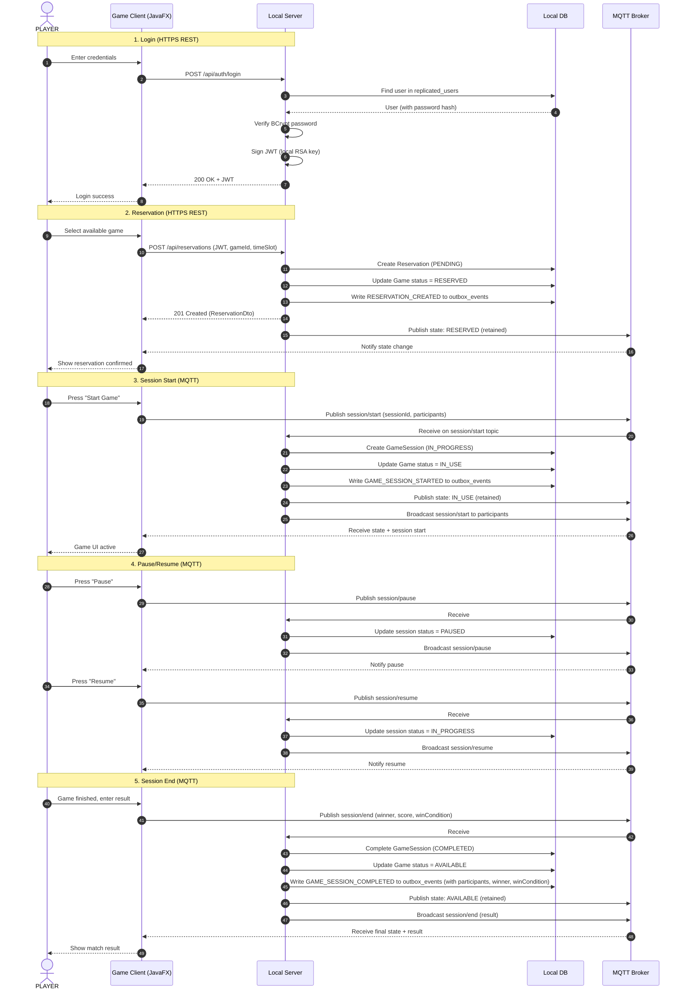
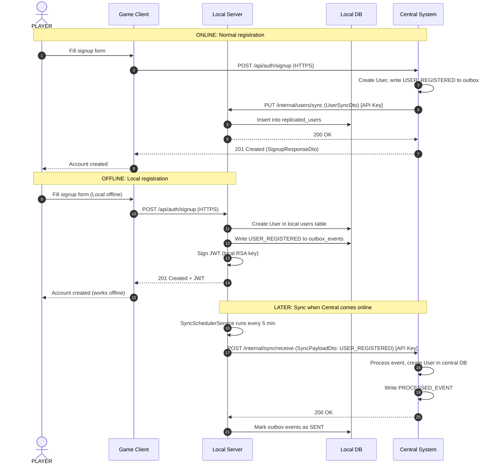
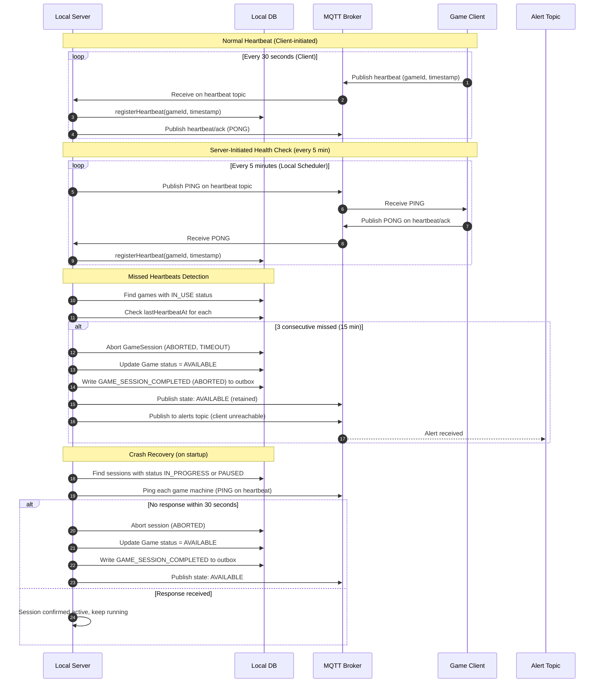
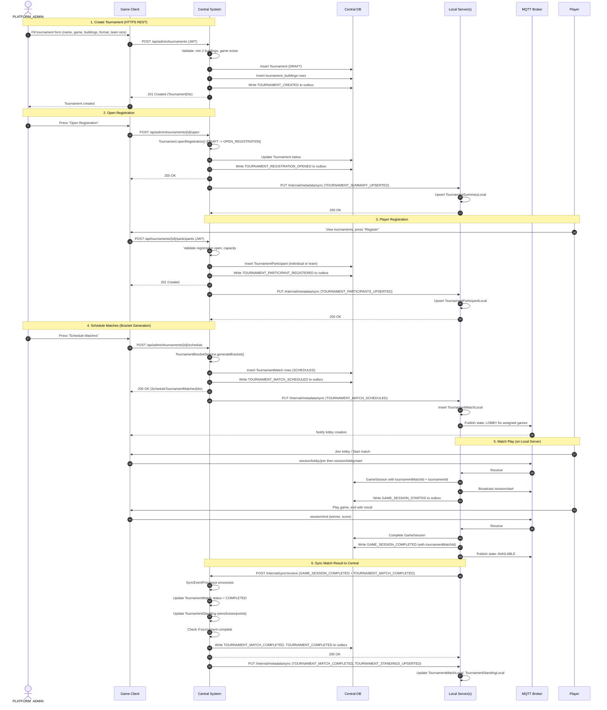
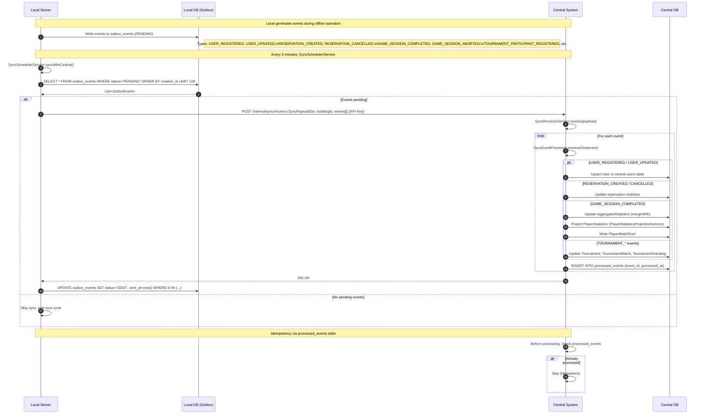
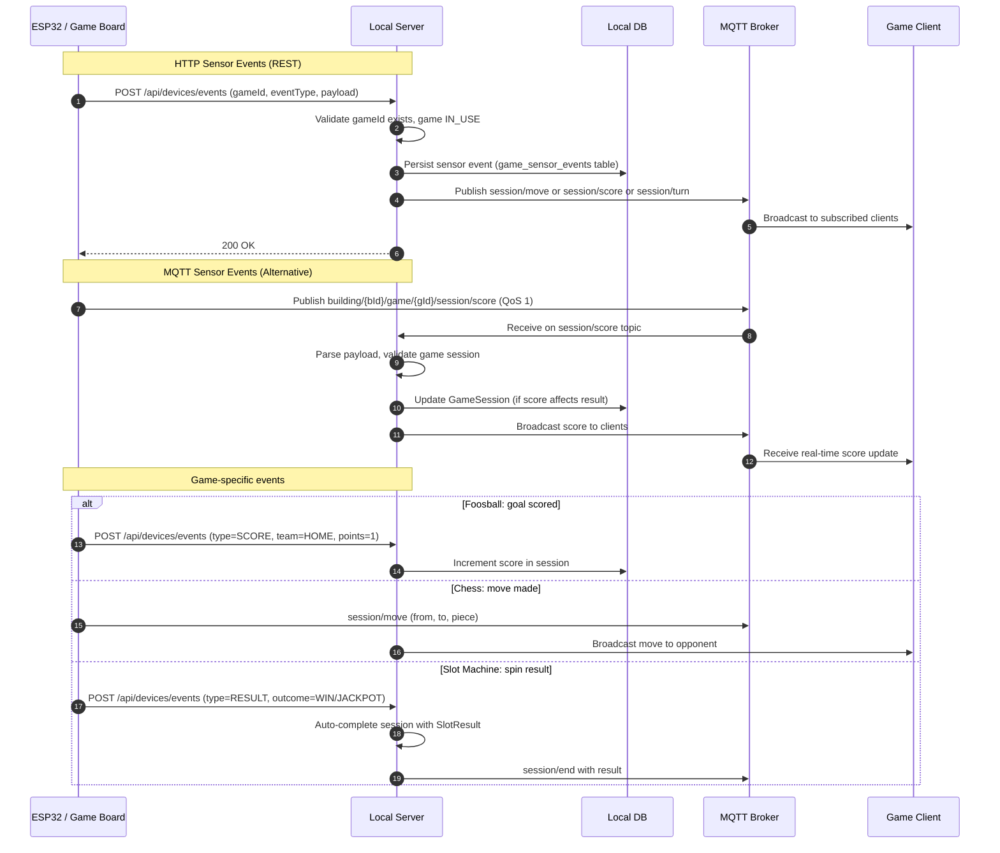

# GAME HANDLER

Progetto del corso di PISSIR, anno 2025/26

## 1. DESCRIZIONE DEL PROGETTO
### Obbiettivo
L'obiettivo del progetto è la realizzazione di una piattaforma distribuita per la gestione di giochi da tavolo e da bar, che permetta la creazione di tornei e di raccogliere e analizzare dati sullo svolgimento delle partite tramite l'utilizzo di sensori.

Questo avviene perchè ogni gioco ha dei sensori che rilevano gli input significativi (i gol in un calcetto ad esempio), questi vengono convertiti dalla board sul gioco (ad esempio un ESP32) in chiamate http e mqtt al broker o al server locale. 
Prima di poter giocare è necessario autenticarsi o creare un utente.

### Utenti di sistema
Ci sono quattro tipi di utenti:

1) PLAYER -> il giocatore
2) LOCAL_ADMIN -> l'admin del locale (il bar)
3) GAME_ADMIN -> l'admin che gestisce i giochi
4) PLATFORM_ADMIN -> il super admin

La tabella descrive le funzionalità di ogni utente

| Permesso                                           | PLAYER | LOCAL_ADMIN | GAME_ADMIN | PLATFORM_ADMIN |
|----------------------------------------------------|:------:|:-----------:|:----------:|:--------------:|
| Partecipa alle partite                             |   ✓    |             |            |       ✓        |
| Consulta proprie statistiche                       |   ✓    |             |            |       ✓        |
| Visualizza i giochi disponibili nei locali         |   ✓    |      ✓      |            |       ✓        |
| Partecipa ai tornei                                |   ✓    |             |            |       ✓        |
| Gestisce i giochi presenti nel proprio locale      |        |      ✓      |            |       ✓        |
| Configura i dispositivi e monitora le partite      |        |      ✓      |            |       ✓        |
| Visualizza statistiche relative al locale          |        |      ✓      |            |       ✓        |
| Definisce nuove tipologie di giochi                |        |             |     ✓      |       ✓        |
| Configura le regole di registrazione delle partite |        |             |     ✓      |       ✓        |
| Gestisce utenti e locali                           |        |             |            |       ✓        |
| Monitora il funzionamento dell'intero sistema      |        |             |            |       ✓        |
| Accede a statistiche globali                       |        |             |            |       ✓        |
| Crazione dei tornei                                |        |             |            |       ✓        |

Maggiori informazioni in [ruoli_utenti](strutture/ruoli_utenti.md)

## 2. STRUTTURA DEL SISTEMA
E' composto da tre componenti:

*   **Central System (L'Hub):** Microservizio Spring Boot responsabile della *Source of Truth* globale: registrazione utenti, aggregazione statistiche cross-building, coordinamento sincronizzazione.

*   **Local Server (Lo Spoke / Edge Node):** Microservizio Spring Boot installato fisicamente in ogni edificio. Funziona come gateway e nodo di persistenza locale. Persiste gli stati dei giochi nel database locale e genera le statistiche localmente (partite completate, in corso, tempo di utilizzo). I dati aggregati delle statistiche vengono poi inviati al Central System.

*   **Endpoint (Game Clients):** Applicazioni client con interfaccia grafica (JavaFX) che comunicano **esclusivamente** con il Local Server del proprio edificio tramite MQTT over TLS. L'uso di MQTT disaccoppia i client dal server ed è compatibile con la futura integrazione ESP32/Arduino.

Per la comunicazione tra le varie parti ci affidiamo sia ad API REST (usate ad esempio per gli accessi) che al protocollo MQTT.

Maggiori infomazioni sulla comunicazione tra le parti in [messages_flow](strutture/messages_flow.md)

Maggiori informazioni sull'architettura in [architettura_proposta](strutture/architettura%20proposta.md) e [architettura_classi](strutture/architettura_classi.md)

### Funzionamento offline
Alla creazione di un utente nuovo, i dati vengono salvati in un database locale e creato un evento nell'outbox.
Ogni transizione (start, pause, resume e end) avviene nel db locale, gli eventi vengono poi publicati tramite MQTT sul broker locale, alla fine della sessione viene publicato un evento GAME_SESSION_COMPLETE. Ragionamento simile è quello per le prenotazioni, vengono infatti create e salvate sul db locale e ogni azione genera un evento. 
In caso di crash del Local Server, il server recupera le sessioni attive o in pausa dal DB, fa un ping delle macchine tramite MQTT locale e se entro 30 secondi non riceve risposta chiude il gioco con un evento GAME_SESSIONE_COMPLETE.

In pratica quando è offline il sistema usa solo il server locale normalmente registrando tutto ciò che accade. Ogni cinque minuti fa un ping al Central System, se lo rileva online, il locale invia tutti gli eventi pending in un unico payload e svuota la coda. A questo punto il server centrale processa gli eventi, aggiorna i dati (statistiche, utenti e prenotazioni).

Maggiori informazioni [local_offline_handling](strutture/local_offline_handling.md)

## 3. GIOCHI, SENSORI E INTERFACCIA LOCALE
Ogni gioco avrà dei sensori specifici per raccogliere le informazioni sull'andamento delle partite, non avendo giochi fisici non abbiamo deciso il posizionamento sui singoli giochi dei sensori ma ne abbiamo simulati alcuni come scacchi o slot machine.

## 4. TORNEI, STATISTICHE E INTERFACCIA UTENTE
I tornei possono essere organizzati dagli utenti PLATFORM_ADMIN e sono ad eliminazione diretta. Sono organizzati su almeno due edifici diversi e sullo stesso gioco. Esistono due varianti: 
* **Individuale** -> usa l'userId del giocatore
* **A squadre** -> viene registrato un team con un teamId e la lista dei giocatori del team


### Diagramma UML delle Classi del Dominio

```mermaid
%%{init: { 'flowchart': { 'curve': 'linear', 'defaultRenderer': 'elk' } } }%%
classDiagram
    %% ==================== SHARED DOMAIN (Value Objects & Enums) ====================
    namespace shared_domain_model {
        class UserId {
            +String value
            +UserId(String)
        }
        class GameId {
            +String id
            +GameId(String)
        }
        class BuildingId {
            +String id
            +BuildingId(String)
        }
        class GameSessionId {
            +String value
            +GameSessionId(String)
        }
        class ReservationId {
            +String value
            +ReservationId(String)
        }
        class TournamentId {
            +String value
            +TournamentId(String)
        }
        class TournamentMatchId {
            +String value
            +TournamentMatchId(String)
        }
        class TeamId {
            +String value
            +TeamId(String)
        }

        class GameType {
            <<enumeration>>
            CHESS
            FOOSBALL
            DARTS
            MONOPOLY
            RISK
            SLOT_MACHINE
            ROULETTE
        }

        class GameStatus {
            <<enumeration>>
            WAITING
            IN_PROGRESS
            PAUSED
            COMPLETED
            ABORTED
        }

        class GameMachineStatus {
            <<enumeration>>
            AVAILABLE
            RESERVED
            IN_USE
            MAINTENANCE
            LOBBY
        }

        class ReservationStatus {
            <<enumeration>>
            PENDING
            CONFIRMED
            CANCELLED
            EXPIRED
        }

        class TournamentStatus {
            <<enumeration>>
            DRAFT
            OPEN_REGISTRATION
            IN_PROGRESS
            COMPLETED
            CANCELLED
        }

        class TournamentFormat {
            <<enumeration>>
            SINGLE_ELIMINATION
            ROUND_ROBIN
        }

        class TournamentMatchStatus {
            <<enumeration>>
            SCHEDULED
            IN_PROGRESS
            COMPLETED
            ABANDONED
            BYE
        }

        class WinCondition {
            <<enumeration>>
            WIN
            DRAW
            ABANDONED
            TIMEOUT
            TEAM_VICTORY
        }

        class StopReason {
            <<enumeration>>
            COMPLETED
            ABORTED
            TIMEOUT
        }

        class Role {
            <<enumeration>>
            PLAYER
            LOCAL_ADMIN
            GAME_ADMIN
            PLATFORM_ADMIN
            +of(String) Role
            +parse(String) Set~Role~
            +toAuthorityNames(String) List~String~
        }
    }

    namespace shared_domain_result {
        class GameResult {
            <<abstract>>
            +UserId winnerId
            +WinCondition winCondition
            +getWinnerId() UserId
            +getWinCondition() WinCondition
        }
        class ChessResult {
            +UserId winnerId
            +WinCondition winCondition
        }
        class FoosballResult {
            +UserId winnerId
            +WinCondition winCondition
            +int scoreTeamA
            +int scoreTeamB
        }
        class DartsResult {
            +UserId winnerId
            +WinCondition winCondition
            +int score
        }
        class MonopolyResult {
            +UserId winnerId
            +WinCondition winCondition
            +int finalWealth
        }
        class RiskResult {
            +UserId winnerId
            +WinCondition winCondition
            +int territoriesControlled
        }
        class SlotResult {
            +UserId winnerId
            +WinCondition winCondition
            +int payout
        }
        class RouletteResult {
            +UserId winnerId
            +WinCondition winCondition
            +int winnings
        }
        class TeamResult {
            +TeamId winnerTeamId
            +WinCondition winCondition
            +int scoreTeamA
            +int scoreTeamB
        }
    }

    GameResult <|-- ChessResult
    GameResult <|-- FoosballResult
    GameResult <|-- DartsResult
    GameResult <|-- MonopolyResult
    GameResult <|-- RiskResult
    GameResult <|-- SlotResult
    GameResult <|-- RouletteResult
    GameResult <|-- TeamResult

    namespace shared_domain_events {
        class DomainEvent {
            <<abstract>>
            +String eventId
            +Instant occurredAt
        }
        class UserRegisteredEvent {
            +UserId userId
            +String username
            +List~String~ roles
        }
        class UserUpdatedEvent {
            +UserId userId
            +String username
            +String email
            +List~String~ roles
        }
        class GameStateChangedEvent {
            +GameId gameId
            +GameMachineStatus newStatus
        }
        class GameSessionCompletedEvent {
            +GameSessionId sessionId
            +GameId gameId
            +GameType gameType
            +BuildingId buildingId
            +List~UserId~ participants
            +UserId winnerId
            +WinCondition winCondition
            +Instant endedAt
        }
        class ReservationCreatedEvent {
            +ReservationId reservationId
            +GameId gameId
            +UserId userId
            +Instant startTime
            +Instant endTime
        }
        class ReservationCancelledEvent {
            +ReservationId reservationId
            +GameId gameId
            +UserId userId
        }
        class StatisticsUpdatedEvent {
            +BuildingId buildingId
            +GameType gameType
            +int totalSessions
            +double avgDuration
            +int totalReservations
        }
        class TournamentCreatedEvent {
            +TournamentId tournamentId
            +String name
            +GameType gameType
            +boolean teamBased
        }
        class TournamentRegistrationOpenedEvent {
            +TournamentId tournamentId
        }
        class TournamentMatchScheduledEvent {
            +TournamentMatchId matchId
            +TournamentId tournamentId
            +int round
            +String participantA
            +String participantB
            +GameType gameType
        }
        class TournamentMatchCompletedEvent {
            +TournamentMatchId matchId
            +TournamentId tournamentId
            +String winner
            +String resultData
        }
        class TournamentCompletedEvent {
            +TournamentId tournamentId
            +String winner
        }

    }

    DomainEvent <|-- UserRegisteredEvent
    DomainEvent <|-- UserUpdatedEvent
    DomainEvent <|-- GameStateChangedEvent
    DomainEvent <|-- GameSessionCompletedEvent
    DomainEvent <|-- ReservationCreatedEvent
    DomainEvent <|-- ReservationCancelledEvent
    DomainEvent <|-- StatisticsUpdatedEvent
    DomainEvent <|-- TournamentCreatedEvent
    DomainEvent <|-- TournamentRegistrationOpenedEvent
    DomainEvent <|-- TournamentMatchScheduledEvent
    DomainEvent <|-- TournamentMatchCompletedEvent
    DomainEvent <|-- TournamentCompletedEvent

    %% ==================== LOCAL SERVER DOMAIN ====================
    namespace local_domain_model {
        class User {
            +UserId userId
            +String username
            +String passwordHash
            +String email
            +List~String~ roles
            +Instant eventTime
            +Instant updatedAt
        }

        class LocalSignupUser {
            +UserId userId
            +String username
            +String passwordHash
            +String email
            +List~String~ roles
            +Instant createdAt
        }

        class Game {
            +GameId id
            +GameType gameType
            +String name
            +BuildingId buildingId
            +GameMachineStatus status
            +long version
            +reserve()
            +startUse()
            +release()
            +setMaintenance()
            +setLobby()
            +rename(String)
        }

        class GameSession {
            +GameSessionId id
            +GameId gameId
            +GameType gameType
            +BuildingId buildingId
            +GameStatus status
            +Instant startedAt
            +Instant endedAt
            +Integer durationSeconds
            +UserId winnerId
            +WinCondition winCondition
            +GameResult result
            +List~UserId~ participants
            +Instant pausedAt
            +int accumulatedPausedSeconds
            +long version
            +TournamentMatchId tournamentMatchId
            +TournamentId tournamentId
            +complete(GameResult, Instant)
            +abort(StopReason, Instant)
            +cancelLobby(Instant)
            +pause(Instant)
            +resume(Instant)
            +calculateDuration()
            +addParticipant(UserId)
            +removeParticipant(UserId)
        }

        class Reservation {
            +ReservationId id
            +GameId gameId
            +UserId userId
            +ReservationStatus status
            +Instant startTime
            +Instant endTime
            +Instant createdAt
            +long version
            +confirm()
            +cancel()
            +expire()
            +canBeCancelled(Clock) boolean
        }

        class TournamentSummaryLocal {
            +TournamentId tournamentId
            +String name
            +GameType gameType
            +boolean teamBased
            +int teamSize
            +TournamentStatus status
            +Instant startsAt
            +Instant endsAt
            +List~String~ buildingIds
            +int participantsCount
            +boolean deleted
            +Instant updatedAt
        }

        class TournamentMatchLocal {
            +TournamentMatchId id
            +TournamentId tournamentId
            +int round
            +int bracketPosition
            +String participantA
            +String participantB
            +GameType gameType
            +String gameId
            +TournamentMatchStatus status
            +Instant scheduledAt
            +withStatus(TournamentMatchStatus) TournamentMatchLocal
        }

        class TournamentStandingLocal {
            +TournamentId tournamentId
            +String participantId
            +int wins
            +int losses
            +int points
            +Integer rank
        }

        class TournamentParticipantLocal {
            +TournamentId tournamentId
            +String participantId
            +boolean isTeam
            +String displayName
            +Instant registeredAt
        }

        class LocalStatistics {
            +GameType gameType
            +int totalSessions
            +double avgDuration
            +int totalReservations
            +Map~String, Double~ winRateByUser
            +recalculate(List~GameSession~)
        }

        class GameDefinitionLocal {
            +GameType gameType
            +String name
            +int minPlayers
            +int maxPlayers
            +boolean teamAllowed
            +Map~String, Object~ registrationRules
            +Instant updatedAt
        }

        class RegisteredLocalServerLocal {
            +BuildingId buildingId
            +String baseUrl
            +Instant lastSeenAt
            +boolean active
            +Instant updatedAt
        }

        class LocalAdminBuilding {
            +UserId userId
            +BuildingId buildingId
            +Instant assignedAt
        }

        class OutboxEvent {
            +String id
            +String eventType
            +String payload
            +String status
            +Instant createdAt
            +Instant sentAt
            +int retryCount
            +markAsSent(Instant)
            +incrementRetry()
            +markAsFailed()
            +hasFailed() boolean
            <<FAILED_THRESHOLD = 10>>
        }

        class OutboxEventStatus {
            <<enumeration>>
            PENDING
            SENT
            FAILED
        }

        class AdminRequestLocal {
            +String id
            +UserId userId
            +String requestType
            +String payload
            +AdminRequestStatus status
            +Instant createdAt
        }

        class AdminRequestStatus {
            <<enumeration>>
            PENDING
            APPROVED
            REJECTED
        }

        class DeadLetterEvent {
            +String id
            +String originalEventId
            +String eventType
            +String payload
            +String errorMessage
            +Instant failedAt
            +int retryCount
        }
    }

    %% ==================== CENTRAL SYSTEM DOMAIN ====================
    namespace central_domain_model {
        class User {
            +UserId id
            +String username
            +String passwordHash
            +String email
            +List~String~ roles
            +Instant createdAt
            +changePassword(String)
            +updateRoles(List~String~)
        }

        class GameDefinition {
            +GameType gameType
            +String name
            +int minPlayers
            +int maxPlayers
            +boolean teamAllowed
            +Map~String, Object~ registrationRules
            +Instant createdAt
            +Instant updatedAt
        }

        class Tournament {
            +TournamentId tournamentId
            +String name
            +GameType gameType
            +boolean teamBased
            +int teamSize
            +TournamentFormat format
            +TournamentStatus status
            +Instant startsAt
            +Instant endsAt
            +UserId createdBy
            +Instant createdAt
            +openRegistration() Tournament
            +cancel() Tournament
            +startProgress() Tournament
            +complete(Instant) Tournament
            +update(String, Instant) Tournament
        }

        class Team {
            +TeamId teamId
            +TournamentId tournamentId
            +String name
            +List~UserId~ members
            +Instant createdAt
        }

        class TournamentParticipant {
            +TournamentId tournamentId
            +String participantId
            +boolean isTeam
            +String displayName
            +Instant registeredAt
        }

        class TournamentMatch {
            +TournamentMatchId matchId
            +TournamentId tournamentId
            +int round
            +int bracketPosition
            +String participantA
            +String participantB
            +String buildingId
            +String gameId
            +String sessionId
            +String winner
            +TournamentMatchStatus status
            +Instant scheduledAt
            +Instant playedAt
            +String resultData
        }

        class TournamentStanding {
            +TournamentId tournamentId
            +String participantId
            +int wins
            +int losses
            +int points
            +Integer rank
        }

        class PlayerStatistics {
            +UserId userId
            +GameType gameType
            +int matchesPlayed
            +int matchesWon
            +Instant lastPlayedAt
            +mergeIncrement(boolean, Instant) PlayerStatistics
        }

        class PlayerMatchFact {
            +String sessionId
            +UserId userId
            +BuildingId buildingId
            +GameType gameType
            +String tournamentId
            +boolean won
            +WinCondition winCondition
            +Instant endedAt
        }

        class AggregatedStatistics {
            +String id
            +BuildingId buildingId
            +GameType gameType
            +LocalDate periodStart
            +LocalDate periodEnd
            +int totalSessions
            +int avgDurationSeconds
            +int totalReservations
            +int totalAbortedSessions
            +Map~String, Object~ data
            +mergeWith(AggregatedStatistics)
        }

        class RegisteredLocalServer {
            +BuildingId buildingId
            +String baseUrl
            +Instant lastSeenAt
            +boolean isActive
            +updateLastSeen(Instant)
            +setActive(boolean)
        }

        class ProcessedEvent {
            +String eventId
            +Instant processedAt
        }

        class ReplicationProgress {
            +String eventId
            +String serverId
        }

        class LocalAdminBuilding {
            +UserId userId
            +BuildingId buildingId
            +Instant assignedAt
        }

        class FailedLoginAttempt {
            +String username
            +Instant attemptedAt
            +boolean success
        }
    }

    %% ==================== RELATIONSHIPS ====================
    UserId <-- GameSession : "gameId"
    UserId <-- GameSession : "buildingId"
    UserId <-- GameSession : "participants"
    GameSessionId <-- GameSession : "id"
    GameType <-- GameSession : "gameType"
    GameStatus <-- GameSession : "status"
    WinCondition <-- GameSession : "winCondition"
    GameResult <-- GameSession : "result"
    UserId <-- GameSession : "winnerId"
    TournamentMatchId <-- GameSession : "tournamentMatchId"
    TournamentId <-- GameSession : "tournamentId"

    GameId <-- Reservation : "gameId"
    UserId <-- Reservation : "userId"
    ReservationStatus <-- Reservation : "status"
    ReservationId <-- Reservation : "id"

    GameId <-- Game : "id"
    GameType <-- Game : "gameType"
    BuildingId <-- Game : "buildingId"
    GameMachineStatus <-- Game : "status"

    TournamentId <-- TournamentSummaryLocal : "tournamentId"
    GameType <-- TournamentSummaryLocal : "gameType"
    TournamentStatus <-- TournamentSummaryLocal : "status"

    TournamentMatchId <-- TournamentMatchLocal : "id"
    TournamentId <-- TournamentMatchLocal : "tournamentId"
    GameType <-- TournamentMatchLocal : "gameType"
    TournamentMatchStatus <-- TournamentMatchLocal : "status"

    TournamentId <-- TournamentParticipantLocal : "tournamentId"

    GameType <-- LocalStatistics : "gameType"
    GameSession <-- LocalStatistics : "recalculate(sessions)"

    GameType <-- GameDefinitionLocal : "gameType"

    BuildingId <-- RegisteredLocalServerLocal : "buildingId"

    UserId <-- LocalAdminBuilding : "userId"
    BuildingId <-- LocalAdminBuilding : "buildingId"

    OutboxEventStatus <-- OutboxEvent : "status"

    UserId <-- User : "id"

    GameType <-- GameDefinition : "gameType"

    TournamentId <-- Tournament : "tournamentId"
    GameType <-- Tournament : "gameType"
    TournamentFormat <-- Tournament : "format"
    TournamentStatus <-- Tournament : "status"
    UserId <-- Tournament : "createdBy"

    TeamId <-- Team : "teamId"
    TournamentId <-- Team : "tournamentId"
    UserId <-- Team : "members"

    TournamentId <-- TournamentParticipant : "tournamentId"

    TournamentMatchId <-- TournamentMatch : "matchId"
    TournamentId <-- TournamentMatch : "tournamentId"
    TournamentMatchStatus <-- TournamentMatch : "status"

    TournamentId <-- TournamentStanding : "tournamentId"

    UserId <-- PlayerStatistics : "userId"
    GameType <-- PlayerStatistics : "gameType"

    BuildingId <-- AggregatedStatistics : "buildingId"
    GameType <-- AggregatedStatistics : "gameType"

    BuildingId <-- RegisteredLocalServer : "buildingId"

    UserId <-- LocalAdminBuilding : "userId"
    BuildingId <-- LocalAdminBuilding : "buildingId"

    ProcessedEvent ..> String : "eventId"

    ReplicationProgress ..> String : "eventId"
    ReplicationProgress ..> String : "serverId"

    UserId ..> "1" Reservation : "userId"
    GameId ..> "1" Reservation : "gameId"

    UserId ..> "1" GameSession : "winnerId"
    GameId ..> "1" GameSession : "gameId"
    BuildingId ..> "1" GameSession : "buildingId"
    GameSessionId ..> "1" GameSession : "id"
    TournamentMatchId ..> "0..1" GameSession : "tournamentMatchId"
    TournamentId ..> "0..1" GameSession : "tournamentId"

    UserId ..> "1" Game : "buildingId"
    GameId ..> "1" Game : "id"

    GameId ..> "1" TournamentMatchLocal : "gameId"
    TournamentId ..> "1" TournamentMatchLocal : "tournamentId"

    TournamentId ..> "1" TournamentParticipantLocal : "tournamentId"
    TournamentId ..> "1" TournamentStandingLocal : "tournamentId"

    GameType ..> "1" LocalStatistics : "gameType"

    GameType ..> "1" GameDefinitionLocal : "gameType"

    BuildingId ..> "1" RegisteredLocalServerLocal : "buildingId"

    UserId ..> "1" LocalAdminBuilding : "userId"
    BuildingId ..> "1" LocalAdminBuilding : "buildingId"
```

Le statististiche che vengono mostrate dipendono da l'utente che ha fatto l'accesso:
* Il player ha accesso hai dati sui giochi che ha giocato lui:


* Il local admin ha accesso a tutti i giochi nel suo locale, con indicato se sono disponibili e i punteggi delle partite.


* Il Game Admin ha accesso a tuttti i giochi creati, la sua dashboard è un editor che permette di definire nuovi giochi.


* Il Platform Admin ha accesso a tutte le statistiche.


### Componenti accessori
Come già accennato è necessario autenticarsi, è inoltre presente un sistema di prenotazione.

## 5. FASI DI LAVORO
### 5.1 Specifica 
Come già detto l'applicazione è una piattaforma software per la gestione di sale giochi da tavolo/bar disposte in più edifici fisici.
### Casi d'uso
1) __Prenotazione e gioco__ un giocatore autenticato prenota una postazione di gioco libera nel proprio edificio; se la prenotazione non viene utilizzata entro l'orario previsto la macchina viene rilasciata automaticamente. Il giocatore avvia poi la sessione dal client, può metterla in pausa e riprenderla, e alla fine invia il risultato della partita (vincitore, punteggio, esito).

2) __Login e registrazione offline__ un utente si autentica o crea un nuovo account anche quando il Local Server del proprio edificio è isolato dal Central System, grazie alla replica locale delle credenziali e alla firma dei token JWT con una chiave del Local Server stesso.

3) __Monitoraggio degli endpoint e recupero da crash__ il Local Server verifica periodicamente che le postazioni di gioco connesse siano raggiungibili; se una postazione non risponde per più cicli consecutivi, o se il server si riavvia dopo un crash con sessioni rimaste appese, la partita in corso viene chiusa automaticamente e la macchina torna disponibile.

4) __Creazione e gestione di un torneo__ un Platform Admin crea un torneo (individuale o a squadre) su almeno due edifici per uno stesso gioco; i giocatori si iscrivono in autonomia durante la fase di registrazione aperta, viene generato un bracket ad eliminazione diretta e i risultati dei singoli match aggiornano automaticamente il bracket e la classifica.

5) __Sincronizzazione locale-centrale__ tutti gli eventi generati mentre il Local Server è offline (prenotazioni, sessioni di gioco, iscrizioni) vengono accumulati in una coda locale e inviati in blocco al Central System non appena la connettività torna disponibile.

6) __Consultazione statistiche per ruolo__ ogni tipologia di utente visualizza dati differenti: il player le proprie partite e statistiche personali, il local admin lo stato dei giochi e le statistiche del proprio locale, il game admin l'anagrafica dei giochi definiti, il platform admin le statistiche aggregate dell'intera piattaforma.

7) __Definizione di nuove tipologie di gioco__ un Game Admin definisce nuovi tipi di gioco e le relative regole di registrazione delle partite, incluse eventuali varianti a giocatore singolo basate su esito casuale (es. slot machine, roulette).

8) __Acquisizione eventi dai sensori di gioco__ i sensori posizionati su ciascun gioco fisico (gestiti ad esempio da una board ESP32) rilevano gli eventi significativi della partita e li inviano al Local Server tramite chiamate HTTP e MQTT.


### Diagramma UML dei Casi d'Uso

```mermaid
%%{init: { 'flowchart': { 'curve': 'linear', 'defaultRenderer': 'elk' } } }%%

flowchart LR
    %% Actors
    PLAYER["Player"]
    LOCAL_ADMIN["Local Admin"]
    GAME_ADMIN["Game Admin"]
    PLATFORM_ADMIN["Platform Admin"]
    GameClient["Game Client"]
    LocalServer["Local Server"]
    CentralSystem["Central System"]
    MqttBroker["MQTT Broker"]
    ESP32["ESP32/Board"]

    subgraph PG ["Prenotazione e Gioco"]
        UC1(["Prenota postazione di gioco"])
        UC2(["Avvia sessione di gioco"])
        UC3(["Metti in pausa/riprendi sessione"])
        UC4(["Termina sessione con risultato"])
    end

    subgraph LR_OFF ["Login e Registrazione Offline"]
        UC5(["Login utente online/offline"])
        UC6(["Registrazione nuovo utente online/offline"])
        UC7(["Replica utenti Central - Local"])
    end

    subgraph MRC ["Monitoraggio e Recupero Crash"]
        UC8(["Heartbeat periodico endpoint"])
        UC9(["Rilevamento endpoint non raggiungibile"])
        UC10(["Chiusura automatica sessione orfana"])
        UC11(["Recupero sessioni al riavvio server"])
    end

    subgraph GT ["Gestione Tornei"]
        UC12(["Crea torneo individuale/squadre"])
        UC13(["Apri/chiudi registrazioni torneo"])
        UC14(["Genera bracket eliminazione diretta"])
        UC15(["Programma match su edifici"])
        UC16(["Registra risultato match"])
        UC17(["Aggiorna classifica torneo"])
    end

    subgraph SLC ["Sincronizzazione Locale-Centrale"]
        UC18(["Accumula eventi in outbox offline"])
        UC19(["Ping periodico Central System"])
        UC20(["Invia payload eventi pending"])
        UC21(["Processa eventi e aggiorna statistiche globali"])
        UC22(["Marca eventi come inviati idempotenza"])
    end

    subgraph CS ["Consultazione Statistiche"]
        UC23(["Visualizza statistiche personali Player"])
        UC24(["Visualizza stato giochi locale Local Admin"])
        UC25(["Visualizza definizioni giochi Game Admin"])
        UC26(["Visualizza statistiche globali Platform Admin"])
    end

    subgraph DTG ["Definizione Tipi di Gioco"]
        UC27(["Definisci nuovo tipo gioco"])
        UC28(["Configura regole registrazione partite"])
        UC29(["Replica definizioni Central - Local"])
    end

    subgraph AES ["Acquisizione Eventi Sensori"]
        UC30(["Invia evento sensore via HTTP/MQTT"])
        UC31(["Processa evento punteggio/mossa/turno"])
    end

    %% Actors to Use Cases
    PLAYER --> UC1
    PLAYER --> UC2
    PLAYER --> UC3
    PLAYER --> UC4
    PLAYER --> UC5
    PLAYER --> UC6
    PLAYER --> UC23

    LOCAL_ADMIN --> UC24
    LOCAL_ADMIN --> UC25

    GAME_ADMIN --> UC27
    GAME_ADMIN --> UC28

    PLATFORM_ADMIN --> UC12
    PLATFORM_ADMIN --> UC13
    PLATFORM_ADMIN --> UC14
    PLATFORM_ADMIN --> UC15
    PLATFORM_ADMIN --> UC26
    PLATFORM_ADMIN --> UC7

    GameClient --> UC1
    GameClient --> UC2
    GameClient --> UC3
    GameClient --> UC4
    GameClient --> UC5
    GameClient --> UC8

    LocalServer --> UC5
    LocalServer --> UC6
    LocalServer --> UC7
    LocalServer --> UC8
    LocalServer --> UC9
    LocalServer --> UC10
    LocalServer --> UC11
    LocalServer --> UC18
    LocalServer --> UC19
    LocalServer --> UC20
    LocalServer --> UC21
    LocalServer --> UC30
    LocalServer --> UC31

    CentralSystem --> UC7
    CentralSystem --> UC12
    CentralSystem --> UC13
    CentralSystem --> UC14
    CentralSystem --> UC15
    CentralSystem --> UC16
    CentralSystem --> UC17
    CentralSystem --> UC21
    CentralSystem --> UC22
    CentralSystem --> UC26
    CentralSystem --> UC27
    CentralSystem --> UC28
    CentralSystem --> UC29

    MqttBroker --> UC2
    MqttBroker --> UC3
    MqttBroker --> UC4
    MqttBroker --> UC8

    ESP32 --> UC30
```




### 5.2 Progettazione
Vengono usati pattern diversi:

* Sul piano della distribuzione usiamo Hub-and-Spoke unito a quello Pub/Sub. Qui il Central System è l'hub e gli spoke i Local Server, quello Pub/Sub è attuato tramite MQTT tra server locale e Game Client.
* Sul piano dei microservizi il sistema è composto da tre microservizi Spring Boot indipendenti (Central System, Local Server, Game Client Emulator),  organizzati come monorepo Maven multi-modulo con moduli condivisi (shared-domain, shared-dto, shared-mqtt) che non dipendono da nessun framework, per evitare duplicazione di codice tra i tre servizi.
* Sul piano del codice interno a ciascun microservizio, viene applicata la Clean Architecture / architettura esagonale (Ports and Adapters): il dominio (le entità e la logica di business) è Java puro, senza dipendenze da Spring o JPA, mentre l'accesso a database, MQTT e REST avviene tramite adapter separati. Questo rispetta il Dependency Inversion Principle e rende il dominio testabile senza framework.

In sintesi, l'architettura si può riassumere così: microservizi distribuiti in pattern hub-and-spoke con comunicazione ibrida REST/MQTT, ciascun servizio internamente strutturato secondo architettura esagonale, con sincronizzazione asincrona basata su outbox pattern per garantire resilienza offline.


### Diagramma dei Package (Maven Modules + Clean Architecture Layers)

```mermaid
%%{init: { 'flowchart': { 'curve': 'linear', 'defaultRenderer': 'elk' } } }%%

flowchart TB
    subgraph Parent ["boardgame-platform (Parent POM)"]
        direction TB
        
        subgraph Shared ["shared (shared modules - NO framework deps)"]
            direction TB
            SD["shared-domain\ncom.gameplatform.shared.domain\n  ├─ model (Value Objects, Enums, Entities)\n  ├─ security (Role)\n  ├─ game (GameFactory, GameLifecycle)\n  ├─ result (GameResult + subtypes)\n  └─ events (DomainEvent + subtypes)"]
            SDto["shared-dto\ncom.gameplatform.shared.dto\n  ├─ Request/Response DTOs\n  ├─ Event DTOs (outbox payloads)\n  └─ Sync DTOs"]
            SMqtt["shared-mqtt\ncom.gameplatform.shared.mqtt\n  ├─ MqttConfig\n  ├─ MqttClient\n  └─ Message serialization"]
        end

        subgraph Central ["central-system (Spring Boot microservice)"]
            direction TB
            CDomain["domain\ncom.gameplatform.central.domain\n  ├─ model (User, GameDefinition, Tournament,\n  │  Team, TournamentParticipant, TournamentMatch,\n  │  TournamentStanding, PlayerStatistics,\n  │  PlayerMatchFact, AggregatedStatistics,\n  │  RegisteredLocalServer, ProcessedEvent,\n  │  ReplicationProgress, LocalAdminBuilding,\n  │  FailedLoginAttempt)\n  ├─ ports.in (Use Cases)\n  ├─ ports.out (Repository Ports, External Ports)\n  └─ exception (Domain Exceptions)"]
            CApp["application\ncom.gameplatform.central.application\n  ├─ service (UserService, AuthService,\n  │  TournamentService, TournamentRegistrationService,\n  │  TournamentBracketService, GameDefinitionService,\n  │  SyncReceiverService, SyncEventProcessor,\n  │  PlayerStatisticsService, PlayerStatisticsProjectionService,\n  │  StatisticsService, LocalAdminBuildingService,\n  │  UserReplicationSchedulerService,\n  │  LateRegistrationCatchUpService,\n  │  TournamentStandingsService,\n  │  GameSessionCompletedPlayerStatisticsProjectionService)"]
            CInfra["infrastructure\ncom.gameplatform.central.infrastructure\n  ├─ adapters.in.rest (Controllers:\n  │  AuthController, UserController,\n  │  TournamentController, TournamentRegistrationController,\n  │  GameAdminController, StatisticsController,\n  │  PlayerStatisticsController, AdminServerController,\n  │  SyncController, LocalAdminController)\n  ├─ adapters.in.mqtt (N/A - Central no MQTT)\n  ├─ adapters.out.mysql (JPA Entities, Repositories,\n  │  Mappers, Repository Adapters)\n  ├─ adapters.out.rest (LocalRestAdapter,\n  │  LocalServerUserCountRestAdapter,\n  │  LocalMetadataRestAdapter,\n  │  LocalGameDefinitionRestAdapter)\n  ├─ config (SecurityConfig, JwtConfig, TlsConfig,\n  │  SchedulerConfig, CorsConfig)\n  └─ security (JwtTokenProvider, JwtAuthenticationFilter,\n      InternalApiKeyFilter, CurrentUserService,\n      PasswordEncoderConfig)"]
        end

        subgraph Local ["local-server (Spring Boot microservice - per building)"]
            direction TB
            LDomain["domain\ncom.gameplatform.local.domain\n  ├─ model (User, Game, GameSession, Reservation,\n  │  TournamentSummaryLocal, TournamentMatchLocal,\n  │  TournamentStandingLocal, TournamentParticipantLocal,\n  │  LocalStatistics, GameDefinitionLocal,\n  │  RegisteredLocalServerLocal, LocalAdminBuilding,\n  │  OutboxEvent, LocalSignupUser, AdminRequestLocal,\n  │  DeadLetterEvent)\n  ├─ ports.in (Use Cases:\n  │  ManageGameCatalogUseCase, ListBuildingGamesUseCase,\n  │  ListBuildingActiveSessionsUseCase,\n  │  GetBuildingStatisticsUseCase,\n  │  GetPlayerStatisticsUseCase,\n  │  RegisterLocalServerUseCase, etc.)\n  ├─ ports.out (Repository Ports,\n  │  External Ports: PushUserToCentralPort,\n  │  PushTournamentSummaryToCentralPort,\n  │  GameDefinitionLocalRepository,\n  │  LocalAdminBuildingLocalRepository)\n  └─ exception (Domain Exceptions)"]
            LApp["application\ncom.gameplatform.local.application\n  ├─ service (GameSessionService, GameStateService,\n  │  ReservationService, SessionRecoveryService,\n  │  StatisticsService, LocalAuthService,\n  │  LocalSignupService, UserSyncService,\n  │  GameCatalogService, GameDefinitionSyncService,\n  │  SyncSchedulerService, OutboxPurgeService,\n  │  HealthCheckService, LobbyExpirationService,\n  │  SessionAbortHelper, TournamentLifecycleRequestedService,\n  │  CreateTournamentRequestedService,\n  │  UpdateTournamentRequestedService,\n  │  DeleteTournamentRequestedService,\n  │  TournamentMatchLocalSyncService,\n  │  TournamentParticipantsLocalSyncService,\n  │  TournamentStandingsLocalSyncService,\n  │  TournamentSummarySyncService,\n  │  RegisterTournamentParticipantRequestedService,\n  │  UpsertGameDefinitionRequestedService,\n  │  LocalServerRegistrationService,\n  │  AdminRequestTimeoutService)"]
            LInfra["infrastructure\ncom.gameplatform.local.infrastructure\n  ├─ adapters.in.rest (Controllers:\n  │  AuthController, GameController,\n  │  GameSessionController, ReservationController,\n  │  StatisticsController, PlayerStatisticsController,\n  │  AdminLocalController, InternalMetadataController,\n  │  InternalGameDefinitionSyncController,\n  │  InternalTournamentController,\n  │  PlayerTournamentController,\n  │  LocalAdminController)\n  ├─ adapters.in.mqtt (MqttMessageHandler,\n  │  SessionStartHandler, SessionPauseHandler,\n  │  SessionResumeHandler, SessionEndHandler,\n  │  LobbyCreateHandler, LobbyJoinHandler,\n  │  LobbyStartHandler, LobbyCancelHandler,\n  │  HeartbeatHandler, MoveHandler, ScoreHandler,\n  │  TurnHandler, DeviceRegisterHandler)\n  ├─ adapters.out.mysql (JPA Entities, Repositories,\n  │  Mappers, Repository Adapters)\n  ├─ adapters.out.rest (CentralSystemRestAdapter,\n  │  RegisterLocalServerAdapter)\n  ├─ adapters.out.mqtt (MqttPublisher,\n  │  GameStatePublisher, AlertPublisher)\n  ├─ config (MqttConfig, JwtConfig, SecurityConfig,\n  │  SchedulerConfig, TlsConfig, JacksonConfig)\n  └─ security (JwtTokenProvider, JwtTokenValidator,\n      JwtAuthenticationFilter, InternalApiKeyFilter,\n      CurrentUserService, LocalAdminBuildingAuthorizationManager)"]
        end

        subgraph Client ["game-client-emulator (JavaFX Desktop App)"]
            direction TB
            ClApp["application\ncom.gameplatform.client\n  ├─ service (AuthService, GameService,\n  │  SessionService, ReservationService,\n  │  TournamentService, StatisticsService,\n  │  AdminService)"]
            ClInfra["infrastructure\ncom.gameplatform.client.infrastructure\n  ├─ ui (MainView, NavbarController,\n  │  GameView, SessionView, TournamentView,\n  │  StatisticsView, AdminView, LoginView,\n  │  RegistrationView)\n  ├─ mqtt (MqttConnectionManager,\n  │  MqttMessageRouter, GameClientMqttHandler)\n  ├─ rest (RestClient, ApiEndpoints)\n  └─ security (ClientJwtTokenManager)"]
        end

        subgraph E2E ["e2e-tests"]
            E2E["Integration Tests\n  ├─ MultiBuildingEndToEndIT\n  ├─ ContractTestBase\n  └─ MessageContractIT"]
        end

        subgraph Infra ["infrastructure (Docker, DB init scripts)"]
            Infra["mysql-central/init.sql\nmysql-local/init.sql\nmysql-local/init-building-2.sql\nmysql-local/init-building-3.sql\ndocker-compose.yml\ndocker-compose.multi.yml"]
        end
    end

    %% Dependencies (compile-time)
    SD -.->|"used by"| CDomain
    SD -.->|"used by"| LDomain
    SD -.->|"used by"| ClApp
    SDto -.->|"used by"| CApp
    SDto -.->|"used by"| LApp
    SDto -.->|"used by"| ClApp
    SMqtt -.->|"used by"| LInfra
    SMqtt -.->|"used by"| ClInfra

    CDomain -.->|"defines ports"| CApp
    CApp -.->|"implements ports"| CInfra
    LDomain -.->|"defines ports"| LApp
    LApp -.->|"implements ports"| LInfra
    ClApp -.->|"uses"| ClInfra

    CInfra -.->|"REST /internal/**\nAPI Key auth"| LInfra
    LInfra -.->|"REST /internal/**\nAPI Key auth"| CInfra
    LInfra -.->|"MQTT"| ClInfra
    ClInfra -.->|"MQTT"| LInfra
```

### Diagramma delle Classi di Implementazione (Clean Architecture / Hexagonal)

```mermaid
%%{init: { 'flowchart': { 'curve': 'linear', 'defaultRenderer': 'elk' } } }%%

classDiagram
    %% ==================== SHARED DOMAIN ====================
    class UserId {
        +value: String
        +UserId(String)
    }
    class GameId {
        +id: String
        +GameId(String)
    }
    class BuildingId {
        +id: String
        +BuildingId(String)
    }
    class GameSessionId {
        +value: String
        +GameSessionId(String)
    }
    class ReservationId {
        +value: String
        +ReservationId(String)
    }
    class TournamentId {
        +value: String
        +TournamentId(String)
    }
    class TournamentMatchId {
        +value: String
        +TournamentMatchId(String)
    }
    class TeamId {
        +value: String
        +TeamId(String)
    }
    class GameType {
        <<enumeration>>
        CHESS, FOOSBALL, DARTS, MONOPOLY, RISK, SLOT_MACHINE, ROULETTE
    }
    class GameStatus {
        <<enumeration>>
        WAITING, IN_PROGRESS, PAUSED, COMPLETED, ABORTED
    }
    class GameMachineStatus {
        <<enumeration>>
        AVAILABLE, RESERVED, IN_USE, MAINTENANCE, LOBBY
    }
    class ReservationStatus {
        <<enumeration>>
        PENDING, CONFIRMED, CANCELLED, EXPIRED
    }
    class TournamentStatus {
        <<enumeration>>
        DRAFT, OPEN_REGISTRATION, IN_PROGRESS, COMPLETED, CANCELLED
    }
    class TournamentFormat {
        <<enumeration>>
        SINGLE_ELIMINATION, ROUND_ROBIN
    }
    class TournamentMatchStatus {
        <<enumeration>>
        SCHEDULED, IN_PROGRESS, COMPLETED, ABANDONED, BYE
    }
    class WinCondition {
        <<enumeration>>
        WIN, DRAW, ABANDONED, TIMEOUT, TEAM_VICTORY
    }
    class StopReason {
        <<enumeration>>
        COMPLETED, ABORTED, TIMEOUT
    }
    class Role {
        <<enumeration>>
        PLAYER, LOCAL_ADMIN, GAME_ADMIN, PLATFORM_ADMIN
        +of(String) Role
        +parse(String) Set~Role~
        +toAuthorityNames(String) List~String~
    }

    %% ==================== CENTRAL SYSTEM DOMAIN ====================
    class CentralUser {
        -id: UserId
        -username: String
        -passwordHash: String
        -email: String
        -roles: List~String~
        -createdAt: Instant
        +changePassword(String)
        +updateRoles(List~String~)
    }
    class GameDefinition {
        -gameType: GameType
        -name: String
        -minPlayers: int
        -maxPlayers: int
        -teamAllowed: boolean
        -registrationRules: Map~String,Object~
        -createdAt: Instant
        -updatedAt: Instant
    }
    class Tournament {
        -tournamentId: TournamentId
        -name: String
        -gameType: GameType
        -teamBased: boolean
        -teamSize: int
        -format: TournamentFormat
        -status: TournamentStatus
        -startsAt: Instant
        -endsAt: Instant
        -createdBy: UserId
        -createdAt: Instant
        +openRegistration() Tournament
        +cancel() Tournament
        +startProgress() Tournament
        +complete(Instant) Tournament
        +update(String, Instant) Tournament
    }
    class Team {
        -teamId: TeamId
        -tournamentId: TournamentId
        -name: String
        -members: List~UserId~
        -createdAt: Instant
    }
    class TournamentParticipant {
        -tournamentId: TournamentId
        -participantId: String
        -isTeam: boolean
        -displayName: String
        -registeredAt: Instant
    }
    class TournamentMatch {
        -matchId: TournamentMatchId
        -tournamentId: TournamentId
        -round: int
        -bracketPosition: int
        -participantA: String
        -participantB: String
        -buildingId: String
        -gameId: String
        -sessionId: String
        -winner: String
        -status: TournamentMatchStatus
        -scheduledAt: Instant
        -playedAt: Instant
        -resultData: String
    }
    class TournamentStanding {
        -tournamentId: TournamentId
        -participantId: String
        -wins: int
        -losses: int
        -points: int
        -rank: Integer
    }
    class PlayerStatistics {
        -userId: UserId
        -gameType: GameType
        -matchesPlayed: int
        -matchesWon: int
        -lastPlayedAt: Instant
        +mergeIncrement(boolean, Instant) PlayerStatistics
    }
    class PlayerMatchFact {
        -sessionId: String
        -userId: UserId
        -buildingId: BuildingId
        -gameType: GameType
        -tournamentId: String
        -won: boolean
        -winCondition: WinCondition
        -endedAt: Instant
    }
    class AggregatedStatistics {
        -id: String
        -buildingId: BuildingId
        -gameType: GameType
        -periodStart: LocalDate
        -periodEnd: LocalDate
        -totalSessions: int
        -avgDurationSeconds: int
        -totalReservations: int
        -totalAbortedSessions: int
        -data: Map~String,Object~
        +mergeWith(AggregatedStatistics)
    }
    class RegisteredLocalServer {
        -buildingId: BuildingId
        -baseUrl: String
        -lastSeenAt: Instant
        -isActive: boolean
        +updateLastSeen(Instant)
        +setActive(boolean)
    }
    class ProcessedEvent {
        -eventId: String
        -processedAt: Instant
    }
    class ReplicationProgress {
        +eventId: String
        +serverId: String
    }
    class LocalAdminBuilding {
        -userId: UserId
        -buildingId: BuildingId
        -assignedAt: Instant
    }
    class FailedLoginAttempt {
        -username: String
        -attemptedAt: Instant
        -success: boolean
    }

    %% ==================== LOCAL SERVER DOMAIN ====================
    class LocalUser {
        -userId: UserId
        -username: String
        -passwordHash: String
        -email: String
        -roles: List~String~
        -eventTime: Instant
        -updatedAt: Instant
    }
    class Game {
        -id: GameId
        -gameType: GameType
        -name: String
        -buildingId: BuildingId
        -status: GameMachineStatus
        -version: long
        +reserve()
        +startUse()
        +release()
        +setMaintenance()
        +setLobby()
        +rename(String)
    }
    class GameSession {
        -id: GameSessionId
        -gameId: GameId
        -gameType: GameType
        -buildingId: BuildingId
        -status: GameStatus
        -startedAt: Instant
        -endedAt: Instant
        -durationSeconds: Integer
        -winnerId: UserId
        -winCondition: WinCondition
        -result: GameResult
        -participants: List~UserId~
        -pausedAt: Instant
        -accumulatedPausedSeconds: int
        -version: long
        -tournamentMatchId: TournamentMatchId
        -tournamentId: TournamentId
        +complete(GameResult, Instant)
        +abort(StopReason, Instant)
        +cancelLobby(Instant)
        +pause(Instant)
        +resume(Instant)
        +calculateDuration()
        +addParticipant(UserId)
        +removeParticipant(UserId)
    }
    class Reservation {
        -id: ReservationId
        -gameId: GameId
        -userId: UserId
        -status: ReservationStatus
        -startTime: Instant
        -endTime: Instant
        -createdAt: Instant
        -version: long
        +canBeCancelled(Clock) boolean
        +confirm()
        +cancel()
        +expire()
    }
    class TournamentSummaryLocal {
        -tournamentId: TournamentId
        -name: String
        -gameType: GameType
        -teamBased: boolean
        -teamSize: int
        -status: TournamentStatus
        -startsAt: Instant
        -endsAt: Instant
        -buildingIds: List~String~
        -participantsCount: int
        -deleted: boolean
        -updatedAt: Instant
    }
    class TournamentMatchLocal {
        -id: TournamentMatchId
        -tournamentId: TournamentId
        -round: int
        -bracketPosition: int
        -participantA: String
        -participantB: String
        -gameType: GameType
        -gameId: String
        -status: TournamentMatchStatus
        -scheduledAt: Instant
        +withStatus(TournamentMatchStatus) TournamentMatchLocal
    }
    class LocalStatistics {
        -gameType: GameType
        -totalSessions: int
        -avgDuration: double
        -totalReservations: int
        -winRateByUser: Map~String,Double~
        +recalculate(List~GameSession~)
    }
    class GameDefinitionLocal {
        -gameType: GameType
        -name: String
        -minPlayers: int
        -maxPlayers: int
        -teamAllowed: boolean
        -registrationRules: Map~String,Object~
        -updatedAt: Instant
    }
    class OutboxEvent {
        -id: String
        -eventType: String
        -payload: String
        -status: String
        -createdAt: Instant
        -sentAt: Instant
        -retryCount: int
        +markAsSent(Instant)
        +incrementRetry()
        +markAsFailed()
        +hasFailed() boolean
    }
    class RegisteredLocalServerLocal {
        -buildingId: BuildingId
        -baseUrl: String
        -lastSeenAt: Instant
        -active: boolean
        -updatedAt: Instant
    }
    class LocalAdminBuilding {
        -userId: UserId
        -buildingId: BuildingId
        -assignedAt: Instant
    }

    %% ==================== PORTS (INTERFACES) ====================
    class UserRepository {
        <<interface>>
        +findById(UserId) Optional~User~
        +findByUsername(String) Optional~User~
        +save(User)
    }
    class TournamentRepository {
        <<interface>>
        +findById(TournamentId) Optional~Tournament~
        +save(Tournament)
    }
    class GameRepository {
        <<interface>>
        +findById(GameId) Optional~Game~
        +findByBuildingId(BuildingId) List~Game~
        +save(Game)
        +deleteById(GameId)
    }
    class GameSessionRepository {
        <<interface>>
        +findById(GameSessionId) Optional~GameSession~
        +findActiveByGameId(GameId) Optional~GameSession~
        +findByParticipant(UserId) List~GameSession~
        +save(GameSession)
    }
    class ReservationRepository {
        <<interface>>
        +findById(ReservationId) Optional~Reservation~
        +findByUserIdAndGameId(UserId, GameId) Optional~Reservation~
        +findPendingByGameId(GameId) List~Reservation~
        +save(Reservation)
    }
    class OutboxEventRepository {
        <<interface>>
        +findPending() List~OutboxEvent~
        +save(OutboxEvent)
    }
    class PushUserToCentralPort {
        <<interface>>
        +pushUsers(List~UserSyncDto~, String)
    }
    class PushTournamentSummaryToCentralPort {
        <<interface>>
        +pushTournamentSummaries(List~TournamentSummaryEventDto~, String)
    }
    class GameDefinitionLocalRepository {
        <<interface>>
        +findByGameType(GameType) Optional~GameDefinitionLocal~
        +save(GameDefinitionLocal)
    }
    class LocalAdminBuildingLocalRepository {
        <<interface>>
        +findByUserId(UserId) List~LocalAdminBuilding~
        +save(LocalAdminBuilding)
        +deleteByUserIdAndBuildingId(UserId, BuildingId)
    }

    %% ==================== APPLICATION SERVICES ====================
    class GameSessionService {
        +start(GameId, UserId, GameType, BuildingId, List~UserId~, Instant) GameSession
        +start(GameId, UserId, GameType, BuildingId, List~UserId~, Instant, TournamentMatchId, TournamentId) GameSession
        +pause(GameSessionId, UserId, Instant)
        +resume(GameSessionId, UserId, Instant)
        +end(GameSessionId, UserId, GameResult, Instant)
        +abort(GameSessionId, UserId, StopReason, Instant)
    }
    class GameStateService {
        +getGameState(GameId) GameStateDto
        +getBuildingGames(BuildingId) List~GameStateDto~
        +getActiveSessions(BuildingId) List~GameSessionDto~
    }
    class ReservationService {
        +create(CreateReservationRequestDto) ReservationDto
        +confirm(ReservationId, UserId)
        +cancel(ReservationId, UserId)
        +expirePending(Clock)
    }
    class StatisticsService {
        +getStatistics(BuildingId, GameType) LocalStatistics
        +getPlayerStatistics(UserId, GameType) PlayerStatisticsDto
        +getActiveSessions(BuildingId) List~GameSessionDto~
        +getBuildingStatistics(BuildingId) BuildingStatisticsDto
    }
    class LocalAuthService {
        +authenticate(LoginRequestDto) LoginResponseDto
    }
    class LocalSignupService {
        +register(SignupRequestDto) SignupResponseDto
    }
    class UserSyncService {
        +syncUsers(List~UserSyncDto~)
    }
    class GameCatalogService {
        +createGame(CreateGameRequestDto) GameDto
        +updateGame(GameId, UpdateGameRequestDto) GameDto
        +deleteGame(GameId)
        +getGames(BuildingId) List~GameDto~
    }
    class SyncSchedulerService {
        +syncWithCentral()
    }
    class SessionRecoveryService {
        +recoverSessions()
    }
    class TournamentLifecycleRequestedService {
        +handleTournamentCreated(TournamentSummaryEventDto)
        +handleTournamentUpdated(TournamentSummaryEventDto)
        +handleTournamentDeleted(TournamentSummaryEventDto)
    }
    class TournamentMatchLocalSyncService {
        +handleMatchScheduled(TournamentMatchScheduledDto)
        +handleMatchCompleted(TournamentMatchResultDto)
    }

    %% ==================== INFRASTRUCTURE ADAPTERS ====================
    class JwtTokenProvider {
        +generateTokenWithExpiry(User, Instant) String
        +parseToken(String) JwtClaims
    }
    class JwtAuthenticationFilter
    class InternalApiKeyFilter
    class CurrentUserService
    class LocalAdminBuildingAuthorizationManager
    class MqttPublisher {
        +publish(String, String, int, boolean)
    }
    class GameStatePublisher {
        +publishState(GameId, GameMachineStatus)
        +publishSessionStart(GameSessionDto)
        +publishSessionEnd(GameSessionDto)
    }
    class AlertPublisher {
        +publishAlert(String, String)
    }
    class MqttMessageHandler {
        +handle(String, String)
    }
    class SessionStartHandler {
        +handle(SessionStartPayload)
    }
    class SessionPauseHandler {
        +handle(SessionPausePayload)
    }
    class SessionResumeHandler {
        +handle(SessionResumePayload)
    }
    class SessionEndHandler {
        +handle(SessionEndPayload)
    }
    class HeartbeatHandler {
        +handle(HeartbeatPayload)
    }
    class CentralSystemRestAdapter {
        +syncUsers(List~UserSyncDto~)
        +syncTournamentSummaries(List~TournamentSummaryEventDto~)
        +syncGameDefinitions(List~GameDefinitionEventDto~)
    }
    class RegisterLocalServerAdapter {
        +register(BuildingId, String)
    }

    %% ==================== RELATIONSHIPS ====================
    CentralUser --|> UserId
    GameDefinition --|> GameType
    Tournament --|> TournamentId
    Tournament --|> GameType
    Tournament --|> TournamentFormat
    Tournament --|> TournamentStatus
    Tournament --|> UserId
    Team --|> TeamId
    Team --|> TournamentId
    Team --|> UserId
    TournamentParticipant --|> TournamentId
    TournamentMatch --|> TournamentMatchId
    TournamentMatch --|> TournamentId
    TournamentMatch --|> TournamentMatchStatus
    TournamentStanding --|> TournamentId
    PlayerStatistics --|> UserId
    PlayerStatistics --|> GameType
    PlayerMatchFact --|> UserId
    PlayerMatchFact --|> BuildingId
    PlayerMatchFact --|> GameType
    PlayerMatchFact --|> WinCondition
    AggregatedStatistics --|> BuildingId
    AggregatedStatistics --|> GameType
    RegisteredLocalServer --|> BuildingId
    LocalAdminBuilding --|> UserId
    LocalAdminBuilding --|> BuildingId

    LocalUser --|> UserId
    Game --|> GameId
    Game --|> GameType
    Game --|> BuildingId
    Game --|> GameMachineStatus
    GameSession --|> GameSessionId
    GameSession --|> GameId
    GameSession --|> GameType
    GameSession --|> BuildingId
    GameSession --|> GameStatus
    GameSession --|> WinCondition
    GameSession --|> GameResult
    GameSession --|> UserId
    GameSession --|> TournamentMatchId
    GameSession --|> TournamentId
    Reservation --|> ReservationId
    Reservation --|> GameId
    Reservation --|> UserId
    Reservation --|> ReservationStatus
    TournamentSummaryLocal --|> TournamentId
    TournamentSummaryLocal --|> GameType
    TournamentSummaryLocal --|> TournamentStatus
    TournamentMatchLocal --|> TournamentMatchId
    TournamentMatchLocal --|> TournamentId
    TournamentMatchLocal --|> GameType
    TournamentMatchLocal --|> TournamentMatchStatus
    LocalStatistics --|> GameType
    GameDefinitionLocal --|> GameType
    OutboxEvent --|> OutboxEventStatus
    RegisteredLocalServerLocal --|> BuildingId
    LocalAdminBuilding --|> UserId
    LocalAdminBuilding --|> BuildingId

    GameSessionService ..> GameSessionRepository : uses
    GameSessionService ..> GameRepository : uses
    GameSessionService ..> GameDefinitionLocalRepository : uses
    GameSessionService ..> OutboxEventRepository : uses
    GameStateService ..> GameRepository : uses
    GameStateService ..> GameSessionRepository : uses
    ReservationService ..> ReservationRepository : uses
    ReservationService ..> GameRepository : uses
    ReservationService ..> OutboxEventRepository : uses
    StatisticsService ..> GameSessionRepository : uses
    StatisticsService ..> ReservationRepository : uses
    LocalAuthService ..> UserRepository : uses
    LocalSignupService ..> UserRepository : uses
    UserSyncService ..> UserRepository : uses
    GameCatalogService ..> GameRepository : uses
    GameCatalogService ..> OutboxEventRepository : uses
    SyncSchedulerService ..> OutboxEventRepository : uses
    SyncSchedulerService ..> CentralSystemRestAdapter : uses
    SessionRecoveryService ..> GameSessionRepository : uses
    SessionRecoveryService ..> MqttPublisher : uses
    TournamentLifecycleRequestedService ..> TournamentSummaryLocalRepository : uses
    TournamentMatchLocalSyncService ..> TournamentMatchLocalRepository : uses

    JwtAuthenticationFilter ..> JwtTokenProvider : uses
    InternalApiKeyFilter ..> CurrentUserService : uses
    MqttMessageHandler ..> SessionStartHandler : delegates
    MqttMessageHandler ..> SessionPauseHandler : delegates
    MqttMessageHandler ..> SessionResumeHandler : delegates
    MqttMessageHandler ..> SessionEndHandler : delegates
    MqttMessageHandler ..> HeartbeatHandler : delegates
    MqttMessageHandler ..> MqttPublisher : uses

    CentralSystemRestAdapter ..> PushUserToCentralPort : implements
    CentralSystemRestAdapter ..> PushTournamentSummaryToCentralPort : implements
    RegisterLocalServerAdapter ..> PushUserToCentralPort : implements
```

### Diagrammi di Sequenza

#### 1. Prenotazione e Gioco (Reservation & Game Session)



#### 2. Login e Registrazione Offline (Offline Authentication)



#### 3. Monitoraggio Endpoint e Recupero da Crash (Health Check & Crash Recovery)



#### 4. Creazione e Gestione Torneo (Tournament Management)



#### 5. Sincronizzazione Locale-Centrale (Local-Central Sync / Outbox Pattern)



#### 6. Acquisizione Eventi dai Sensori (ESP32 / Sensor Integration)



#### DEFINIZIONE API REST
La piattaforma espone API REST da due micro servizi distinti: il Central System (porta 8180) e il Local Server (porta 8181, uno per edificio), entrambi su HTTPS/TLS 1.3.

L'accesso a ogni endpoint è protetto da autenticazione JWT (firmata con chiavi RSA proprie di ciascun nodo, non intercambiabili tra Central e Local) e regolato tramite RBAC sui quattro ruoli PLAYER, LOCAL_ADMIN, GAME_ADMIN, PLATFORM_ADMIN, con controlli aggiuntivi di self-check sull'utente e di binding sull'edificio dove previsto. Gli endpoint /internal/**, usati solo per la sincronizzazione server-to-server tra Local e Central, sono invece protetti da una API Key condivisa e non richiedono JWT.

La documentazione completa di ogni endpoint è consultabile nel documento [report_api_rest.md](strutture/report_api_rest.md)

#### TOPIC MQTT
Tutti i topic seguono lo schema gerarchico `building/{buildingId}/game/{gameId}/{action}`, ad eccezione di `alerts` che è a livello di edificio (`building/{buildingId}/alerts`, senza `gameId`).

| Topic                                                      | Publisher                   | Subscriber                 | QoS / Retained      | Descrizione                                                                                      |
|------------------------------------------------------------|-----------------------------|----------------------------|---------------------|--------------------------------------------------------------------------------------------------|
| `building/{buildingId}/game/{gameId}/state`                | Local Server                | Game Client (wildcard `+`) | QoS 1, Retained     | Stato della macchina di gioco: AVAILABLE, RESERVED, LOBBY, IN_USE                                |
| `building/{buildingId}/game/{gameId}/session/start`        | Game Client                 | Local Server               | QoS 1               | Avvio sessione di gioco (walk-in, con `reservationId` opzionale)                                 |
| `building/{buildingId}/game/{gameId}/session/pause`        | Game Client                 | Local Server               | QoS 1               | Pausa della sessione in corso                                                                    |
| `building/{buildingId}/game/{gameId}/session/resume`       | Game Client                 | Local Server               | QoS 1               | Ripresa della sessione                                                                           |
| `building/{buildingId}/game/{gameId}/session/end`          | Game Client                 | Local Server               | QoS 1               | Chiusura sessione con `result_data` (vincitore, punteggio, esito)                                |
| `building/{buildingId}/game/{gameId}/session/lobby/create` | Game Client (creator)       | Local Server               | QoS 1               | Creazione di una lobby su un gioco                                                               |
| `building/{buildingId}/game/{gameId}/session/lobby/join`   | Game Client (joiner)        | Local Server               | QoS 1               | Ingresso di un giocatore in una lobby esistente                                                  |
| `building/{buildingId}/game/{gameId}/session/lobby/start`  | Game Client (creator)       | Local Server               | QoS 1               | Avvio della partita dalla lobby                                                                  |
| `building/{buildingId}/game/{gameId}/session/lobby/cancel` | Game Client (creator)       | Local Server               | QoS 1               | Annullamento della lobby prima dell'avvio                                                        |
| `building/{buildingId}/game/{gameId}/heartbeat`            | Game Client / Local Server  | Local Server / Game Client | QoS 0               | Battito periodico del client, oppure PING del server ogni 5 minuti                               |
| `building/{buildingId}/game/{gameId}/heartbeat/ack`        | Local Server / Game Client  | Game Client / Local Server | QoS 0               | Risposta (ACK/PONG) al battito ricevuto                                                          |
| `building/{buildingId}/game/{gameId}/session/move`         | Game Client / tavolo fisico | Local Server               | QoS non specificato | Evento di mossa durante la partita (generico, da standardizzare per tipo di gioco)               |
| `building/{buildingId}/game/{gameId}/session/score`        | Game Client / tavolo fisico | Local Server               | QoS non specificato | Evento di punteggio (es. goal a calciobalilla, generico)                                         |
| `building/{buildingId}/game/{gameId}/session/turn`         | Game Client / tavolo fisico | Local Server               | QoS non specificato | Cambio turno (generico)                                                                          |
| `building/{buildingId}/alerts`                             | Local Server                | Central System / dashboard | QoS non specificato | Allarmi: client irraggiungibile dopo 3 heartbeat mancati (15 min), prenotazione non valida, ecc. |

