# GAME HANDLER

Progetto del corso di PISSIR, anno 2025/26

## 1. DESCRIZIONE DEL PROGETTO
### Obiettivo
L'obiettivo del progetto è la realizzazione di una piattaforma distribuita per la gestione di giochi da tavolo e da bar, che permetta la creazione di tornei e di raccogliere e analizzare dati sullo svolgimento delle partite tramite l'utilizzo di sensori.

Questo avviene perchè ogni gioco ha dei sensori che rilevano gli input significativi (i gol in un calcetto ad esempio), questi vengono convertiti dalla board sul gioco (ad esempio un ESP32) in chiamate http e mqtt al broker o al server locale. 
Prima di poter giocare è necessario autenticarsi o creare un utente.

### Utenti di sistema
Ci sono quattro tipi di utenti:

1) PLAYER -> il giocatore
2) LOCAL_ADMIN -> l'admin del locale (il bar)
3) GAME_ADMIN -> l'admin che gestisce i giochi
4) PLATFORM_ADMIN -> il super admin

La tabella descrive le funzionalità di ogni utente

| Permesso                                           | PLAYER | LOCAL_ADMIN | GAME_ADMIN | PLATFORM_ADMIN |
|----------------------------------------------------|:------:|:-----------:|:----------:|:--------------:|
| Partecipa alle partite                             |   ✓    |             |            |       ✓        |
| Consulta proprie statistiche                       |   ✓    |             |            |       ✓        |
| Visualizza i giochi disponibili nei locali         |   ✓    |      ✓      |            |       ✓        |
| Partecipa ai tornei                                |   ✓    |             |            |       ✓        |
| Gestisce i giochi presenti nel proprio locale      |        |      ✓      |            |       ✓        |
| Configura i dispositivi e monitora le partite      |        |      ✓      |            |       ✓        |
| Visualizza statistiche relative al locale          |        |      ✓      |            |       ✓        |
| Definisce nuove tipologie di giochi                |        |             |     ✓      |       ✓        |
| Configura le regole di registrazione delle partite |        |             |     ✓      |       ✓        |
| Gestisce utenti e locali                           |        |             |            |       ✓        |
| Monitora il funzionamento dell'intero sistema      |        |             |            |       ✓        |
| Accede a statistiche globali                       |        |             |            |       ✓        |
| Crazione dei tornei                                |        |             |            |       ✓        |

Maggiori informazioni in [ruoli_utenti](strutture/ruoli_utenti.md)

## 2. STRUTTURA DEL SISTEMA
E' composto da tre componenti:

*   **Central System (L'Hub):** Microservizio Spring Boot responsabile della *Source of Truth* globale: registrazione utenti, aggregazione statistiche cross-building, coordinamento sincronizzazione.

*   **Local Server (Lo Spoke / Edge Node):** Microservizio Spring Boot installato fisicamente in ogni edificio. Funziona come gateway e nodo di persistenza locale. Persiste gli stati dei giochi nel database locale e genera le statistiche localmente (partite completate, in corso, tempo di utilizzo). I dati aggregati delle statistiche vengono poi inviati al Central System.

*   **Endpoint (Game Clients):** Applicazioni client con interfaccia grafica (JavaFX) che comunicano **esclusivamente** con il Local Server del proprio edificio tramite MQTT over TLS. L'uso di MQTT disaccoppia i client dal server ed è compatibile con la futura integrazione ESP32/Arduino.

Per la comunicazione tra le varie parti ci affidiamo sia ad API REST (usate ad esempio per gli accessi) che al protocollo MQTT.

Maggiori infomazioni sulla comunicazione tra le parti in [messages_flow](strutture/messages_flow.md)

Maggiori informazioni sull'architettura in [architettura_proposta](strutture/architettura%20proposta.md) e [architettura_classi](strutture/architettura_classi.md)

### Funzionamento offline
Alla creazione di un utente nuovo, i dati vengono salvati in un database locale e creato un evento nell'outbox.
Ogni transizione (start, pause, resume e end) avviene nel db locale, gli eventi vengono poi publicati tramite MQTT sul broker locale, alla fine della sessione viene publicato un evento GAME_SESSION_COMPLETE. Ragionamento simile è quello per le prenotazioni, vengono infatti create e salvate sul db locale e ogni azione genera un evento. 
In caso di crash del Local Server, il server recupera le sessioni attive o in pausa dal DB, fa un ping delle macchine tramite MQTT locale e se entro 30 secondi non riceve risposta chiude il gioco con un evento GAME_SESSIONE_COMPLETE.

In pratica quando è offline il sistema usa solo il server locale normalmente registrando tutto ciò che accade. Ogni cinque minuti fa un ping al Central System, se lo rileva online, il locale invia tutti gli eventi pending in un unico payload e svuota la coda. A questo punto il server centrale processa gli eventi, aggiorna i dati (statistiche, utenti e prenotazioni).

Maggiori informazioni [local_offline_handling](strutture/local_offline_handling.md)

## 3. GIOCHI, SENSORI E INTERFACCIA LOCALE
Ogni gioco avrà dei sensori specifici per raccogliere le informazioni sull'andamento delle partite, non avendo giochi fisici non abbiamo deciso il posizionamento sui singoli giochi dei sensori ma ne abbiamo simulati alcuni come scacchi o slot machine.

## 4. TORNEI, STATISTICHE E INTERFACCIA UTENTE
I tornei possono essere organizzati dagli utenti PLATFORM_ADMIN e sono ad eliminazione diretta. Sono organizzati su almeno due edifici diversi e sullo stesso gioco. Esistono due varianti: 
* **Individuale** -> usa l'userId del giocatore
* **A squadre** -> viene registrato un team con un teamId e la lista dei giocatori del team

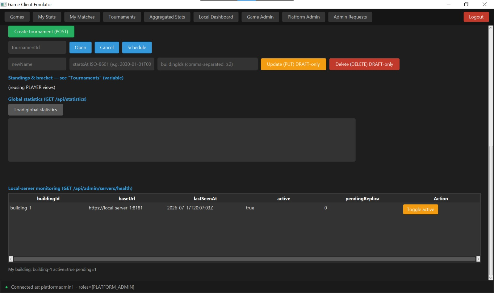
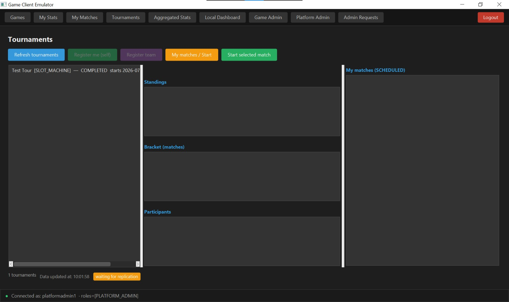

### Diagramma UML delle Classi del Dominio
#### Shared Domain — Value Objects & Enums

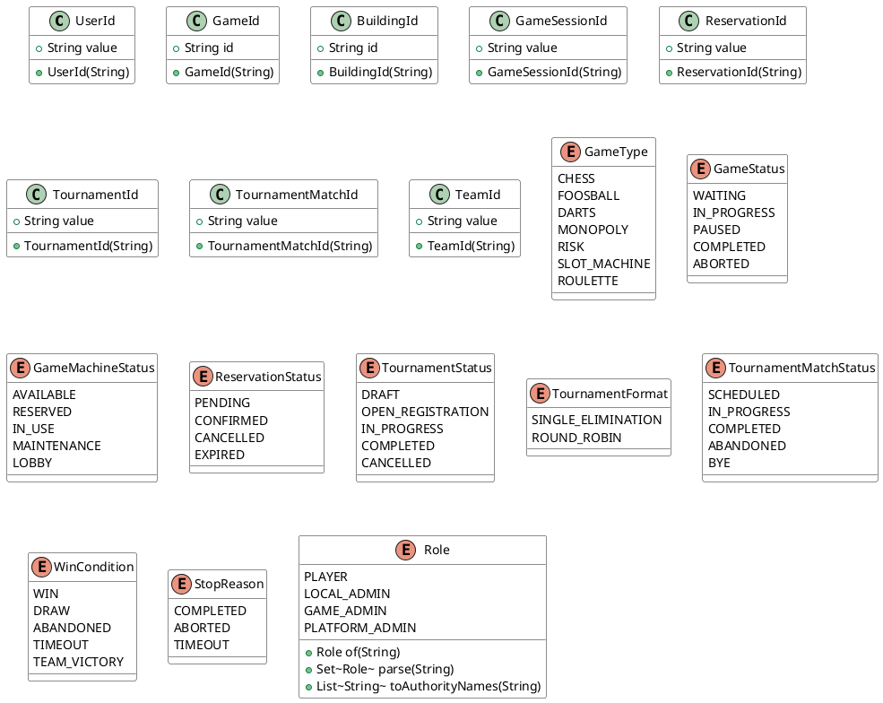

#### Shared Domain — Game Results

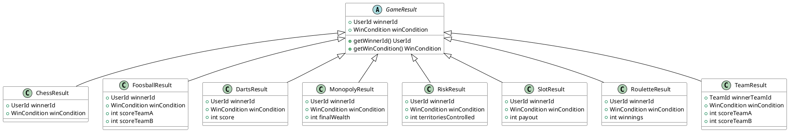

#### Shared Domain — Domain Events

```puml
@startuml
skinparam class {
  backgroundColor White
  arrowColor Black
}

abstract class DomainEvent {
  +String eventId
  +Instant occurredAt
}
class UserRegisteredEvent {
  +UserId userId
  +String username
  +List~String~ roles
}
class UserUpdatedEvent {
  +UserId userId
  +String username
  +String email
  +List~String~ roles
}
class GameStateChangedEvent {
  +GameId gameId
  +GameMachineStatus newStatus
}
class GameSessionCompletedEvent {
  +GameSessionId sessionId
  +GameId gameId
  +GameType gameType
  +BuildingId buildingId
  +List~UserId~ participants
  +UserId winnerId
  +WinCondition winCondition
  +Instant endedAt
}
class ReservationCreatedEvent {
  +ReservationId reservationId
  +GameId gameId
  +UserId userId
  +Instant startTime
  +Instant endTime
}
class ReservationCancelledEvent {
  +ReservationId reservationId
  +GameId gameId
  +UserId userId
}
class StatisticsUpdatedEvent {
  +BuildingId buildingId
  +GameType gameType
  +int totalSessions
  +double avgDuration
  +int totalReservations
}
class TournamentCreatedEvent {
  +TournamentId tournamentId
  +String name
  +GameType gameType
  +boolean teamBased
}
class TournamentRegistrationOpenedEvent {
  +TournamentId tournamentId
}
class TournamentMatchScheduledEvent {
  +TournamentMatchId matchId
  +TournamentId tournamentId
  +int round
  +String participantA
  +String participantB
  +GameType gameType
}
class TournamentMatchCompletedEvent {
  +TournamentMatchId matchId
  +TournamentId tournamentId
  +String winner
  +String resultData
}
class TournamentCompletedEvent {
  +TournamentId tournamentId
  +String winner
}

DomainEvent <|-- UserRegisteredEvent
DomainEvent <|-- UserUpdatedEvent
DomainEvent <|-- GameStateChangedEvent
DomainEvent <|-- GameSessionCompletedEvent
DomainEvent <|-- ReservationCreatedEvent
DomainEvent <|-- ReservationCancelledEvent
DomainEvent <|-- StatisticsUpdatedEvent
DomainEvent <|-- TournamentCreatedEvent
DomainEvent <|-- TournamentRegistrationOpenedEvent
DomainEvent <|-- TournamentMatchScheduledEvent
DomainEvent <|-- TournamentMatchCompletedEvent
DomainEvent <|-- TournamentCompletedEvent
@enduml
```

#### Local Server — Domain Model

```puml
@startuml
skinparam class {
  backgroundColor White
  arrowColor Black
}

class User {
  +UserId userId
  +String username
  +String passwordHash
  +String email
  +List~String~ roles
  +Instant eventTime
  +Instant updatedAt
}
class LocalSignupUser {
  +UserId userId
  +String username
  +String passwordHash
  +String email
  +List~String~ roles
  +Instant createdAt
}
class Game {
  +GameId id
  +GameType gameType
  +String name
  +BuildingId buildingId
  +GameMachineStatus status
  +long version
  +reserve()
  +startUse()
  +release()
  +setMaintenance()
  +setLobby()
  +rename(String)
}
class GameSession {
  +GameSessionId id
  +GameId gameId
  +GameType gameType
  +BuildingId buildingId
  +GameStatus status
  +Instant startedAt
  +Instant endedAt
  +Integer durationSeconds
  +UserId winnerId
  +WinCondition winCondition
  +GameResult result
  +List~UserId~ participants
  +Instant pausedAt
  +int accumulatedPausedSeconds
  +long version
  +TournamentMatchId tournamentMatchId
  +TournamentId tournamentId
  +complete(GameResult, Instant)
  +abort(StopReason, Instant)
  +cancelLobby(Instant)
  +pause(Instant)
  +resume(Instant)
  +calculateDuration()
  +addParticipant(UserId)
  +removeParticipant(UserId)
}
class Reservation {
  +ReservationId id
  +GameId gameId
  +UserId userId
  +ReservationStatus status
  +Instant startTime
  +Instant endTime
  +Instant createdAt
  +long version
  +confirm()
  +cancel()
  +expire()
  +canBeCancelled(Clock) boolean
}
class TournamentSummaryLocal {
  +TournamentId tournamentId
  +String name
  +GameType gameType
  +boolean teamBased
  +int teamSize
  +TournamentStatus status
  +Instant startsAt
  +Instant endsAt
  +List~String~ buildingIds
  +int participantsCount
  +boolean deleted
  +Instant updatedAt
}
class TournamentMatchLocal {
  +TournamentMatchId id
  +TournamentId tournamentId
  +int round
  +int bracketPosition
  +String participantA
  +String participantB
  +GameType gameType
  +String gameId
  +TournamentMatchStatus status
  +Instant scheduledAt
  +withStatus(TournamentMatchStatus) TournamentMatchLocal
}
class TournamentStandingLocal {
  +TournamentId tournamentId
  +String participantId
  +int wins
  +int losses
  +int points
  +Integer rank
}
class TournamentParticipantLocal {
  +TournamentId tournamentId
  +String participantId
  +boolean isTeam
  +String displayName
  +Instant registeredAt
}
class LocalStatistics {
  +GameType gameType
  +int totalSessions
  +double avgDuration
  +int totalReservations
  +Map~String, Double~ winRateByUser
  +recalculate(List~GameSession~)
}
class GameDefinitionLocal {
  +GameType gameType
  +String name
  +int minPlayers
  +int maxPlayers
  +boolean teamAllowed
  +Map~String, Object~ registrationRules
  +Instant updatedAt
}
class RegisteredLocalServerLocal {
  +BuildingId buildingId
  +String baseUrl
  +Instant lastSeenAt
  +boolean active
  +Instant updatedAt
}
class LocalAdminBuilding {
  +UserId userId
  +BuildingId buildingId
  +Instant assignedAt
}
class OutboxEvent {
  +String id
  +String eventType
  +String payload
  +String status
  +Instant createdAt
  +Instant sentAt
  +int retryCount
  +markAsSent(Instant)
  +incrementRetry()
  +markAsFailed()
  +hasFailed() boolean
}
enum OutboxEventStatus {
  PENDING
  SENT
  FAILED
}
class AdminRequestLocal {
  +String id
  +UserId userId
  +String requestType
  +String payload
  +AdminRequestStatus status
  +Instant createdAt
}
enum AdminRequestStatus {
  PENDING
  APPROVED
  REJECTED
}
class DeadLetterEvent {
  +String id
  +String originalEventId
  +String eventType
  +String payload
  +String errorMessage
  +Instant failedAt
  +int retryCount
}

GameSession --> UserId : gameId
GameSession --> UserId : buildingId
GameSession --> UserId : participants
GameSession --> GameSessionId : id
GameSession --> GameType : gameType
GameSession --> GameStatus : status
GameSession --> WinCondition : winCondition
GameSession --> GameResult : result
GameSession --> UserId : winnerId
GameSession --> TournamentMatchId : tournamentMatchId
GameSession --> TournamentId : tournamentId

Reservation --> GameId : gameId
Reservation --> UserId : userId
Reservation --> ReservationStatus : status
Reservation --> ReservationId : id

Game --> GameId : id
Game --> GameType : gameType
Game --> BuildingId : buildingId
Game --> GameMachineStatus : status

TournamentSummaryLocal --> TournamentId : tournamentId
TournamentSummaryLocal --> GameType : gameType
TournamentSummaryLocal --> TournamentStatus : status

TournamentMatchLocal --> TournamentMatchId : id
TournamentMatchLocal --> TournamentId : tournamentId
TournamentMatchLocal --> GameType : gameType
TournamentMatchLocal --> TournamentMatchStatus : status

TournamentParticipantLocal --> TournamentId : tournamentId

LocalStatistics --> GameType : gameType
LocalStatistics --> GameSession : recalculate(sessions)

GameDefinitionLocal --> GameType : gameType

RegisteredLocalServerLocal --> BuildingId : buildingId

LocalAdminBuilding --> UserId : userId
LocalAdminBuilding --> BuildingId : buildingId

OutboxEvent --> OutboxEventStatus : status

LocalAdminBuilding ..> UserId : "1 userId"
LocalAdminBuilding ..> BuildingId : "1 buildingId"
@enduml
```

#### Central System — Domain Model

```puml
@startuml
skinparam class {
  backgroundColor White
  arrowColor Black
}

class User {
  +UserId id
  +String username
  +String passwordHash
  +String email
  +List~String~ roles
  +Instant createdAt
  +changePassword(String)
  +updateRoles(List~String~)
}
class GameDefinition {
  +GameType gameType
  +String name
  +int minPlayers
  +int maxPlayers
  +boolean teamAllowed
  +Map~String, Object~ registrationRules
  +Instant createdAt
  +Instant updatedAt
}
class Tournament {
  +TournamentId tournamentId
  +String name
  +GameType gameType
  +boolean teamBased
  +int teamSize
  +TournamentFormat format
  +TournamentStatus status
  +Instant startsAt
  +Instant endsAt
  +UserId createdBy
  +Instant createdAt
  +openRegistration() Tournament
  +cancel() Tournament
  +startProgress() Tournament
  +complete(Instant) Tournament
  +update(String, Instant) Tournament
}
class Team {
  +TeamId teamId
  +TournamentId tournamentId
  +String name
  +List~UserId~ members
  +Instant createdAt
}
class TournamentParticipant {
  +TournamentId tournamentId
  +String participantId
  +boolean isTeam
  +String displayName
  +Instant registeredAt
}
class TournamentMatch {
  +TournamentMatchId matchId
  +TournamentId tournamentId
  +int round
  +int bracketPosition
  +String participantA
  +String participantB
  +String buildingId
  +String gameId
  +String sessionId
  +String winner
  +TournamentMatchStatus status
  +Instant scheduledAt
  +Instant playedAt
  +String resultData
}
class TournamentStanding {
  +TournamentId tournamentId
  +String participantId
  +int wins
  +int losses
  +int points
  +Integer rank
}
class PlayerStatistics {
  +UserId userId
  +GameType gameType
  +int matchesPlayed
  +int matchesWon
  +Instant lastPlayedAt
  +mergeIncrement(boolean, Instant) PlayerStatistics
}
class PlayerMatchFact {
  +String sessionId
  +UserId userId
  +BuildingId buildingId
  +GameType gameType
  +String tournamentId
  +boolean won
  +WinCondition winCondition
  +Instant endedAt
}
class AggregatedStatistics {
  +String id
  +BuildingId buildingId
  +GameType gameType
  +LocalDate periodStart
  +LocalDate periodEnd
  +int totalSessions
  +int avgDurationSeconds
  +int totalReservations
  +int totalAbortedSessions
  +Map~String, Object~ data
  +mergeWith(AggregatedStatistics)
}
class RegisteredLocalServer {
  +BuildingId buildingId
  +String baseUrl
  +Instant lastSeenAt
  +boolean isActive
  +updateLastSeen(Instant)
  +setActive(boolean)
}
class ProcessedEvent {
  +String eventId
  +Instant processedAt
}
class ReplicationProgress {
  +String eventId
  +String serverId
}
class LocalAdminBuilding {
  +UserId userId
  +BuildingId buildingId
  +Instant assignedAt
}
class FailedLoginAttempt {
  +String username
  +Instant attemptedAt
  +boolean success
}

User --> UserId : id

GameDefinition --> GameType : gameType

Tournament --> TournamentId : tournamentId
Tournament --> GameType : gameType
Tournament --> TournamentFormat : format
Tournament --> TournamentStatus : status
Tournament --> UserId : createdBy

Team --> TeamId : teamId
Team --> TournamentId : tournamentId
Team --> UserId : members

TournamentParticipant --> TournamentId : tournamentId

TournamentMatch --> TournamentMatchId : matchId
TournamentMatch --> TournamentId : tournamentId
TournamentMatch --> TournamentMatchStatus : status

TournamentStanding --> TournamentId : tournamentId

PlayerStatistics --> UserId : userId
PlayerStatistics --> GameType : gameType

AggregatedStatistics --> BuildingId : buildingId
AggregatedStatistics --> GameType : gameType

RegisteredLocalServer --> BuildingId : buildingId

LocalAdminBuilding --> UserId : userId
LocalAdminBuilding --> BuildingId : buildingId

ProcessedEvent ..> String : eventId

ReplicationProgress ..> String : eventId
ReplicationProgress ..> String : serverId
@enduml
```

Le statististiche che vengono mostrate dipendono da l'utente che ha fatto l'accesso:
* Il player ha accesso hai dati sui giochi che ha giocato lui:

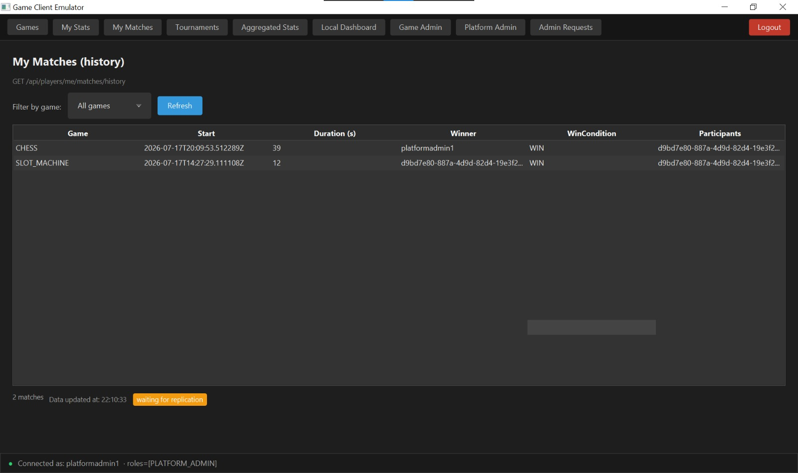
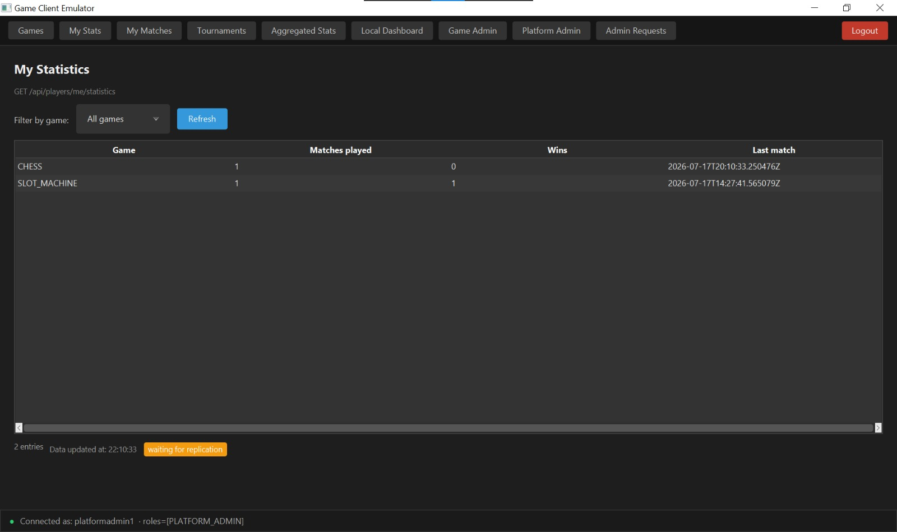

* Il local admin ha accesso a tutti i giochi nel suo locale, con indicato se sono disponibili e i punteggi delle partite.

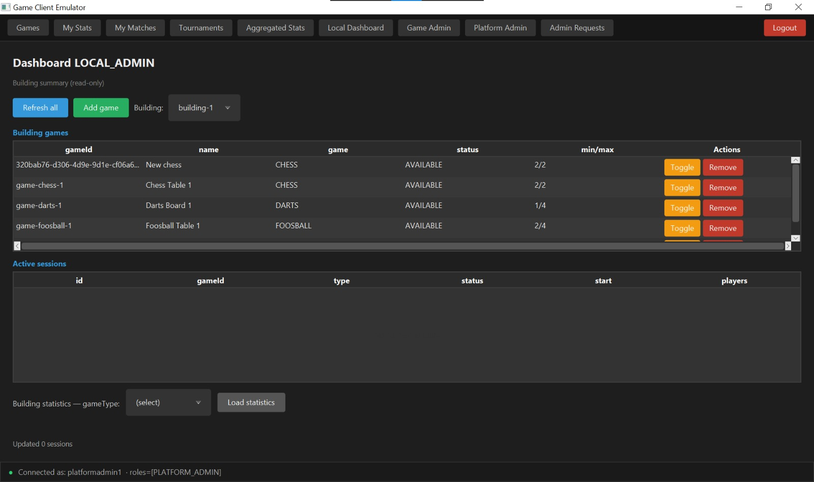

* Il Game Admin ha accesso a tuttti i giochi creati, la sua dashboard è un editor che permette di definire nuovi giochi.

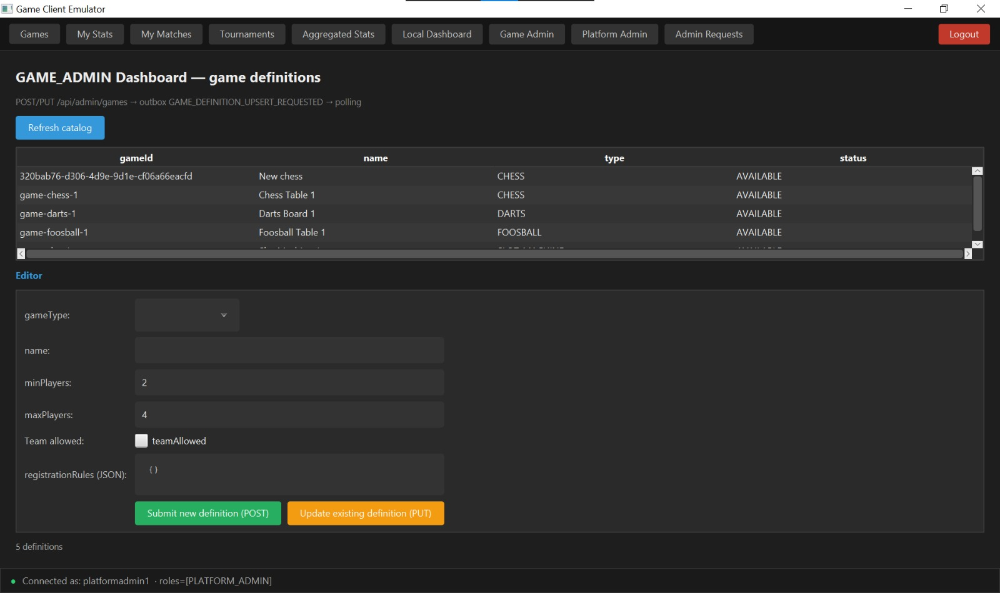

* Il Platform Admin ha accesso a tutte le statistiche.

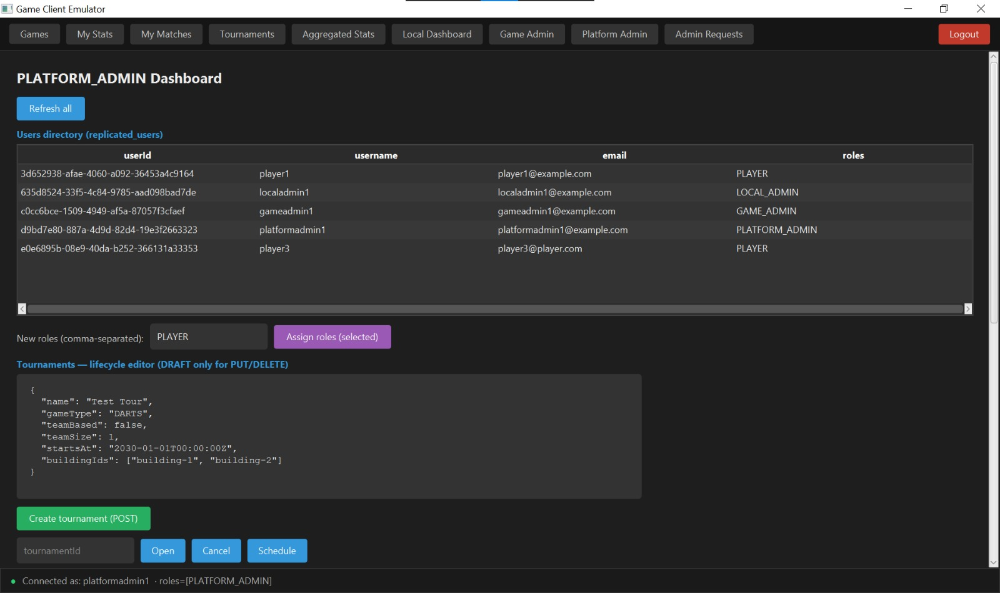

### Componenti accessori
Come già accennato è necessario autenticarsi.

## 5. FASI DI LAVORO
### 5.1 Specifica 
Come già detto l'applicazione è una piattaforma software per la gestione di sale giochi da tavolo/bar disposte in più edifici fisici.

### Casi d'uso

1) __Login e registrazione offline__ un utente si autentica o crea un nuovo account anche quando il Local Server del proprio edificio è isolato dal Central System, grazie alla replica locale delle credenziali e alla firma dei token JWT con una chiave del Local Server stesso.

2) __Monitoraggio degli endpoint e recupero da crash__ il Local Server verifica periodicamente che le postazioni di gioco connesse siano raggiungibili; se una postazione non risponde per più cicli consecutivi, o se il server si riavvia dopo un crash con sessioni rimaste appese, la partita in corso viene chiusa automaticamente e la macchina torna disponibile.

3) __Creazione e gestione di un torneo__ un Platform Admin crea un torneo (individuale o a squadre) su almeno due edifici per uno stesso gioco; i giocatori si iscrivono in autonomia durante la fase di registrazione aperta, viene generato un bracket ad eliminazione diretta e i risultati dei singoli match aggiornano automaticamente il bracket e la classifica.

4) __Sincronizzazione locale-centrale__ tutti gli eventi generati mentre il Local Server è offline (prenotazioni, sessioni di gioco, iscrizioni) vengono accumulati in una coda locale e inviati in blocco al Central System non appena la connettività torna disponibile.

5) __Consultazione statistiche per ruolo__ ogni tipologia di utente visualizza dati differenti: il player le proprie partite e statistiche personali, il local admin lo stato dei giochi e le statistiche del proprio locale, il game admin l'anagrafica dei giochi definiti, il platform admin le statistiche aggregate dell'intera piattaforma.

6) __Definizione di nuove tipologie di gioco__ un Game Admin definisce nuovi tipi di gioco e le relative regole di registrazione delle partite, incluse eventuali varianti a giocatore singolo basate su esito casuale (es. slot machine, roulette).

7) __Acquisizione eventi dai sensori di gioco__ i sensori posizionati su ciascun gioco fisico (gestiti ad esempio da una board ESP32) rilevano gli eventi significativi della partita e li inviano al Local Server tramite chiamate HTTP e MQTT.


### Diagramma UML dei Casi d'Uso

#### Login e Registrazione Offline

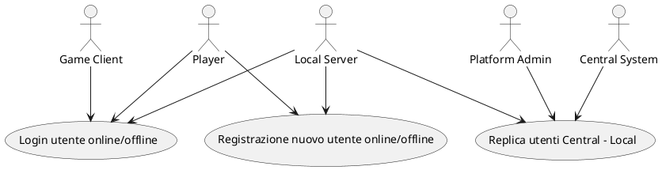

#### Monitoraggio e Recupero Crash

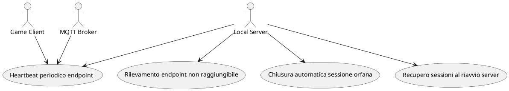

#### Gestione Tornei

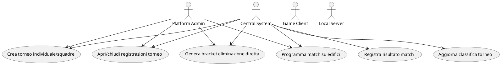

#### Sincronizzazione Locale-Centrale

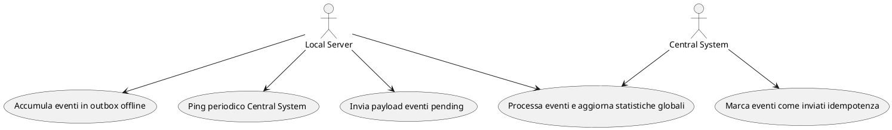

#### Consultazione Statistiche

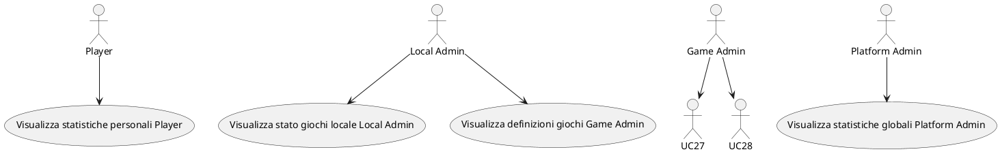

#### Definizione Tipi di Gioco

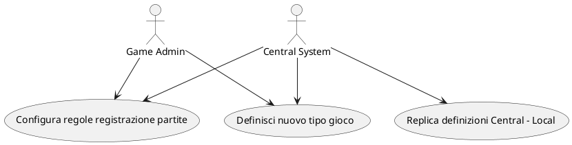

#### Acquisizione Eventi Sensori

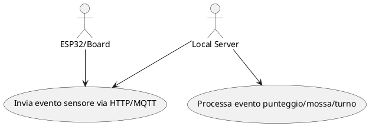


### 5.2 Progettazione
Vengono usati pattern diversi:

* Sul piano della distribuzione usiamo Hub-and-Spoke unito a quello Pub/Sub. Qui il Central System è l'hub e gli spoke i Local Server, quello Pub/Sub è attuato tramite MQTT tra server locale e Game Client.
* Sul piano dei microservizi il sistema è composto da tre microservizi Spring Boot indipendenti (Central System, Local Server, Game Client Emulator),  organizzati come monorepo Maven multi-modulo con moduli condivisi (shared-domain, shared-dto, shared-mqtt) che non dipendono da nessun framework, per evitare duplicazione di codice tra i tre servizi.
* Sul piano del codice interno a ciascun microservizio, viene applicata la Clean Architecture / architettura esagonale (Ports and Adapters): il dominio (le entità e la logica di business) è Java puro, senza dipendenze da Spring o JPA, mentre l'accesso a database, MQTT e REST avviene tramite adapter separati. Questo rispetta il Dependency Inversion Principle e rende il dominio testabile senza framework.

In sintesi, l'architettura si può riassumere così: microservizi distribuiti in pattern hub-and-spoke con comunicazione ibrida REST/MQTT, ciascun servizio internamente strutturato secondo architettura esagonale, con sincronizzazione asincrona basata su outbox pattern per garantire resilienza offline.


### Diagramma dei Package (Maven Modules + Clean Architecture Layers)

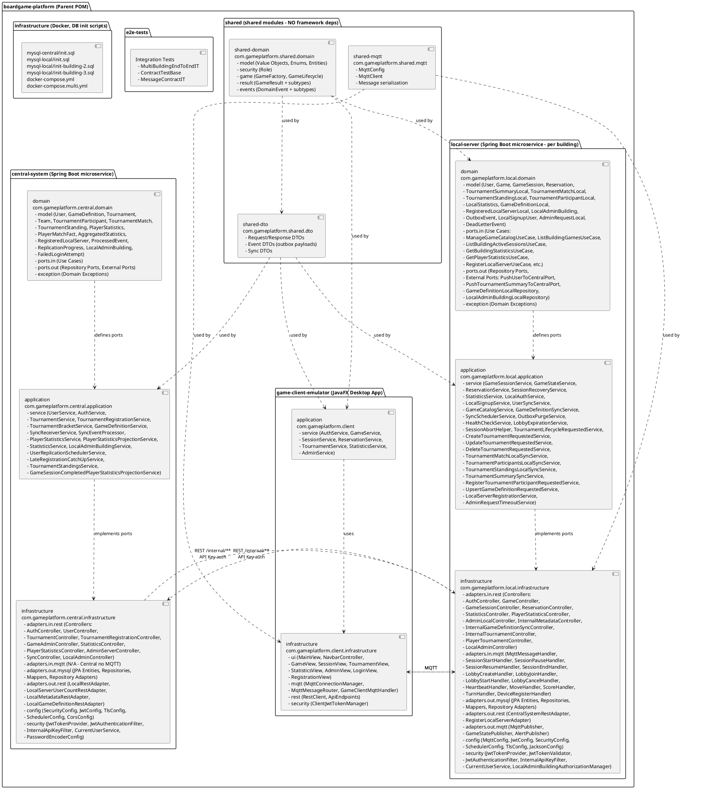

### Diagramma delle Classi di Implementazione (Clean Architecture / Hexagonal)

#### 6.1 Value Objects & Enum

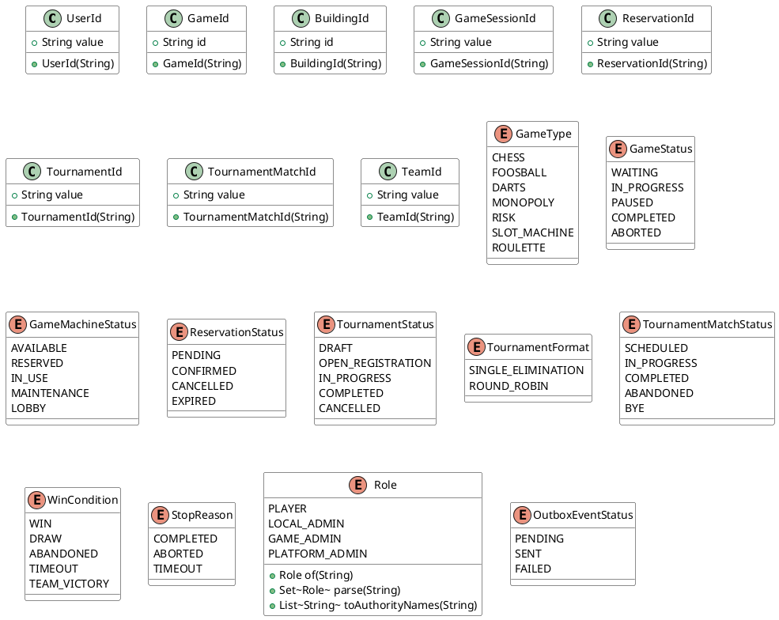

#### 6.2 Central System - Domain Model

```puml
@startuml
skinparam class {
  backgroundColor White
  arrowColor Black
}
class CentralUser {
    -UserId id
    -String username
    -String passwordHash
    -String email
    -List~String~ roles
    -Instant createdAt
    +changePassword(String)
    +updateRoles(List~String~)
}
class GameDefinition {
    -GameType gameType
    -String name
    -int minPlayers
    -int maxPlayers
    -boolean teamAllowed
    -Map~String,Object~ registrationRules
    -Instant createdAt
    -Instant updatedAt
}
class Tournament {
    -TournamentId tournamentId
    -String name
    -GameType gameType
    -boolean teamBased
    -int teamSize
    -TournamentFormat format
    -TournamentStatus status
    -Instant startsAt
    -Instant endsAt
    -UserId createdBy
    -Instant createdAt
    +Tournament openRegistration()
    +Tournament cancel()
    +Tournament startProgress()
    +Tournament complete(Instant)
    +Tournament update(String, Instant)
}
class Team {
    -TeamId teamId
    -TournamentId tournamentId
    -String name
    -List~UserId~ members
    -Instant createdAt
}
class TournamentParticipant {
    -TournamentId tournamentId
    -String participantId
    -boolean isTeam
    -String displayName
    -Instant registeredAt
}
class TournamentMatch {
    -TournamentMatchId matchId
    -TournamentId tournamentId
    -int round
    -int bracketPosition
    -String participantA
    -String participantB
    -String buildingId
    -String gameId
    -String sessionId
    -String winner
    -TournamentMatchStatus status
    -Instant scheduledAt
    -Instant playedAt
    -String resultData
}
class TournamentStanding {
    -TournamentId tournamentId
    -String participantId
    -int wins
    -int losses
    -int points
    -Integer rank
}
class PlayerStatistics {
    -UserId userId
    -GameType gameType
    -int matchesPlayed
    -int matchesWon
    -Instant lastPlayedAt
    +PlayerStatistics mergeIncrement(boolean, Instant)
}
class PlayerMatchFact {
    -String sessionId
    -UserId userId
    -BuildingId buildingId
    -GameType gameType
    -String tournamentId
    -boolean won
    -WinCondition winCondition
    -Instant endedAt
}
class AggregatedStatistics {
    -String id
    -BuildingId buildingId
    -GameType gameType
    -LocalDate periodStart
    -LocalDate periodEnd
    -int totalSessions
    -int avgDurationSeconds
    -int totalReservations
    -int totalAbortedSessions
    -Map~String,Object~ data
    +mergeWith(AggregatedStatistics)
}
class RegisteredLocalServer {
    -BuildingId buildingId
    -String baseUrl
    -Instant lastSeenAt
    -boolean isActive
    +updateLastSeen(Instant)
    +setActive(boolean)
}
class ProcessedEvent {
    -String eventId
    -Instant processedAt
}
class ReplicationProgress {
    +String eventId
    +String serverId
}
class LocalAdminBuilding {
    -UserId userId
    -BuildingId buildingId
    -Instant assignedAt
}
class FailedLoginAttempt {
    -String username
    -Instant attemptedAt
    -boolean success
}

UserId <|-- CentralUser
GameType <|-- GameDefinition
TournamentId <|-- Tournament
GameType <|-- Tournament
TournamentFormat <|-- Tournament
TournamentStatus <|-- Tournament
UserId <|-- Tournament
TeamId <|-- Team
TournamentId <|-- Team
UserId <|-- Team
TournamentId <|-- TournamentParticipant
TournamentMatchId <|-- TournamentMatch
TournamentId <|-- TournamentMatch
TournamentMatchStatus <|-- TournamentMatch
TournamentId <|-- TournamentStanding
UserId <|-- PlayerStatistics
GameType <|-- PlayerStatistics
UserId <|-- PlayerMatchFact
BuildingId <|-- PlayerMatchFact
GameType <|-- PlayerMatchFact
WinCondition <|-- PlayerMatchFact
BuildingId <|-- AggregatedStatistics
GameType <|-- AggregatedStatistics
BuildingId <|-- RegisteredLocalServer
UserId <|-- LocalAdminBuilding
BuildingId <|-- LocalAdminBuilding
@enduml
```

#### 6.3 Local Server - Domain Model

```puml
@startuml
skinparam class {
  backgroundColor White
  arrowColor Black
}
class LocalUser {
    -UserId userId
    -String username
    -String passwordHash
    -String email
    -List~String~ roles
    -Instant eventTime
    -Instant updatedAt
}
class Game {
    -GameId id
    -GameType gameType
    -String name
    -BuildingId buildingId
    -GameMachineStatus status
    -long version
    +reserve()
    +startUse()
    +release()
    +setMaintenance()
    +setLobby()
    +rename(String)
}
class GameSession {
    -GameSessionId id
    -GameId gameId
    -GameType gameType
    -BuildingId buildingId
    -GameStatus status
    -Instant startedAt
    -Instant endedAt
    -Integer durationSeconds
    -UserId winnerId
    -WinCondition winCondition
    -GameResult result
    -List~UserId~ participants
    -Instant pausedAt
    -int accumulatedPausedSeconds
    -long version
    -TournamentMatchId tournamentMatchId
    -TournamentId tournamentId
    +complete(GameResult, Instant)
    +abort(StopReason, Instant)
    +cancelLobby(Instant)
    +pause(Instant)
    +resume(Instant)
    +calculateDuration()
    +addParticipant(UserId)
    +removeParticipant(UserId)
}
class Reservation {
    -ReservationId id
    -GameId gameId
    -UserId userId
    -ReservationStatus status
    -Instant startTime
    -Instant endTime
    -Instant createdAt
    -long version
    +canBeCancelled(Clock) boolean
    +confirm()
    +cancel()
    +expire()
}
class TournamentSummaryLocal {
    -TournamentId tournamentId
    -String name
    -GameType gameType
    -boolean teamBased
    -int teamSize
    -TournamentStatus status
    -Instant startsAt
    -Instant endsAt
    -List~String~ buildingIds
    -int participantsCount
    -boolean deleted
    -Instant updatedAt
}
class TournamentMatchLocal {
    -TournamentMatchId id
    -TournamentId tournamentId
    -int round
    -int bracketPosition
    -String participantA
    -String participantB
    -GameType gameType
    -String gameId
    -TournamentMatchStatus status
    -Instant scheduledAt
    +TournamentMatchLocal withStatus(TournamentMatchStatus)
}
class LocalStatistics {
    -GameType gameType
    -int totalSessions
    -double avgDuration
    -int totalReservations
    -Map~String,Double~ winRateByUser
    +recalculate(List~GameSession~)
}
class GameDefinitionLocal {
    -GameType gameType
    -String name
    -int minPlayers
    -int maxPlayers
    -boolean teamAllowed
    -Map~String,Object~ registrationRules
    -Instant updatedAt
}
class OutboxEvent {
    -String id
    -String eventType
    -String payload
    -String status
    -Instant createdAt
    -Instant sentAt
    -int retryCount
    +markAsSent(Instant)
    +incrementRetry()
    +markAsFailed()
    +hasFailed() boolean
}
class RegisteredLocalServerLocal {
    -BuildingId buildingId
    -String baseUrl
    -Instant lastSeenAt
    -boolean active
    -Instant updatedAt
}

UserId <|-- LocalUser
GameId <|-- Game
GameType <|-- Game
BuildingId <|-- Game
GameMachineStatus <|-- Game
GameSessionId <|-- GameSession
GameId <|-- GameSession
GameType <|-- GameSession
BuildingId <|-- GameSession
GameStatus <|-- GameSession
WinCondition <|-- GameSession
GameResult <|-- GameSession
UserId <|-- GameSession
TournamentMatchId <|-- GameSession
TournamentId <|-- GameSession
ReservationId <|-- Reservation
GameId <|-- Reservation
UserId <|-- Reservation
ReservationStatus <|-- Reservation
TournamentId <|-- TournamentSummaryLocal
GameType <|-- TournamentSummaryLocal
TournamentStatus <|-- TournamentSummaryLocal
TournamentMatchId <|-- TournamentMatchLocal
TournamentId <|-- TournamentMatchLocal
GameType <|-- TournamentMatchLocal
TournamentMatchStatus <|-- TournamentMatchLocal
GameType <|-- LocalStatistics
GameType <|-- GameDefinitionLocal
OutboxEventStatus <|-- OutboxEvent
BuildingId <|-- RegisteredLocalServerLocal
UserId <|-- LocalAdminBuilding
BuildingId <|-- LocalAdminBuilding
@enduml
```

#### 6.4 Ports (Interfaces / Hexagonal)

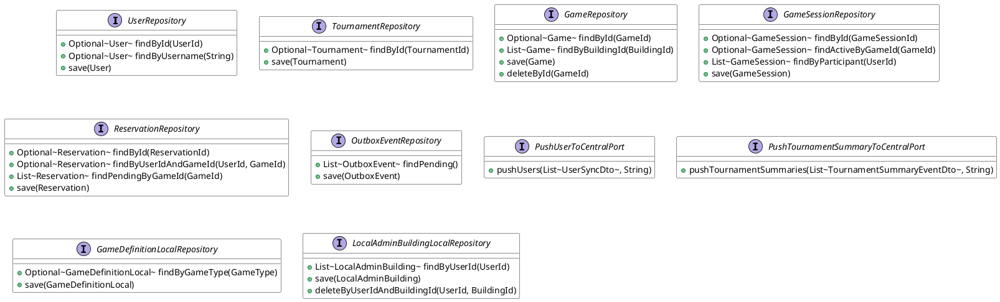

#### 6.5 Application Services (Local Server)

```puml
@startuml
skinparam class {
  backgroundColor White
  arrowColor Black
}
class GameSessionService {
    +GameSession start(GameId, UserId, GameType, BuildingId, List~UserId~, Instant)
    +GameSession start(GameId, UserId, GameType, BuildingId, List~UserId~, Instant, TournamentMatchId, TournamentId)
    +pause(GameSessionId, UserId, Instant)
    +resume(GameSessionId, UserId, Instant)
    +end(GameSessionId, UserId, GameResult, Instant)
    +abort(GameSessionId, UserId, StopReason, Instant)
}
class GameStateService {
    +GameStateDto getGameState(GameId)
    +List~GameStateDto~ getBuildingGames(BuildingId)
    +List~GameSessionDto~ getActiveSessions(BuildingId)
}
class ReservationService {
    +ReservationDto create(CreateReservationRequestDto)
    +confirm(ReservationId, UserId)
    +cancel(ReservationId, UserId)
    +expirePending(Clock)
}
class StatisticsService {
    +LocalStatistics getStatistics(BuildingId, GameType)
    +PlayerStatisticsDto getPlayerStatistics(UserId, GameType)
    +List~GameSessionDto~ getActiveSessions(BuildingId)
    +BuildingStatisticsDto getBuildingStatistics(BuildingId)
}
class LocalAuthService {
    +LoginResponseDto authenticate(LoginRequestDto)
}
class LocalSignupService {
    +SignupResponseDto register(SignupRequestDto)
}
class UserSyncService {
    +syncUsers(List~UserSyncDto~)
}
class GameCatalogService {
    +GameDto createGame(CreateGameRequestDto)
    +GameDto updateGame(GameId, UpdateGameRequestDto)
    +deleteGame(GameId)
    +List~GameDto~ getGames(BuildingId)
}
class SyncSchedulerService {
    +syncWithCentral()
}
class SessionRecoveryService {
    +recoverSessions()
}
class TournamentLifecycleRequestedService {
    +handleTournamentCreated(TournamentSummaryEventDto)
    +handleTournamentUpdated(TournamentSummaryEventDto)
    +handleTournamentDeleted(TournamentSummaryEventDto)
}
class TournamentMatchLocalSyncService {
    +handleMatchScheduled(TournamentMatchScheduledDto)
    +handleMatchCompleted(TournamentMatchResultDto)
}

GameSessionService ..> GameSessionRepository : uses
GameSessionService ..> GameRepository : uses
GameSessionService ..> GameDefinitionLocalRepository : uses
GameSessionService ..> OutboxEventRepository : uses
GameStateService ..> GameRepository : uses
GameStateService ..> GameSessionRepository : uses
ReservationService ..> ReservationRepository : uses
ReservationService ..> GameRepository : uses
ReservationService ..> OutboxEventRepository : uses
StatisticsService ..> GameSessionRepository : uses
StatisticsService ..> ReservationRepository : uses
LocalAuthService ..> UserRepository : uses
LocalSignupService ..> UserRepository : uses
UserSyncService ..> UserRepository : uses
GameCatalogService ..> GameRepository : uses
GameCatalogService ..> OutboxEventRepository : uses
SyncSchedulerService ..> OutboxEventRepository : uses
SyncSchedulerService ..> CentralSystemRestAdapter : uses
SessionRecoveryService ..> GameSessionRepository : uses
SessionRecoveryService ..> MqttPublisher : uses
TournamentLifecycleRequestedService ..> TournamentSummaryLocalRepository : uses
TournamentMatchLocalSyncService ..> TournamentMatchLocalRepository : uses
@enduml
```

#### 6.6 Infrastructure Adapters

```puml
@startuml
skinparam class {
  backgroundColor White
  arrowColor Black
}
class JwtTokenProvider {
    +String generateTokenWithExpiry(User, Instant)
    +JwtClaims parseToken(String)
}
class JwtAuthenticationFilter
class InternalApiKeyFilter
class CurrentUserService
class LocalAdminBuildingAuthorizationManager
class MqttPublisher {
    +publish(String, String, int, boolean)
}
class GameStatePublisher {
    +publishState(GameId, GameMachineStatus)
    +publishSessionStart(GameSessionDto)
    +publishSessionEnd(GameSessionDto)
}
class AlertPublisher {
    +publishAlert(String, String)
}
class MqttMessageHandler {
    +handle(String, String)
}
class SessionStartHandler {
    +handle(SessionStartPayload)
}
class SessionPauseHandler {
    +handle(SessionPausePayload)
}
class SessionResumeHandler {
    +handle(SessionResumePayload)
}
class SessionEndHandler {
    +handle(SessionEndPayload)
}
class HeartbeatHandler {
    +handle(HeartbeatPayload)
}
class CentralSystemRestAdapter {
    +syncUsers(List~UserSyncDto~)
    +syncTournamentSummaries(List~TournamentSummaryEventDto~)
    +syncGameDefinitions(List~GameDefinitionEventDto~)
}
class RegisterLocalServerAdapter {
    +register(BuildingId, String)
}

JwtAuthenticationFilter ..> JwtTokenProvider : uses
InternalApiKeyFilter ..> CurrentUserService : uses
MqttMessageHandler ..> SessionStartHandler : delegates
MqttMessageHandler ..> SessionPauseHandler : delegates
MqttMessageHandler ..> SessionResumeHandler : delegates
MqttMessageHandler ..> SessionEndHandler : delegates
MqttMessageHandler ..> HeartbeatHandler : delegates
MqttMessageHandler ..> MqttPublisher : uses

CentralSystemRestAdapter ..> PushUserToCentralPort : implements
CentralSystemRestAdapter ..> PushTournamentSummaryToCentralPort : implements
RegisterLocalServerAdapter ..> PushUserToCentralPort : implements
@enduml
```

### Diagrammi di Sequenza


#### Login e Registrazione Offline (Offline Authentication)

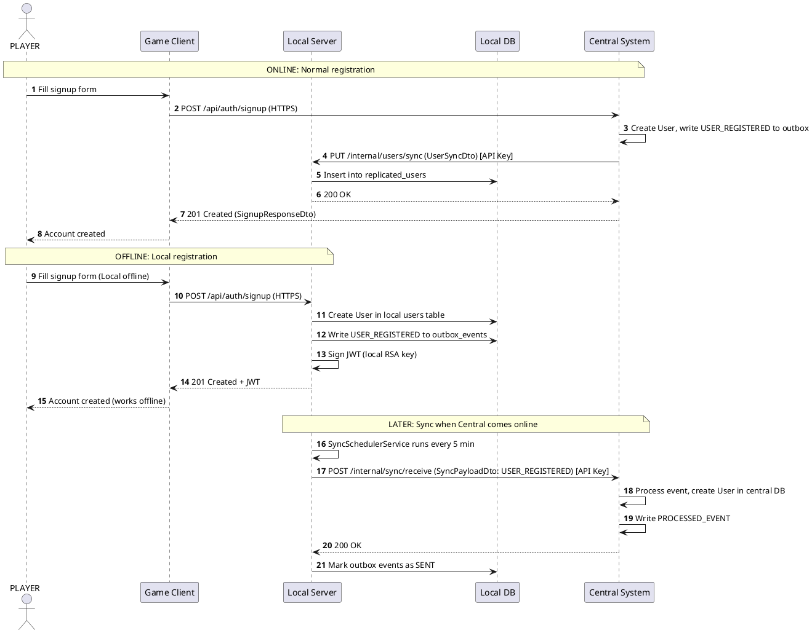

#### Monitoraggio Endpoint e Recupero da Crash (Health Check & Crash Recovery)

```puml
@startuml
autonumber
participant "Local Server" as Local
participant "Local DB" as DB
participant "MQTT Broker" as MQTT
participant "Game Client" as Client
participant "Alert Topic" as Alert

note over Local, Client : Normal Heartbeat (Client-initiated)
loop Every 30 seconds (Client)
    Client -> MQTT : Publish heartbeat (gameId, timestamp)
    MQTT -> Local : Receive on heartbeat topic
    Local -> DB : registerHeartbeat(gameId, timestamp)
    Local -> MQTT : Publish heartbeat/ack (PONG)
end

note over Local, Client : Server-Initiated Health Check (every 5 min)
loop Every 5 minutes (Local Scheduler)
    Local -> MQTT : Publish PING on heartbeat topic
    MQTT -> Client : Receive PING
    Client -> MQTT : Publish PONG on heartbeat/ack
    MQTT -> Local : Receive PONG
    Local -> DB : registerHeartbeat(gameId, timestamp)
end

note over Local, DB : Missed Heartbeats Detection
Local -> DB : Find games with IN_USE status
Local -> DB : Check lastHeartbeatAt for each
alt 3 consecutive missed (15 min)
    Local -> DB : Abort GameSession (ABORTED, TIMEOUT)
    Local -> DB : Update Game status = AVAILABLE
    Local -> DB : Write GAME_SESSION_COMPLETED (ABORTED) to outbox
    Local -> MQTT : Publish state: AVAILABLE (retained)
    Local -> MQTT : Publish to alerts topic (client unreachable)
    MQTT --> Alert : Alert received
end

note over Local, DB : Crash Recovery (on startup)
Local -> DB : Find sessions with status IN_PROGRESS or PAUSED
Local -> MQTT : Ping each game machine (PING on heartbeat)
alt No response within 30 seconds
    Local -> DB : Abort session (ABORTED)
    Local -> DB : Update Game status = AVAILABLE
    Local -> DB : Write GAME_SESSION_COMPLETED to outbox
    Local -> MQTT : Publish state: AVAILABLE
else Response received
    Local -> Local : Session confirmed active, keep running
end
@enduml
```

#### Creazione e Gestione Torneo (Tournament Management)

```puml
@startuml
autonumber
actor Admin as "PLATFORM_ADMIN"
participant "Game Client" as Client
participant "Central System" as Central
participant "Central DB" as DB
participant "Local Server(s)" as Local
participant "MQTT Broker" as MQTT

note over Admin, Central : 1. Create Tournament (HTTPS REST)
Admin -> Client : Fill tournament form (name, game, buildings, format, team size)
Client -> Central : POST /api/admin/tournaments (JWT)
Central -> Central : Validate: min 2 buildings, game exists
Central -> DB : Insert Tournament (DRAFT)
Central -> DB : Insert tournament_buildings rows
Central -> DB : Write TOURNAMENT_CREATED to outbox
Central --> Client : 201 Created (TournamentDto)
Client --> Admin : Tournament created

note over Admin, Central : 2. Open Registration
Admin -> Client : Press "Open Registration"
Client -> Central : POST /api/admin/tournaments/{id}/open
Central -> Central : Tournament.openRegistration() [DRAFT -> OPEN_REGISTRATION]
Central -> DB : Update Tournament status
Central -> DB : Write TOURNAMENT_REGISTRATION_OPENED to outbox
Central --> Client : 200 OK
Central -> Local : PUT /internal/metadata/sync (TOURNAMENT_SUMMARY_UPSERTED)
Local -> Local : Upsert TournamentSummaryLocal
Local --> Central : 200 OK

note over Player, Central : 3. Player Registration
Player -> Client : View tournaments, press "Register"
Client -> Central : POST /api/tournaments/{id}/participants (JWT)
Central -> Central : Validate registration open, capacity
Central -> DB : Insert TournamentParticipant (individual or team)
Central -> DB : Write TOURNAMENT_PARTICIPANT_REGISTERED to outbox
Central --> Client : 201 Created
Central -> Local : PUT /internal/metadata/sync (TOURNAMENT_PARTICIPANTS_UPSERTED)
Local -> Local : Upsert TournamentParticipantLocal
Local --> Central : 200 OK

note over Admin, Central : 4. Schedule Matches (Bracket Generation)
Admin -> Client : Press "Schedule Matches"
Client -> Central : POST /api/admin/tournaments/{id}/schedule
Central -> Central : TournamentBracketService.generateBracket()
Central -> DB : Insert TournamentMatch rows (SCHEDULED)
Central -> DB : Write TOURNAMENT_MATCH_SCHEDULED to outbox
Central --> Client : 200 OK (ScheduleTournamentMatchesDto)
Central -> Local : PUT /internal/metadata/sync (TOURNAMENT_MATCH_SCHEDULED)
Local -> Local : Insert TournamentMatchLocal
Local -> MQTT : Publish state: LOBBY for assigned games
MQTT --> Client : Notify lobby creation

note over Player, Local : 5. Match Play (on Local Server)
Player -> Client : Join lobby / Start match
Client -> MQTT : session/lobby/join then session/lobby/start
MQTT -> Local : Receive
Local -> DB : GameSession with tournamentMatchId + tournamentId
Local -> MQTT : Broadcast session/start
Local -> DB : Write GAME_SESSION_STARTED to outbox

Player -> Client : Play game, end with result
Client -> MQTT : session/end (winner, score)
MQTT -> Local : Receive
Local -> DB : Complete GameSession
Local -> DB : Write GAME_SESSION_COMPLETED (with tournamentMatchId)
Local -> MQTT : Publish state: AVAILABLE

note over Local, Central : 6. Sync Match Result to Central
Local -> Central : POST /internal/sync/receive (GAME_SESSION_COMPLETED + TOURNAMENT_MATCH_COMPLETED)
Central -> Central : SyncEventProcessor processes
Central -> Central : Update TournamentMatch status = COMPLETED
Central -> Central : Update TournamentStanding (wins/losses/points)
Central -> Central : Check if tournament complete
Central -> DB : Write TOURNAMENT_MATCH_COMPLETED, TOURNAMENT_COMPLETED to outbox
Central --> Local : 200 OK
Central -> Local : PUT /internal/metadata/sync (TOURNAMENT_MATCH_COMPLETED, TOURNAMENT_STANDINGS_UPSERTED)
Local -> Local : Update TournamentMatchLocal, TournamentStandingLocal
@enduml
```

#### Sincronizzazione Locale-Centrale (Local-Central Sync / Outbox Pattern)

```puml
@startuml
autonumber
participant "Local Server" as Local
participant "Local DB (Outbox)" as DB
participant "Central System" as Central
participant "Central DB" as CDB

note over Local, Central : Local generates events during offline operation
Local -> DB : Write events to outbox_events (PENDING)
note right of DB : Types: USER_REGISTERED, USER_UPDATED,<br/>RESERVATION_CREATED, RESERVATION_CANCELLED,<br/>GAME_SESSION_COMPLETED, GAME_SESSION_ABORTED,<br/>TOURNAMENT_PARTICIPANT_REGISTERED, etc.

note over Local, Central : Every 5 minutes: SyncSchedulerService
Local -> Local : SyncSchedulerService.syncWithCentral()
Local -> DB : SELECT * FROM outbox_events WHERE status='PENDING' ORDER BY created_at LIMIT 100
DB --> Local : List<OutboxEvent>

alt Events pending
    Local -> Central : POST /internal/sync/receive (SyncPayloadDto: buildingId, events[]) [API Key]
    Central -> Central : SyncReceiverService.receive(payload)
    loop For each event
        Central -> Central : SyncEventProcessor.processOne(event)
        alt USER_REGISTERED / USER_UPDATED
            Central -> CDB : Upsert User in central users table
        else RESERVATION_CREATED / CANCELLED
            Central -> CDB : Update reservation statistics
        else GAME_SESSION_COMPLETED
            Central -> CDB : Update AggregatedStatistics (mergeWith)
            Central -> CDB : Project PlayerStatistics (PlayerStatisticsProjectionService)
            Central -> CDB : Write PlayerMatchFact
        else TOURNAMENT_* events
            Central -> CDB : Update Tournament, TournamentMatch, TournamentStanding
        end
        Central -> CDB : INSERT INTO processed_events (event_id, processed_at)
    end
    Central --> Local : 200 OK
    Local -> DB : UPDATE outbox_events SET status='SENT', sent_at=now() WHERE id IN (...)
else No pending events
    Local -> Local : Skip sync, wait next cycle
end

note over Local, Central : Idempotency via processed_events table
Central -> Central : Before processing, check processed_events
alt Already processed
    Central -> Central : Skip (idempotent)
end
@enduml
```

#### Acquisizione Eventi dai Sensori (ESP32 / Sensor Integration)

```puml
@startuml
autonumber
participant "ESP32 / Game Board" as ESP32
participant "Local Server" as Local
participant "Local DB" as DB
participant "MQTT Broker" as MQTT
participant "Game Client" as Client

note over ESP32, Local : HTTP Sensor Events (REST)
ESP32 -> Local : POST /api/devices/events (gameId, eventType, payload)
Local -> Local : Validate gameId exists, game IN_USE
Local -> DB : Persist sensor event (game_sensor_events table)
Local -> MQTT : Publish session/move or session/score or session/turn
MQTT -> Client : Broadcast to subscribed clients
Local --> ESP32 : 200 OK

note over ESP32, Local : MQTT Sensor Events (Alternative)
ESP32 -> MQTT : Publish building/{bId}/game/{gId}/session/score (QoS 1)
MQTT -> Local : Receive on session/score topic
Local -> Local : Parse payload, validate game session
Local -> DB : Update GameSession (if score affects result)
Local -> MQTT : Broadcast score to clients
MQTT -> Client : Receive real-time score update

note over ESP32, Local : Game-specific events
alt Foosball: goal scored
    ESP32 -> Local : POST /api/devices/events (type=SCORE, team=HOME, points=1)
    Local -> DB : Increment score in session
else Chess: move made
    ESP32 -> MQTT : session/move (from, to, piece)
    Local -> Client : Broadcast move to opponent
else Slot Machine: spin result
    ESP32 -> Local : POST /api/devices/events (type=RESULT, outcome=WIN/JACKPOT)
    Local -> Local : Auto-complete session with SlotResult
    Local -> MQTT : session/end with result
end
@enduml
```

#### DEFINIZIONE API REST
La piattaforma espone API REST da due micro servizi distinti: il Central System (porta 8180) e il Local Server (porta 8181, uno per edificio), entrambi su HTTPS/TLS 1.3.

L'accesso a ogni endpoint è protetto da autenticazione JWT (firmata con chiavi RSA proprie di ciascun nodo, non intercambiabili tra Central e Local) e regolato tramite RBAC sui quattro ruoli PLAYER, LOCAL_ADMIN, GAME_ADMIN, PLATFORM_ADMIN, con controlli aggiuntivi di self-check sull'utente e di binding sull'edificio dove previsto. Gli endpoint /internal/**, usati solo per la sincronizzazione server-to-server tra Local e Central, sono invece protetti da una API Key condivisa e non richiedono JWT.

La documentazione completa di ogni endpoint è consultabile nel documento [report_api_rest.md](strutture/report_api_rest.md)

#### TOPIC MQTT
Tutti i topic seguono lo schema gerarchico `building/{buildingId}/game/{gameId}/{action}`, ad eccezione di `alerts` che è a livello di edificio (`building/{buildingId}/alerts`, senza `gameId`).
La documentazione completa di ogni topic è consultabile nel documento [report_mqtt.md](strutture/report_mqtt.md)


| Topic                                                      | Publisher                   | Subscriber                 | QoS / Retained      | Descrizione                                                                                      |
|------------------------------------------------------------|-----------------------------|----------------------------|---------------------|--------------------------------------------------------------------------------------------------|
| `building/{buildingId}/game/{gameId}/state`                | Local Server                | Game Client (wildcard `+`) | QoS 1, Retained     | Stato della macchina di gioco: AVAILABLE, RESERVED, LOBBY, IN_USE                                |
| `building/{buildingId}/game/{gameId}/session/start`        | Game Client                 | Local Server               | QoS 1               | Avvio sessione di gioco (walk-in, con `reservationId` opzionale)                                 |
| `building/{buildingId}/game/{gameId}/session/pause`        | Game Client                 | Local Server               | QoS 1               | Pausa della sessione in corso                                                                    |
| `building/{buildingId}/game/{gameId}/session/resume`       | Game Client                 | Local Server               | QoS 1               | Ripresa della sessione                                                                           |
| `building/{buildingId}/game/{gameId}/session/end`          | Game Client                 | Local Server               | QoS 1               | Chiusura sessione con `result_data` (vincitore, punteggio, esito)                                |
| `building/{buildingId}/game/{gameId}/session/lobby/create` | Game Client (creator)       | Local Server               | QoS 1               | Creazione di una lobby su un gioco                                                               |
| `building/{buildingId}/game/{gameId}/session/lobby/join`   | Game Client (joiner)        | Local Server               | QoS 1               | Ingresso di un giocatore in una lobby esistente                                                  |
| `building/{buildingId}/game/{gameId}/session/lobby/start`  | Game Client (creator)       | Local Server               | QoS 1               | Avvio della partita dalla lobby                                                                  |
| `building/{buildingId}/game/{gameId}/session/lobby/cancel` | Game Client (creator)       | Local Server               | QoS 1               | Annullamento della lobby prima dell'avvio                                                        |
| `building/{buildingId}/game/{gameId}/heartbeat`            | Game Client / Local Server  | Local Server / Game Client | QoS 0               | Battito periodico del client, oppure PING del server ogni 5 minuti                               |
| `building/{buildingId}/game/{gameId}/heartbeat/ack`        | Local Server / Game Client  | Game Client / Local Server | QoS 0               | Risposta (ACK/PONG) al battito ricevuto                                                          |
| `building/{buildingId}/game/{gameId}/session/move`         | Game Client / tavolo fisico | Local Server               | QoS non specificato | Evento di mossa durante la partita (generico, da standardizzare per tipo di gioco)               |
| `building/{buildingId}/game/{gameId}/session/score`        | Game Client / tavolo fisico | Local Server               | QoS non specificato | Evento di punteggio (es. goal a calciobalilla, generico)                                         |
| `building/{buildingId}/game/{gameId}/session/turn`         | Game Client / tavolo fisico | Local Server               | QoS non specificato | Cambio turno (generico)                                                                          |
| `building/{buildingId}/alerts`                             | Local Server                | Central System / dashboard | QoS non specificato | Allarmi: client irraggiungibile dopo 3 heartbeat mancati (15 min), prenotazione non valida, ecc. |

