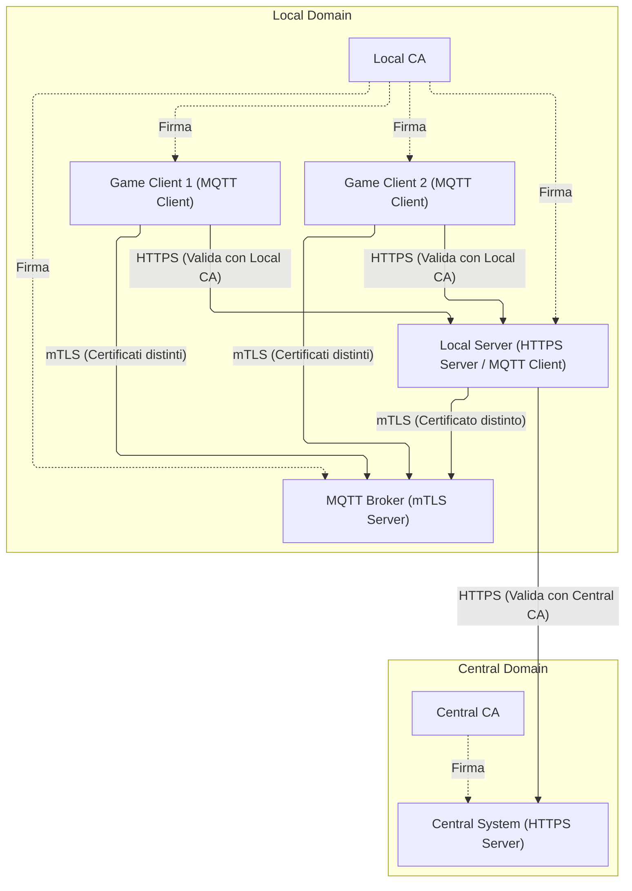

# Architettura dei Certificati e Sicurezza crittografica della Piattaforma

Questo documento descrive in dettaglio la struttura dei certificati, il funzionamento dei sistemi crittografici, le modalità di connessione, le motivazioni dietro l'uso integrato dei protocolli HTTPS e MQTT, e le relative implementazioni software del progetto.

---

## 1. Architettura dei Certificati e Dominio di Rete

La piattaforma implementa una gerarchia di certificati strutturata in due domini di fiducia indipendenti:



### Matrice di Sintesi dei File Crittografici per Componente

| Componente | File nel Container / Classpath | Scopo |
| :--- | :--- | :--- |
| **Central System** | `central-system-https.p12` | Abilitare HTTPS Server (Port 8180) |
| **Local Server** | `local-server-https.p12`<br>`local-truststore.p12`<br>`central-truststore.p12` | Abilitare HTTPS Server (Port 8181)<br>Fidarsi del Broker MQTT locale e dei client connessi<br>Fidarsi del Central System (REST HTTPS) |
| **MQTT Broker** | `ca.crt`<br>`server.crt`<br>`server.key` | Abilitare listener mTLS (Port 8883)<br>Validare i certificati client di emulatori e Local Server |
| **Game Client (Generici)** | `game-client-keystore.p12`<br>`local-truststore.p12` | Autenticarsi al Broker MQTT locale via mTLS<br>Fidarsi del Broker MQTT e del Local Server (HTTPS) |

---

## 2. Sistemi di Crittografia nel Progetto

Il progetto implementa due livelli distinti di sicurezza crittografica:

### A. Sicurezza a Livello Trasporto (Transport Layer Security - TLS)
Viene utilizzato per proteggere le comunicazioni di rete da intercettazioni (eavesdropping) e attacchi Man-in-the-Middle (MitM):
1. **HTTPS (REST)**: Tutte le chiamate API REST tra Client e Local Server, e tra Local Server e Central System sono cifrate tramite HTTPS. I server presentano un certificato, verificato dai client tramite i rispettivi truststore (`local-truststore.p12` e `central-truststore.p12`).
2. **MQTTS (Mutual TLS - mTLS)**: La comunicazione sul broker MQTT avviene su porta protetta 8883. A differenza del TLS semplice (dove solo il server dimostra la sua identità), l'**mTLS** richiede che anche il client presenti un certificato firmato dalla stessa CA del Broker. Questo garantisce crittograficamente l'identità del client senza trasmettere password in chiaro.

### B. Crittografia a Livello Applicativo (Asymmetric Key Signing - JWT)
Le coppie di chiavi private/pubbliche RSA (`private.pem`, `public.pem`, `local-private.pem` e `local-public.pem`) in `infrastructure/tls` **non** sono utilizzate per la sicurezza del trasporto (TLS), ma servono a livello applicativo per la gestione delle sessioni:
1. **Central System**: Utilizza la sua chiave privata per firmare crittograficamente i token JWT rilasciati agli utenti loggati.
2. **Local Server**: Utilizza la corrispondente chiave pubblica del Central System per verificare che il token JWT presentato dall'utente sia integro ed autentico.
3. **Local Server (Local JWT)**: Firma i token JWT emessi localmente per la comunicazione interna ed offline-first.

---

## 3. Flusso dei Canali di Connessione

### Fase 1: Onboarding Dinamico del Dispositivo (Bootstrap)
Quando un Game Client si connette per la prima volta:
1. **Generazione locale**: Il client genera autonomamente una coppia di chiavi RSA a 2048-bit.
2. **Creazione della CSR**: Crea una *Certificate Signing Request* (CSR) specificando come Common Name (CN) il suo `gameId` univoco (es. `client-foosball-1`).
3. **Chiamata di Registrazione**: Il client invia la CSR al Local Server tramite `POST /api/devices/register`. Per superare il problema dell'assenza iniziale del truststore, il client effettua questa chiamata iniziale disabilitando temporaneamente la verifica dell'hostname/CA.
4. **Verifica e Firma**: Il Local Server interroga il database per verificare che il `gameId` sia censito. Se autorizzato, firma la CSR usando la chiave privata della **Local CA** (`ca.key`) e restituisce il certificato client ed il certificato CA in formato PEM.
5. **Generazione dei Keystore**: Il client salva la chiave privata e la catena dei certificati in `client-keystore.p12`, ed il certificato CA in `local-truststore.p12`.

### Fase 2: Connessione MQTT via mTLS
1. Il client si connette all'indirizzo `ssl://mqtt-broker-1:8883`.
2. Durante l'handshake TLS, il client invia il proprio certificato (`client-keystore.p12`).
3. Il Broker Mosquitto valida il certificato usando `ca.crt`.
4. Grazie alla proprietà `use_identity_as_username true`, Mosquitto estrae il CN (es. `client-foosball-1`) e lo imposta come username MQTT per la sessione, verificando le regole ACL di lettura/scrittura.

---

## 4. Scelta dei Protocolli: Perché MQTT e l'Uso Congiunto con HTTPS

La piattaforma utilizza un approccio ibrido **HTTPS + MQTT** per bilanciare consistenza transazionale ed efficienza in tempo reale.

### Perché si usa MQTT per il Gameplay?
* **Paradigma Pub/Sub**: Disaccoppia completamente i client mittenti dai destinatari. Un client pubblica la sua mossa o stato senza doversi preoccupare di quanti altri client o server stiano ascoltando.
* **Basso Overhead e Latenza**: MQTT ha un header piccolissimo (fino a soli 2 byte) rispetto ad HTTP. Questo riduce drasticamente l'uso della banda ed elimina la latenza associata alla creazione ripetuta di connessioni TCP.
* **Notifiche Push in Tempo Reale**: Consente al Local Server di spingere aggiornamenti di stato istantanei ai client connessi, evitando il polling HTTP inefficiente.
* **Resilienza Offline**: MQTT gestisce autonomamente le riconnessioni ed il buffering in caso di micro-disconnessioni della rete locale.

### Perché il Local Server usa sia HTTPS sia MQTT?

| Protocollo | Utilizzato per | Rationale (Perché) |
| :--- | :--- | :--- |
| **HTTPS** (REST) | • Login Utente<br>• Download Catalogo iniziale<br>• Registrazione Dispositivo (CSR)<br>• Sincronizzazione con il Central System | **Sincrono, Transazionale**: Queste operazioni richiedono una connessione diretta request-response, dove il client ha bisogno di una conferma immediata di successo/fallimento (es. credenziali di login corrette, o ricezione del certificato firmato) prima di procedere. |
| **MQTT** (MQTTS) | • Invio stato di gioco live<br>• Eventi gameplay (Gol, Mosse)<br>• Heartbeat (Vitalità dei dispositivi) | **Asincrono, Event-driven**: Il flusso di gioco richiede notifiche rapide, continuo scambio di pacchetti leggeri di telemetria e broadcast a più client contemporaneamente (es. due giocatori che osservano la stessa partita), ottimizzando reattività ed efficienza. |

---

## 5. Dettagli di Implementazione dei Codici

### A. Firma Crittografica della CSR sul Local Server
Nel file [DeviceRegistrationController.java](file:///c:/Users/VLT14/Documents/UNI/PISSIR/Progetto/gamehandler-platform/local-server/src/main/java/com/gameplatform/local/infrastructure/adapters/in/rest/DeviceRegistrationController.java) viene utilizzata la libreria **BouncyCastle** per firmare la richiesta client:
```java
// Estrazione della chiave pubblica dalla CSR
JcaPEMKeyConverter converter = new JcaPEMKeyConverter().setProvider("BC");
PublicKey clientPublicKey = converter.getPublicKey(csr.getSubjectPublicKeyInfo());

// Configurazione del builder del certificato X.509
X509v3CertificateBuilder certBuilder = new JcaX509v3CertificateBuilder(
        issuerX500Name,
        serialNumber,
        notBefore,
        notAfter,
        csr.getSubject(),
        clientPublicKey
);

// Firma del certificato con la chiave privata della CA locale
ContentSigner signer = new JcaContentSignerBuilder("SHA256withRSA").setProvider("BC").build(caPrivateKey);
X509CertificateHolder holder = certBuilder.build(signer);
X509Certificate clientCert = new JcaX509CertificateConverter().setProvider("BC").getCertificate(holder);
```

### B. Richiesta di Certificato ed Inizializzazione lato Client
Nel file [CertificateEnrollmentService.java](file:///c:/Users/VLT14/Documents/UNI/PISSIR/Progetto/gamehandler-platform/game-client-emulator/src/main/java/com/gameplatform/client/infrastructure/security/CertificateEnrollmentService.java), il client genera la richiesta:
```java
// Generazione della coppia di chiavi
KeyPairGenerator kpg = KeyPairGenerator.getInstance("RSA");
kpg.initialize(2048);
KeyPair kp = kpg.generateKeyPair();

// Creazione della CSR
PKCS10CertificationRequestBuilder p10Builder = new JcaPKCS10CertificationRequestBuilder(
        new X500Name("CN=" + gameId + ",O=GamePlatformLocal,C=IT"), 
        kp.getPublic()
);
ContentSigner signer = new JcaContentSignerBuilder("SHA256withRSA").build(kp.getPrivate());
PKCS10CertificationRequest csr = p10Builder.build(signer);
```
Il client invia la CSR via HTTP e, ricevuta la risposta, costruisce i file `.p12` salvandoli localmente.

### C. Configurazione del Client HTTP Sicuro
Nel file [HttpClientHelper.java](file:///c:/Users/VLT14/Documents/UNI/PISSIR/Progetto/gamehandler-platform/game-client-emulator/src/main/java/com/gameplatform/client/infrastructure/security/HttpClientHelper.java), l'HttpClient di Java viene configurato con l'SSLContext contenente il truststore dinamico:
```java
KeyStore trustStore = KeyStore.getInstance("PKCS12");
try (InputStream in = new FileInputStream(truststoreFile)) {
    trustStore.load(in, "changeit".toCharArray());
}
TrustManagerFactory tmf = TrustManagerFactory.getInstance(TrustManagerFactory.getDefaultAlgorithm());
tmf.init(trustStore);

SSLContext sslContext = SSLContext.getInstance("TLS");
sslContext.init(null, tmf.getTrustManagers(), new SecureRandom());

return HttpClient.newBuilder()
        .sslContext(sslContext)
        .build();
```

### D. Configurazione del Client MQTT in mTLS
In [MqttClientAdapter.java](file:///c:/Users/VLT14/Documents/UNI/PISSIR/Progetto/gamehandler-platform/game-client-emulator/src/main/java/com/gameplatform/client/infrastructure/mqtt/MqttClientAdapter.java) (client) e [MqttConfig.java](file:///c:/Users/VLT14/Documents/UNI/PISSIR/Progetto/gamehandler-platform/local-server/src/main/java/com/gameplatform/local/infrastructure/config/MqttConfig.java) (server), la connessione Paho MQTT viene configurata caricando sia `KeyManagerFactory` (keystore client) sia `TrustManagerFactory` (truststore) per mTLS:
```java
SSLContext sslContext = SSLContext.getInstance("TLS");
sslContext.init(
    kmf.getKeyManagers(),   // Permette di presentare il certificato del client (mTLS)
    tmf.getTrustManagers(), // Permette di verificare l'attendibilità del certificato del broker
    new SecureRandom()
);
options.setSocketFactory(sslContext.getSocketFactory());
```
