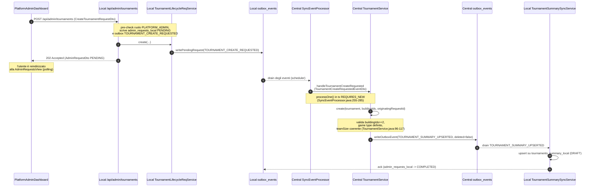

# Gestione dei Tornei


## 1. Visione d'insieme

Un **torneo** è una competizione organizzata da un `PLATFORM_ADMIN` in grado
`SINGLE_ELIMINATION` a eliminazione diretta, ospitata su almeno due edifici
(`buildingIds` con `size >= 2`, `TournamentService.java:96-98`). il ciclo di
vita del torneo è una macchina a stati immutabile
(`Tournament.java:35-46`):

```
DRAFT -> OPEN_REGISTRATION -> IN_PROGRESS -> COMPLETED
                                 ^
        \-- CANCELLED <-- DRAFT ----- OPEN_REGISTRATION -/
```

Le transizioni sono codificate come metodi puri che restituiscono una nuova
istanza (`Tournament.openRegistration()` `Tournament.java:84-90`,
`startProgress()` `Tournament.java:124-130`, `complete(Instant)` `Tournament.java:150-156`,
`cancel()` `Tournament.java:103-109`, `update(name, startsAt)` `Tournament.java:171-177`).
Gli stati inammissibili sollevano `InvalidTournamentStateException`
(`Tournament.java:86, 105, 126, 152, 173`).

Esistono due varianti di torneo:

* **Individuale** `teamBased=false`, `teamSize=1` (`Tournament.java:57` e
  `TournamentService.java:112-114`); il `participantId` coincide con il
  `UserId` del giocatore (`TournamentRegistrationService.java:136`).
* **A squadre** `teamBased=true`, `teamSize>=2` (`TournamentService.java:115-117`);
  viene registrato un `Team` con `teamId` come `participantId`, e la lista
  `members` di `UserId` (`TournamentRegistrationService.java:163-172`).

Il sistema è **multi-nodo**: un **Central Source-of-Truth** produce eventi di
outbox che vengono replicati sui **Local Server** registrati (Outbox Pattern,
`TournamentService.java:55` `SUMMARY_EVENT_TYPE` e
`UserReplicationSchedulerService`). I client JavaFX (Game Client Emulator)
parlano **solo con la Local** del loro edificio per le scritture
`PLATFORM_ADMIN` (es. `POST /api/admin/tournaments` `PlatformAdminTournamentController.java:66-78`)
e con la Local per le letture replicate (`PlayerTournamentSummaryController.java:50-92`).
Il giocamento di un match avviene sulla Local assegnata dal bracket
(`GameSessionService.start(... tournamentMatchId)` `GameSessionService.java:213-401`),
ne produce risultati (outbox `GAME_SESSION_COMPLETED` + `TOURNAMENT_MATCH_COMPLETED`
`GameSessionService.java:515-554`) che il Central riconcilia
(`SyncEventProcessor.handleTournamentMatchCompleted` `SyncEventProcessor.java:447-491`)
per avanzare il bracket (`TournamentBracketService.advanceWinner` `TournamentBracketService.java:287-365`)
e ricalcolare le classifiche (`TournamentStandingsService.recomputeAfterCompletion` `TournamentStandingsService.java:198-237`).

## 2. Modello di dominio

### 2.1 Entità Central

#### `Tournament` (`central-system/.../domain/model/Tournament.java:35-235`)
Campi immutabili (`Tournament.java:36-46`): `tournamentId: TournamentId`,
`name: String`, `gameType: GameType`, `teamBased: boolean`, `teamSize: int`,
`format: TournamentFormat`, `status: TournamentStatus`, `startsAt: Instant`,
`endsAt: Instant`, `createdBy: UserId`, `createdAt: Instant`. Identità =
`tournamentId` (`Tournament.java:227-229`). Invariante costruttore:
`teamSize >= 1`, `teamBased=false -> teamSize==1` (`Tournament.java:56-57`).

Metodi di transizione (tutti restituiscono una nuova istanza, mai mutano il
ricevitore): `openRegistration()` `Tournament.java:84-90`,
`cancel()` `Tournament.java:103-109`, `startProgress()` `Tournament.java:124-130`,
`complete(Instant endedAt)` `Tournament.java:150-156`, `update(name, startsAt)`
`Tournament.java:171-177`.

#### `TournamentMatch` (`central-system/.../domain/model/TournamentMatch.java:25-135`)
Campi (`TournamentMatch.java:26-39`): `matchId: TournamentMatchId`,
`tournamentId: TournamentId`, `round: int` (>=1), `bracketPosition: int` (>=1),
`participantA: String` (non blank), `participantB: String` (nullable, null =
BYE), `buildingId: String` (nullable), `gameId: String` (nullable),
`sessionId: String` (nullable), `winner: String` (nullable),
`status: TournamentMatchStatus`, `scheduledAt`, `playedAt`, `resultData`.
Identità = `matchId` (`TournamentMatch.java:127-129`).

#### `TournamentStanding` (`central-system/.../domain/model/TournamentStanding.java:21-80`)
Campi (`TournamentStanding.java:22-27`): `tournamentId`, `participantId`,
`wins: int`, `losses: int`, `points: int`, `rank: Integer` (nullable fino
alla finale `assignFinalRanks`). Identità composta
`(tournamentId, participantId)` (`TournamentStanding.java:69-74`).

#### `TournamentParticipant` (`central-system/.../domain/model/TournamentParticipant.java:22-74`)
Campi (`TournamentParticipant.java:23-27`): `tournamentId`, `participantId`
(polimorfo: `UserId` se individuale, `TeamId` se squadra), `isTeam: boolean`,
`displayName: String`, `registeredAt: Instant`. Identità composta
`(tournamentId, participantId)` (`TournamentParticipant.java:64-68`).

#### `Team` (`central-system/.../domain/model/Team.java:25-77`)
Campi (`Team.java:26-30`): `teamId: TeamId`, `tournamentId: TournamentId`,
`name: String`, `members: List<UserId>` (copiata difensivamente `Team.java:41`),
`createdAt: Instant`. Identità = `teamId` (`Team.java:69-71`).

### 2.2 Entità Local (repliche read-only)

#### `TournamentSummaryLocal` (`local-server/.../domain/model/TournamentSummaryLocal.java:25-132`)
Campi (`TournamentSummaryLocal.java:27-38`): `tournamentId`, `name`,
`gameType`, `teamBased`, `teamSize`, `status`, `startsAt`, `endsAt`,
`buildingIds`, `participantsCount`, `deleted: boolean` (tombstone,
`TournamentSummaryLocal.java:112-114`), `updatedAt`. Identità =
`tournamentId` (`TournamentSummaryLocal.java:124-126`). Proiezione di
`TOURNAMENT_SUMMARY_UPSERTED` (`TournamentSummaryEventDto.java:36-52`).

#### `TournamentMatchLocal` (`local-server/.../domain/model/TournamentMatchLocal.java:20-134`)
Campi (`TournamentMatchLocal.java:22-31`): `id: TournamentMatchId`,
`tournamentId`, `round`, `bracketPosition`, `participantA`, `participantB`
(nullable), `gameType`, `gameId` (nullable), `status`, `scheduledAt`. **NON**
contiene `buildingId`, `winner`, `playedAt`, `resultData` (commento
`TournamentMatchLocal.java:13-19` — sono central-only). Mutabilità limitata a
`withStatus(newStatus)` (`TournamentMatchLocal.java:104-120`), usato da
`GameSessionService.start/end` (`GameSessionService.java:266, 561`).

#### `TournamentParticipantLocal` (`local-server/.../domain/model/TournamentParticipantLocal.java:18-89`)
Campi (`TournamentParticipantLocal.java:20-25`): `tournamentId`,
`participantId`, `isTeam`, `displayName`, `registeredAt`, `updatedAt`.
Identità composta `(tournamentId, participantId)`
(`TournamentParticipantLocal.java:80-83`).

#### `TeamMemberLocalJpaEntity` (`local-server/.../infrastructure/adapters/out/mysql/entity/TeamMemberLocalJpaEntity.java:20-71`)
Tabella `team_members_local` (`TeamMemberLocalJpaEntity.java:21-23`) con chiave
composta `(tournamentId, teamId, userId)` (`TeamMemberLocalJpaEntity.java:27-37`),
indice `idx_tml_user` su `user_id` (`TeamMemberLocalJpaEntity.java:22`) che
backa il JOIN `myMatches` `TournamentMatchLocalJpaRepository.java:20-29`
(`EXISTS (SELECT tm FROM TeamMemberLocalJpaEntity tm WHERE tm.userId = :userId
AND (tm.teamId = m.participantA OR tm.teamId = m.participantB))`).

### 2.3 Enum

| Enum | File | Valori |
| --- | --- | --- |
| `TournamentStatus` | `TournamentStatus.java:4-8` | `DRAFT`, `OPEN_REGISTRATION`, `IN_PROGRESS`, `COMPLETED`, `CANCELLED` |
| `TournamentMatchStatus` | `TournamentMatchStatus.java:4-8` | `SCHEDULED`, `IN_PROGRESS`, `COMPLETED`, `ABANDONED`, `BYE` |
| `TournamentFormat` | `TournamentFormat.java:4-5` | `SINGLE_ELIMINATION`, `ROUND_ROBIN` |
| `WinCondition` | `WinCondition.java:3-8` | `WIN`, `DRAW`, `ABANDONED`, `TIMEOUT`, `TEAM_VICTORY` |
| `GameType` | `GameType.java:3-10` | `CHESS`, `FOOSBALL`, `DARTS`, `MONOPOLY`, `RISK`, `SLOT_MACHINE`, `ROULETTE` |
| `AdvanceOutcome` | `TournamentBracketService.java:75` | `PARENT_PATCHED`, `WAS_FINAL`, `NO_WINNER` |
| `TournamentId` | `TournamentId.java:3-9` | record `value: String` (UUID) |
| `TournamentMatchId` | `TournamentMatchId.java:3-9` | record `value: String` (UUID) |

## 3. Flow dei messaggi (Mermaid)

### 3.1 Creazione torneo (PLATFORM_ADMIN via Local outbox)



Proof of reference: `PlatformAdminTournamentController.java:66-78` (handler),
`TournamentLifecycleRequestedService.java:46-66` (outbox + admin_requests),
`SyncEventProcessor.java:544-564` (handleTournamentCreateRequested),
`TournamentService.java:91-134` (create),
`TournamentService.java:237-268` (writeOutboxEvent),
`TournamentSummaryEventDto.java:36-60` (payload).

### 3.2 Apertura iscrizioni + iscrizione PLAYER

```mermaid
sequenceDiagram
    autonumber
    participant GUI as PlatformAdminDashboard / TournamentsView
    participant LC as Local /api/admin/tournaments/{id}/open
    participant LREG as Local PlayerTournamentRegistrationController
    participant LO as Local outbox_events
    participant CS as Central SyncEventProcessor
    participant TS as Central TournamentService
    participant TRS as Central TournamentRegistrationService
    participant CO as Central outbox_events
    participant LSYN as Local sync services

    GUI->>LC: POST /api/admin/tournaments/{id}/open
    LC->>LO: writePendingRequest(TOURNAMENT_OPEN_REQUESTED)
    LC-->>GUI: 202 PENDING
    LO-->>CS: drain
    CS->>TS: handleTournamentOpenRequested (TournamentLifecycleRequestedEventDto)
    TS->>TS: open(tournamentId, originatingRequestId)
    Note over TS: t.openRegistration() DRAFT->OPEN_REGISTRATION<br/>(Tournament.java:84-90; TournamentService.java:137-146)
    TS->>CO: writeOutboxEvent(TOURNAMENT_SUMMARY_UPSERTED status=OPEN_REGISTRATION)
    CO-->>LSYN: drain summary (replica aggiornata)
    Note over GUI: nel frattempo PLAYER apre TournamentsView
    GUI->>LREG: POST /api/tournaments/{id}/participants<br/>(RegisterTournamentParticipantDto o vuoto)
    LREG->>LO: writePendingRequest(PARTICIPANT_REGISTER_REQUESTED)
    LREG-->>GUI: 202 PENDING
    LO-->>CS: drain
    CS->>TRS: handleParticipantRegisterRequested
    TRS->>TRS: register(tournamentId, captainId, teamName, teamMemberIds, requestId)
    Note over TRS: verifica status OPEN_REGISTRATION<br/>(TournamentRegistrationService.java:112-114)
    alt Individuale
        TRS->>TRS: registerIndividual (userId == participantId)
    else Squadra
        TRS->>TRS: registerTeam (Team + TeamMembers)
    end
    TRS->>CO: writeOutboxEvent(TOURNAMENT_PARTICIPANTS_UPSERTED)
    opt team-based
        TRS->>CO: writeOutboxEvent(TEAM_MEMBERS_UPSERTED)
    end
    CO-->>LSYN: drain participants (+ team_members) -> repliche local
    LSYN-->>LO: ack (admin_requests_local -> COMPLETED)
```

Proof of reference: `PlatformAdminTournamentController.java:80-107` (open),
`TournamentLifecycleRequestedService.java:27` (`OPEN_EVENT_TYPE`),
`PlayerTournamentRegistrationController.java:46-68` (POST participants),
`SyncEventProcessor.java:572-579` (handleTournamentOpenRequested),
`SyncEventProcessor.java:678-690` (handleParticipantRegisterRequested),
`TournamentRegistrationService.java:107-128` (register dispatch),
`TournamentRegistrationService.java:216-243` (writeParticipantsOutbox),
`TournamentRegistrationService.java:258-286` (writeTeamMembersOutbox).

### 3.3 Schedule bracket + replica matches

```mermaid
sequenceDiagram
    autonumber
    participant GUI as PlatformAdminDashboard
    participant LC as Local /api/admin/tournaments/{id}/schedule
    participant LO as Local outbox_events
    participant CS as Central SyncEventProcessor
    participant TBS as Central TournamentBracketService
    participant TSS as Central TournamentStandingsService
    participant TMOA as Central TournamentMatchOutboxAdapter
    participant CO as Central outbox_events
    participant LSYN as Local TournamentMatchLocalSyncService

    GUI->>LC: POST /api/admin/tournaments/{id}/schedule
    LC->>LO: writePendingRequest(TOURNAMENT_SCHEDULE_REQUESTED)
    LC-->>GUI: 202 PENDING
    LO-->>CS: drain
    CS->>TBS: handleTournamentScheduleRequested -> schedule(tournamentId)
    Note over TBS: format guard SINGLE_ELIMINATION (TournamentBracketService.java:124)<br/>startProgress OPEN_REGISTRATION->IN_PROGRESS (line 132)<br/>sort Participants by registeredAt (line 138-141)
    loop per match round 1 (BYE rows NON emettono outbox)
        TBS->>TBS: persist BYE row (status=BYE, winner=participantA) (line 163-177)
    end
    loop per SCHEDULED match round 1
        TBS->>TMOA: publishScheduled(match, tournament) (line 199)
        TMOA->>CO: OutboxEvent TOURNAMENT_MATCH_SCHEDULED (TournamentMatchOutboxAdapter.java:81-83)
    end
    TBS->>TSS: seedStandings(tournamentId, allParticipantIds) (line 208; TournamentStandingsService.java:159-175)
    CS->>CO: emitSummary(tournamentId, originatingRequestId) (SyncEventProcessor.java:635; TournamentService.java:287-301)<br/>(ritorno che chiude l'admin_request_local)
    CO-->>LSYN: drain TOURNAMENT_MATCH_SCHEDULED
    LSYN->>LSYN: upsert su tournament_matches_local (TournamentMatchLocalSyncService.java:41-60)
    CO-->>LSYN: drain TOURNAMENT_SUMMARY_UPSERTED (status IN_PROGRESS)
```

Proof of reference: `PlatformAdminTournamentController.java:80-107`
(action switch `schedule` `PlatformAdminTournamentController.java:95-96`),
`TournamentLifecycleRequestedService.java:29` (`SCHEDULE_EVENT_TYPE`),
`SyncEventProcessor.java:621-636` (handleTournamentScheduleRequested +
emitSummary), `TournamentBracketService.java:113-215` (schedule body),
`TournamentMatchOutboxAdapter.java:55-84` (publishScheduled + EVENT_TYPE
`TournamentMatchOutboxAdapter.java:41`), `TournamentMatchScheduledEvent.java:22`
(`"TOURNAMENT_MATCH_SCHEDULED"`).

### 3.4 Start match + play + end match + advanceWinner

```mermaid
sequenceDiagram
    autonumber
    participant GUI as TournamentsView (PLAYER)
    participant PLC as Local /api/players/tournaments/matches/{id}/start
    participant GSS as Local GameSessionService.start
    participant MLP as Local tournament_matches_local
    participant MQTT as MQTT broker
    participant GE as Local GamePlay / End match
    participant LO as Local outbox_events
    participant CS as Central SyncEventProcessor
    participant TBS as Central TournamentBracketService
    participant TSS as Central TournamentStandingsService

    GUI->>PLC: POST /api/players/tournaments/matches/{matchId}/start
    PLC->>PLC: valida status==SCHEDULED (PlayerTournamentController.java:128-130)
    PLC->>GSS: start(gameId, gameType, participants, null, tournamentMatchId) (PlayerTournamentController.java:160)
    Note over GSS: validation team_allowed vs partecipanti (GameSessionService.java:233-264)<br/>localMatch.withStatus(IN_PROGRESS) (line 266)
    GSS->>MLP: save(localMatch IN_PROGRESS)
    GSS-->>PLC: GameSession (IN_PROGRESS, bind tournamentMatchId) (GameSessionService.java:343-358)
    PLC-->>GUI: 201 Created GameSessionDto
    GSS->>MQTT: publishState + sessionStart(afterCommit) (GameSessionService.java:384-398)
    Note over GUI: l'utente gioca nella GamePlay view,<br/>preme "End match" con winner
    GUI->>GE: end(sessionId, GameResult con winner)
    GE->>GSS: end(sessionId, result) (GameSessionService.java:404)
    Note over GSS: se tournament, winner non nullo obbligatorio<br/>(GameSessionService.java:425-431)
    GSS->>GSS: session.complete(result, now) (line 424)<br/>flip local match a COMPLETED (line 561)
    GSS->>LO: GAME_SESSION_COMPLETED (outbox) (line 515-524)<br/>+ TOURNAMENT_MATCH_COMPLETED (line 538-554)
    GSS->>MQTT: publishState + sessionEnd (line 454-468)
    LO-->>CS: drain di entrambi gli outbox
    Note over CS: GAME_SESSION_COMPLETED<br/>-> updateAggregatedStatistics<br/>+ projectPlayerStatistics (SyncEventProcessor.java:305-328)
    CS->>CS: TOURNAMENT_MATCH_COMPLETED -> handleTournamentMatchCompleted (SyncEventProcessor.java:362-366, 447-491)
    CS->>TSS: recomputeAfterCompletion(matchId) se COMPLETED (SyncEventProcessor.java:472-474; TournamentStandingsService.java:198-237)
    CS->>TBS: advanceWinner(matchId, winner) (SyncEventProcessor.java:477-478; TournamentBracketService.java:287-365)
    alt outcome WAS_FINAL
        TBS->>TBS: completeIfDone(tournamentId) (SyncEventProcessor.java:481-482; TournamentBracketService.java:377-399)<br/>tournament.complete(now) + assignFinalRanks
    else outcome PARENT_PATCHED
        TBS->>LO: (via TournamentMatchOutboxAdapter.publishScheduled sul parent)<br/>TOURNAMENT_MATCH_SCHEDULED per parent
        Note over TBS: emesso solo se parent ora<br/>ha entrambi i partecipanti<br/>(TournamentBracketService.java:355-361)
    else outcome NO_WINNER
        Note over CS: log.error, salta completamento<br/>(SyncEventProcessor.java:483-486)
    end
    TSS-->>LO: TOURNAMENT_STANDINGS_UPSERTED (replica standings)
```

Proof of reference: `PlayerTournamentController.java:121-164` (startMatch),
`GameSessionService.java:213-401` (start 5-arg),
`GameSessionService.java:404-571` (end), `SyncEventProcessor.java:447-491`
(handleTournamentMatchCompleted), `TournamentBracketService.java:287-365`
(advanceWinner), `TournamentBracketService.java:377-399` (completeIfDone).

### 3.5 Statistiche torneo + standings

```mermaid
sequenceDiagram
    autonumber
    participant GSC as Local GameSessionService.end
    participant LO as Local outbox_events
    participant CS as Central SyncEventProcessor
    participant PSP as Central PlayerStatisticsProjectionService
    participant SR as Central StatisticsRepository<br/>(aggregated_statistics)
    participant PFR as Central player_match_facts
    participant PSR as Central player_statistics
    participant TSS as Central TournamentStandingsService
    participant LSYN as Local tournament_standings_local

    GSC->>LO: GAME_SESSION_COMPLETED (con sessione arricchita:<br/>participants, winnerId, winCondition) (GameSessionService.java:480-512)
    LO-->>CS: drain
    CS->>SR: updateSessionStats (aggregated_statistics) (SyncEventProcessor.java:316; 836-881)
    CS->>PSP: projectPlayerStatistics (SyncEventProcessor.java:324-326, 777-794)
    PSP->>PFR: insert player_match_facts per partecipante
    PSP->>PSR: upsert player_statistics (matchesPlayed, matchesWon)
    CS->>TSS: recomputeAfterCompletion(matchId) (SyncEventProcessor.java:472-474)
    Note over TSS: winner: wins+1, points+3;<br/>loser: losses+1 (TournamentStandingsService.java:215-235)<br/>emette TOURNAMENT_STANDINGS_UPSERTED (line 236)
    TSS-->>LSYN: drain standings snapshot
    LSYN->>LSYN: delete+insert by tournamentId su tournament_standings_local
```

Proof of reference: `GameSessionService.java:480-512` (payload participants +
winnerId + winCondition), `SyncEventProcessor.java:765-794`
(projectPlayerStatistics), `TournamentStandingsService.java:198-237`
(recomputeAfterCompletion), `TournamentStandingsService.java:246-268`
(writeStandingsOutbox).

## 4. Regole e vincoli

### 4.1 Validazione creazione torneo
`TournamentService.create` (`TournamentService.java:91-134`):
- `buildingIds != null && size >= 2` (`TournamentService.java:96-98`)
- nessuna voce blank (`TournamentService.java:99-101`)
- `startsAt != null` (`TournamentService.java:102-104`)
- il `GameType` deve essere presente in `game_definitions` (`TournamentService.java:105-108`)
- se `teamBased == false -> teamSize == 1` (`TournamentService.java:112-114`)
- se `teamBased == true -> teamSize >= 2` (`TournamentService.java:115-117`)
- se `teamBased && !gd.isTeamAllowed()` solleva `InvalidTournamentException`
  (`TournamentService.java:109-111`)
- il `format` viene **forzato** a `SINGLE_ELIMINATION` e lo `status` a `DRAFT`
  indipendentemente dall'input (`TournamentService.java:118-130`).
- DTO valido: `CreateTournamentRequestDto` con `@NotBlank name`, `@NotNull
  gameType`, `@Min(1) teamSize`, `@NotNull startsAt`, `@NotNull @Size(min=2)
  buildingIds` (`CreateTournamentRequestDto.java:11-19`).

### 4.2 Stato transitions
| Transizione | Metodo | Stato richiesto | File:riga |
| --- | --- | --- | --- |
| `DRAFT -> OPEN_REGISTRATION` | `Tournament.openRegistration()` | `DRAFT` | `Tournament.java:84-90` |
| `DRAFT|OPEN_REGISTRATION -> CANCELLED` | `Tournament.cancel()` | `DRAFT` o `OPEN_REGISTRATION` | `Tournament.java:103-109` |
| `OPEN_REGISTRATION -> IN_PROGRESS` | `Tournament.startProgress()` | `OPEN_REGISTRATION` | `Tournament.java:124-130` |
| `IN_PROGRESS -> COMPLETED` | `Tournament.complete(endedAt)` | `IN_PROGRESS` + `endedAt != null` | `Tournament.java:150-156` |
| `DRAFT -> DRAFT` (rename/retarget) | `Tournament.update(name, startsAt)` | `DRAFT` | `Tournament.java:171-177` |

`TournamentService.update` ripristina anche `endsAt = null` (`Tournament.java:175`).
`TournamentService.delete` richiede `status == DRAFT` altrimenti
`InvalidTournamentStateException` (`TournamentService.java:179-181`).

### 4.3 Bracket generation
`TournamentBracketService.schedule` (`TournamentBracketService.java:113-215`):
- `tournamentId` non nullo (`TournamentBracketService.java:115-117`).
- format guard: solo `SINGLE_ELIMINATION` (`TournamentBracketService.java:124-127`).
- `startProgress()` solleva `InvalidTournamentStateException` se non
  `OPEN_REGISTRATION` (idempotency-by-rejection, `TournamentBracketService.java:130-133`).
- partecipanti ordinati per `registeredAt ASC` (`TournamentBracketService.java:138-141`).
- `n < 2` -> `InvalidTournamentStateException` (`TournamentBracketService.java:144-147`).
- `bracketSize = nextPow2(n)`, `byes = bracketSize - n`
  (`TournamentBracketService.java:149-151`); top-seed (prime `byes`
  partecipanti per registration order) ottengono BYE: `participantB = null`,
  `status = BYE`, `winner = participantA`; queste righe vengono persistite
  (`TournamentBracketService.java:161-177`) ma **NON** emettono outbox
  (commento `TournamentBracketService.java:50-55` e `TournamentBracketService.java:176`).
- SCHEDULED pair: `pA = participants[byes + j]` (best rimanente) vs `pB =
  participants[n-1 - j]` (worst rimanente), `bracketPos` incrementale
  (`TournamentBracketService.java:183-201`); per ogni SCHEDULED match viene
  chiamato `tournamentMatchOutboxPort.publishScheduled` (`TournamentBracketService.java:199`).
- Seed standings zero-init per **tutti** i partecipanti (BYE inclusi)
  (`TournamentBracketService.java:205-208`; `TournamentStandingsService.seedStandings:159-175`).
- `nextPow2(n)` (`TournamentBracketService.java:242-248`).

### 4.4 Match play
`GameSessionService.start` overload 5-arg con `tournamentMatchId`
(`GameSessionService.java:213-401`):
- `tournamentMatchLocalRepository.findById` -> `TournamentMatchNotFoundException`
  se mancante (`GameSessionService.java:220-222`).
- `localMatch.status != SCHEDULED` -> `TournamentMatchNotScheduledException`
  (`GameSessionService.java:223-227`).
- `gameDefinitionLocalRepository.findByGameType(gameType)` usato per inferire
  `teamBased` dalla definizione replicata (`GameSessionService.java:233-264`):
  se teamBased então `participants.size() != 2` ->
  `TournamentMatchValidationException` (`GameSessionService.java:238-243`);
  se individuale `participants.size() != 2` (`GameSessionService.java:245-249`)
  e ogni `p` deve comparire in `participantA`/`participantB`
  (`GameSessionService.java:250-263`).
- `tournamentMatchLocalRepository.save(localMatch.withStatus(IN_PROGRESS))`
  (`GameSessionService.java:266`).
- La sessione viene costruita con `tournamentMatchId` e `resolvedTournamentId`
  (`GameSessionService.java:343-358`).
- MQTT `sessionStart` pubblicato `afterCommit`
  (`GameSessionService.java:384-398`).

`GameSessionService.end` (`GameSessionService.java:404-571`):
- Late-arrival: se già `COMPLETED` no-op (`GameSessionService.java:409-411`); se
  `ABORTED` continuo per registrare il risultato (`GameSessionService.java:413`).
- Se `session.tournamentMatchId != null` e `result.winnerId != null` e
  `gameDefinitionLocal.teamAllowed` allora trasforma in `TeamResult` con
  `WinCondition.TEAM_VICTORY` (`GameSessionService.java:416-422`).
- Per le sessioni torneo `winnerId == null` è vietato -> `IllegalStateException`
  (`GameSessionService.java:425-431`).
- Emette outbox `GAME_SESSION_COMPLETED` arricchito con `participants`,
  `winnerId`, `winCondition` (`GameSessionService.java:480-512`) **solo** se non
  era già aborted (`GameSessionService.java:475-476`).
- Aggiunge, per torneo, un secondo outbox `TOURNAMENT_MATCH_COMPLETED` con
  `TournamentMatchResultDto(matchId, winner, resultData, "COMPLETED")`
  (`GameSessionService.java:531-554`) e flippa il `TournamentMatchLocal` a
  `COMPLETED` via `withStatus` (`GameSessionService.java:556-565`).

### 4.5 advanceWinner
`TournamentBracketService.advanceWinner(matchId, winnerId)`
(`TournamentBracketService.java:287-365`):
- `matchId == null` -> `NO_WINNER` (`TournamentBracketService.java:288-290`).
- `effectiveWinner` risolve il `winnerId`: se nullo e `participantB == null`
  (BYE-like) usa `participantA`; altrimenti `NO_WINNER`
  (`TournamentBracketService.java:295-306`).
- `parentRound = match.getRound() + 1`;
  `parentBracketPosition = (bracketPosition + 1) / 2`
  (`TournamentBracketService.java:308-309`).
- `totalRounds = 31 - Integer.numberOfLeadingZeros(bracketSize)` dove
  `bracketSize = nextPow2(participantCount)` (`TournamentBracketService.java:312-314`).
- se `parentRound > totalRounds` -> restituisce `WAS_FINAL`
  (`TournamentBracketService.java:315-317`): il match era la finale.
- se il parent non esiste lo crea con `participantA = winner`,
  `participantB = null`, `status = SCHEDULED`, **senza** emettere outbox
  (`TournamentBracketService.java:324-334` — solo un partecipante non scheduleable).
- se esiste, patcha il primo slot libero (`participantA` se nullo,
  altrimenti `participantB`) (`TournamentBracketService.java:336-353`); se ora
  entrambi i partecipanti sono non nulli -> `publishScheduled(parent, tournament)`
  (`TournamentBracketService.java:356-360`).
- ritorna `PARENT_PATCHED` (`TournamentBracketService.java:364`).

`completeIfDone(tournamentId)` (`TournamentBracketService.java:377-399`):
- `findByIdForUpdate` (`TournamentBracketService.java:381`); no-op se
  `status == COMPLETED` (`TournamentBracketService.java:386-388`).
- se rimane almeno un match `SCHEDULED`/`IN_PROGRESS` ritorna
  (`TournamentBracketService.java:390-394`).
- altrimenti `tournament.complete(Instant.now(clock))`, salva, e chiama
  `tournamentStandingsService.assignFinalRanks(tournamentId)`
  (`TournamentBracketService.java:396-398`).

## 5. Come creare un torneo (Passo a passo)

### 5.1 Prerequisiti
1. L'utente autenticato ha il ruolo `PLATFORM_ADMIN` (middleware
   `@PreAuthorize("hasRole('PLATFORM_ADMIN')")` su
   `PlatformAdminTournamentController.java:40` e
   `TournamentController.java:115`).
2. Almeno due edifici registrati nel sistema: il front-end costruisce un body
   con `buildingIds` di lunghezza >= 2 (`PlatformAdminDashboard.java:301`;
   `CreateTournamentRequestDto.java:18` con `@Size(min=2)`).
3. La `game_definitions_local` (replica della centrale `game_definitions`)
   contiene una definizione per il `GameType` scelto
   (`TournamentService.java:106-108`).
4. Un `PLATFORM_ADMIN` di esempio è quello preconfigurato dallo script
   `setup-users.ps1` (root `gamehandler-platform`).

### 5.2 Creazione via GUI
1. Login come `PLATFORM_ADMIN` nel Game Client Emulator e apri la vista
   **`PlatformAdminDashboard`** (`PlatformAdminDashboard.java:65`).
2. Localizza la sezione titolata **"Tournaments — lifecycle editor (DRAFT
   only for PUT/DELETE)"** (`PlatformAdminDashboard.java:203`).
3. Nell'area di testo compaiono i default (`PlatformAdminDashboard.java:73-74`):
   ```json
   {
     "name": "Test Tour",
     "gameType": "DARTS",
     "teamBased": false,
     "teamSize": 1,
     "startsAt": "2030-01-01T00:00:00Z",
     "buildingIds": ["building-1", "building-2"]
   }
   ```
   I campi sono quelli del record `CreateTournamentRequestDto` (`CreateTournamentRequestDto.java:11-19`):
   `name` (NotBlank), `gameType` (uno dei valori `GameType.java:3-10`),
   `teamBased` boolean, `teamSize` (>=1), `startsAt` (ISO-8601), `buildingIds`
   (>=2 voci). Modificali a piacere.
4. Premi il bottone **"Create tournament (POST)"** (`PlatformAdminDashboard.java:115-117`):
   clicked handler = `createTournament()` (`PlatformAdminDashboard.java:287-318`)
   che esegue `ApiClient.instance().post("/api/admin/tournaments", body, AdminRequestDto.class)`
   (`PlatformAdminDashboard.java:309`).
5. La Local risponde con **HTTP 202 Accepted** + `AdminRequestDto` con
   `status=PENDING` (`PlatformAdminTournamentController.java:67, 77`).
6. La Local scrive atomicamente una riga in `admin_requests_local` e una in
   `outbox_events` con `EVENT_TYPE = "TOURNAMENT_CREATE_REQUESTED"`
   (`TournamentLifecycleRequestedService.java:65`).
7. La dashboard cambia `statusLabel` in `"Tournament PENDING (reqId=...) →
   polling Admin Requests"` (`PlatformAdminDashboard.java:312`) e chiama
   `onNavigateToRequests.run()` (`PlatformAdminDashboard.java:313`), navigando
   alla **`AdminRequestsView`** che fa polling di `GET /api/admin/requests`
   ogni **8 s** (`AdminRequestsView.java:38, 55`).
8. Sul Central, lo scheduler di `UserReplicationSchedulerService` drena
   l'evento, `SyncEventProcessor.handleTournamentCreateRequested`
   (`SyncEventProcessor.java:544-564`) invoca `TournamentService.create` con
   `originatingRequestId = dto.requestId()`
   (`SyncEventProcessor.java:563`); `TournamentService.create`
   (`TournamentService.java:91-134`) valida, persiste il `Tournament` DRAFT,
   le righe in `tournament_buildings`, e scrive l'outbox `TOURNAMENT_SUMMARY_UPSERTED`
   (`TournamentService.java:237-268`).
9. La replica del `TOURNAMENT_SUMMARY_UPSERTED` alla Local avviene via
   `UserReplicationSchedulerService.replicateUsers()` (prova end-to-end in
   `C1TournamentCreatePropagatesToLocalTest.java:53-64`): la riga
   `tournaments_summary_local` è `status = "DRAFT"`.
10. Il sync handler della Local chiude la `admin_requests_local` a
    `COMPLETED` (request id correlato dal `originatingRequestId` del summary
    upsert — `SyncEventProcessor.java:130-140` commento BUG-SCHEDULE-REQUEST-ID).
11. Il polling su **`AdminRequestsView`** mostrerà la card verde con `✓
    COMPLETED` (`AdminRequestsView.java:31-32`).

### 5.3 Apertura iscrizioni
1. Copia il `tournamentId` dal result dell'admin request (o dall'elenco della
   `TournamentsView`).
2. In `PlatformAdminDashboard` sezione lifecycle (TextField `tournamentId`
   `PlatformAdminDashboard.java:122-124`), incolla l'id.
3. Premi il bottone **"Open"** (`PlatformAdminDashboard.java:125` ->
   `lifecycleButton("open")` `PlatformAdminDashboard.java:401-406` =>
   `lifecycle(id, "open")` `PlatformAdminDashboard.java:321-332`)
   che invoca `ApiClient.instance().postEmpty("/api/admin/tournaments/"
   + id + "/open", AdminRequestDto.class)` (`PlatformAdminDashboard.java:325`).
4. La Local mappa l'action `"open"` nell'evento `"TOURNAMENT_OPEN_REQUESTED"`
   (`PlatformAdminTournamentController.java:89-90`) e usa
   `TournamentLifecycleRequestedService.lifecycle`
   (`TournamentLifecycleRequestedService.java:46-66`) che pre-controlla il
   ruolo `PLATFORM_ADMIN` (`TournamentLifecycleRequestedService.java:25,56`)
   e scrive la riga admin-request + outbox.
5. Il Central chiama `TournamentService.open`
   (`SyncEventProcessor.java:572-579` -> `TournamentService.java:136-146`),
   `tournament.openRegistration()` (`Tournament.java:84-90`), salva e
   emette `TOURNAMENT_SUMMARY_UPSERTED` con `status = OPEN_REGISTRATION`
   (`TournamentService.java:55, 237-268`). Replica Local -> la
   `tournaments_summary_local` si aggiorna a `OPEN_REGISTRATION`.
6. La `admin_requests_local` si chiude su `COMPLETED` (la summary upsert
   porta il `originatingRequestId`).

### 5.4 Iscrizione PLAYER
1. Login come `PLAYER` e apri la vista **`TournamentsView`**
   (`TournamentsView.java:50`). Premi **"Refresh tournaments"**
   (`TournamentsView.java:145-147`) per popolare la lista sinistra
   (`flow.listTournaments()` `PlayerTournamentFlow.java:55-57` ->
   `GET /api/tournaments` `PlayerTournamentSummaryController.java:50-64`).
2. Seleziona un torneo in `OPEN_REGISTRATION` dalla lista sinistra; vengono
   mostrati standings / bracket / participants nel detail centrale
   (`TournamentsView.java:242-269`; `PlayerTournamentFlow.getTournament` ->
   `GET /api/tournaments/{id}` `PlayerTournamentSummaryController.java:66-71`).
3. **Registrazione individuale** (solo se `teamBased == false`): premi il
   bottone verde **"Register me (self)"**
   (`TournamentsView.java:149-151`). Handler `registerSelf()`
   (`TournamentsView.java:273-293`) => `flow.registerSelf(tournamentId)`
   (`PlayerTournamentFlow.java:107-109`)
   => `POST /api/tournaments/{id}/participants` con body vuoto
   (`PlayerTournamentFlow.java:99-104`;
   `PlayerTournamentRegistrationController.java:46-68`).
4. **Registrazione squadra** (solo se `teamBased == true`): premi il bottone
   viola **"Register team"** (`TournamentsView.java:153-155`). Handler
   `registerTeam()` (`TournamentsView.java:295-318`) apre un
   `TextInputDialog` per il nome (`TournamentsView.java:301-304`) e invia un
   `RegisterTournamentParticipantDto(teamName, List.of())` via
   `flow.register(tournamentId, body)` (`TournamentsView.java:309`,
   `PlayerTournamentFlow.java:97-104`). NB: la GUI demo usa `List.of()` come
   teamMembers, la validazione Central su `TournamentRegistrationService.registerTeam`
   richiederebbe `teamMembers.size() == teamSize`
   (`TournamentRegistrationService.java:154-159`) — in produzione il form
   andrebbe esteso; il `RegisterTournamentParticipantDto` è
   `record (String teamName, List<String> teamMembers)`
   (`RegisterTournamentParticipantDto.java:5-8`).
5. La Local risponde con HTTP 202 + `AdminRequestDto` PENDING
   (`PlayerTournamentRegistrationController.java:67`).
6. La Local scrive la `admin_requests_local` + outbox
   `PARTICIPANT_REGISTER_REQUESTED`.
7. Il Central: `SyncEventProcessor.handleParticipantRegisterRequested`
   (`SyncEventProcessor.java:678-690`) -> `TournamentRegistrationService.register`
   (`TournamentRegistrationService.java:107-128`) che esegue
   `registerIndividual` (`TournamentRegistrationService.java:130-144`) oppure
   `registerTeam` (`TournamentRegistrationService.java:146-173`) e insegue
   `TOURNAMENT_PARTICIPANTS_UPSERTED`
   (`TournamentRegistrationService.java:216-243`) e, per team,
   `TEAM_MEMBERS_UPSERTED` (`TournamentRegistrationService.java:258-286`).
8. Le rispettive tabelle replicate si popolano (`team_members_local`,
   `tournament_participants_local`), e la `admin_requests_local` Player
   si chiude a `COMPLETED`.

### 5.5 Schedule bracket
1. Torna come `PLATFORM_ADMIN` al **`PlatformAdminDashboard`**, sezione
   lifecycle, TextField `tournamentId` con l'id del torneo ormai popolato di
   partecipanti.
2. Premi il bottone **"Schedule"** (`PlatformAdminDashboard.java:127` =>
   `lifecycleButton("schedule")` => `lifecycle(id, "schedule")`
   `PlatformAdminDashboard.java:321-332`), `POST
   /api/admin/tournaments/{id}/schedule`
   (`PlatformAdminTournamentController.java:80-107`; action switch
   `PlatformAdminTournamentController.java:95-96`).
3. La Local scrive outbox `TOURNAMENT_SCHEDULE_REQUESTED`
   (`TournamentLifecycleRequestedService.java:29`).
4. Sul Central `SyncEventProcessor.handleTournamentScheduleRequested`
   (`SyncEventProcessor.java:621-636`) invoca
   `TournamentBracketService.schedule(tournamentId)`
   (`TournamentBracketService.java:113-215`) poi
   `EmitTournamentSummaryUseCase.emitSummary(tournamentId, dto.requestId())`
   (`SyncEventProcessor.java:635`; `TournamentService.java:287-301`) per
   chiudere l'admin request (vedi commento BUG-SCHEDULE-REQUEST-ID
   `SyncEventProcessor.java:130-140`). Il `TournamentMatchOutboxAdapter`
   emette `TOURNAMENT_MATCH_SCHEDULED` per ogni match SCHEDULED round 1
   (`TournamentMatchOutboxAdapter.java:55-84`; event type
   `TournamentMatchOutboxAdapter.java:41`).
5. Sulla Local, `TournamentMatchLocalSyncService.applyEvents` legge i
   `TournamentMatchScheduledDto` (`TournamentMatchLocalSyncService.java:41-60`)
   e upserta `tournament_matches_local` (idempotente per PK `matchId`).
6. Il seed standings viene inizializzato a zero per tutti i partecipanti
   (`TournamentBracketService.java:205-208`; `TournamentStandingsService.java:159-175`).

### 5.6 Start match (PLAYER)
1. Login come `PLAYER`, apri **`TournamentsView`**, premi il bottone
   arancione **"My matches / Start"** (`TournamentsView.java:157-159`). Handler
   `loadMyMatches()` (`TournamentsView.java:322-333`) =>
   `flow.myMatches()` (`PlayerTournamentFlow.java:112-114`) =>
   `GET /api/players/tournaments/me/matches`
   (`PlayerTournamentController.java:67-114`). La query JPQL risolve le
   appartenenze al team via `EXISTS` su `team_members_local`
   (`TournamentMatchLocalJpaRepository.java:20-29`).
2. Seleziona un match `SCHEDULED` dalla lista "My matches (SCHEDULED)"
   (`TournamentsView.java:170-180`) e premi il bottone verde **"Start
   selected match"** (`TournamentsView.java:161-163`). Handler
   `startSelectedMatch()` (`TournamentsView.java:335-354`) =>
   `flow.startMatch(matchId, match.gameId())` (`PlayerTournamentFlow.java:128-134`)
   => `POST /api/players/tournaments/matches/{matchId}/start?gameId=...`
   (`PlayerTournamentController.java:121-164`).
3. La Local:
   - `tournamentMatchLocalRepository.findById(...)` (404 se assente,
     `PlayerTournamentController.java:125-126`).
   - controlla `local.status == SCHEDULED` altrimenti
     `TournamentMatchNotScheduledException` (409,
     `PlayerTournamentController.java:128-131`).
   - risolve il `gameId` dal match locale o dal query param
     (`PlayerTournamentController.java:135-142`).
   - costruisce `participants` da `participantA`/`participantB`
     (`PlayerTournamentController.java:148-154`).
   - chiama `gameSessionService.start(gameId, gameType, participants, null,
     tournamentMatchId)` (`PlayerTournamentController.java:160`;
     `GameSessionService.java:213-401`).
4. La sessione viene creata IN_PROGRESS (bind tournament) e
   `tournament_matches_local.status` passa a `IN_PROGRESS`
   (`GameSessionService.java:266`).
5. Vengono pubblicati su MQTT `GAME_STATE` + `GAME_SESSION_STARTED` in
   `afterCommit` (`GameSessionService.java:384-398`; gli argomenti topic sono
   `MqttTopics.sessionStart(buildingId, gameId)`).
6. La Local ritorna `201 Created` + `GameSessionDto`
   (`PlayerTournamentController.java:163`).

### 5.7 End match (PLAYER)
1. L'utente passa alla GamePlay view del client, gioca la partita, e preme
   "End match" fornendo un `GameResult` con `winnerId` non nullo.
2. Il client chiama l'endpoint di end session sulla Local
   (`GameSessionService.end` `GameSessionService.java:404-571`).
3. La Local:
   - carica la sessione; se già `COMPLETED` no-op; se `ABORTED` late-arrival
     è ammesso (`GameSessionService.java:405-413`).
   - se la sessione è torneo, definizione team_allowed e il winner non è nullo,
     trasforma `GameResult` in `TeamResult(null, null, TeamId, TEAM_VICTORY)`
     (`GameSessionService.java:416-422`).
   - `session.complete(result, Instant.now)` (`GameSessionService.java:424`);
     per torneo `winnerId` non nullo è obbligatorio, altrimenti
     `IllegalStateException` (`GameSessionService.java:425-431`).
   - salva la sessione e rilascia il game machine se non aborted
     (`GameSessionService.java:432-442`).
   - pubblica MQTT `sessionEnd` (`GameSessionService.java:454-468`).
   - **se non aborted** scrive due outbox: `GAME_SESSION_COMPLETED`
     (`GameSessionService.java:515-524`, `EventParams` arricchiti con
     `participants`, `winnerId`, `winCondition` in `GameSessionService.java:480-512`)
     e, per torneo, `TOURNAMENT_MATCH_COMPLETED` con
     `TournamentMatchResultDto(matchId, winner, resultData, "COMPLETED")`
     (`GameSessionService.java:538-554`).
   - flip del `TournamentMatchLocal` locale a `COMPLETED`
     (`GameSessionService.java:556-565`).

### 5.8 Advance bracket + standings
1. Lo scheduler di sync drena i due outbox dalla Local al Central
   (`SyncEventProcessor.processOne` `SyncEventProcessor.java:255-285`):
   - `GAME_SESSION_COMPLETED` (line 305-328): aggiorna `aggregated_statistics`
     + proietta `player_match_facts`/`player_statistics`
     (`SyncEventProcessor.java:324-326, 765-794`).
   - `TOURNAMENT_MATCH_COMPLETED` (line 362-366): chiama
     `handleTournamentMatchCompleted` (`SyncEventProcessor.java:447-491`):
     i. `tournamentMatchRepository.findByIdForUpdate(matchId)` (404 ->
        `IllegalStateException`, `SyncEventProcessor.java:456-458`).
     ii. ricostruisce il `TournamentMatch` con `status = ABANDONED` (?) o
        `COMPLETED`, `winner = dto.winner()`, `playedAt = now`, salva
        (`SyncEventProcessor.java:460-469`).
     iii. se `COMPLETED` -> `TournamentStandingsService.recomputeAfterCompletion`
          (`SyncEventProcessor.java:472-474`; `TournamentStandingsService.java:198-237`):
          winner `wins + 1`, `points + 3`; loser (se non null) `losses + 1`.
          Emette `TOURNAMENT_STANDINGS_UPSERTED`
          (`TournamentStandingsService.java:236, 246-268`).
     iv. `AdvanceOutcome outcome = tournamentBracketService.advanceWinner(matchId,
         dto.winner())` (`SyncEventProcessor.java:477-478`).
     v.  se `WAS_FINAL` -> `tournamentBracketService.completeIfDone(tournamentId)`
         (`SyncEventProcessor.java:481-482`): quando non ci sono più match `SCHEDULED`/`IN_PROGRESS`
         (`TournamentBracketService.java:390-394`), il torneo passa a `COMPLETED`
         e `assignFinalRanks` ordina per `points desc, wins desc, participantId asc`
         assegnando `rank = 1, 2, ...` (`TournamentStandingsService.java:279-299`).
     vi. se `PARENT_PATCHED`: round successivo match generato/patchato; quando il
         parent è completo (entrambi i `participantX`) `publishScheduled` emette
         un nuovo `TOURNAMENT_MATCH_SCHEDULED` per il match del round successivo
         (`TournamentBracketService.java:356-360`; viene poi replicato alla Local
         che lo rende visibile come nuovo match `SCHEDULED`).
     vii. se `NO_WINNER`: log.error, il torneo resta `IN_PROGRESS`
          (`SyncEventProcessor.java:483-486`).
2. Lato Local, il `TOURNAMENT_STANDINGS_UPSERTED` viene applicato come
   delete+insert by `tournamentId` su `tournament_standings_local` (usato
   dal detail view `PlayerTournamentSummaryController.java:73-78`).

### 5.9 Statistiche
1. `GAME_SESSION_COMPLETED` con payload arricchito (`participants`, `winnerId`,
   `winCondition`, `sessionId`) entra nel `SyncEventProcessor`
   (`SyncEventProcessor.java:305-328`).
2. `projectPlayerStatistics` (`SyncEventProcessor.java:777-794`) estrae
   `sessionId`, `participants`, `winnerId`, `winCondition` e chiama
   `PlayerStatisticsProjectionService.onGameSessionCompleted(...)` che scrive
   una riga di `player_match_facts` per ogni partecipante e upsert
   `player_statistics` (matchesPlayed/matchesWon).
3. `aggregated_statistics` per `(buildingId, gameType, periodStart)` viene
   incrementato: `totalSessions += 1`, `totalDurationSeconds +=
   durationSeconds` (`SyncEventProcessor.java:836-881`).
4. Il flow end-to-end è validato da `TournamentFlowWithPlayerStatisticsIT`
   (`TournamentFlowWithPlayerStatisticsIT.java:69`): dopo il completamento del
   torneo 4-player CHESS, `aggregated_statistics.total_sessions == 3`,
   `player_statistics` del campione = `matchesPlayed=2, matchesWon=2`
   (`TournamentFlowWithPlayerStatisticsIT.java:53-59`).
5. Le standings del torneo (con `rank` finale) sono consultabili:
   - dal client via `GET /api/tournaments/{id}/standings` (Local detail view
     `PlayerTournamentSummaryController.java:73-78`), implementato
     central-side come `TournamentController.java:184-187` ->
     `TournamentStandingsService.getStandings` (`TournamentStandingsService.java:97-100`).
   - il sorting in `buildStandingsSnapshot` è `points desc, wins desc,
     participantId asc` (`TournamentStandingsService.java:128-141`).
6. Player history personale via GET
   `/api/players/me/matches/history[?gameType=...]` (vista
   `MyMatchesView.java:53, 125-127`) — proiezione `player_match_facts`.

## 6. Endpoint REST

### 6.1 Central (`central-system/.../infrastructure/adapters/in/rest/`)

| Metodo | Path | Ruolo | Descrizione | File:riga |
| --- | --- | --- | --- | --- |
| POST | `/api/tournaments` | PLATFORM_ADMIN | Crea torneo DRAFT (direct branch) | `TournamentController.java:114-132` |
| POST | `/api/tournaments/{id}/open` | PLATFORM_ADMIN | DRAFT -> OPEN_REGISTRATION | `TournamentController.java:134-138` |
| POST | `/api/tournaments/{id}/cancel` | PLATFORM_ADMIN | DRAFT/OPEN -> CANCELLED | `TournamentController.java:140-144` |
| PUT  | `/api/tournaments/{id}` | PLATFORM_ADMIN | Update (DRAFT only) | `TournamentController.java:146-153` |
| DELETE | `/api/tournaments/{id}` | PLATFORM_ADMIN | Delete (DRAFT only) | `TournamentController.java:155-160` |
| GET | `/api/tournaments?status=` | authenticated | List, filter by status | `TournamentController.java:162-169` |
| GET | `/api/tournaments/{id}` | authenticated | Detail | `TournamentController.java:171-176` |
| POST | `/api/tournaments/{id}/schedule` | PLATFORM_ADMIN | Bracket generation OPEN -> IN_PROGRESS | `TournamentController.java:178-182` |
| GET | `/api/tournaments/{id}/standings` | authenticated | Standings snapshot | `TournamentController.java:184-187` |
| GET | `/api/tournaments/{id}/matches` | authenticated | Bracket matches list | `TournamentController.java:189-192` |
| POST | `/api/tournaments/{id}/participants` | PLAYER / PLATFORM_ADMIN | Register participant (direct branch) | `TournamentRegistrationController.java:53-60` |
| DELETE | `/api/tournaments/{id}/participants` | PLAYER / PLATFORM_ADMIN | Unregister current user | `TournamentRegistrationController.java:62-69` |
| GET | `/api/tournaments/{id}/participants` | authenticated | List participants | `TournamentRegistrationController.java:71-74` |

### 6.2 Local (`local-server/.../infrastructure/adapters/in/rest/`)

| Metodo | Path | Ruolo | Descrizione | File:riga |
| --- | --- | --- | --- | --- |
| POST | `/api/admin/tournaments` | PLATFORM_ADMIN | Async create via outbox `TOURNAMENT_CREATE_REQUESTED` -> 202 `AdminRequestDto` | `PlatformAdminTournamentController.java:66-78` |
| POST | `/api/admin/tournaments/{id}/{action}` | PLATFORM_ADMIN | `action` in {open, cancel, schedule} -> 202 `AdminRequestDto` | `PlatformAdminTournamentController.java:80-107` |
| PUT | `/api/admin/tournaments/{id}` | PLATFORM_ADMIN | Async update (DRAFT only lato Central) -> 202 | `PlatformAdminTournamentController.java:109-121` |
| DELETE | `/api/admin/tournaments/{id}` | PLATFORM_ADMIN | Async delete (DRAFT only lato Central) -> 202 | `PlatformAdminTournamentController.java:123-133` |
| POST | `/api/tournaments/{id}/participants` | PLAYER / PLATFORM_ADMIN | Async register (>202 AdminRequestDto) | `PlayerTournamentRegistrationController.java:46-68` |
| GET | `/api/tournaments?status=` | authenticated | List replica locale `tournaments_summary_local` | `PlayerTournamentSummaryController.java:50-64` |
| GET | `/api/tournaments/{id}` | authenticated | Detail aggregato (summary + standings + matches + participants) | `PlayerTournamentSummaryController.java:66-71` |
| GET | `/api/tournaments/{id}/standings` | authenticated | Standings locale | `PlayerTournamentSummaryController.java:73-78` |
| GET | `/api/tournaments/{id}/matches` | authenticated | Matches locale (bracket) | `PlayerTournamentSummaryController.java:80-85` |
| GET | `/api/tournaments/{id}/participants` | authenticated | Participants locali | `PlayerTournamentSummaryController.java:87-92` |
| GET | `/api/players/tournaments/me/matches` | PLAYER / PLATFORM_ADMIN | SCHEDULED matches riferiti all'utente (JOIN team_members_local via EXISTS) | `PlayerTournamentController.java:67-114` |
| POST | `/api/players/tournaments/matches/{matchId}/start?gameId=` | PLAYER / PLATFORM_ADMIN | Avvia GameSession torneo (bind tournamentMatchId) -> 201 `GameSessionDto` | `PlayerTournamentController.java:121-164` |
| GET | `/api/admin/requests` | PLAYER / PLATFORM_ADMIN | Polling admin_requests (filtra per actingUserId) | `AdminRequestsView.java:38, 55` |

## 7. Event types outbox

| Event type | Producer (file:riga) | Consumer / handler (file:riga) | Descrizione |
| --- | --- | --- | --- |
| `TOURNAMENT_CREATE_REQUESTED` | `TournamentLifecycleRequestedService.java:65` (Local admin use case) | `SyncEventProcessor.java:377-381, 544-564` | Crea DRAFT |
| `TOURNAMENT_OPEN_REQUESTED` | `TournamentLifecycleRequestedService.java:27` | `SyncEventProcessor.java:382-386, 572-579` | Apertura iscrizioni |
| `TOURNAMENT_CANCEL_REQUESTED` | `TournamentLifecycleRequestedService.java:28` | `SyncEventProcessor.java:387-391, 587-594` | Cancellazione |
| `TOURNAMENT_SCHEDULE_REQUESTED` | `TournamentLifecycleRequestedService.java:29` | `SyncEventProcessor.java:392-396, 621-636` | Schedule bracket + emit summary |
| `TOURNAMENT_UPDATE_REQUESTED` | `UpdateTournamentRequestedService` (Local) | `SyncEventProcessor.java:397-401, 644-652` | Update DRAFT |
| `TOURNAMENT_DELETE_REQUESTED` | `DeleteTournamentRequestedService` (Local) | `SyncEventProcessor.java:402-406, 660-667` | Delete DRAFT (tombstone) |
| `PARTICIPANT_REGISTER_REQUESTED` | `PlayerTournamentRegistrationController.java:59-66` via Local use case | `SyncEventProcessor.java:407-411, 678-690` | Iscrizione PLAYER |
| `TOURNAMENT_SUMMARY_UPSERTED` | `TournamentService.java:55` + `TournamentBracketService.schedule` indiretto via `emitSummary` `TournamentService.java:289-301` | `TournamentSummarySyncService` (Local) — replica `tournaments_summary_local` | Snapshot torneo (status, buildings, count) |
| `TOURNAMENT_PARTICIPANTS_UPSERTED` | `TournamentRegistrationService.java:63` | `TournamentParticipantsLocalSyncService` -> `tournament_participants_local` | Snapshot participants |
| `TEAM_MEMBERS_UPSERTED` | `TournamentRegistrationService.java:64` | `TeamMembersLocalSyncService` -> `team_members_local` (`TeamMemberLocalJpaEntity.java:21`) | Membership team->user |
| `TOURNAMENT_MATCH_SCHEDULED` | `TournamentMatchOutboxAdapter.java:41, 81-83` | `TournamentMatchLocalSyncService.java:30, 41-60` -> `tournament_matches_local` | Replica match per la Local assegnata |
| `TOURNAMENT_MATCH_COMPLETED` | `GameSessionService.java:538-554` (Event type `TournamentMatchCompletedEvent.java:10`) | `SyncEventProcessor.java:362-366, 447-491` | Match finito -> advanceWinner + standings |
| `GAME_SESSION_COMPLETED` | `GameSessionService.java:515-524` (Event type `GameSessionCompletedEvent.java:9`) | `SyncEventProcessor.java:305-328` | Stats aggregated_statistics + player_match_facts/player_statistics |
| `GAME_SESSION_ABORTED` | `GameSessionService` (path abort) — `SessionAbortHelper` | `SyncEventProcessor.java:329-338` | Stats aborted |
| `ROLE_ASSIGNMENT_REQUESTED` | `PlatformAdminUserController` (Local) | `SyncEventProcessor.java:367-371, 502-509` | (Solo menzionato qui perché tocca `UpdateUserUseCase.updateUser` con roles — fuori flow tornei) |

## 8. Testes E2E / IT

| Test | File | Copertura |
| --- | --- | --- |
| `C1TournamentCreatePropagatesToLocalTest` | `e2e-tests/.../localcentral/C1TournamentCreatePropagatesToLocalTest.java:32` | `TournamentService.create` -> outbox `TOURNAMENT_SUMMARY_UPSERTED` PENDING -> `UserReplicationSchedulerService.replicateUsers` drena -> riga `tournaments_summary_local` con `status=DRAFT` (`C1TournamentCreatePropagatesToLocalTest.java:36-64`). |
| `C2TournamentPlayReturnsToCentralTest` | `e2e-tests/.../localcentral/C2TournamentPlayReturnsToCentralTest.java:55` | Flow cross-modulo: `create -> open -> register 4 -> schedule` (Central) -> replica `TOURNAMENT_MATCH_SCHEDULED` -> play di un match sulla Local via `GameSessionService.start/end` -> drain `GAME_SESSION_COMPLETED`+`TOURNAMENT_MATCH_COMPLETED` -> `advanceWinner` crea round-2 parent; assert bracket avanzato (`C2TournamentPlayReturnsToCentralTest.java:58-80` e note file:riga `34-53`). |
| `TournamentFlowEndToEndIT` | `central-system/.../TournamentFlowEndToEndIT.java:69` | Lifecycle bracket H2 4-player CHESS: schedule -> 2 round-1 SCHEDULED -> `completeMatch` di entrambi -> round-2 parent popolato + 3 outbox `TOURNAMENT_MATCH_SCHEDULED` -> complete finale -> torneo `COMPLETED` + standings ranks `1,2,3,4` (`TournamentFlowEndToEndIT.java:157-203`). Secondo test: abbandono match `ABANDONED` con walkover winner -> avanzamento e ranking `1,2,3,4` (`TournamentFlowEndToEndIT.java:205-240`). |
| `TournamentFlowWithPlayerStatisticsIT` | `central-system/.../TournamentFlowWithPlayerStatisticsIT.java:69` | Stesso lifecycle FASE 6 + proiezione statistiche: per ogni match completato emette il `GAME_SESSION_COMPLETED` arricchito; assertion su `aggregated_statistics.total_sessions == 3`, `player_statistics` campione `matchesPlayed=2, matchesWon=2`, runner-up `matchesPlayed=2, matchesWon=1`, semi-finalisti `matchesPlayed=1, matchesWon=0`, una riga `player_match_facts` per (session, participant) (`TournamentFlowWithPlayerStatisticsIT.java:53-59`). |

## 9. Limiti noti e scope delle modalità di torneo

> La libreria dei giochi gestisce 7 `GameType` (`GameType.java:3-10`: `CHESS`, `FOOSBALL`,
> `DARTS`, `MONOPOLY`, `RISK`, `SLOT_MACHINE`, `ROULETTE`), ognuno con capienza e
> semantica profondamente diversa. Il sottosistema tornei attuale implementa una
> **semantica di torneo basilare e uniforme**, non specializzata per gioco, e non
> riesce a coprire tutte le dinamiche che si creerebbero con dispositivi veri.

### 9.1 Limiti noti

I seguenti limiti sono **intenzionalmente noti** e non sono considerati bug:

#### a. Single-player per dispositivo cross-building non supportati
Tornei di `SLOT_MACHINE` (max_players=1, `game_definitions` seed in
`infrastructure/mysql-central/init.sql:133`), e in generale qualsiasi
`GameType` con `max_players==1`, non possono ospitare un bracket
`SINGLE_ELIMINATION` a 2 partecipanti per match (`TournamentBracketService.schedule`
genera sempre `participantA` + `participantB` non nulli,
`TournamentBracketService.java:161-201`). La dynamic reale che dovrebbe
essere:

> i partecipanti, anche in edifici diversi, giocano one-after-the-other
> (o su dispositivi paralleli) e si confrontano i punteggi (score comparison),

richiede un concetto di "match-torneo come serie di `GameSession`
separate, una per partecipante, con accumulo e confronto finale" che il
modello attuale NON possiede: ogni match emette un singolo
`TOURNAMENT_MATCH_COMPLETED` con `winnerId` determinato dalla `GameSession`
che lo chiude (`GameSessionService.java:538-554`,
`SyncEventProcessor.java:447-491`). Pertanto un torneo "slot-machine
cross-building" non è realisticamente disputabile: uno dei due partecipanti
non disputa alcuna `GameSession` e risulta "perdente per default".

Conseguentemente, il primo partecipante che preme `Start selected match` su
un match `SLOT_MACHINE` chiude il match, l'altro PLAYER non vede alcuna
sessione giocabile e il bracket avanza solo il vincitore "tecnico".

#### b. Match `SINGLE_ELIMINATION` senza `matchMode` personalizzato per `GameType`
Il bracket (`TournamentBracketService.java:113-215`) è agganciato 2-partecipanti
(sia individuali `teamSize==1` sia team `teamSize>=2`), con:
- 1 `GameSession` sola per match,
- 1 `winnerId` determinato al `GameSessionService.end`,
- 2 `participants` legati alla sessione (`GameSessionService.java:343-358`).

Outbox/output di completamento: `TOURNAMENT_MATCH_COMPLETED` con
`winner` singolo (`TournamentMatchResultDto`, `GameSessionService.java:538-554`);
NON c'è accumulo di `score` separati per partecipante né notion di
"multi `GameSession` per match".

Questo è agnostico alle vere dinamiche:
- 2-player same-device with full-info turns (e.g., `CHESS`): i due player devono
  condividere lo stesso tavolo/scacchiera e sincronizzare i mosse via MQTT
  interserver. Questo **è parzialmente realizzato attualmente** tra 2 client
  della stessa building, ma senza `join` pathway, il 2° player riceve `409` se
  il match è già `IN_PROGRESS` (`PlayerTournamentController.java:128-131`)
  → il secondo PLAYER non vede la `GamePlay view`
  (`TournamentsView.startSelectedMatch`).
- Team-physical-multiplayer (`FOOSBALL` 1v1 o 2v2 su stesso tavolo): il
  "vs" del bracket viene interpretato come "2 persone alle due sponde dello
  stesso foosball" SOLO se i 2 sono nella stessa building. Negli altri casi
  (partecipanti tra edifici diversi) la situazione non è semanticamente
  chiara. Dinamiche desiderabili (ma non implementate) sarebbero:
  - "single-player run + confronto score" (utenti esercitano su
    building diversi, si confrontano a punteggio), oppure
  - "2v2 tra edifici con due foosball paralleli", oppure
  - tornei "tra edifici" in cui le modalità non sono addressate
    (1v1 vs 2v2 vs score-run).

#### c. Cross-building routing non specializzato
L'`UserReplicationSchedulerService.replicateTournamentMatchEvent`
(cerca `central-system/.../UserReplicationSchedulerService.java` ~`replicateTournamentMatchEvent`)
replica il `TournamentMatchLocal` **a una sola building** del match
(assegnazione round-robin). Un PLAYER registrato in un'altra building
non riceve il match in `GET /api/players/tournaments/me/matches`
(perché la query su `tournament_matches_local` viene fatta sulla Local del
player, `PlayerTournamentController.java:67-114`,
`TournamentMatchLocalJpaRepository.java:20-29`, e il match non è stato
replicato lì). Conseguentemente **ampi cross-building multi-player match
non sono giocabili come previsto**.

#### d. `game_catalog` per-device non universalmente seedato
I tornei `MONOPOLY`/`RISK`/`ROULETTE` non hanno `game_catalog` entries in
alcuna building (`infrastructure/mysql-local/init-building-*.sql:125-129`
contiene solo `CHESS`, `FOOSBALL`, `DARTS`, `SLOT_MACHINE`). Un match di
tali `GameType` non trovano una `game.md` disponibile al momento dello
start (`PlayerTournamentController.java` fallback "No AVAILABLE game
machine"). Singolarmente `SLOT_MACHINE` ha game machine ma è impedito
dal punto (a); `CHESS`, `FOOSBALL`, `DARTS` funzionano same-building.

### 9.2 Cosa è effettivamente possibile (scope attuale)

Nonostante i limiti di cui al §9.1, il sottosistema supporta un **sottoinsieme
basic ma utile**:

1. **Tornei `OPEN_REGISTRATION` + bracket `SINGLE_ELIMINATION`** per
   `GameType` con `max_players >= 2` (`CHESS`, `FOOSBALL`, `DARTS`)
   — step create→open→register→schedule→play→end (`gestione_tornei.md:486-781`).
2. **Avanzamento round + standings**: `advanceWinner` genera il parent
   round successivo (`TournamentBracketService.java:287-365`);
   `recomputeAfterCompletion` aggiorna `wins/losses/points`
   (`TournamentStandingsService.java:198-237`); infine `assignFinalRanks`
   ordina per `points desc, wins desc, participantId asc`
   (`TournamentStandingsService.java:279-299`).
3. **Rank finale display** via `GET /api/tournaments/{id}/standings`
   (`PlayerTournamentSummaryController.java:73-78`): il client JavaFX
   nella pagina Tournaments mostra `playerName + W + L + PTS + rank`
   (`TournamentsView.java`).
4. **Statistiche per player** (`player_match_facts`, `player_statistics`)
   e aggregate `aggregated_statistics` per `(buildingId, gameType, period)`
   aggiornate ad ogni `GAME_SESSION_COMPLETED`
   (`SyncEventProcessor.java:305-328, 777-794, 836-881`). Cover in
   `TournamentFlowWithPlayerStatisticsIT.java:53-59`.
5. **Same-building 2-player multiplayer turn-based "shared"` come `CHESS`
   nel building dove il match è assegnato, con `GameSessionService.start`
   5-arg bninni i 2 `participantId`, MQTT `session/start` published
   afterCommit (`GameSessionService.java:384-398`); il "2° player JOIN"
   dello stesso match non è presented via GUI per un limit sul endpoint
   start (`§9.1 c` parziale).
6. **Admin requests PENDING → COMPLETED**: il flusso `*_REQUESTED` via
   outbox e la return-emit di `TournamentSummary` avvengono, con
   il chiusura della `admin_requests_local` via `originatingRequestId`
   (`TournamentSummarySyncService.java:104-120`).
7. **Idempotenza su retry di consegna di outbox_events**: `processed_events`
   filter nel Central side processor (`SyncEventProcessor.java:257-284`)
   garantisce no-duplicate trattamento dell'evento originale.

### 9.3 Cosa è stato analizzato e sarà oggetto di possibili aggiornamenti futuri

In sede di proof-of-concept e testing UX sono state **analizzate** le
seguenti estensioni (riassunte nel piano di fix non implementato,
"Opzione 2"):

- **R1 — Rifiuto alla creazione** di tornei di giochi single-player-per-device
  (`SLOT_MACHINE` e qualsiasi `max_players==1`) in `TournamentService.create`
  (`TournamentService.java:91-134`), con `InvalidTournamentException`.
- **`matchMode` (`SHARED` vs `SCORE_COMPARISON`)**: nuova colonna
  `tournament_matches.match_mode` etichettata a `schedule` in base al
  `GameType` e alla distribuzione delle building dei due partecipanti.
  - `SHARED` per `CHESS`, `MONOPOLY`, `RISK`, `ROULETTE`, e per
    `FOOSBALL`/`DARTS` same-building;
  - `SCORE_COMPARISON` per `FOOSBALL`/`DARTS` cross-building
    (single-player run + confronto score).
- **Bracket routing multi-building**: `replicateTournamentMatchEvent`
  pusha il match a tutte le building dei due partecipanti identificati
  (invece di una sola round-robin), con `building_id` su
  `tournament_participants` per risolvere le appartenenze.
- **`joinTournamentMatch` path**: nuovo endpoint
  `POST /api/players/tournaments/matches/{matchId}/join` e metodo
  `GameSessionService.joinTournamentMatch`, che ritorna la session
  IN_PROGRESS esistente senza alterarla (per `SHARED` 2-player, sessione
  condivisa su tavolo/scacchiera unico).
- **`GAME_SESSION_BOUND` outbox + `game_sessions_remote` mirror**:
  replica cross-building dello stato della sessione tra due Local Server
  diverse dove i 2 PLAYER sono registrati.
- **`TournamentMatchResultDto` + `participantId` + `score`**:
  estensione dell'outbox `TOURNAMENT_MATCH_COMPLETED` per portare il
  `score` separato per partecipante nel caso `SCORE_COMPARISON`.
- **`SyncEventProcessor.handleTournamentMatchCompleted`**: accumulo in
  nuova tabella `tournament_match_scores(matchId, participantId, score)`
  e `advanceWinner(matchId, maxScore)` solo quando entrambi i
  partecipanti hanno sottoposto lo score.
- **Seed `game_catalog`** per `MONOPOLY`/`RISK`/`ROULETTE` in
  `init-building-*.sql` per renderli giocabili come `SHARED` 2-player.
- **`building_id` su `tournament_team_members`** per routing team-based
  cross-building (member può essere in building diversi; il match viene
  pushato all'unione delle building dei membri).

Queste estensioni sono **state analizzate e disegnate** ma **non
implementate** in favore della manutenzione di un codice essenziale adatto
al proof-of-concept. L'architettura outbox/sync/MQTT del repository
permetterebbe di implementarle in fasi senza stravolgere il
backbone (vedi §3 Outbox, §7 Event types), come sviluppo futuro.
Fino ad allora, i tornei rimangono «giocabili» nelle dinamiche basic di
SINGLE_ELIMINATION descritte al §9.2 per giochi multi-player per device,
e vengono considerati **fuori scope per giochi single-player-per-device**.
