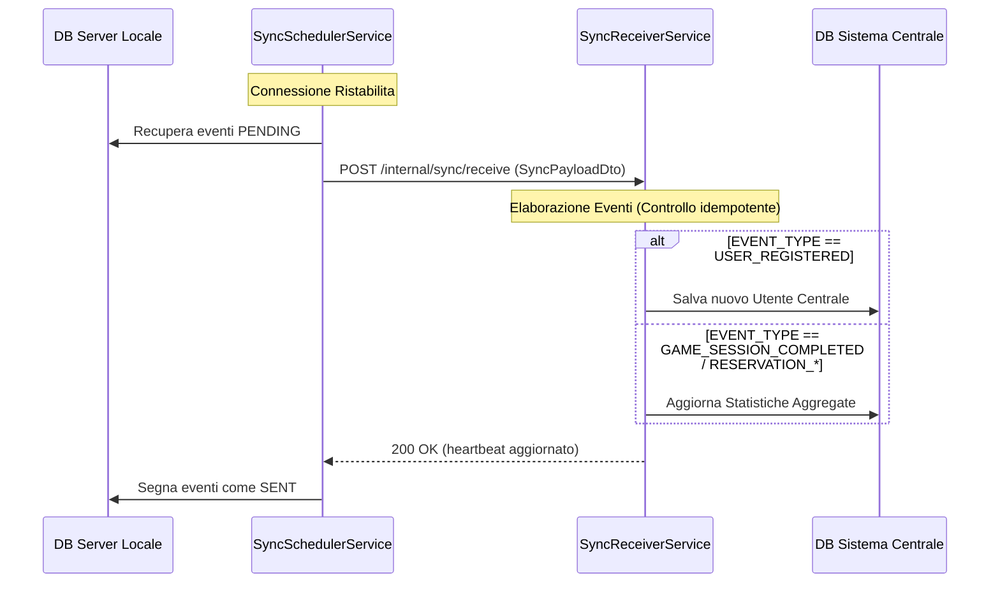

# Analisi Approfondita: Capacità Offline del Server Locale & Sincronizzazione Centrale

Questo documento presenta un'analisi approfondita della capacità del sistema di gestire i client localmente mentre è disconnesso dal server centrale, e come sincronizza lo stato (utenti, sessioni di gioco e prenotazioni) una volta ristabilita la connessione.

---

## 1. Riepilogo Esecutivo

- **Indipendenza Offline:** Il server locale è pienamente in grado di funzionare in modo indipendente e gestire i client quando è disconnesso dal server centrale. Le azioni principali come registrazione utente, login utente, creazione/cancellazione prenotazioni, gestione sessioni di gioco e ripristino all'avvio vengono eseguite sul database locale e sul broker MQTT locale.
- **Modello di Sincronizzazione (Outbox Pattern):** Il sistema utilizza un **outbox pattern** sia sul server locale che sul server centrale. Le azioni eseguite offline generano eventi pendenti in una tabella outbox del database.
- **Riconciliazione Bi-Direzionale:**
    - **Locale -> Centrale:** Sincronizza gli utenti creati localmente, le sessioni di gioco completate e gli storici delle prenotazioni verso il sistema centrale per aggiornare i repository centrali e le statistiche aggregate.
    - **Centrale -> Locale:** Replica gli aggiornamenti degli utenti centrali verso tutti i server locali registrati.
- **Resilienza e Robustezza:** Entrambi gli scheduler, locale e centrale, sono progettati per prevenire blocchi della coda ("batch poisoning") causati da eventi malformati o guasti di rete.

---

## 2. Capacità Offline (Gestione Client Offline)

Quando la connessione al server centrale è interrotta, i client comunicano direttamente con le API del server locale. Di seguito una ripartizione del comportamento dei diversi componenti offline.

### A. Registrazione Utente Locale (Signup)
- **Servizio:** [LocalSignupService](file:///c:/Users/VLT14/Documents/UNI/PISSIR/Progetto/gamehandler-platform/local-server/src/main/java/com/gameplatform/local/application/service/LocalSignupService.java)
- **Entità Database:** `LocalUserJpaEntity` tramite [LocalSignupUserRepositoryAdapter](file:///c:/Users/VLT14/Documents/UNI/PISSIR/Progetto/gamehandler-platform/local-server/src/main/java/com/gameplatform/local/infrastructure/adapters/out/mysql/adapter/LocalSignupUserRepositoryAdapter.java)
- **Comportamento:** Gli utenti che si registrano direttamente su un server locale vengono salvati immediatamente nel database locale. Un evento outbox `USER_REGISTERED` corrispondente viene generato e memorizzato localmente nell'outbox.
- **Unicità del Username:** Il controllo di registrazione locale valida l'unicità sia rispetto alle registrazioni locali che agli utenti replicati dal centrale, per prevenire conflitti.

### B. Autenticazione Utente (Login)
- **Servizio:** [LocalAuthService](file:///c:/Users/VLT14/Documents/UNI/PISSIR/Progetto/gamehandler-platform/local-server/src/main/java/com/gameplatform/local/application/service/LocalAuthService.java)
- **Adapter Repository Utente:** [UserRepositoryAdapter](file:///c:/Users/VLT14/Documents/UNI/PISSIR/Progetto/gamehandler-platform/local-server/src/main/java/com/gameplatform/local/infrastructure/adapters/out/mysql/adapter/UserRepositoryAdapter.java)
- **Comportamento:** Quando si autentica un utente, il server locale interroga due repository:
    1. `UserJpaRepository` (contenente gli utenti replicati dal sistema centrale).
    2. `LocalUserJpaRepository` (contenente gli utenti registratisi localmente).
- **Risultato:** Se l'utente esiste in uno dei due repository, l'hash della password viene verificato localmente usando BCrypt, e viene generato un token JWT locale. Questo consente sia agli utenti registrati centralmente (se già replicati) che agli utenti registrati localmente di effettuare il login completamente offline.

### C. Sessioni di Gioco
- **Servizio:** [GameSessionService](file:///c:/Users/VLT14/Documents/UNI/PISSIR/Progetto/gamehandler-platform/local-server/src/main/java/com/gameplatform/local/application/service/GameSessionService.java)
- **Comportamento:** Le transizioni di stato della sessione (`start`, `pause`, `resume`, `end`) vengono elaborate localmente usando il `GameSessionRepository` locale.
- **Eventi MQTT:** Gli eventi delle macchine e delle sessioni vengono pubblicati su un broker MQTT locale. Poiché questo broker gira nell'infrastruttura locale (tipicamente su `localhost:1883`), non richiede connettività internet.
- **Registrazione Outbox:** Quando una sessione di gioco viene finalizzata con successo (completata o interrotta), viene creato un evento outbox `GAME_SESSION_COMPLETED`.

### D. Prenotazioni
- **Servizio:** [ReservationService](file:///c:/Users/VLT14/Documents/UNI/PISSIR/Progetto/gamehandler-platform/local-server/src/main/java/com/gameplatform/local/application/service/ReservationService.java)
- **Comportamento:** La creazione o cancellazione di prenotazioni modifica il `ReservationRepository` locale e cambia lo stato della macchina di gioco localmente.
- **Registrazione Outbox:** Ogni azione di prenotazione genera un evento outbox `RESERVATION_CREATED` oppure `RESERVATION_CANCELLED`.

### E. Resilienza a Crash e Ripristino
- **Servizi:** [SessionRecoveryService](file:///c:/Users/VLT14/Documents/UNI/PISSIR/Progetto/gamehandler-platform/local-server/src/main/java/com/gameplatform/local/application/service/SessionRecoveryService.java) e [SessionRecoveryHelper](file:///c:/Users/VLT14/Documents/UNI/PISSIR/Progetto/gamehandler-platform/local-server/src/main/java/com/gameplatform/local/application/service/SessionRecoveryHelper.java)
- **Comportamento:** Se il server locale crasha o si riavvia offline:
    1. Recupera tutte le sessioni attive/in pausa dal database locale.
    2. Esegue un ping delle macchine di gioco via MQTT locale.
    3. Se una macchina non risponde entro 30 secondi, interrompe la sessione, rilascia la macchina di gioco e persiste un evento `GAME_SESSION_COMPLETED` (stato interrotto) nell'outbox per garantire la corretta riconciliazione delle statistiche una volta online.

---

## 3. Sincronizzazione Online (Connessione Ristabilita)

Quando la connettività viene ripristinata, la sincronizzazione bi-direzionale riprende.

### A. Sincronizzazione Locale -> Centrale (Push dei Dati Locali)

1. **Polling Programmato:** [SyncSchedulerService](file:///c:/Users/VLT14/Documents/UNI/PISSIR/Progetto/gamehandler-platform/local-server/src/main/java/com/gameplatform/local/application/service/SyncSchedulerService.java) viene eseguito periodicamente (configurato con frequenza di 5 minuti).
2. **Controllo Connettività:** Chiama `syncCentralSystemPort.isReachable()`. In [CentralSystemRestAdapter](file:///c:/Users/VLT14/Documents/UNI/PISSIR/Progetto/gamehandler-platform/local-server/src/main/java/com/gameplatform/local/infrastructure/adapters/out/rest/CentralSystemRestAdapter.java), questo esegue un ping a `/internal/sync/receive` tramite una leggera richiesta GET. Se il livello HTTP risponde (anche con `405 Method Not Allowed`), il server viene determinato come raggiungibile.
3. **Costruzione Payload:** Gli eventi pendenti vengono mappati in `OutboxEventDto` e impacchettati in un `SyncPayloadDto` contenente il `buildingId` del server locale.
4. **Trasmissione REST:** Il payload viene inviato tramite una richiesta POST a `/internal/sync/receive`.
5. **Aggiornamento Stato:** Se la POST ha successo con stato 2xx, [OutboxSyncHelper](file:///c:/Users/VLT14/Documents/UNI/PISSIR/Progetto/gamehandler-platform/local-server/src/main/java/com/gameplatform/local/application/service/OutboxSyncHelper.java) segna gli eventi locali come `SENT`.

### B. Ricezione ed Elaborazione del Sistema Centrale

1. **Servizio:** [SyncReceiverService](file:///c:/Users/VLT14/Documents/UNI/PISSIR/Progetto/gamehandler-platform/central-system/src/main/java/com/gameplatform/central/application/service/SyncReceiverService.java)
2. **Idempotenza e Deduplicazione:** Per gestire le interruzioni di rete in cui la risposta fallisce ma i dati sono stati scritti, il sistema centrale controlla `ProcessedEventRepository`. Se un `eventId` in arrivo è già stato elaborato, viene saltato.
3. **Elaborazione Eventi:**
    - **`USER_REGISTERED`:** Analizza i dettagli dell'utente e chiama [UserService.registerFromSync](file:///c:/Users/VLT14/Documents/UNI/PISSIR/Progetto/gamehandler-platform/central-system/src/main/java/com/gameplatform/central/application/service/UserService.java#L77-L99) per inserire l'utente nel database centrale.
    - **`GAME_SESSION_COMPLETED`:** Calcola la durata della sessione e aggiorna/unisce la tabella del database centrale `AggregatedStatistics` utilizzando un lock in scrittura pessimistico per prevenire race condition.
    - **`RESERVATION_CREATED` / `RESERVATION_CANCELLED`:** Incrementa/decrementa i contatori delle prenotazioni in `AggregatedStatistics`.
4. **Heartbeat:** Al termine dell'elaborazione, il sistema centrale aggiorna il timestamp `lastSeenAt` del server locale, che funge da indicatore di heartbeat.

### C. Sincronizzazione Centrale -> Locale (Replica degli Utenti Centrali)

1. **Scheduler:** [UserReplicationSchedulerService](file:///c:/Users/VLT14/Documents/UNI/PISSIR/Progetto/gamehandler-platform/central-system/src/main/java/com/gameplatform/central/application/service/UserReplicationSchedulerService.java) viene eseguito periodicamente (usando `fixedDelay = 300_000` per prevenire esecuzioni sovrapposte).
2. **Selezione dei Target:** Recupera i server locali attivi dal database.
3. **Tracciamento Avanzamento Replica:** Lo scheduler interroga `ReplicationProgressRepository` per identificare quali server locali non hanno ancora ricevuto specifici eventi utente.
4. **Meccanismo di Push:** Invia i dettagli dell'utente all'endpoint REST `/internal/users/sync` del server locale.
5. **Registrazione Avanzamento:**
    - Se un server locale è online e accetta il push, viene registrata una voce di avanzamento.
    - Se un server è offline, l'eccezione viene catturata e quel server viene saltato. L'evento outbox rimane pendente sul sistema centrale per quel server specifico e verrà ritentato nei cicli successivi.
    - L'evento outbox centrale viene segnato come `SENT` globalmente solo quando *tutti* i server locali attivi hanno riconosciuto con successo la replica.

---

## 4. Pattern di Progettazione Chiave per la Resilienza

La codebase implementa diversi pattern per garantire consistenza eventuale e robustezza:

| Pattern / Tecnica | Dettaglio Classe & Implementazione | Beneficio |
| :--- | :--- | :--- |
| **Outbox Pattern** | `OutboxEvent` & `OutboxEventRepository` su entrambi i server | Disaccoppia l'esecuzione locale dalle dipendenze remote. Garantisce consistenza eventuale. |
| **Idempotenza** | [SyncReceiverService](file:///c:/Users/VLT14/Documents/UNI/PISSIR/Progetto/gamehandler-platform/central-system/src/main/java/com/gameplatform/central/application/service/SyncReceiverService.java#L89-L92) tramite `ProcessedEventRepository` | Previene registrazione duplicata e doppio conteggio delle statistiche durante ritrasmissioni. |
| **Isolamento da Queue-Poisoning** | `SyncReceiverService` (`processEvent`) & `UserReplicationSchedulerService` (`replicateUsers`) | I payload malformati vengono registrati e segnati come falliti o elaborati. Un evento problematico non blocca mai i messaggi successivi. |
| **Locking Pessimistico** | `SyncReceiverService.updateSessionStats` tramite `statisticsRepository.findByBuildingAndTypeAndPeriodWithLock` | Previene problemi di aggiornamenti persi (race condition) quando più server locali si sincronizzano contemporaneamente. |
| **Isolamento Transazionale** | `@Transactional(propagation = Propagation.REQUIRES_NEW)` in [UserService.registerFromSync](file:///c:/Users/VLT14/Documents/UNI/PISSIR/Progetto/gamehandler-platform/central-system/src/main/java/com/gameplatform/central/application/service/UserService.java#L75) | Garantisce che le violazioni di vincoli di unicità durante la sincronizzazione utenti non facciano fallire la transazione batch di sincronizzazione esterna. |

---

## 5. Limitazioni Potenziali & Casi Limite

1. **Ritardo Login Registrazione Centrale:** Un utente che si registra sul Server Centrale non può effettuare il login su un Server Locale mentre quel server locale è offline, poiché la replica dei dati utente non può raggiungerlo finché non torna online.
2. **Atomicità Transazionale della Sincronizzazione Locale (Bug L-05):** Come evidenziato da [BugL05_SyncSchedulerNonAtomicMarkAsSentTest](file:///c:/Users/VLT14/Documents/UNI/PISSIR/Progetto/gamehandler-platform/local-server/src/test/java/com/gameplatform/local/application/service/BugL05_SyncSchedulerNonAtomicMarkAsSentTest.java), il `SyncSchedulerService` locale non viene eseguito in una singola transazione. Se si verifica un guasto durante il ciclo mentre si stanno segnando gli eventi come `SENT` localmente, un sottoinsieme di eventi rimane pendente. Il sistema locale ritenterà gli eventi pendenti alla successiva esecuzione. Fortunatamente, il controllo di idempotenza del sistema centrale previene statistiche o entità duplicate.
3. **Perdita di Dati in Caso di Distruzione del Server Locale:** Poiché i dati offline sono memorizzati nel database del server locale, un guasto hardware catastrofico del server locale prima della sincronizzazione comporterebbe la perdita delle statistiche offline e delle registrazioni utente.
