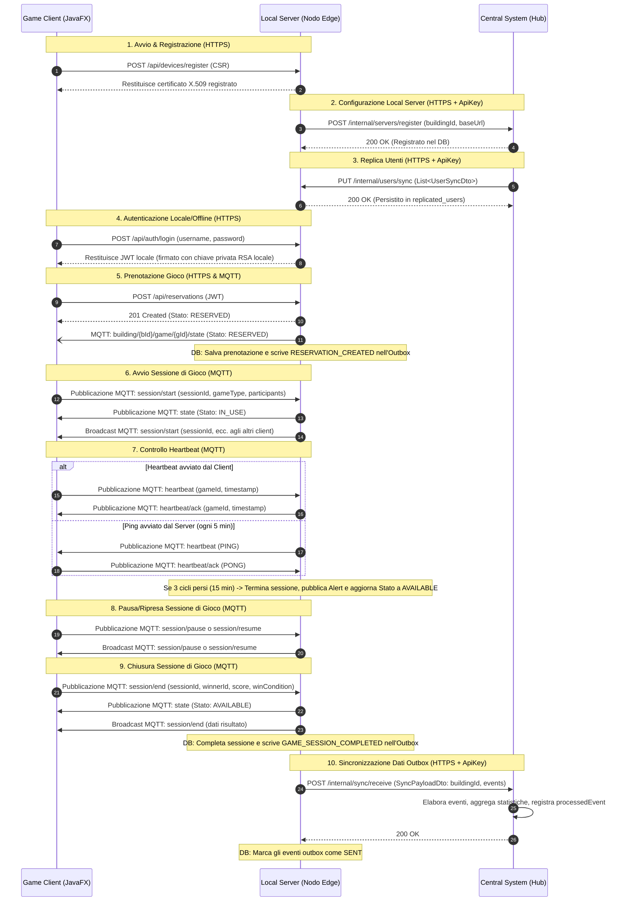

# Flussi di Messaggi nella Piattaforma di Gioco Distribuita

Questo documento descrive il flusso di messaggi, protocolli, autenticazione e aggiornamenti del database attraverso i tre livelli del sistema distribuito:
1. **Game Client** (Emulatore Desktop JavaFX)
2. **Local Server** (Nodo Edge installato in ogni edificio)
3. **Central System** (Hub basato su cloud)

---

## Diagramma di Sequenza

---

## Spiegazioni Dettagliate dei Passaggi

### 1. Avvio e Registrazione Dispositivo
* **Direzione:** Client &rarr; Local Server
* **Protocollo:** HTTPS REST
* **Dettagli:** Il Game Client invia una Certificate Signing Request (CSR) a `/api/devices/register` per stabilire un'identità client sicura. Il Local Server registra il dispositivo e restituisce il certificato client X.509 che viene utilizzato per la successiva autenticazione reciproca MQTT su TLS (MQTTS).

### 2. Configurazione Local Server (Auto-Registrazione)
* **Direzione:** Local Server &rarr; Central System
* **Protocollo:** HTTPS REST
* **Auth:** Chiave API Condivisa (header `X-Internal-Api-Key`)
* **Dettagli:** Durante l'avvio, il Local Server invia un payload di registrazione (contenente il suo `buildingId` e `baseUrl`) a `POST /internal/servers/register` sul Central System. Il Central System persiste questa registrazione nel suo database (tabella `local_servers`).

### 3. Sincronizzazione Utenti (Replica dal Centrale al Locale)
* **Direzione:** Central System &rarr; Local Server
* **Protocollo:** HTTPS REST
* **Auth:** Chiave API Condivisa (header `X-Internal-Api-Key`)
* **Dettagli:** Lo scheduler del Central System preleva gli eventi di creazione/aggiornamento utente in sospeso dal suo outbox. Invia un batch di utenti all'endpoint `/internal/users/sync` del Local Server registrato tramite HTTP PUT. Il Local Server persiste i dettagli dell'utente e gli hash delle password in `replicated_users` per abilitare il **login offline**.

### 4. Autenticazione Locale
* **Direzione:** Client &rarr; Local Server
* **Protocollo:** HTTPS REST
* **Dettagli:** L'utente inserisce le credenziali nel client. Il client chiama `POST /api/auth/login`. Il Local Server verifica localmente la validità dell'hash BCrypt (questo significa che funziona anche se offline). In caso di successo, il Local Server firma un JWT utilizzando la propria chiave privata locale e lo restituisce.

### 5. Prenotazione Gioco
* **Direzione:** Client &rarr; Local Server
* **Protocollo:** HTTPS REST (Richiesta) e MQTTS (Notifica)
* **Auth:** Token JWT locale (bearer)
* **Dettagli:** Il client richiede uno slot chiamando `POST /api/reservations`. Il Local Server crea la prenotazione nel database e cambia lo stato della macchina in `RESERVED`.
  * Il Local Server pubblica il cambiamento di stato sul topic `building/{buildingId}/game/{gameId}/state`.
  * Un evento outbox di tipo `RESERVATION_CREATED` viene persistito per sincronizzare questa azione con il Central System.

### 6. Avvio Sessione di Gioco
* **Direzione:** Client &rarr; Local Server
* **Protocollo:** MQTTS
* **Dettagli:** Il client avvia la sessione di gioco pubblicando un `SessionStartPayload` su `building/{buildingId}/game/{gameId}/session/start`. Il Local Server ascolta questo topic, porta la macchina di gioco allo stato `IN_USE` e lo stato della sessione a `IN_PROGRESS` nel database, e trasmette in broadcast i cambiamenti di stato a tutti i client.

### 7. Controllo Heartbeat
* **Direzione:** Bidirezionale (MQTTS)
* **Dettagli:**
  * **Iniziato dal Client (Normale):** Il client pubblica regolarmente heartbeat su `building/{buildingId}/game/{gameId}/heartbeat`. Il server registra il contatto (`registerHeartbeat`) e invia un ACK (`heartbeat/ack`).
  * **Iniziato dal Server (Health check):** Ogni 5 minuti, il Local Server esegue un health check. Trasmette in broadcast un `PING` su `building/{buildingId}/game/{gameId}/heartbeat`. Il client risponde con `PONG` su `heartbeat/ack`.
  * Se un client non risponde per 3 cicli consecutivi (15 minuti), il server termina la sessione, imposta la macchina di gioco su `AVAILABLE`, registra un evento outbox `GAME_SESSION_COMPLETED`, e pubblica un alert su `building/{buildingId}/alerts`.

### 8. Pausa/Ripresa Sessione di Gioco
* **Direzione:** Client &rarr; Local Server
* **Protocollo:** MQTTS
* **Dettagli:** Il client pubblica un `SessionPausePayload` su `building/{buildingId}/game/{gameId}/session/pause` o un `SessionResumePayload` su `building/{buildingId}/game/{gameId}/session/resume`. Il Local Server aggiorna lo stato della sessione nel database e trasmette in broadcast l'evento per mantenere sincronizzate tutte le interfacce dell'edificio.

### 9. Chiusura Sessione di Gioco (Fine Sessione)
* **Direzione:** Client &rarr; Local Server
* **Protocollo:** MQTTS
* **Dettagli:** Una volta che il gioco è completato, il client pubblica un `SessionEndPayload` contenente il vincitore, il punteggio e la condizione su `building/{buildingId}/game/{gameId}/session/end`. Il Local Server marca la sessione come `COMPLETED`, porta la macchina di gioco su `AVAILABLE`, trasmette in broadcast il risultato, e scrive un evento `GAME_SESSION_COMPLETED` nella sua tabella `outbox_events`.

### 10. Sincronizzazione Dati Outbox
* **Direzione:** Local Server &rarr; Central System
* **Protocollo:** HTTPS REST
* **Auth:** Chiave API Condivisa (header `X-Internal-Api-Key`)
* **Dettagli:** Il `SyncSchedulerService` del Local Server interroga regolarmente gli eventi in sospeso (prenotazioni, completamenti sessioni, alert). Li impacchetta in un `SyncPayloadDto` e chiama `POST /internal/sync/receive` sul Central System. Il Central System analizza gli eventi, aggiorna le statistiche aggregate globali (con scope per `BuildingId` e `GameType`), registra ogni evento come elaborato per prevenire duplicati, e restituisce `200 OK`. Il Local Server marca quindi questi eventi come `SENT` localmente.
