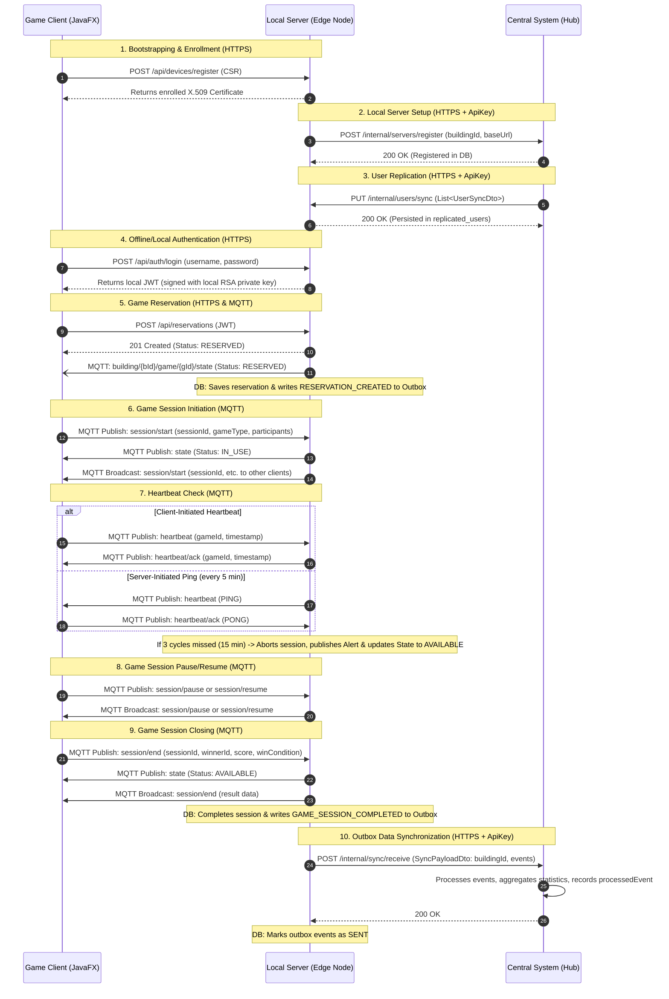

# Message Flows in the Distributed Game Platform

This document describes the flow of messages, protocols, authentication, and database updates across the three tiers of the distributed system:
1. **Game Client** (JavaFX Desktop Emulator)
2. **Local Server** (Edge Node installed in each building)
3. **Central System** (Cloud-based Hub)

---

## Sequence Diagram

---

## Detailed Step Explanations

### 1. Bootstrapping & Device Enrollment
* **Direction:** Client &rarr; Local Server
* **Protocol:** HTTPS REST
* **Details:** The Game Client sends a Certificate Signing Request (CSR) to `/api/devices/register` to establish a secure client identity. The Local Server enrolls the device and returns the X.509 client certificate which is used for subsequent MQTT over TLS (MQTTS) mutual authentication.

### 2. Local Server Setup (Self-Registration)
* **Direction:** Local Server &rarr; Central System
* **Protocol:** HTTPS REST
* **Auth:** Shared API Key (`X-Internal-Api-Key` header)
* **Details:** During startup, the Local Server sends a registration payload (containing its `buildingId` and `baseUrl`) to `POST /internal/servers/register` on the Central System. The Central System persists this registration in its database (`local_servers` table).

### 3. User Sync (Central to Local Replication)
* **Direction:** Central System &rarr; Local Server
* **Protocol:** HTTPS REST
* **Auth:** Shared API Key (`X-Internal-Api-Key` header)
* **Details:** The Central System scheduler pulls pending user creation/update events from its outbox. It sends a user batch to the registered Local Server's `/internal/users/sync` endpoint via HTTP PUT. The Local Server persists the user details and password hashes in `replicated_users` to enable **offline login**.

### 4. Local Authentication
* **Direction:** Client &rarr; Local Server
* **Protocol:** HTTPS REST
* **Details:** The user enters credentials at the client. The client calls `POST /api/auth/login`. The Local Server checks BCrypt hash validity locally (meaning it works even if offline). Upon success, the Local Server signs a JWT using its own local private key and returns it.

### 5. Game Reservation
* **Direction:** Client &rarr; Local Server
* **Protocol:** HTTPS REST (Request) & MQTTS (Notification)
* **Auth:** local JWT bearer token
* **Details:** The client requests a slot by calling `POST /api/reservations`. The Local Server creates the reservation in the database and changes the machine state to `RESERVED`.
    * The Local Server publishes the state change to the topic `building/{buildingId}/game/{gameId}/state`.
    * An outbox event of type `RESERVATION_CREATED` is persisted to sync this action to the Central System.

### 6. Game Session Initiation
* **Direction:** Client &rarr; Local Server
* **Protocol:** MQTTS
* **Details:** The client starts the game session by publishing a `SessionStartPayload` to `building/{buildingId}/game/{gameId}/session/start`. The Local Server listens to this topic, transitions the game machine status to `IN_USE` and session status to `IN_PROGRESS` in the database, and broadcasts the status changes back to all clients.

### 7. Heartbeat Check
* **Direction:** Bi-directional (MQTTS)
* **Details:**
    * **Client-Initiated (Normal):** The client regularly publishes heartbeats to `building/{buildingId}/game/{gameId}/heartbeat`. The server records contact (`registerHeartbeat`) and sends an ACK (`heartbeat/ack`).
    * **Server-Initiated (Health check):** Every 5 minutes, the Local Server performs a health check. It broadcasts a `PING` on `building/{buildingId}/game/{gameId}/heartbeat`. The client responds with `PONG` on `heartbeat/ack`.
    * If a client fails to respond for 3 consecutive cycles (15 minutes), the server aborts the session, sets the game machine to `AVAILABLE`, logs a `GAME_SESSION_COMPLETED` outbox event, and publishes an alert to `building/{buildingId}/alerts`.

### 8. Game Session Pause/Resume
* **Direction:** Client &rarr; Local Server
* **Protocol:** MQTTS
* **Details:** The client publishes `SessionPausePayload` to `building/{buildingId}/game/{gameId}/session/pause` or `SessionResumePayload` to `building/{buildingId}/game/{gameId}/session/resume`. The Local Server updates the session status in the database and broadcasts the event to keep all building interfaces synchronized.

### 9. Game Session Closing (End Session)
* **Direction:** Client &rarr; Local Server
* **Protocol:** MQTTS
* **Details:** Once the game is completed, the client publishes a `SessionEndPayload` containing the winner, score, and condition to `building/{buildingId}/game/{gameId}/session/end`. The Local Server marks the session as `COMPLETED`, transitions the game machine to `AVAILABLE`, broadcasts the result, and writes a `GAME_SESSION_COMPLETED` event into its `outbox_events` table.

### 10. Outbox Data Synchronization
* **Direction:** Local Server &rarr; Central System
* **Protocol:** HTTPS REST
* **Auth:** Shared API Key (`X-Internal-Api-Key` header)
* **Details:** The Local Server's `SyncSchedulerService` regularly polls pending events (reservations, session completions, alerts). It packs them into a `SyncPayloadDto` and calls `POST /internal/sync/receive` on the Central System. The Central System parses the events, updates global aggregated statistics (scoped by `BuildingId` and `GameType`), logs each event as processed to prevent duplicates, and returns `200 OK`. The Local Server then marks these events as `SENT` locally.
