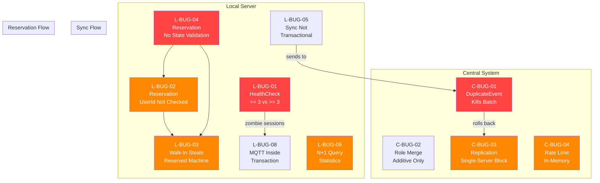

# 🔍 Analisi Bug — Punti 4 e 5 del Workflow

> [!NOTE]
> Analisi approfondita del codice dei moduli **central-system** (Punto 4) e **local-server** (Punto 5).
> Ogni riga è stata analizzata, le chiamate tra funzioni tracciate, e simulazioni virtuali eseguite per ogni percorso critico.

---

## Sommario Esecutivo

| Modulo | File Analizzati | Bug Trovati | Critici | Alti | Medi | Bassi |
|--------|:-:|:-:|:-:|:-:|:-:|:-:|
| **central-system** (Punto 4) | ~40 | 5 | 1 | 2 | 1 | 1 |
| **local-server** (Punto 5) | ~55 | 10 | 2 | 4 | 3 | 1 |
| **Totale** | **~95** | **15** | **3** | **6** | **4** | **2** |

---

## Punto 4 — central-system (`com.gameplatform.central`)

---

### C-BUG-01 — DuplicateEventException Interrompe l'Intero Batch di Sync

| Campo | Valore |
|---|---|
| **Severity** | 🔴 CRITICAL |
| **Categoria** | Error Handling / Transactional Atomicity |
| **File** | [SyncReceiverService.java](file:///c:/Users/VLT14/Documents/UNI/PISSIR/Progetto/gamehandler-platform/central-system/src/main/java/com/gameplatform/central/application/service/SyncReceiverService.java#L68-L82) |
| **Linee** | 68–82 |

**Descrizione**:
Nel metodo `receiveSyncPayload()`, il ciclo `for` (linea 68) processa ogni evento del payload. Se un evento è già stato elaborato (linea 70), viene lanciata una `DuplicateEventException` (linea 71), che estende `RuntimeException`. Il blocco `catch` alla linea 79 cattura solo `JsonProcessingException`. La `DuplicateEventException` non viene catturata e si propaga fuori dal ciclo, interrompendo l'elaborazione di **tutti** gli eventi rimanenti. Poiché il metodo è `@Transactional`, il rollback annulla anche gli eventi già processati nelle iterazioni precedenti.

**Simulazione**:
```
1. Local Server invia SyncPayloadDto con 3 eventi: [E1, E2, E3]
2. E1: nuovo → processato ✅, salvato in ProcessedEventRepository
3. E2: duplicato → existsByEventId() restituisce true
4. DuplicateEventException lanciata → esce dal for-loop
5. @Transactional rollback → E1 viene annullato dal DB
6. E3: MAI processato
7. Risultato: NESSUN evento del batch è persistito
```

**Impatto**: Un singolo evento duplicato (ri-invio da un Local Server) avvelena l'intero batch di sync. Gli eventi validi vengono persi. Il Local Server riceve un errore e ri-invia tutti gli eventi, ma il duplicato è ancora presente → loop infinito di sync falliti.

---

### C-BUG-02 — UpdateUser Aggiunge Ruoli Senza Rimuoverli (Merge Additivo)

| Campo | Valore |
|---|---|
| **Severity** | 🟡 MEDIUM |
| **Categoria** | Logic Error |
| **File** | [UserService.java](file:///c:/Users/VLT14/Documents/UNI/PISSIR/Progetto/gamehandler-platform/central-system/src/main/java/com/gameplatform/central/application/service/UserService.java#L84-L91) |
| **Linee** | 84–91 |

**Descrizione**:
Il metodo `updateUser()` riceve `newRoles`, ma anziché sostituire i ruoli esistenti, li *aggiunge* a quelli preesistenti:
```java
List<String> mergedRoles = new ArrayList<>(user.getRoles()); // copia esistenti
for (String role : newRoles) {
    if (!mergedRoles.contains(role)) {
        mergedRoles.add(role); // solo aggiunta, MAI rimozione
    }
}
```

**Simulazione**:
```
1. Utente ha ruoli: [USER, ADMIN]
2. Admin chiama updateUser(id, null, List.of("USER"))  → intento: rimuovere ADMIN
3. mergedRoles = [USER, ADMIN]  (copia ruoli esistenti)
4. "USER" già presente → skip
5. Risultato: ruoli = [USER, ADMIN]  (invariato, ADMIN non rimosso)
```

**Impatto**: Impossibile revocare un ruolo una volta assegnato. Un utente promosso ad ADMIN non può essere declassato. Violazione del principio del least privilege.

---

### C-BUG-03 — UserReplicationSchedulerService: Parziale Delivery con Marking Inconsistente

| Campo | Valore |
|---|---|
| **Severity** | 🟠 HIGH |
| **Categoria** | Distributed Consistency |
| **File** | [UserReplicationSchedulerService.java](file:///c:/Users/VLT14/Documents/UNI/PISSIR/Progetto/gamehandler-platform/central-system/src/main/java/com/gameplatform/central/application/service/UserReplicationSchedulerService.java#L83-L106) |
| **Linee** | 83–106 |

**Descrizione**:
Il servizio deserializza ogni OutboxEvent in un singolo `UserSyncDto` e lo invia a ciascun Local Server. Se TUTTI i server ricevono l'evento, lo marca come SENT (linea 102). Se anche un solo server fallisce, l'evento resta PENDING (linea 104). Tuttavia:

1. **L'evento viene inviato come singolo utente** (`List.of(user)`) a ciascun server, NON come batch
2. **Se il server A riceve ma B fallisce**, l'evento resta PENDING e verrà ri-inviato a ENTRAMBI
3. **Il server A riceve l'utente due volte** — se il Local Server fa upsert, è OK; se fa insert, ottiene un duplicato

Il problema reale è che non c'è tracking per-server: o tutti ricevono o nessuno è marcato SENT. Questo significa che un singolo server offline blocca permanentemente il marking di tutti gli eventi per tutti i server.

**Impatto**: Un Local Server offline impedisce di marcare come SENT gli eventi per tutti gli altri server. La coda outbox cresce indefinitamente.

---

### C-BUG-04 — AuthService: Rate Limiter In-Memory Non Persistente

| Campo | Valore |
|---|---|
| **Severity** | 🟠 HIGH |
| **Categoria** | Security / State Management |
| **File** | [AuthService.java](file:///c:/Users/VLT14/Documents/UNI/PISSIR/Progetto/gamehandler-platform/central-system/src/main/java/com/gameplatform/central/application/service/AuthService.java#L30-L70) |
| **Linee** | 30, 61–70 |

**Descrizione**:
Il rate limiter per i tentativi di login (linea 30: `ConcurrentHashMap<String, List<Instant>> failedAttempts`) è in-memory. Se il server viene riavviato, tutti i contatori si azzerano, rendendo il rate limiting inefficace contro attacchi persistenti. Inoltre, in un deployment multi-istanza, ogni istanza ha il proprio contatore — l'attaccante può distribuire tentativi tra istanze.

**Impatto**: Rate limiting bypassabile tramite restart del server o in architetture multi-nodo.

---

### C-BUG-05 — DUMMY_HASH in AuthService Non è un Hash BCrypt Valido

| Campo | Valore |
|---|---|
| **Severity** | 🔵 LOW |
| **Categoria** | Security / Code Quality |
| **File** | [AuthService.java](file:///c:/Users/VLT14/Documents/UNI/PISSIR/Progetto/gamehandler-platform/central-system/src/main/java/com/gameplatform/central/application/service/AuthService.java#L26) |
| **Linea** | 26 |

**Descrizione**:
La costante `DUMMY_HASH` usata per prevenire timing attacks:
```java
private static final String DUMMY_HASH = "$2a$10$S9dK/n/rP.qZ9H9yK3m/Vu1YV7k4m4k5m6m7m8m9m0m1m2m3m4m5m";
```
Non è un hash BCrypt valido (lunghezza e charset errati). `BCrypt.checkpw(password, DUMMY_HASH)` potrebbe lanciare un'eccezione interna o ritornare immediatamente, vanificando la protezione contro timing attacks.

**Impatto**: L'attaccante potrebbe distinguere "username non esiste" da "password sbagliata" basandosi sul tempo di risposta.

---

## Punto 5 — local-server (`com.gameplatform.local`)

---

### L-BUG-01 — HealthCheckService: Missed Counter Usa `== 3` Invece di `>= 3`

| Campo | Valore |
|---|---|
| **Severity** | 🔴 CRITICAL |
| **Categoria** | Logic Error / State Machine |
| **File** | [HealthCheckService.java](file:///c:/Users/VLT14/Documents/UNI/PISSIR/Progetto/gamehandler-platform/local-server/src/main/java/com/gameplatform/local/application/service/HealthCheckService.java#L76-L80) |
| **Linee** | 76–80 |

**Descrizione**:
Il contatore `missed` viene incrementato ad ogni ciclo in cui il client non risponde (linea 76-77). L'azione di abort avviene SOLO quando `missed == 3` (linea 80). Dopo l'abort (missed=3), il contatore continua a crescere (4, 5, 6...) ma non torna mai a 3. Se una **nuova sessione** viene avviata sulla stessa macchina e il nuovo client non risponde, il contatore è già >3 e la condizione `== 3` non scatta MAI più.

**Simulazione**:
```
Ciclo 1: Game-1, nessuna risposta → missed = 1
Ciclo 2: Game-1, nessuna risposta → missed = 2
Ciclo 3: Game-1, nessuna risposta → missed = 3 → ABORT sessione A ✅
         Macchina rilasciata, sessione A terminata
--- Nuova sessione B avviata su Game-1 ---
Ciclo 4: Game-1, nessuna risposta → missed = 4 → (4 == 3) = FALSE → NESSUN ABORT ❌
Ciclo 5: Game-1, nessuna risposta → missed = 5 → (5 == 3) = FALSE → NESSUN ABORT ❌
...
Sessione B diventa ZOMBIE permanente
```

**Impatto**: Sessioni zombie permanenti dopo il primo abort su una macchina. La macchina resta bloccata in IN_USE per sempre.

---

### L-BUG-02 — GameSessionService.start(): Nessuna Validazione UserId della Prenotazione

| Campo | Valore |
|---|---|
| **Severity** | 🟠 HIGH |
| **Categoria** | Security / Missing Validation |
| **File** | [GameSessionService.java](file:///c:/Users/VLT14/Documents/UNI/PISSIR/Progetto/gamehandler-platform/local-server/src/main/java/com/gameplatform/local/application/service/GameSessionService.java#L80-L94) |
| **Linee** | 80–94 |

**Descrizione**:
Quando viene fornito un `reservationId`, il servizio valida:
- ✅ Che la prenotazione esista (linea 81-82)
- ✅ Che il `gameId` corrisponda (linea 83-84)
- ✅ Che lo stato non sia CANCELLED (linea 86-87) o EXPIRED (linea 89-91)
- ❌ **MAI** che `reservation.getUserId()` corrisponda a uno dei `participants`

**Simulazione**:
```
1. User-A crea prenotazione R1 per Game-1 (14:00-15:00)
2. User-B scopre l'ID di R1 (es. intercettando un'API response)
3. User-B chiama POST /api/sessions/start con:
   { gameId: "game-1", participants: ["user-b"], reservationId: "r1" }
4. Validazione passa: R1 esiste ✅, gameId corrisponde ✅, stato PENDING ✅
5. Sessione creata per User-B con la prenotazione di User-A ✅
6. User-A arriva e trova la macchina occupata da User-B
```

**Impatto**: Hijacking di prenotazioni — qualsiasi utente con un reservationId valido può usare la prenotazione di un altro.

---

### L-BUG-03 — Walk-In Può Avviare Sessione su Macchina RESERVED

| Campo | Valore |
|---|---|
| **Severity** | 🟠 HIGH |
| **Categoria** | State Machine Violation / Authorization |
| **File** | [GameSessionService.java](file:///c:/Users/VLT14/Documents/UNI/PISSIR/Progetto/gamehandler-platform/local-server/src/main/java/com/gameplatform/local/application/service/GameSessionService.java#L69-L98) + [Game.java](file:///c:/Users/VLT14/Documents/UNI/PISSIR/Progetto/gamehandler-platform/local-server/src/main/java/com/gameplatform/local/domain/model/Game.java#L48-L55) |

**Descrizione**:
Se `reservationId` è `null` (walk-in), il codice salta la validazione prenotazione e chiama direttamente `game.startUse()` (linea 97). `Game.startUse()` accetta sia `AVAILABLE` che `RESERVED`:
```java
if (status != GameMachineStatus.AVAILABLE && status != GameMachineStatus.RESERVED) {
    throw new InvalidGameStateTransitionException(...);
}
this.status = GameMachineStatus.IN_USE;
```
Questo significa che un walk-in può "rubare" una macchina già prenotata.

**Simulazione**:
```
1. User-A prenota Game-1 → stato macchina: RESERVED
2. User-B arriva, chiama start() senza reservationId (walk-in)
3. game.startUse() → RESERVED è accettato → stato diventa IN_USE
4. Sessione creata per User-B ✅
5. User-A arriva per usare la sua prenotazione → macchina occupata
```

**Impatto**: Le prenotazioni non proteggono la macchina. Un utente senza prenotazione può usare una macchina prenotata da altri.

---

### L-BUG-04 — Reservation: confirm(), cancel(), expire() Senza Validazione Stato

| Campo | Valore |
|---|---|
| **Severity** | 🔴 CRITICAL |
| **Categoria** | State Machine Violation / Domain Invariant |
| **File** | [Reservation.java](file:///c:/Users/VLT14/Documents/UNI/PISSIR/Progetto/gamehandler-platform/local-server/src/main/java/com/gameplatform/local/domain/model/Reservation.java#L63-L73) |
| **Linee** | 63–73 |

**Descrizione**:
I metodi di transizione di stato del dominio `Reservation` NON validano lo stato corrente:
```java
public void confirm() { this.status = ReservationStatus.CONFIRMED; }  // nessun check
public void cancel()  { this.status = ReservationStatus.CANCELLED; }  // nessun check
public void expire()  { this.status = ReservationStatus.EXPIRED; }    // nessun check
```

Questo viola la macchina a stati del dominio. Transizioni illegali sono possibili:
- `CANCELLED → CONFIRMED` (riattivare una prenotazione annullata)
- `EXPIRED → CONFIRMED` (riattivare una prenotazione scaduta)
- `CONFIRMED → EXPIRED` (scadere una prenotazione in uso)

**Simulazione**:
```
1. Reservation R1: status = PENDING
2. R1.cancel() → status = CANCELLED
3. R1.confirm() → status = CONFIRMED  (transizione illegale! ❌)
4. La prenotazione "cancellata" è ora "confermata"
```

> [!WARNING]
> Anche se i servizi (`ReservationService`, `GameSessionService`) effettuano alcuni check esterni, il dominio stesso non è protetto. Qualsiasi nuovo codice che chiami direttamente questi metodi potrebbe violare gli invarianti.

**Impatto**: Il Rich Domain Model non protegge i propri invarianti. La macchina a stati è aperta a transizioni illegali, rendendo il modello fragile a modifiche future.

---

### L-BUG-05 — SyncSchedulerService: Operazioni di Mark Non Atomiche

| Campo | Valore |
|---|---|
| **Severity** | 🟡 MEDIUM |
| **Categoria** | Atomicity / Crash Consistency |
| **File** | [SyncSchedulerService.java](file:///c:/Users/VLT14/Documents/UNI/PISSIR/Progetto/gamehandler-platform/local-server/src/main/java/com/gameplatform/local/application/service/SyncSchedulerService.java#L55-L63) |
| **Linee** | 55–63 |

**Descrizione**:
La classe `SyncSchedulerService` NON ha `@Transactional`. Dopo un `sendSyncPayload()` con successo, gli eventi vengono marcati come SENT uno alla volta in un loop (linee 56-58). Se il processo crasha a metà loop, alcuni eventi risultano SENT e altri PENDING, creando inconsistenza. L'idempotenza del Central mitiga il re-invio, ma lo stato locale del outbox è corrotto.

**Impatto**: Stato inconsistente dell'outbox locale; debug complesso dopo crash.

---

### L-BUG-06 — HealthCheckService: e.printStackTrace() Invece di Logger

| Campo | Valore |
|---|---|
| **Severity** | 🔵 LOW |
| **Categoria** | Code Quality / Logging |
| **File** | [HealthCheckService.java](file:///c:/Users/VLT14/Documents/UNI/PISSIR/Progetto/gamehandler-platform/local-server/src/main/java/com/gameplatform/local/application/service/HealthCheckService.java#L112) |
| **Linea** | 112 |

**Descrizione**:
Nel catch block per la serializzazione del payload outbox:
```java
} catch (Exception e) {
    e.printStackTrace();  // ❌ Dovrebbe essere log.error()
}
```
`e.printStackTrace()` stampa su `System.err`, bypassando il framework di logging (SLF4J/Logback). L'errore non appare nei log centralizzati, non ha timestamp, non è filtrabile.

**Impatto**: Errori di serializzazione invisibili nel sistema di monitoraggio.

---

### L-BUG-07 — SessionRecoveryHelper e HealthCheckService: Potenziale NPE con Map.of()

| Campo | Valore |
|---|---|
| **Severity** | 🟡 MEDIUM |
| **Categoria** | Null Safety |
| **File** | [SessionRecoveryHelper.java](file:///c:/Users/VLT14/Documents/UNI/PISSIR/Progetto/gamehandler-platform/local-server/src/main/java/com/gameplatform/local/application/service/SessionRecoveryHelper.java#L59-L67) + [HealthCheckService.java](file:///c:/Users/VLT14/Documents/UNI/PISSIR/Progetto/gamehandler-platform/local-server/src/main/java/com/gameplatform/local/application/service/HealthCheckService.java#L90-L98) |

**Descrizione**:
Entrambi i servizi usano `Map.of(...)` per creare il payload dell'outbox event:
```java
Map<String, Object> payload = Map.of(
    "durationSeconds", session.getDurationSeconds(),  // Integer, potenzialmente null
    ...
);
```
`Map.of()` in Java NON accetta valori `null`. Se `getDurationSeconds()` restituisce `null` (cosa teoricamente non possibile nel flusso normale perché `abort()` chiama `calculateDuration()`), si otterrebbe un `NullPointerException`.

Il rischio è maggiore nel caso di sessioni lette da DB dove `durationSeconds` potrebbe essere null per dati legacy o corrotti.

**Impatto**: NPE silenzioso che impedisce la generazione dell'outbox event. La sessione viene abortita ma l'evento non viene sincronizzato al Central System.

---

### L-BUG-08 — ReservationExpirationService: Pubblica MQTT Dentro la Transazione

| Campo | Valore |
|---|---|
| **Severity** | 🟡 MEDIUM |
| **Categoria** | Transactional Side Effects |
| **File** | [ReservationExpirationService.java](file:///c:/Users/VLT14/Documents/UNI/PISSIR/Progetto/gamehandler-platform/local-server/src/main/java/com/gameplatform/local/application/service/ReservationExpirationService.java#L36-L51) |
| **Linee** | 44–48 |

**Descrizione**:
Il servizio è `@Transactional` (linea 17), ma pubblica su MQTT *dentro* la transazione (linea 48):
```java
publishGameStatePort.publishState(game.getId(), game.getStatus());
```
A differenza di `ReservationService` e `GameSessionService` che usano `TransactionSynchronizationManager.registerSynchronization()` per pubblicare *dopo* il commit, `ReservationExpirationService` pubblica *durante* la transazione. Se la transazione successivamente fallisce e fa rollback, il messaggio MQTT è già stato inviato — i client ricevono uno stato inconsistente.

**Impatto**: Stato MQTT inconsistente con il DB se la transazione fa rollback. I client vedono la macchina come AVAILABLE ma nel DB è ancora RESERVED.

---

### L-BUG-09 — StatisticsService: N+1 Query per Conteggio Prenotazioni

| Campo | Valore |
|---|---|
| **Severity** | 🟠 HIGH |
| **Categoria** | Performance / N+1 Query |
| **File** | [StatisticsService.java](file:///c:/Users/VLT14/Documents/UNI/PISSIR/Progetto/gamehandler-platform/local-server/src/main/java/com/gameplatform/local/application/service/StatisticsService.java#L38-L45) |
| **Linee** | 38–45 |

**Descrizione**:
Per calcolare le prenotazioni totali di un tipo di gioco:
```java
List<Game> gamesOfType = gameRepository.findAll().stream()
    .filter(game -> game.getGameType() == gameType).toList();
int totalReservations = 0;
for (Game game : gamesOfType) {
    totalReservations += reservationRepository.findByGameId(game.getId()).size();
}
```
Questa è una classica N+1 query: 1 query per tutti i giochi + N query per le prenotazioni di ciascun gioco. Con 100 macchine di tipo CHESS, genera 101 query SQL.

**Impatto**: Performance degradata esponenzialmente con il numero di macchine. Possibile timeout sotto carico.

---

### L-BUG-10 — LocalAuthService: Usa Instant.now() Invece di Clock

| Campo | Valore |
|---|---|
| **Severity** | 🔵 LOW |
| **Categoria** | Testability / Inconsistency |
| **File** | [LocalAuthService.java](file:///c:/Users/VLT14/Documents/UNI/PISSIR/Progetto/gamehandler-platform/local-server/src/main/java/com/gameplatform/local/application/service/LocalAuthService.java#L38) |
| **Linea** | 38 |

**Descrizione**:
Il servizio calcola `expiresAt` con `Instant.now()` diretto:
```java
Instant expiresAt = Instant.now().plus(1, ChronoUnit.HOURS);
```
Tutti gli altri servizi del local-server iniettano `Clock` come bean e usano `Instant.now(clock)` per testabilità deterministica. `LocalAuthService` non inietta `Clock` e usa `Instant.now()` diretto, rendendo il servizio non testabile in modo deterministico.

**Impatto**: I test non possono verificare l'esatto valore di `expiresAt` senza margine di errore temporale.

---

## Diagramma delle Dipendenze e Flusso dei Bug



---

## Test Creati

### Central System Tests

| File | Bug Testati |
|---|---|
| [SyncReceiverServiceBugTest.java](file:///c:/Users/VLT14/Documents/UNI/PISSIR/Progetto/gamehandler-platform/central-system/src/test/java/com/gameplatform/central/application/service/SyncReceiverServiceBugTest.java) | C-BUG-01: Duplicate event aborts entire batch |
| [UserServiceBugTest.java](file:///c:/Users/VLT14/Documents/UNI/PISSIR/Progetto/gamehandler-platform/central-system/src/test/java/com/gameplatform/central/application/service/UserServiceBugTest.java) | C-BUG-02: Additive role merge |

### Local Server Tests

| File | Bug Testati |
|---|---|
| [HealthCheckServiceBugTest.java](file:///c:/Users/VLT14/Documents/UNI/PISSIR/Progetto/gamehandler-platform/local-server/src/test/java/com/gameplatform/local/application/service/HealthCheckServiceBugTest.java) | L-BUG-01: Missed counter == vs >= |
| [GameSessionServiceBugTest.java](file:///c:/Users/VLT14/Documents/UNI/PISSIR/Progetto/gamehandler-platform/local-server/src/test/java/com/gameplatform/local/application/service/GameSessionServiceBugTest.java) | L-BUG-02, L-BUG-03: Reservation hijacking, walk-in theft |
| [ReservationBugTest.java](file:///c:/Users/VLT14/Documents/UNI/PISSIR/Progetto/gamehandler-platform/local-server/src/test/java/com/gameplatform/local/domain/model/ReservationBugTest.java) | L-BUG-04: Missing state validation |
| [SyncSchedulerServiceBugTest.java](file:///c:/Users/VLT14/Documents/UNI/PISSIR/Progetto/gamehandler-platform/local-server/src/test/java/com/gameplatform/local/application/service/SyncSchedulerServiceBugTest.java) | L-BUG-05: Non-atomic marking |

---

## Priorità di Risoluzione Consigliata

| Priorità | Bug ID | Motivazione |
|:-:|---|---|
| 1 | **C-BUG-01** | Blocca completamente la sincronizzazione se un evento duplicato è presente |
| 2 | **L-BUG-01** | Crea sessioni zombie irrecuperabili |
| 3 | **L-BUG-04** | Il dominio non protegge i propri invarianti → base fragile |
| 4 | **L-BUG-02** | Vulnerabilità di sicurezza: hijacking prenotazioni |
| 5 | **L-BUG-03** | Prenotazioni inutili: walk-in bypassa il sistema |
| 6 | **C-BUG-03** | Crescita illimitata outbox con un solo server offline |
| 7 | **L-BUG-08** | Inconsistenza MQTT/DB su rollback |
| 8 | **L-BUG-09** | Performance sotto carico |
| 9 | **C-BUG-02** | Impossibile revocare ruoli |
| 10 | **L-BUG-05** | Inconsistenza outbox su crash |
